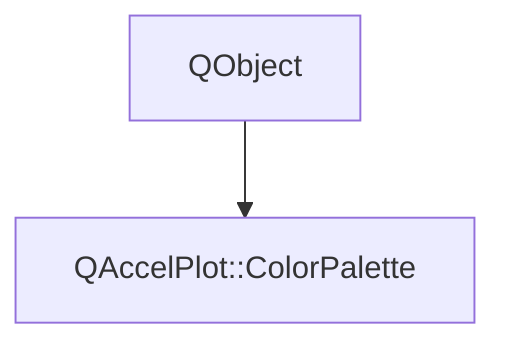

# Class QAccelPlot::ColorPalette


[**ClassList**](annotated.md) **>** [**QAccelPlot**](namespaceQAccelPlot.md) **>** [**ColorPalette**](classQAccelPlot_1_1ColorPalette.md)


_A named set of theme colors shared by QML (via the_ `Colors` _singleton) and C++ defaults._[More...](#detailed-description)

* `#include <ColorPalette.hpp>`


Inherits the following classes: QObject


## Inheritance diagram




## Public Properties

| Type | Name |
| ---: | :--- |
| property QColor | [**annotationEvent**](classQAccelPlot_1_1ColorPalette.md#property-annotationevent)  <br> |
| property QColor | [**annotationMarkerOutline**](classQAccelPlot_1_1ColorPalette.md#property-annotationmarkeroutline)  <br> |
| property QColor | [**annotationPeak**](classQAccelPlot_1_1ColorPalette.md#property-annotationpeak)  <br> |
| property QColor | [**annotationRange**](classQAccelPlot_1_1ColorPalette.md#property-annotationrange)  <br> |
| property QColor | [**annotationRangeFill**](classQAccelPlot_1_1ColorPalette.md#property-annotationrangefill)  <br> |
| property QColor | [**annotationValley**](classQAccelPlot_1_1ColorPalette.md#property-annotationvalley)  <br> |
| property QColor | [**axesArea**](classQAccelPlot_1_1ColorPalette.md#property-axesarea)  <br> |
| property QColor | [**axisLabel**](classQAccelPlot_1_1ColorPalette.md#property-axislabel)  <br> |
| property QColor | [**axisLine**](classQAccelPlot_1_1ColorPalette.md#property-axisline)  <br> |
| property QColor | [**axisTickLabel**](classQAccelPlot_1_1ColorPalette.md#property-axisticklabel)  <br> |
| property QColor | [**control**](classQAccelPlot_1_1ColorPalette.md#property-control)  <br> |
| property QColor | [**controlHover**](classQAccelPlot_1_1ColorPalette.md#property-controlhover)  <br> |
| property QColor | [**focus**](classQAccelPlot_1_1ColorPalette.md#property-focus)  <br> |
| property QColor | [**grid**](classQAccelPlot_1_1ColorPalette.md#property-grid)  <br> |
| property QColor | [**handleBorder**](classQAccelPlot_1_1ColorPalette.md#property-handleborder)  <br> |
| property QColor | [**hover**](classQAccelPlot_1_1ColorPalette.md#property-hover)  <br> |
| property QColor | [**legendBackground**](classQAccelPlot_1_1ColorPalette.md#property-legendbackground)  <br> |
| property QColor | [**legendBorder**](classQAccelPlot_1_1ColorPalette.md#property-legendborder)  <br> |
| property QColor | [**materialAccent**](classQAccelPlot_1_1ColorPalette.md#property-materialaccent)  <br> |
| property QColor | [**outline**](classQAccelPlot_1_1ColorPalette.md#property-outline)  <br> |
| property QColor | [**performanceCurve**](classQAccelPlot_1_1ColorPalette.md#property-performancecurve)  <br> |
| property QColor | [**performanceRectangles**](classQAccelPlot_1_1ColorPalette.md#property-performancerectangles)  <br> |
| property QColor | [**plotArea**](classQAccelPlot_1_1ColorPalette.md#property-plotarea)  <br> |
| property QColor | [**plotBorder**](classQAccelPlot_1_1ColorPalette.md#property-plotborder)  <br> |
| property QColor | [**seriesCyan**](classQAccelPlot_1_1ColorPalette.md#property-seriescyan)  <br> |
| property QColor | [**seriesMuted**](classQAccelPlot_1_1ColorPalette.md#property-seriesmuted)  <br> |
| property QColor | [**seriesPrimary**](classQAccelPlot_1_1ColorPalette.md#property-seriesprimary)  <br> |
| property QColor | [**seriesQuaternary**](classQAccelPlot_1_1ColorPalette.md#property-seriesquaternary)  <br> |
| property QColor | [**seriesRose**](classQAccelPlot_1_1ColorPalette.md#property-seriesrose)  <br> |
| property QColor | [**seriesSecondary**](classQAccelPlot_1_1ColorPalette.md#property-seriessecondary)  <br> |
| property QColor | [**seriesTertiary**](classQAccelPlot_1_1ColorPalette.md#property-seriestertiary)  <br> |
| property QColor | [**seriesYellow**](classQAccelPlot_1_1ColorPalette.md#property-seriesyellow)  <br> |
| property QColor | [**statusError**](classQAccelPlot_1_1ColorPalette.md#property-statuserror)  <br> |
| property QColor | [**statusGood**](classQAccelPlot_1_1ColorPalette.md#property-statusgood)  <br> |
| property QColor | [**statusWarning**](classQAccelPlot_1_1ColorPalette.md#property-statuswarning)  <br> |
| property QColor | [**subGrid**](classQAccelPlot_1_1ColorPalette.md#property-subgrid)  <br> |
| property QColor | [**subtick**](classQAccelPlot_1_1ColorPalette.md#property-subtick)  <br> |
| property QColor | [**text**](classQAccelPlot_1_1ColorPalette.md#property-text)  <br> |
| property QColor | [**textMuted**](classQAccelPlot_1_1ColorPalette.md#property-textmuted)  <br> |
| property QColor | [**textOnAccent**](classQAccelPlot_1_1ColorPalette.md#property-textonaccent)  <br> |
| property QColor | [**textSecondary**](classQAccelPlot_1_1ColorPalette.md#property-textsecondary)  <br> |
| property QColor | [**tick**](classQAccelPlot_1_1ColorPalette.md#property-tick)  <br> |
| property QColor | [**toolAngle**](classQAccelPlot_1_1ColorPalette.md#property-toolangle)  <br> |
| property QColor | [**toolOverlay**](classQAccelPlot_1_1ColorPalette.md#property-tooloverlay)  <br> |
| property QColor | [**toolPoint**](classQAccelPlot_1_1ColorPalette.md#property-toolpoint)  <br> |
| property QColor | [**toolRegion**](classQAccelPlot_1_1ColorPalette.md#property-toolregion)  <br> |
| property QColor | [**toolRuler**](classQAccelPlot_1_1ColorPalette.md#property-toolruler)  <br> |
| property QColor | [**tooltipBackground**](classQAccelPlot_1_1ColorPalette.md#property-tooltipbackground)  <br> |
| property QColor | [**tooltipText**](classQAccelPlot_1_1ColorPalette.md#property-tooltiptext)  <br> |
| property QColor | [**transparent**](classQAccelPlot_1_1ColorPalette.md#property-transparent)  <br> |
| property QColor | [**window**](classQAccelPlot_1_1ColorPalette.md#property-window)  <br> |


## Public Static Functions

| Type | Name |
| ---: | :--- |
|  const [**ColorPalette**](classQAccelPlot_1_1ColorPalette.md) & | [**dark**](#function-dark) () <br>_Returns the dark palette. Used for C++ property defaults._  |
|  const [**ColorPalette**](classQAccelPlot_1_1ColorPalette.md) & | [**light**](#function-light) () <br>_Returns the light palette._  |


## Detailed Description


This is the single source of truth for [**QAccelPlot**](classQAccelPlot_1_1QAccelPlot.md)'s color theme. C++ property defaults use `ColorPalette::dark()`; QML accesses both palettes as `Colors.light` and `Colors.dark`. All properties are read-only.


**See also:** [**Colors**](classQAccelPlot_1_1Colors.md) 


    
## Public Properties Documentation


### property annotationEvent {#property-annotationevent}

```C++
QColor QAccelPlot::ColorPalette::annotationEvent;
```


<hr>


### property annotationMarkerOutline {#property-annotationmarkeroutline}

```C++
QColor QAccelPlot::ColorPalette::annotationMarkerOutline;
```


<hr>


### property annotationPeak {#property-annotationpeak}

```C++
QColor QAccelPlot::ColorPalette::annotationPeak;
```


<hr>


### property annotationRange {#property-annotationrange}

```C++
QColor QAccelPlot::ColorPalette::annotationRange;
```


<hr>


### property annotationRangeFill {#property-annotationrangefill}

```C++
QColor QAccelPlot::ColorPalette::annotationRangeFill;
```


<hr>


### property annotationValley {#property-annotationvalley}

```C++
QColor QAccelPlot::ColorPalette::annotationValley;
```


<hr>


### property axesArea {#property-axesarea}

```C++
QColor QAccelPlot::ColorPalette::axesArea;
```


<hr>


### property axisLabel {#property-axislabel}

```C++
QColor QAccelPlot::ColorPalette::axisLabel;
```


<hr>


### property axisLine {#property-axisline}

```C++
QColor QAccelPlot::ColorPalette::axisLine;
```


<hr>


### property axisTickLabel {#property-axisticklabel}

```C++
QColor QAccelPlot::ColorPalette::axisTickLabel;
```


<hr>


### property control {#property-control}

```C++
QColor QAccelPlot::ColorPalette::control;
```


<hr>


### property controlHover {#property-controlhover}

```C++
QColor QAccelPlot::ColorPalette::controlHover;
```


<hr>


### property focus {#property-focus}

```C++
QColor QAccelPlot::ColorPalette::focus;
```


<hr>


### property grid {#property-grid}

```C++
QColor QAccelPlot::ColorPalette::grid;
```


<hr>


### property handleBorder {#property-handleborder}

```C++
QColor QAccelPlot::ColorPalette::handleBorder;
```


<hr>


### property hover {#property-hover}

```C++
QColor QAccelPlot::ColorPalette::hover;
```


<hr>


### property legendBackground {#property-legendbackground}

```C++
QColor QAccelPlot::ColorPalette::legendBackground;
```


<hr>


### property legendBorder {#property-legendborder}

```C++
QColor QAccelPlot::ColorPalette::legendBorder;
```


<hr>


### property materialAccent {#property-materialaccent}

```C++
QColor QAccelPlot::ColorPalette::materialAccent;
```


<hr>


### property outline {#property-outline}

```C++
QColor QAccelPlot::ColorPalette::outline;
```


<hr>


### property performanceCurve {#property-performancecurve}

```C++
QColor QAccelPlot::ColorPalette::performanceCurve;
```


<hr>


### property performanceRectangles {#property-performancerectangles}

```C++
QColor QAccelPlot::ColorPalette::performanceRectangles;
```


<hr>


### property plotArea {#property-plotarea}

```C++
QColor QAccelPlot::ColorPalette::plotArea;
```


<hr>


### property plotBorder {#property-plotborder}

```C++
QColor QAccelPlot::ColorPalette::plotBorder;
```


<hr>


### property seriesCyan {#property-seriescyan}

```C++
QColor QAccelPlot::ColorPalette::seriesCyan;
```


<hr>


### property seriesMuted {#property-seriesmuted}

```C++
QColor QAccelPlot::ColorPalette::seriesMuted;
```


<hr>


### property seriesPrimary {#property-seriesprimary}

```C++
QColor QAccelPlot::ColorPalette::seriesPrimary;
```


<hr>


### property seriesQuaternary {#property-seriesquaternary}

```C++
QColor QAccelPlot::ColorPalette::seriesQuaternary;
```


<hr>


### property seriesRose {#property-seriesrose}

```C++
QColor QAccelPlot::ColorPalette::seriesRose;
```


<hr>


### property seriesSecondary {#property-seriessecondary}

```C++
QColor QAccelPlot::ColorPalette::seriesSecondary;
```


<hr>


### property seriesTertiary {#property-seriestertiary}

```C++
QColor QAccelPlot::ColorPalette::seriesTertiary;
```


<hr>


### property seriesYellow {#property-seriesyellow}

```C++
QColor QAccelPlot::ColorPalette::seriesYellow;
```


<hr>


### property statusError {#property-statuserror}

```C++
QColor QAccelPlot::ColorPalette::statusError;
```


<hr>


### property statusGood {#property-statusgood}

```C++
QColor QAccelPlot::ColorPalette::statusGood;
```


<hr>


### property statusWarning {#property-statuswarning}

```C++
QColor QAccelPlot::ColorPalette::statusWarning;
```


<hr>


### property subGrid {#property-subgrid}

```C++
QColor QAccelPlot::ColorPalette::subGrid;
```


<hr>


### property subtick {#property-subtick}

```C++
QColor QAccelPlot::ColorPalette::subtick;
```


<hr>


### property text {#property-text}

```C++
QColor QAccelPlot::ColorPalette::text;
```


<hr>


### property textMuted {#property-textmuted}

```C++
QColor QAccelPlot::ColorPalette::textMuted;
```


<hr>


### property textOnAccent {#property-textonaccent}

```C++
QColor QAccelPlot::ColorPalette::textOnAccent;
```


<hr>


### property textSecondary {#property-textsecondary}

```C++
QColor QAccelPlot::ColorPalette::textSecondary;
```


<hr>


### property tick {#property-tick}

```C++
QColor QAccelPlot::ColorPalette::tick;
```


<hr>


### property toolAngle {#property-toolangle}

```C++
QColor QAccelPlot::ColorPalette::toolAngle;
```


<hr>


### property toolOverlay {#property-tooloverlay}

```C++
QColor QAccelPlot::ColorPalette::toolOverlay;
```


<hr>


### property toolPoint {#property-toolpoint}

```C++
QColor QAccelPlot::ColorPalette::toolPoint;
```


<hr>


### property toolRegion {#property-toolregion}

```C++
QColor QAccelPlot::ColorPalette::toolRegion;
```


<hr>


### property toolRuler {#property-toolruler}

```C++
QColor QAccelPlot::ColorPalette::toolRuler;
```


<hr>


### property tooltipBackground {#property-tooltipbackground}

```C++
QColor QAccelPlot::ColorPalette::tooltipBackground;
```


<hr>


### property tooltipText {#property-tooltiptext}

```C++
QColor QAccelPlot::ColorPalette::tooltipText;
```


<hr>


### property transparent {#property-transparent}

```C++
QColor QAccelPlot::ColorPalette::transparent;
```


<hr>


### property window {#property-window}

```C++
QColor QAccelPlot::ColorPalette::window;
```


<hr>
## Public Static Functions Documentation


### function dark {#function-dark}

_Returns the dark palette. Used for C++ property defaults._ 
```C++
static const ColorPalette & QAccelPlot::ColorPalette::dark () 
```


<hr>


### function light {#function-light}

_Returns the light palette._ 
```C++
static const ColorPalette & QAccelPlot::ColorPalette::light () 
```


<hr>

------------------------------
The documentation for this class was generated from the following file `QAccelPlot/src/theme/ColorPalette.hpp`

