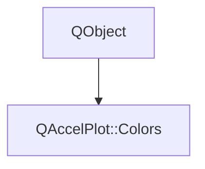

# Class QAccelPlot::Colors


[**ClassList**](annotated.md) **>** [**QAccelPlot**](namespaceQAccelPlot.md) **>** [**Colors**](classQAccelPlot_1_1Colors.md)


_QML singleton exposing_ [_**QAccelPlot**_](classQAccelPlot_1_1QAccelPlot.md) _'s built-in color palettes._[More...](#detailed-description)

* `#include <Colors.hpp>`


Inherits the following classes: QObject


## Inheritance diagram




## Public Properties

| Type | Name |
| ---: | :--- |
| property QML\_SINGLETONColorPalette \* | [**dark**](classQAccelPlot_1_1Colors.md#property-dark-12)  <br>_Read-only constant: dark theme palette. C++ property defaults use these colors._  |
| property [**ColorPalette**](classQAccelPlot_1_1ColorPalette.md) \* | [**light**](classQAccelPlot_1_1Colors.md#property-light-12)  <br>_Read-only constant: light theme palette._  |


## Public Functions

| Type | Name |
| ---: | :--- |
|   | [**Colors**](#function-colors) (QObject \* parent=nullptr) <br> |
|  [**ColorPalette**](classQAccelPlot_1_1ColorPalette.md) \* | [**dark**](#function-dark-22) () const<br> |
|  [**ColorPalette**](classQAccelPlot_1_1ColorPalette.md) \* | [**light**](#function-light-22) () const<br> |


## Detailed Description


**
**


```C++
import QAccelPlot as QAccelPlot

QAccelPlot.Plot {
    plotAreaColor: QAccelPlot.Colors.dark.plotArea
}
```


**See also:** [**ColorPalette**](classQAccelPlot_1_1ColorPalette.md) 


    
## Public Properties Documentation


### property dark {#property-dark-12}

_Read-only constant: dark theme palette. C++ property defaults use these colors._ 
```C++
QML_SINGLETONColorPalette* QAccelPlot::Colors::dark;
```


<hr>


### property light {#property-light-12}

_Read-only constant: light theme palette._ 
```C++
ColorPalette* QAccelPlot::Colors::light;
```


<hr>
## Public Functions Documentation


### function Colors {#function-colors}

```C++
explicit QAccelPlot::Colors::Colors (
    QObject * parent=nullptr
) 
```


<hr>


### function dark {#function-dark-22}

```C++
ColorPalette * QAccelPlot::Colors::dark () const
```


<hr>


### function light {#function-light-22}

```C++
ColorPalette * QAccelPlot::Colors::light () const
```


<hr>

------------------------------
The documentation for this class was generated from the following file `QAccelPlot/src/theme/Colors.hpp`

