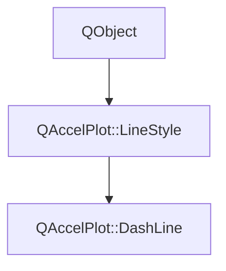

# Class QAccelPlot::DashLine


[**ClassList**](annotated.md) **>** [**QAccelPlot**](namespaceQAccelPlot.md) **>** [**DashLine**](classQAccelPlot_1_1DashLine.md)


_A line style that renders the curve as a customisable dashed line._ [More...](#detailed-description)

* `#include <DashLine.hpp>`


Inherits the following classes: [QAccelPlot::LineStyle](classQAccelPlot_1_1LineStyle.md)


## Inheritance diagram




## Public Properties

| Type | Name |
| ---: | :--- |
| property QList&lt; qreal &gt; | [**pattern**](classQAccelPlot_1_1DashLine.md#property-pattern-12)  <br>_Alternating dash/gap lengths in pixels, e.g._ `` _[10, 5] for a 10px dash with 5px gap._ |


## Public Properties inherited from QAccelPlot::LineStyle

See [QAccelPlot::LineStyle](classQAccelPlot_1_1LineStyle.md)

| Type | Name |
| ---: | :--- |
| property QML\_ANONYMOUSbool | [**showLine**](classQAccelPlot_1_1LineStyle.md#property-showline-12)  <br>_Whether the line should be rendered. Subclasses override to suppress (e.g._ [_**NoLine**_](classQAccelPlot_1_1NoLine.md) _)._ |


## Public Signals

| Type | Name |
| ---: | :--- |
| signal void | [**patternChanged**](classQAccelPlot_1_1DashLine.md#signal-patternchanged)  <br>_Emitted when the pattern property changes._  |


## Public Signals inherited from QAccelPlot::LineStyle

See [QAccelPlot::LineStyle](classQAccelPlot_1_1LineStyle.md)

| Type | Name |
| ---: | :--- |
| signal void | [**styleChanged**](classQAccelPlot_1_1LineStyle.md#signal-stylechanged)  <br>_Emitted when any style property changes, triggering a curve redraw._  |


## Public Functions

| Type | Name |
| ---: | :--- |
|   | [**DashLine**](#function-dashline) (QObject \* parent=nullptr) <br>_Constructs a_ [_**DashLine**_](classQAccelPlot_1_1DashLine.md) _with the given__parent_ _._ |
| virtual [**DashParameters**](structQAccelPlot_1_1DashParameters.md) | [**dashParameters**](#function-dashparameters) () override const<br>_Returns a render-thread-safe snapshot of the dash parameters._  |
|  QList&lt; qreal &gt; | [**pattern**](#function-pattern-22) () const<br>_Returns the current dash pattern._  |
|  void | [**setPattern**](#function-setpattern) (const QList&lt; qreal &gt; & pattern) <br>_Sets the dash pattern to_ _pattern_ _._ |


## Public Functions inherited from QAccelPlot::LineStyle

See [QAccelPlot::LineStyle](classQAccelPlot_1_1LineStyle.md)

| Type | Name |
| ---: | :--- |
|   | [**LineStyle**](classQAccelPlot_1_1LineStyle.md#function-linestyle) (QObject \* parent=nullptr) <br>_Constructs an_ [_**LineStyle**_](classQAccelPlot_1_1LineStyle.md) _with the given__parent_ _._ |
| virtual [**DashParameters**](structQAccelPlot_1_1DashParameters.md) | [**dashParameters**](classQAccelPlot_1_1LineStyle.md#function-dashparameters) () const<br>_Returns the dash parameters for this style. Default: disabled dash._  |
| virtual bool | [**showLine**](classQAccelPlot_1_1LineStyle.md#function-showline-22) () const<br>_Returns_ `true` _if the line should be rendered. Default:_`true` _._ |


## Detailed Description


The `pattern` property accepts a list of alternating dash and gap lengths in pixels, following the same convention as SVG `stroke-dasharray`.


**See also:** [**SolidLine**](classQAccelPlot_1_1SolidLine.md), [**NoLine**](classQAccelPlot_1_1NoLine.md), [**LineStyle**](classQAccelPlot_1_1LineStyle.md) 


    
## Public Properties Documentation


### property pattern {#property-pattern-12}

_Alternating dash/gap lengths in pixels, e.g._ `` _[10, 5] for a 10px dash with 5px gap._
```C++
QList<qreal> QAccelPlot::DashLine::pattern;
```


<hr>
## Public Signals Documentation


### signal patternChanged {#signal-patternchanged}

_Emitted when the pattern property changes._ 
```C++
void QAccelPlot::DashLine::patternChanged;
```


<hr>
## Public Functions Documentation


### function DashLine {#function-dashline}

_Constructs a_ [_**DashLine**_](classQAccelPlot_1_1DashLine.md) _with the given__parent_ _._
```C++
explicit QAccelPlot::DashLine::DashLine (
    QObject * parent=nullptr
) 
```


<hr>


### function dashParameters {#function-dashparameters}

_Returns a render-thread-safe snapshot of the dash parameters._ 
```C++
virtual DashParameters QAccelPlot::DashLine::dashParameters () override const
```


Implements [*QAccelPlot::LineStyle::dashParameters*](classQAccelPlot_1_1LineStyle.md#function-dashparameters)


<hr>


### function pattern {#function-pattern-22}

_Returns the current dash pattern._ 
```C++
QList< qreal > QAccelPlot::DashLine::pattern () const
```


<hr>


### function setPattern {#function-setpattern}

_Sets the dash pattern to_ _pattern_ _._
```C++
void QAccelPlot::DashLine::setPattern (
    const QList< qreal > & pattern
) 
```


<hr>

------------------------------
The documentation for this class was generated from the following file `QAccelPlot/src/linestyles/DashLine.hpp`

