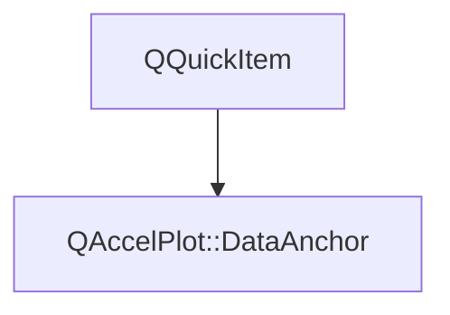

# Class QAccelPlot::DataAnchor


[**ClassList**](annotated.md) **>** [**QAccelPlot**](namespaceQAccelPlot.md) **>** [**DataAnchor**](classQAccelPlot_1_1DataAnchor.md)


_A QQuickItem that tracks a data-coordinate rectangle in pixel space._ [More...](#detailed-description)

* `#include <DataAnchor.hpp>`


Inherits the following classes: QQuickItem


## Inheritance diagram




## Public Properties

| Type | Name |
| ---: | :--- |
| property qreal | [**dataX1**](classQAccelPlot_1_1DataAnchor.md#property-datax1-12)  <br>_X data coordinate of the first (left) edge of the anchor._  |
| property qreal | [**dataX2**](classQAccelPlot_1_1DataAnchor.md#property-datax2-12)  <br>_X data coordinate of the second (right) edge of the anchor._  |
| property qreal | [**dataY1**](classQAccelPlot_1_1DataAnchor.md#property-datay1-12)  <br>_Y data coordinate of the first (bottom or top) edge of the anchor._  |
| property qreal | [**dataY2**](classQAccelPlot_1_1DataAnchor.md#property-datay2-12)  <br>_Y data coordinate of the second (top or bottom) edge of the anchor._  |
| property qreal | [**hoverThreshold**](classQAccelPlot_1_1DataAnchor.md#property-hoverthreshold-12)  <br>_Radius in pixels by which_ [_**contains()**_](classQAccelPlot_1_1DataAnchor.md#function-contains) _expands the logical hit area._ |
| property QRectF | [**plotRect**](classQAccelPlot_1_1DataAnchor.md#property-plotrect-12)  <br>_The pixel rectangle of the plot canvas, used together with the axes to compute the item's position and size._  |
| property [**Axis**](classQAccelPlot_1_1Axis.md) \* | [**xAxis**](classQAccelPlot_1_1DataAnchor.md#property-xaxis-12)  <br>_The horizontal axis used to map data X coordinates to pixel positions._  |
| property [**Axis**](classQAccelPlot_1_1Axis.md) \* | [**yAxis**](classQAccelPlot_1_1DataAnchor.md#property-yaxis-12)  <br>_The vertical axis used to map data Y coordinates to pixel positions._  |


## Public Signals

| Type | Name |
| ---: | :--- |
| signal void | [**dataX1Changed**](classQAccelPlot_1_1DataAnchor.md#signal-datax1changed)  <br>_Emitted when the dataX1 property changes._  |
| signal void | [**dataX2Changed**](classQAccelPlot_1_1DataAnchor.md#signal-datax2changed)  <br>_Emitted when the dataX2 property changes._  |
| signal void | [**dataY1Changed**](classQAccelPlot_1_1DataAnchor.md#signal-datay1changed)  <br>_Emitted when the dataY1 property changes._  |
| signal void | [**dataY2Changed**](classQAccelPlot_1_1DataAnchor.md#signal-datay2changed)  <br>_Emitted when the dataY2 property changes._  |
| signal void | [**hoverThresholdChanged**](classQAccelPlot_1_1DataAnchor.md#signal-hoverthresholdchanged)  <br>_Emitted when the hoverThreshold property changes._  |
| signal void | [**plotRectChanged**](classQAccelPlot_1_1DataAnchor.md#signal-plotrectchanged)  <br>_Emitted when the plotRect property changes._  |
| signal void | [**xAxisChanged**](classQAccelPlot_1_1DataAnchor.md#signal-xaxischanged)  <br>_Emitted when the xAxis property changes._  |
| signal void | [**yAxisChanged**](classQAccelPlot_1_1DataAnchor.md#signal-yaxischanged)  <br>_Emitted when the yAxis property changes._  |


## Public Functions

| Type | Name |
| ---: | :--- |
|   | [**DataAnchor**](#function-dataanchor) (QQuickItem \* parent=nullptr) <br>_Constructs a_ [_**DataAnchor**_](classQAccelPlot_1_1DataAnchor.md) _with the given__parent_ _._ |
|  bool | [**contains**](#function-contains) (const QPointF & point) override const<br>_Returns_ `true` _if__point_ _falls within the item's bounding rect expanded by hoverThreshold on all sides._ |
|  qreal | [**dataX1**](#function-datax1-22) () const<br>_Returns the X data coordinate of the first edge._  |
|  qreal | [**dataX2**](#function-datax2-22) () const<br>_Returns the X data coordinate of the second edge._  |
|  qreal | [**dataY1**](#function-datay1-22) () const<br>_Returns the Y data coordinate of the first edge._  |
|  qreal | [**dataY2**](#function-datay2-22) () const<br>_Returns the Y data coordinate of the second edge._  |
|  qreal | [**hoverThreshold**](#function-hoverthreshold-22) () const<br>_Returns the hover threshold in pixels._  |
|  QRectF | [**plotRect**](#function-plotrect-22) () const<br>_Returns the plot canvas pixel rectangle._  |
|  void | [**setDataX1**](#function-setdatax1) (qreal value) <br>_Sets the X data coordinate of the first edge to_ _value_ _._ |
|  void | [**setDataX2**](#function-setdatax2) (qreal value) <br>_Sets the X data coordinate of the second edge to_ _value_ _._ |
|  void | [**setDataY1**](#function-setdatay1) (qreal value) <br>_Sets the Y data coordinate of the first edge to_ _value_ _._ |
|  void | [**setDataY2**](#function-setdatay2) (qreal value) <br>_Sets the Y data coordinate of the second edge to_ _value_ _._ |
|  void | [**setHoverThreshold**](#function-sethoverthreshold) (qreal threshold) <br>_Sets the hover threshold to_ _threshold_ _pixels._ |
|  void | [**setPlotRect**](#function-setplotrect) (const QRectF & rect) <br>_Sets the plot canvas pixel rectangle to_ _rect_ _, triggering a geometry update._ |
|  void | [**setXAxis**](#function-setxaxis) ([**Axis**](classQAccelPlot_1_1Axis.md) \* axis) <br>_Sets the horizontal axis to_ _axis_ _, reconnecting range-change tracking._ |
|  void | [**setYAxis**](#function-setyaxis) ([**Axis**](classQAccelPlot_1_1Axis.md) \* axis) <br>_Sets the vertical axis to_ _axis_ _, reconnecting range-change tracking._ |
|  [**Axis**](classQAccelPlot_1_1Axis.md) \* | [**xAxis**](#function-xaxis-22) () const<br>_Returns the horizontal axis._  |
|  [**Axis**](classQAccelPlot_1_1Axis.md) \* | [**yAxis**](#function-yaxis-22) () const<br>_Returns the vertical axis._  |


## Detailed Description


Declare [**DataAnchor**](classQAccelPlot_1_1DataAnchor.md) as a direct child of PlotView and nest any visual QML items (Rectangle, Text, HoverHandler, TapHandler …) inside it — they will follow pan and zoom automatically as the axes change.


**
**


* **Point annotation**: set `dataX1` == `dataX2` and `dataY1` == `dataY2`. The item has zero size but [**contains()**](classQAccelPlot_1_1DataAnchor.md#function-contains) still responds within hoverThreshold.
* **Vertical line**: set `dataX1` == `dataX2` and different Y values. The item has zero width but a non-zero height.
* **Rectangle / range band**: supply four distinct data coordinates.


The [**contains()**](classQAccelPlot_1_1DataAnchor.md#function-contains) override expands the logical hit area by hoverThreshold in every direction, so HoverHandler and TapHandler work correctly on zero-size anchors.


**See also:** [**Axis**](classQAccelPlot_1_1Axis.md) 


    
## Public Properties Documentation


### property dataX1 {#property-datax1-12}

_X data coordinate of the first (left) edge of the anchor._ 
```C++
qreal QAccelPlot::DataAnchor::dataX1;
```


<hr>


### property dataX2 {#property-datax2-12}

_X data coordinate of the second (right) edge of the anchor._ 
```C++
qreal QAccelPlot::DataAnchor::dataX2;
```


<hr>


### property dataY1 {#property-datay1-12}

_Y data coordinate of the first (bottom or top) edge of the anchor._ 
```C++
qreal QAccelPlot::DataAnchor::dataY1;
```


<hr>


### property dataY2 {#property-datay2-12}

_Y data coordinate of the second (top or bottom) edge of the anchor._ 
```C++
qreal QAccelPlot::DataAnchor::dataY2;
```


<hr>


### property hoverThreshold {#property-hoverthreshold-12}

_Radius in pixels by which_ [_**contains()**_](classQAccelPlot_1_1DataAnchor.md#function-contains) _expands the logical hit area._
```C++
qreal QAccelPlot::DataAnchor::hoverThreshold;
```


Useful for zero-size anchors (point or line) where the item's bounding rect would otherwise have no area to interact with. 


        

<hr>


### property plotRect {#property-plotrect-12}

_The pixel rectangle of the plot canvas, used together with the axes to compute the item's position and size._ 
```C++
QRectF QAccelPlot::DataAnchor::plotRect;
```


<hr>


### property xAxis {#property-xaxis-12}

_The horizontal axis used to map data X coordinates to pixel positions._ 
```C++
Axis* QAccelPlot::DataAnchor::xAxis;
```


<hr>


### property yAxis {#property-yaxis-12}

_The vertical axis used to map data Y coordinates to pixel positions._ 
```C++
Axis* QAccelPlot::DataAnchor::yAxis;
```


<hr>
## Public Signals Documentation


### signal dataX1Changed {#signal-datax1changed}

_Emitted when the dataX1 property changes._ 
```C++
void QAccelPlot::DataAnchor::dataX1Changed;
```


<hr>


### signal dataX2Changed {#signal-datax2changed}

_Emitted when the dataX2 property changes._ 
```C++
void QAccelPlot::DataAnchor::dataX2Changed;
```


<hr>


### signal dataY1Changed {#signal-datay1changed}

_Emitted when the dataY1 property changes._ 
```C++
void QAccelPlot::DataAnchor::dataY1Changed;
```


<hr>


### signal dataY2Changed {#signal-datay2changed}

_Emitted when the dataY2 property changes._ 
```C++
void QAccelPlot::DataAnchor::dataY2Changed;
```


<hr>


### signal hoverThresholdChanged {#signal-hoverthresholdchanged}

_Emitted when the hoverThreshold property changes._ 
```C++
void QAccelPlot::DataAnchor::hoverThresholdChanged;
```


<hr>


### signal plotRectChanged {#signal-plotrectchanged}

_Emitted when the plotRect property changes._ 
```C++
void QAccelPlot::DataAnchor::plotRectChanged;
```


<hr>


### signal xAxisChanged {#signal-xaxischanged}

_Emitted when the xAxis property changes._ 
```C++
void QAccelPlot::DataAnchor::xAxisChanged;
```


<hr>


### signal yAxisChanged {#signal-yaxischanged}

_Emitted when the yAxis property changes._ 
```C++
void QAccelPlot::DataAnchor::yAxisChanged;
```


<hr>
## Public Functions Documentation


### function DataAnchor {#function-dataanchor}

_Constructs a_ [_**DataAnchor**_](classQAccelPlot_1_1DataAnchor.md) _with the given__parent_ _._
```C++
explicit QAccelPlot::DataAnchor::DataAnchor (
    QQuickItem * parent=nullptr
) 
```


<hr>


### function contains {#function-contains}

_Returns_ `true` _if__point_ _falls within the item's bounding rect expanded by hoverThreshold on all sides._
```C++
bool QAccelPlot::DataAnchor::contains (
    const QPointF & point
) override const
```


**Parameters:**


* `point` Point in item-local coordinates. 


        

<hr>


### function dataX1 {#function-datax1-22}

_Returns the X data coordinate of the first edge._ 
```C++
qreal QAccelPlot::DataAnchor::dataX1 () const
```


<hr>


### function dataX2 {#function-datax2-22}

_Returns the X data coordinate of the second edge._ 
```C++
qreal QAccelPlot::DataAnchor::dataX2 () const
```


<hr>


### function dataY1 {#function-datay1-22}

_Returns the Y data coordinate of the first edge._ 
```C++
qreal QAccelPlot::DataAnchor::dataY1 () const
```


<hr>


### function dataY2 {#function-datay2-22}

_Returns the Y data coordinate of the second edge._ 
```C++
qreal QAccelPlot::DataAnchor::dataY2 () const
```


<hr>


### function hoverThreshold {#function-hoverthreshold-22}

_Returns the hover threshold in pixels._ 
```C++
qreal QAccelPlot::DataAnchor::hoverThreshold () const
```


<hr>


### function plotRect {#function-plotrect-22}

_Returns the plot canvas pixel rectangle._ 
```C++
QRectF QAccelPlot::DataAnchor::plotRect () const
```


<hr>


### function setDataX1 {#function-setdatax1}

_Sets the X data coordinate of the first edge to_ _value_ _._
```C++
void QAccelPlot::DataAnchor::setDataX1 (
    qreal value
) 
```


<hr>


### function setDataX2 {#function-setdatax2}

_Sets the X data coordinate of the second edge to_ _value_ _._
```C++
void QAccelPlot::DataAnchor::setDataX2 (
    qreal value
) 
```


<hr>


### function setDataY1 {#function-setdatay1}

_Sets the Y data coordinate of the first edge to_ _value_ _._
```C++
void QAccelPlot::DataAnchor::setDataY1 (
    qreal value
) 
```


<hr>


### function setDataY2 {#function-setdatay2}

_Sets the Y data coordinate of the second edge to_ _value_ _._
```C++
void QAccelPlot::DataAnchor::setDataY2 (
    qreal value
) 
```


<hr>


### function setHoverThreshold {#function-sethoverthreshold}

_Sets the hover threshold to_ _threshold_ _pixels._
```C++
void QAccelPlot::DataAnchor::setHoverThreshold (
    qreal threshold
) 
```


<hr>


### function setPlotRect {#function-setplotrect}

_Sets the plot canvas pixel rectangle to_ _rect_ _, triggering a geometry update._
```C++
void QAccelPlot::DataAnchor::setPlotRect (
    const QRectF & rect
) 
```


<hr>


### function setXAxis {#function-setxaxis}

_Sets the horizontal axis to_ _axis_ _, reconnecting range-change tracking._
```C++
void QAccelPlot::DataAnchor::setXAxis (
    Axis * axis
) 
```


<hr>


### function setYAxis {#function-setyaxis}

_Sets the vertical axis to_ _axis_ _, reconnecting range-change tracking._
```C++
void QAccelPlot::DataAnchor::setYAxis (
    Axis * axis
) 
```


<hr>


### function xAxis {#function-xaxis-22}

_Returns the horizontal axis._ 
```C++
Axis * QAccelPlot::DataAnchor::xAxis () const
```


<hr>


### function yAxis {#function-yaxis-22}

_Returns the vertical axis._ 
```C++
Axis * QAccelPlot::DataAnchor::yAxis () const
```


<hr>

------------------------------
The documentation for this class was generated from the following file `QAccelPlot/src/annotations/DataAnchor.hpp`

