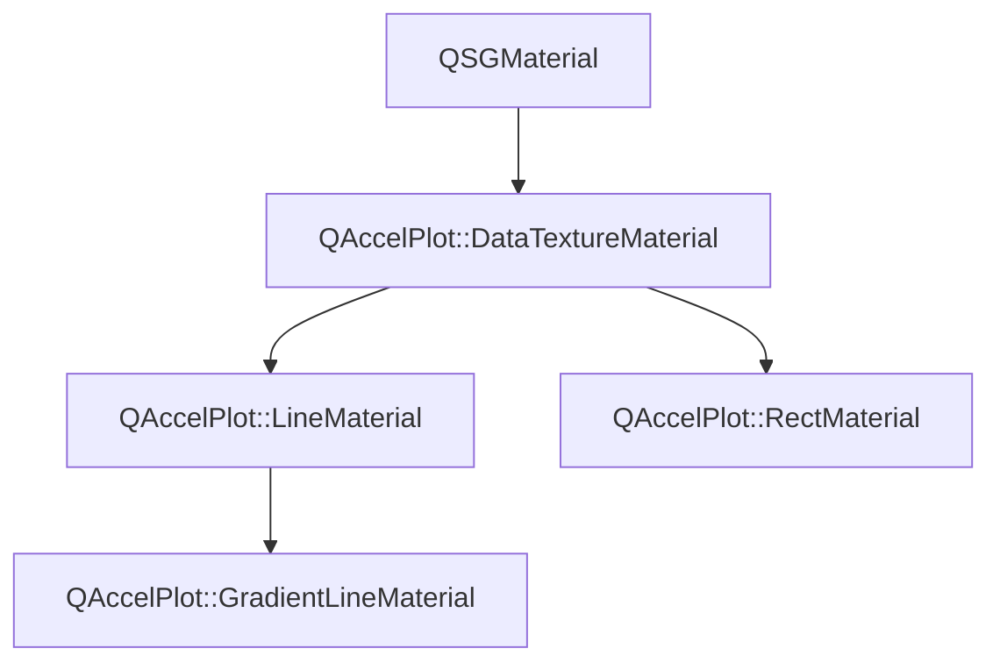

# Class QAccelPlot::DataTextureMaterial


[**ClassList**](annotated.md) **>** [**QAccelPlot**](namespaceQAccelPlot.md) **>** [**DataTextureMaterial**](classQAccelPlot_1_1DataTextureMaterial.md)


_Base QSGMaterial that uploads curve data as a floating-point texture and exposes shared shader uniforms._ [More...](#detailed-description)

* `#include <DataTextureMaterial.hpp>`


Inherits the following classes: QSGMaterial


Inherited by the following classes: [QAccelPlot::LineMaterial](classQAccelPlot_1_1LineMaterial.md),  [QAccelPlot::RectMaterial](classQAccelPlot_1_1RectMaterial.md)


## Inheritance diagram




## Public Attributes

| Type | Name |
| ---: | :--- |
|  QColor | [**color**](#variable-color)   = `{Qt::blue}`<br>_Line/fill color uniform._  |
|  std::unique\_ptr&lt; QSGTexture &gt; | [**dataTexture**](#variable-datatexture)  <br>_Owned data texture bound to the shader sampler._  |
|  QVector2D | [**domainMax**](#variable-domainmax)   = `{1.0f, 1.0f}`<br>_Maximum data-space coordinate._  |
|  QVector2D | [**domainMin**](#variable-domainmin)   = `{0.0f, 0.0f}`<br>_Minimum data-space coordinate._  |
|  float | [**logScaleX**](#variable-logscalex)   = `{0.0f}`<br>_1.0 when the X axis uses log scale (float for std140 UBO compatibility)._  |
|  float | [**logScaleY**](#variable-logscaley)   = `{0.0f}`<br>_1.0 when the Y axis uses log scale (float for std140 UBO compatibility)._  |
|  float | [**useVertexColor**](#variable-usevertexcolor)   = `{0.0f}`<br>_1.0 when per-vertex color overrides_ `color` _(float for std140 UBO compatibility)._ |
|  QVector2D | [**viewportSize**](#variable-viewportsize)   = `{800.0f, 600.0f}`<br>_Viewport size in pixels._  |


## Public Functions

| Type | Name |
| ---: | :--- |
|   | [**DataTextureMaterial**](#function-datatexturematerial) () <br>_Constructs an empty_ [_**DataTextureMaterial**_](classQAccelPlot_1_1DataTextureMaterial.md) _._ |
|  int | [**compare**](#function-compare) (const QSGMaterial \* other) override const<br>_Compares shared uniform fields; delegates type-specific fields to_ `compareExtra()` _._ |
|  void | [**uploadTexture**](#function-uploadtexture) (std::unique\_ptr&lt; QSGTexture &gt; & texture, QQuickWindow \* window, const float \* data, int floatCount) <br>_Uploads_ _floatCount_ _raw floats as an RGBA8888 data texture, reusing existing GPU/CPU buffers where possible._ |
|   | [**~DataTextureMaterial**](#function-datatexturematerial) () override<br> |


## Public Static Functions

| Type | Name |
| ---: | :--- |
|  const QSGGeometry::AttributeSet & | [**attributeSet**](#function-attributeset) () <br>_Returns the shared vertex attribute set:_ `{float` _id, float param, uchar4 color} (12 bytes)._ |
|  void | [**commitTexture**](#function-committexture) (QSGMaterialShader::RenderState & state, int binding, QSGTexture \*\* texture, QSGTexture \* dataTexture) <br>_Commits_ _dataTexture_ _to sampler__binding_ _(call from_`updateSampledImage` _)._ |
|  bool | [**writeCommonUniforms**](#function-writecommonuniforms) (char \* buf, int bufSize, const QMatrix4x4 & matrix, const [**DataTextureMaterial**](classQAccelPlot_1_1DataTextureMaterial.md) \* mat) <br>_Writes the shared UBO prefix (transform + color + domain + flags) into_ _buf_ _._ |


## Protected Functions

| Type | Name |
| ---: | :--- |
| virtual int | [**compareExtra**](#function-compareextra) (const QSGMaterial \* other) const<br>_Subclass hook for_ `compare()` _— called after the shared fields compare equal._ |


## Detailed Description


Subclasses (`LineMaterial`, `RectMaterial`) extend the UBO (Uniform Buffer Object) with type-specific fields. The shared uniform block occupies the first 116 bytes of the std140 UBO: 

**
**


* 0–63 mat4 transform matrix
* 64–79 vec4 color
* 80–87 vec2 domainMin
* 88–95 vec2 domainMax
* 96–103 vec2 viewportSize
* 104–107 float logScaleX
* 108–111 float logScaleY
* 112–115 float useVertexColor 


    
## Public Attributes Documentation


### variable color {#variable-color}

_Line/fill color uniform._ 
```C++
QColor QAccelPlot::DataTextureMaterial::color;
```


<hr>


### variable dataTexture {#variable-datatexture}

_Owned data texture bound to the shader sampler._ 
```C++
std::unique_ptr<QSGTexture> QAccelPlot::DataTextureMaterial::dataTexture;
```


<hr>


### variable domainMax {#variable-domainmax}

_Maximum data-space coordinate._ 
```C++
QVector2D QAccelPlot::DataTextureMaterial::domainMax;
```


<hr>


### variable domainMin {#variable-domainmin}

_Minimum data-space coordinate._ 
```C++
QVector2D QAccelPlot::DataTextureMaterial::domainMin;
```


<hr>


### variable logScaleX {#variable-logscalex}

_1.0 when the X axis uses log scale (float for std140 UBO compatibility)._ 
```C++
float QAccelPlot::DataTextureMaterial::logScaleX;
```


<hr>


### variable logScaleY {#variable-logscaley}

_1.0 when the Y axis uses log scale (float for std140 UBO compatibility)._ 
```C++
float QAccelPlot::DataTextureMaterial::logScaleY;
```


<hr>


### variable useVertexColor {#variable-usevertexcolor}

_1.0 when per-vertex color overrides_ `color` _(float for std140 UBO compatibility)._
```C++
float QAccelPlot::DataTextureMaterial::useVertexColor;
```


<hr>


### variable viewportSize {#variable-viewportsize}

_Viewport size in pixels._ 
```C++
QVector2D QAccelPlot::DataTextureMaterial::viewportSize;
```


<hr>
## Public Functions Documentation


### function DataTextureMaterial {#function-datatexturematerial}

_Constructs an empty_ [_**DataTextureMaterial**_](classQAccelPlot_1_1DataTextureMaterial.md) _._
```C++
QAccelPlot::DataTextureMaterial::DataTextureMaterial () 
```


<hr>


### function compare {#function-compare}

_Compares shared uniform fields; delegates type-specific fields to_ `compareExtra()` _._
```C++
int QAccelPlot::DataTextureMaterial::compare (
    const QSGMaterial * other
) override const
```


<hr>


### function uploadTexture {#function-uploadtexture}

_Uploads_ _floatCount_ _raw floats as an RGBA8888 data texture, reusing existing GPU/CPU buffers where possible._
```C++
void QAccelPlot::DataTextureMaterial::uploadTexture (
    std::unique_ptr< QSGTexture > & texture,
    QQuickWindow * window,
    const float * data,
    int floatCount
) 
```


<hr>


### function ~DataTextureMaterial {#function-datatexturematerial}

```C++
QAccelPlot::DataTextureMaterial::~DataTextureMaterial () override
```


<hr>
## Public Static Functions Documentation


### function attributeSet {#function-attributeset}

_Returns the shared vertex attribute set:_ `{float` _id, float param, uchar4 color} (12 bytes)._
```C++
static const QSGGeometry::AttributeSet & QAccelPlot::DataTextureMaterial::attributeSet () 
```


<hr>


### function commitTexture {#function-committexture}

_Commits_ _dataTexture_ _to sampler__binding_ _(call from_`updateSampledImage` _)._
```C++
static void QAccelPlot::DataTextureMaterial::commitTexture (
    QSGMaterialShader::RenderState & state,
    int binding,
    QSGTexture ** texture,
    QSGTexture * dataTexture
) 
```


<hr>


### function writeCommonUniforms {#function-writecommonuniforms}

_Writes the shared UBO prefix (transform + color + domain + flags) into_ _buf_ _._
```C++
static bool QAccelPlot::DataTextureMaterial::writeCommonUniforms (
    char * buf,
    int bufSize,
    const QMatrix4x4 & matrix,
    const DataTextureMaterial * mat
) 
```


Returns `false` only if _bufSize_ is too small; always writes all fields otherwise. 


        

<hr>
## Protected Functions Documentation


### function compareExtra {#function-compareextra}

_Subclass hook for_ `compare()` _— called after the shared fields compare equal._
```C++
virtual int QAccelPlot::DataTextureMaterial::compareExtra (
    const QSGMaterial * other
) const
```


<hr>

------------------------------
The documentation for this class was generated from the following file `QAccelPlot/src/materials/DataTextureMaterial.hpp`

