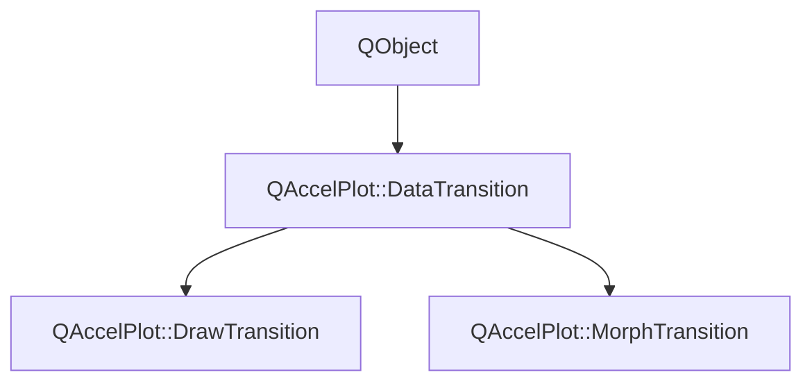

# Class QAccelPlot::DataTransition


[**ClassList**](annotated.md) **>** [**QAccelPlot**](namespaceQAccelPlot.md) **>** [**DataTransition**](classQAccelPlot_1_1DataTransition.md)


_Abstract base class for animated data transitions on plot elements._ [More...](#detailed-description)

* `#include <DataTransition.hpp>`


Inherits the following classes: QObject


Inherited by the following classes: [QAccelPlot::DrawTransition](classQAccelPlot_1_1DrawTransition.md),  [QAccelPlot::MorphTransition](classQAccelPlot_1_1MorphTransition.md)


## Inheritance diagram




## Public Properties

| Type | Name |
| ---: | :--- |
| property QML\_ANONYMOUSint | [**duration**](classQAccelPlot_1_1DataTransition.md#property-duration-12)  <br>_Duration of the transition in milliseconds. Default: 300._  |
| property QEasingCurve | [**easing**](classQAccelPlot_1_1DataTransition.md#property-easing-12)  <br>_Easing curve applied to the animation progress. Default:_ `QEasingCurve::Linear` _._ |
| property bool | [**enabled**](classQAccelPlot_1_1DataTransition.md#property-enabled-12)  <br>_Whether the transition is active. When_ `false` _, data updates are applied instantly._ |
| property bool | [**running**](classQAccelPlot_1_1DataTransition.md#property-running-12)  <br>_Read-only:_ `true` _while the transition is playing._ |


## Public Signals

| Type | Name |
| ---: | :--- |
| signal void | [**durationChanged**](classQAccelPlot_1_1DataTransition.md#signal-durationchanged)  <br>_Emitted when the duration property changes._  |
| signal void | [**easingChanged**](classQAccelPlot_1_1DataTransition.md#signal-easingchanged)  <br>_Emitted when the easing property changes._  |
| signal void | [**enabledChanged**](classQAccelPlot_1_1DataTransition.md#signal-enabledchanged)  <br>_Emitted when the enabled property changes._  |
| signal void | [**runningChanged**](classQAccelPlot_1_1DataTransition.md#signal-runningchanged)  <br>_Emitted when the running property changes._  |


## Public Functions

| Type | Name |
| ---: | :--- |
|   | [**DataTransition**](#function-datatransition) (QObject \* parent=nullptr) <br>_Constructs an_ [_**DataTransition**_](classQAccelPlot_1_1DataTransition.md) _with the given__parent_ _._ |
|  bool | [**advance**](#function-advance) (std::vector&lt; double &gt; & outData, int & outPointCount) <br>_Advances the animation by one frame, writing the interpolated data into_ _outData_ _._ |
|  void | [**cancel**](#function-cancel) () <br>_Cancels the running transition immediately._  |
|  int | [**duration**](#function-duration-22) () const<br>_Returns the animation duration in milliseconds._  |
|  QEasingCurve | [**easing**](#function-easing-22) () const<br>_Returns the easing curve._  |
|  bool | [**enabled**](#function-enabled-22) () const<br>_Returns_ `true` _if the transition is enabled._ |
|  bool | [**running**](#function-running-22) () const<br>_Returns_ `true` _while a transition is actively playing._ |
|  void | [**setDuration**](#function-setduration) (int duration) <br>_Sets the animation duration to_ _duration_ _milliseconds._ |
|  void | [**setEasing**](#function-seteasing) (const QEasingCurve & easing) <br>_Sets the easing curve to_ _easing_ _._ |
|  void | [**setEnabled**](#function-setenabled) (bool enabled) <br>_Sets the enabled state to_ _enabled_ _._ |
|  void | [**start**](#function-start) (const std::vector&lt; double &gt; & currentData, int currentPointCount, std::vector&lt; double &gt; && newData, int newPointCount) <br>_Starts a new transition from_ _currentData_ _to__newData_ _._ |


## Protected Functions

| Type | Name |
| ---: | :--- |
| virtual void | [**interpolate**](#function-interpolate) (double easedProgress, const std::vector&lt; double &gt; & fromData, int fromPointCount, const std::vector&lt; double &gt; & toData, int toPointCount, std::vector&lt; double &gt; & outData, int & outPointCount) = 0<br>_Subclass entry point — computes the interpolated dataset at_ _easedProgress_ _(0–1)._ |


## Detailed Description


Subclasses implement `interpolate()` to define how the element animates between an old dataset and a new one. The transition is driven frame-by-frame by `advance()`, which is called from the host element's `updatePaintNode()`.


**See also:** [**DrawTransition**](classQAccelPlot_1_1DrawTransition.md), [**MorphTransition**](classQAccelPlot_1_1MorphTransition.md), [**LineCurve**](classQAccelPlot_1_1LineCurve.md) 


    
## Public Properties Documentation


### property duration {#property-duration-12}

_Duration of the transition in milliseconds. Default: 300._ 
```C++
QML_ANONYMOUSint QAccelPlot::DataTransition::duration;
```


<hr>


### property easing {#property-easing-12}

_Easing curve applied to the animation progress. Default:_ `QEasingCurve::Linear` _._
```C++
QEasingCurve QAccelPlot::DataTransition::easing;
```


<hr>


### property enabled {#property-enabled-12}

_Whether the transition is active. When_ `false` _, data updates are applied instantly._
```C++
bool QAccelPlot::DataTransition::enabled;
```


<hr>


### property running {#property-running-12}

_Read-only:_ `true` _while the transition is playing._
```C++
bool QAccelPlot::DataTransition::running;
```


<hr>
## Public Signals Documentation


### signal durationChanged {#signal-durationchanged}

_Emitted when the duration property changes._ 
```C++
void QAccelPlot::DataTransition::durationChanged;
```


<hr>


### signal easingChanged {#signal-easingchanged}

_Emitted when the easing property changes._ 
```C++
void QAccelPlot::DataTransition::easingChanged;
```


<hr>


### signal enabledChanged {#signal-enabledchanged}

_Emitted when the enabled property changes._ 
```C++
void QAccelPlot::DataTransition::enabledChanged;
```


<hr>


### signal runningChanged {#signal-runningchanged}

_Emitted when the running property changes._ 
```C++
void QAccelPlot::DataTransition::runningChanged;
```


<hr>
## Public Functions Documentation


### function DataTransition {#function-datatransition}

_Constructs an_ [_**DataTransition**_](classQAccelPlot_1_1DataTransition.md) _with the given__parent_ _._
```C++
explicit QAccelPlot::DataTransition::DataTransition (
    QObject * parent=nullptr
) 
```


<hr>


### function advance {#function-advance}

_Advances the animation by one frame, writing the interpolated data into_ _outData_ _._
```C++
bool QAccelPlot::DataTransition::advance (
    std::vector< double > & outData,
    int & outPointCount
) 
```


**Returns:**

`true` if the animation is still running after this call. 


        

<hr>


### function cancel {#function-cancel}

_Cancels the running transition immediately._ 
```C++
void QAccelPlot::DataTransition::cancel () 
```


<hr>


### function duration {#function-duration-22}

_Returns the animation duration in milliseconds._ 
```C++
int QAccelPlot::DataTransition::duration () const
```


<hr>


### function easing {#function-easing-22}

_Returns the easing curve._ 
```C++
QEasingCurve QAccelPlot::DataTransition::easing () const
```


<hr>


### function enabled {#function-enabled-22}

_Returns_ `true` _if the transition is enabled._
```C++
bool QAccelPlot::DataTransition::enabled () const
```


<hr>


### function running {#function-running-22}

_Returns_ `true` _while a transition is actively playing._
```C++
bool QAccelPlot::DataTransition::running () const
```


<hr>


### function setDuration {#function-setduration}

_Sets the animation duration to_ _duration_ _milliseconds._
```C++
void QAccelPlot::DataTransition::setDuration (
    int duration
) 
```


<hr>


### function setEasing {#function-seteasing}

_Sets the easing curve to_ _easing_ _._
```C++
void QAccelPlot::DataTransition::setEasing (
    const QEasingCurve & easing
) 
```


<hr>


### function setEnabled {#function-setenabled}

_Sets the enabled state to_ _enabled_ _._
```C++
void QAccelPlot::DataTransition::setEnabled (
    bool enabled
) 
```


<hr>


### function start {#function-start}

_Starts a new transition from_ _currentData_ _to__newData_ _._
```C++
void QAccelPlot::DataTransition::start (
    const std::vector< double > & currentData,
    int currentPointCount,
    std::vector< double > && newData,
    int newPointCount
) 
```


**Parameters:**


* `currentData` Current XY double buffer (copied as the _from_ state). 
* `currentPointCount` Number of points in _currentData_. 
* `newData` Target XY double buffer (moved as the _to_ state). 
* `newPointCount` Number of points in _newData_. 


        

<hr>
## Protected Functions Documentation


### function interpolate {#function-interpolate}

_Subclass entry point — computes the interpolated dataset at_ _easedProgress_ _(0–1)._
```C++
virtual void QAccelPlot::DataTransition::interpolate (
    double easedProgress,
    const std::vector< double > & fromData,
    int fromPointCount,
    const std::vector< double > & toData,
    int toPointCount,
    std::vector< double > & outData,
    int & outPointCount
) = 0
```


<hr>

------------------------------
The documentation for this class was generated from the following file `QAccelPlot/src/transitions/DataTransition.hpp`

