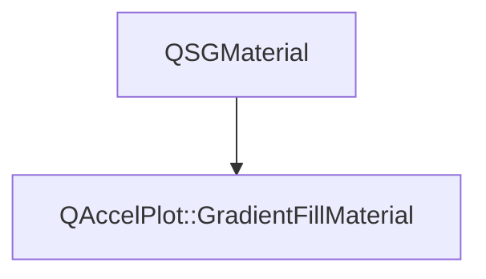

# Class QAccelPlot::GradientFillMaterial


[**ClassList**](annotated.md) **>** [**QAccelPlot**](namespaceQAccelPlot.md) **>** [**GradientFillMaterial**](classQAccelPlot_1_1GradientFillMaterial.md)


_Scene-graph material that evaluates fill gradients per fragment._ 

* `#include <GradientFillMaterial.hpp>`


Inherits the following classes: QSGMaterial


## Inheritance diagram




## Public Attributes

| Type | Name |
| ---: | :--- |
|  [**GradientTexture**](classQAccelPlot_1_1GradientTexture.md) | [**gradientTexture**](#variable-gradienttexture)  <br> |
|  float | [**opacity**](#variable-opacity)   = `{1.0f}`<br> |


## Public Functions

| Type | Name |
| ---: | :--- |
|   | [**GradientFillMaterial**](#function-gradientfillmaterial) () <br> |
|  int | [**compare**](#function-compare) (const QSGMaterial \* other) override const<br> |
|  QSGMaterialShader \* | [**createShader**](#function-createshader) (QSGRendererInterface::RenderMode) override const<br> |
|  QSGMaterialType \* | [**type**](#function-type) () override const<br> |


## Public Attributes Documentation


### variable gradientTexture {#variable-gradienttexture}

```C++
GradientTexture QAccelPlot::GradientFillMaterial::gradientTexture;
```


<hr>


### variable opacity {#variable-opacity}

```C++
float QAccelPlot::GradientFillMaterial::opacity;
```


<hr>
## Public Functions Documentation


### function GradientFillMaterial {#function-gradientfillmaterial}

```C++
QAccelPlot::GradientFillMaterial::GradientFillMaterial () 
```


<hr>


### function compare {#function-compare}

```C++
int QAccelPlot::GradientFillMaterial::compare (
    const QSGMaterial * other
) override const
```


<hr>


### function createShader {#function-createshader}

```C++
QSGMaterialShader * QAccelPlot::GradientFillMaterial::createShader (
    QSGRendererInterface::RenderMode
) override const
```


<hr>


### function type {#function-type}

```C++
QSGMaterialType * QAccelPlot::GradientFillMaterial::type () override const
```


<hr>

------------------------------
The documentation for this class was generated from the following file `QAccelPlot/src/materials/GradientFillMaterial.hpp`

