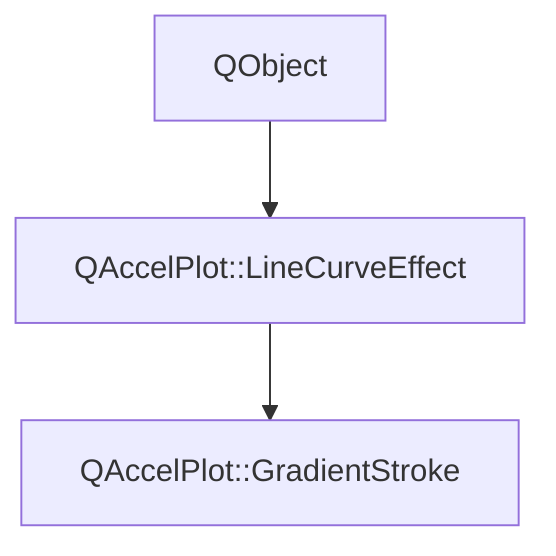

# Class QAccelPlot::GradientStroke


[**ClassList**](annotated.md) **>** [**QAccelPlot**](namespaceQAccelPlot.md) **>** [**GradientStroke**](classQAccelPlot_1_1GradientStroke.md)


_A_ [_**LineCurve**_](classQAccelPlot_1_1LineCurve.md) _effect that replaces the solid line color with a color gradient._[More...](#detailed-description)

* `#include <GradientStroke.hpp>`


Inherits the following classes: [QAccelPlot::LineCurveEffect](classQAccelPlot_1_1LineCurveEffect.md)


## Inheritance diagram




## Public Properties

| Type | Name |
| ---: | :--- |
| property [**GradientDirection**](namespaceQAccelPlot_1_1GradientDirectionNS.md#enum-direction) | [**direction**](classQAccelPlot_1_1GradientStroke.md#property-direction-12)  <br>[_**Axis**_](classQAccelPlot_1_1Axis.md) _along which the gradient color varies (Horizontal or Vertical)._ |
| property QObject \* | [**gradient**](classQAccelPlot_1_1GradientStroke.md#property-gradient-12)  <br>_A Qt_ `Gradient` _(or compatible) object supplying the color stops._ |
| property qreal | [**gradientValueMax**](classQAccelPlot_1_1GradientStroke.md#property-gradientvaluemax-12)  <br>_Data-space value that maps to gradient position 1.0. Only used when gradientValueMaxSource is Fixed._  |
| property [**GradientValueSource**](namespaceQAccelPlot_1_1GradientValueSourceNS.md#enum-source) | [**gradientValueMaxSource**](classQAccelPlot_1_1GradientStroke.md#property-gradientvaluemaxsource-12)  <br>_How the gradient normalization maximum is determined; see_ `GradientValueSource` _._ |
| property qreal | [**gradientValueMin**](classQAccelPlot_1_1GradientStroke.md#property-gradientvaluemin-12)  <br>_Data-space value that maps to gradient position 0.0. Only used when gradientValueMinSource is Fixed._  |
| property [**GradientValueSource**](namespaceQAccelPlot_1_1GradientValueSourceNS.md#enum-source) | [**gradientValueMinSource**](classQAccelPlot_1_1GradientStroke.md#property-gradientvalueminsource-12)  <br>_How the gradient normalization minimum is determined; see_ `GradientValueSource` _._ |


## Public Properties inherited from QAccelPlot::LineCurveEffect

See [QAccelPlot::LineCurveEffect](classQAccelPlot_1_1LineCurveEffect.md)

| Type | Name |
| ---: | :--- |
| property QML\_ANONYMOUSbool | [**enabled**](classQAccelPlot_1_1LineCurveEffect.md#property-enabled-12)  <br>_Whether this effect is active. Disabled effects are ignored during rendering._  |


## Public Signals

| Type | Name |
| ---: | :--- |
| signal void | [**directionChanged**](classQAccelPlot_1_1GradientStroke.md#signal-directionchanged)  <br>_Emitted when the direction property changes._  |
| signal void | [**gradientChanged**](classQAccelPlot_1_1GradientStroke.md#signal-gradientchanged)  <br>_Emitted when the gradient property changes._  |
| signal void | [**gradientValueMaxChanged**](classQAccelPlot_1_1GradientStroke.md#signal-gradientvaluemaxchanged)  <br>_Emitted when the gradientValueMax property changes._  |
| signal void | [**gradientValueMaxSourceChanged**](classQAccelPlot_1_1GradientStroke.md#signal-gradientvaluemaxsourcechanged)  <br>_Emitted when the gradientValueMaxSource property changes._  |
| signal void | [**gradientValueMinChanged**](classQAccelPlot_1_1GradientStroke.md#signal-gradientvalueminchanged)  <br>_Emitted when the gradientValueMin property changes._  |
| signal void | [**gradientValueMinSourceChanged**](classQAccelPlot_1_1GradientStroke.md#signal-gradientvalueminsourcechanged)  <br>_Emitted when the gradientValueMinSource property changes._  |


## Public Signals inherited from QAccelPlot::LineCurveEffect

See [QAccelPlot::LineCurveEffect](classQAccelPlot_1_1LineCurveEffect.md)

| Type | Name |
| ---: | :--- |
| signal void | [**effectChanged**](classQAccelPlot_1_1LineCurveEffect.md#signal-effectchanged)  <br>_Emitted when any effect property changes, requesting a curve redraw._  |
| signal void | [**enabledChanged**](classQAccelPlot_1_1LineCurveEffect.md#signal-enabledchanged)  <br>_Emitted when the enabled property changes._  |


## Public Functions

| Type | Name |
| ---: | :--- |
|   | [**GradientStroke**](#function-gradientstroke) (QObject \* parent=nullptr) <br>_Constructs a_ [_**GradientStroke**_](classQAccelPlot_1_1GradientStroke.md) _with the given__parent_ _._ |
|  [**GradientDirection**](namespaceQAccelPlot_1_1GradientDirectionNS.md#enum-direction) | [**direction**](#function-direction-22) () const<br>_Returns the gradient direction._  |
|  QObject \* | [**gradient**](#function-gradient-22) () const<br>_Returns the Qt Gradient object supplying color stops._  |
|  qreal | [**gradientValueMax**](#function-gradientvaluemax-22) () const<br>_Returns the maximum data value for gradient normalization._  |
|  [**GradientValueSource**](namespaceQAccelPlot_1_1GradientValueSourceNS.md#enum-source) | [**gradientValueMaxSource**](#function-gradientvaluemaxsource-22) () const<br>_Returns how the gradient normalization maximum is determined._  |
|  qreal | [**gradientValueMin**](#function-gradientvaluemin-22) () const<br>_Returns the minimum data value for gradient normalization._  |
|  [**GradientValueSource**](namespaceQAccelPlot_1_1GradientValueSourceNS.md#enum-source) | [**gradientValueMinSource**](#function-gradientvalueminsource-22) () const<br>_Returns how the gradient normalization minimum is determined._  |
|  [**GradientColorPayload**](structQAccelPlot_1_1GradientColorPayload.md) | [**payload**](#function-payload) () const<br>_Returns a render-thread-safe snapshot of all stroke parameters._  |
|  void | [**setDirection**](#function-setdirection) ([**GradientDirection**](namespaceQAccelPlot_1_1GradientDirectionNS.md#enum-direction) direction) <br>_Sets the gradient direction to_ _direction_ _._ |
|  void | [**setGradient**](#function-setgradient) (QObject \* gradient) <br>_Sets the Qt Gradient object to_ _gradient_ _._ |
|  void | [**setGradientValueMax**](#function-setgradientvaluemax) (qreal value) <br>_Sets the maximum data value for gradient normalization to_ _value_ _._ |
|  void | [**setGradientValueMaxSource**](#function-setgradientvaluemaxsource) ([**GradientValueSource**](namespaceQAccelPlot_1_1GradientValueSourceNS.md#enum-source) source) <br>_Sets the gradient normalization maximum source to_ _source_ _._ |
|  void | [**setGradientValueMin**](#function-setgradientvaluemin) (qreal value) <br>_Sets the minimum data value for gradient normalization to_ _value_ _._ |
|  void | [**setGradientValueMinSource**](#function-setgradientvalueminsource) ([**GradientValueSource**](namespaceQAccelPlot_1_1GradientValueSourceNS.md#enum-source) source) <br>_Sets the gradient normalization minimum source to_ _source_ _._ |


## Public Functions inherited from QAccelPlot::LineCurveEffect

See [QAccelPlot::LineCurveEffect](classQAccelPlot_1_1LineCurveEffect.md)

| Type | Name |
| ---: | :--- |
|   | [**LineCurveEffect**](classQAccelPlot_1_1LineCurveEffect.md#function-linecurveeffect) (QObject \* parent=nullptr) <br>_Constructs an_ [_**LineCurveEffect**_](classQAccelPlot_1_1LineCurveEffect.md) _with the given__parent_ _._ |
|  bool | [**enabled**](classQAccelPlot_1_1LineCurveEffect.md#function-enabled-22) () const<br>_Returns_ `true` _if the effect is active._ |
|  void | [**setEnabled**](classQAccelPlot_1_1LineCurveEffect.md#function-setenabled) (bool enabled) <br>_Sets the effect's enabled state to_ _enabled_ _._ |


## Detailed Description


Attach to `LineCurve::effects` to color the line with a gradient derived from a Qt `Gradient` object. The gradient can run horizontally (along X data values) or vertically (along Y data values).


**See also:** [**GradientFill**](classQAccelPlot_1_1GradientFill.md), [**LineCurveEffect**](classQAccelPlot_1_1LineCurveEffect.md), [**LineCurve**](classQAccelPlot_1_1LineCurve.md) 


    
## Public Properties Documentation


### property direction {#property-direction-12}

[_**Axis**_](classQAccelPlot_1_1Axis.md) _along which the gradient color varies (Horizontal or Vertical)._
```C++
GradientDirection QAccelPlot::GradientStroke::direction;
```


<hr>


### property gradient {#property-gradient-12}

_A Qt_ `Gradient` _(or compatible) object supplying the color stops._
```C++
QObject* QAccelPlot::GradientStroke::gradient;
```


<hr>


### property gradientValueMax {#property-gradientvaluemax-12}

_Data-space value that maps to gradient position 1.0. Only used when gradientValueMaxSource is Fixed._ 
```C++
qreal QAccelPlot::GradientStroke::gradientValueMax;
```


<hr>


### property gradientValueMaxSource {#property-gradientvaluemaxsource-12}

_How the gradient normalization maximum is determined; see_ `GradientValueSource` _._
```C++
GradientValueSource QAccelPlot::GradientStroke::gradientValueMaxSource;
```


<hr>


### property gradientValueMin {#property-gradientvaluemin-12}

_Data-space value that maps to gradient position 0.0. Only used when gradientValueMinSource is Fixed._ 
```C++
qreal QAccelPlot::GradientStroke::gradientValueMin;
```


<hr>


### property gradientValueMinSource {#property-gradientvalueminsource-12}

_How the gradient normalization minimum is determined; see_ `GradientValueSource` _._
```C++
GradientValueSource QAccelPlot::GradientStroke::gradientValueMinSource;
```


<hr>
## Public Signals Documentation


### signal directionChanged {#signal-directionchanged}

_Emitted when the direction property changes._ 
```C++
void QAccelPlot::GradientStroke::directionChanged;
```


<hr>


### signal gradientChanged {#signal-gradientchanged}

_Emitted when the gradient property changes._ 
```C++
void QAccelPlot::GradientStroke::gradientChanged;
```


<hr>


### signal gradientValueMaxChanged {#signal-gradientvaluemaxchanged}

_Emitted when the gradientValueMax property changes._ 
```C++
void QAccelPlot::GradientStroke::gradientValueMaxChanged;
```


<hr>


### signal gradientValueMaxSourceChanged {#signal-gradientvaluemaxsourcechanged}

_Emitted when the gradientValueMaxSource property changes._ 
```C++
void QAccelPlot::GradientStroke::gradientValueMaxSourceChanged;
```


<hr>


### signal gradientValueMinChanged {#signal-gradientvalueminchanged}

_Emitted when the gradientValueMin property changes._ 
```C++
void QAccelPlot::GradientStroke::gradientValueMinChanged;
```


<hr>


### signal gradientValueMinSourceChanged {#signal-gradientvalueminsourcechanged}

_Emitted when the gradientValueMinSource property changes._ 
```C++
void QAccelPlot::GradientStroke::gradientValueMinSourceChanged;
```


<hr>
## Public Functions Documentation


### function GradientStroke {#function-gradientstroke}

_Constructs a_ [_**GradientStroke**_](classQAccelPlot_1_1GradientStroke.md) _with the given__parent_ _._
```C++
explicit QAccelPlot::GradientStroke::GradientStroke (
    QObject * parent=nullptr
) 
```


<hr>


### function direction {#function-direction-22}

_Returns the gradient direction._ 
```C++
GradientDirection QAccelPlot::GradientStroke::direction () const
```


<hr>


### function gradient {#function-gradient-22}

_Returns the Qt Gradient object supplying color stops._ 
```C++
QObject * QAccelPlot::GradientStroke::gradient () const
```


<hr>


### function gradientValueMax {#function-gradientvaluemax-22}

_Returns the maximum data value for gradient normalization._ 
```C++
qreal QAccelPlot::GradientStroke::gradientValueMax () const
```


<hr>


### function gradientValueMaxSource {#function-gradientvaluemaxsource-22}

_Returns how the gradient normalization maximum is determined._ 
```C++
GradientValueSource QAccelPlot::GradientStroke::gradientValueMaxSource () const
```


<hr>


### function gradientValueMin {#function-gradientvaluemin-22}

_Returns the minimum data value for gradient normalization._ 
```C++
qreal QAccelPlot::GradientStroke::gradientValueMin () const
```


<hr>


### function gradientValueMinSource {#function-gradientvalueminsource-22}

_Returns how the gradient normalization minimum is determined._ 
```C++
GradientValueSource QAccelPlot::GradientStroke::gradientValueMinSource () const
```


<hr>


### function payload {#function-payload}

_Returns a render-thread-safe snapshot of all stroke parameters._ 
```C++
GradientColorPayload QAccelPlot::GradientStroke::payload () const
```


<hr>


### function setDirection {#function-setdirection}

_Sets the gradient direction to_ _direction_ _._
```C++
void QAccelPlot::GradientStroke::setDirection (
    GradientDirection direction
) 
```


<hr>


### function setGradient {#function-setgradient}

_Sets the Qt Gradient object to_ _gradient_ _._
```C++
void QAccelPlot::GradientStroke::setGradient (
    QObject * gradient
) 
```


<hr>


### function setGradientValueMax {#function-setgradientvaluemax}

_Sets the maximum data value for gradient normalization to_ _value_ _._
```C++
void QAccelPlot::GradientStroke::setGradientValueMax (
    qreal value
) 
```


<hr>


### function setGradientValueMaxSource {#function-setgradientvaluemaxsource}

_Sets the gradient normalization maximum source to_ _source_ _._
```C++
void QAccelPlot::GradientStroke::setGradientValueMaxSource (
    GradientValueSource source
) 
```


<hr>


### function setGradientValueMin {#function-setgradientvaluemin}

_Sets the minimum data value for gradient normalization to_ _value_ _._
```C++
void QAccelPlot::GradientStroke::setGradientValueMin (
    qreal value
) 
```


<hr>


### function setGradientValueMinSource {#function-setgradientvalueminsource}

_Sets the gradient normalization minimum source to_ _source_ _._
```C++
void QAccelPlot::GradientStroke::setGradientValueMinSource (
    GradientValueSource source
) 
```


<hr>

------------------------------
The documentation for this class was generated from the following file `QAccelPlot/src/effects/GradientStroke.hpp`

