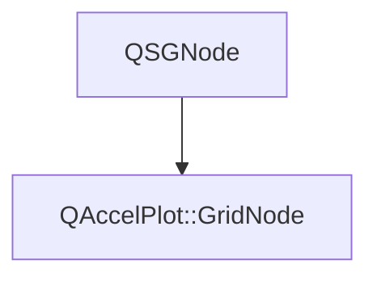

# Class QAccelPlot::GridNode


[**ClassList**](annotated.md) **>** [**QAccelPlot**](namespaceQAccelPlot.md) **>** [**GridNode**](classQAccelPlot_1_1GridNode.md)


_Internal QSGNode responsible for rendering the plot grid into the scene graph._ [More...](#detailed-description)

* `#include <GridNode.hpp>`


Inherits the following classes: QSGNode


## Inheritance diagram




## Public Functions

| Type | Name |
| ---: | :--- |
|   | [**GridNode**](#function-gridnode) () = default<br>_Constructs an empty_ [_**GridNode**_](classQAccelPlot_1_1GridNode.md) _._ |
|  void | [**update**](#function-update) (const [**Grid**](classQAccelPlot_1_1Grid.md) \* grid, const [**Axis**](classQAccelPlot_1_1Axis.md) \* xAxis, const [**Axis**](classQAccelPlot_1_1Axis.md) \* yAxis, const QRectF & plotRect) <br>_Recomputes and updates all grid geometry from the supplied configuration objects._  |


## Detailed Description


Computes grid line positions from the same tick step as `AxisTickPainter` so that grid lines stay aligned with axis tick marks under all zoom levels, including log scale. 


    
## Public Functions Documentation


### function GridNode {#function-gridnode}

_Constructs an empty_ [_**GridNode**_](classQAccelPlot_1_1GridNode.md) _._
```C++
explicit QAccelPlot::GridNode::GridNode () = default
```


<hr>


### function update {#function-update}

_Recomputes and updates all grid geometry from the supplied configuration objects._ 
```C++
void QAccelPlot::GridNode::update (
    const Grid * grid,
    const Axis * xAxis,
    const Axis * yAxis,
    const QRectF & plotRect
) 
```


**Parameters:**


* `grid` [**Grid**](classQAccelPlot_1_1Grid.md) configuration (line widths, visibility flags, colors). 
* `xAxis` Horizontal axis used to determine column positions. 
* `yAxis` Vertical axis used to determine row positions. 
* `plotRect` Plot area rectangle in item-local pixel coordinates. 


        

<hr>

------------------------------
The documentation for this class was generated from the following file `QAccelPlot/src/grid/GridNode.hpp`

