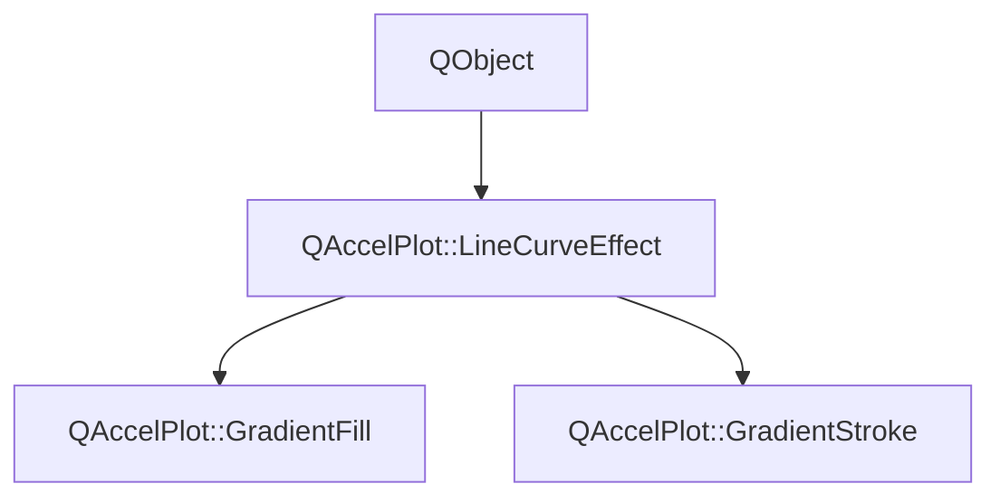

# Class QAccelPlot::LineCurveEffect


[**ClassList**](annotated.md) **>** [**QAccelPlot**](namespaceQAccelPlot.md) **>** [**LineCurveEffect**](classQAccelPlot_1_1LineCurveEffect.md)


_Abstract base class for visual effects applied to a_ `LineCurve` _._[More...](#detailed-description)

* `#include <LineCurveEffect.hpp>`


Inherits the following classes: QObject


Inherited by the following classes: [QAccelPlot::GradientFill](classQAccelPlot_1_1GradientFill.md),  [QAccelPlot::GradientStroke](classQAccelPlot_1_1GradientStroke.md)


## Inheritance diagram




## Public Properties

| Type | Name |
| ---: | :--- |
| property QML\_ANONYMOUSbool | [**enabled**](classQAccelPlot_1_1LineCurveEffect.md#property-enabled-12)  <br>_Whether this effect is active. Disabled effects are ignored during rendering._  |


## Public Signals

| Type | Name |
| ---: | :--- |
| signal void | [**effectChanged**](classQAccelPlot_1_1LineCurveEffect.md#signal-effectchanged)  <br>_Emitted when any effect property changes, requesting a curve redraw._  |
| signal void | [**enabledChanged**](classQAccelPlot_1_1LineCurveEffect.md#signal-enabledchanged)  <br>_Emitted when the enabled property changes._  |


## Public Functions

| Type | Name |
| ---: | :--- |
|   | [**LineCurveEffect**](#function-linecurveeffect) (QObject \* parent=nullptr) <br>_Constructs an_ [_**LineCurveEffect**_](classQAccelPlot_1_1LineCurveEffect.md) _with the given__parent_ _._ |
|  bool | [**enabled**](#function-enabled-22) () const<br>_Returns_ `true` _if the effect is active._ |
|  void | [**setEnabled**](#function-setenabled) (bool enabled) <br>_Sets the effect's enabled state to_ _enabled_ _._ |


## Detailed Description


Effects are attached via the `LineCurve::effects` list property and evaluated during `updatePaintNode` to modify line or fill rendering.


**See also:** [**GradientFill**](classQAccelPlot_1_1GradientFill.md), [**GradientStroke**](classQAccelPlot_1_1GradientStroke.md), [**LineCurve**](classQAccelPlot_1_1LineCurve.md) 


    
## Public Properties Documentation


### property enabled {#property-enabled-12}

_Whether this effect is active. Disabled effects are ignored during rendering._ 
```C++
QML_ANONYMOUSbool QAccelPlot::LineCurveEffect::enabled;
```


<hr>
## Public Signals Documentation


### signal effectChanged {#signal-effectchanged}

_Emitted when any effect property changes, requesting a curve redraw._ 
```C++
void QAccelPlot::LineCurveEffect::effectChanged;
```


<hr>


### signal enabledChanged {#signal-enabledchanged}

_Emitted when the enabled property changes._ 
```C++
void QAccelPlot::LineCurveEffect::enabledChanged;
```


<hr>
## Public Functions Documentation


### function LineCurveEffect {#function-linecurveeffect}

_Constructs an_ [_**LineCurveEffect**_](classQAccelPlot_1_1LineCurveEffect.md) _with the given__parent_ _._
```C++
explicit QAccelPlot::LineCurveEffect::LineCurveEffect (
    QObject * parent=nullptr
) 
```


<hr>


### function enabled {#function-enabled-22}

_Returns_ `true` _if the effect is active._
```C++
bool QAccelPlot::LineCurveEffect::enabled () const
```


<hr>


### function setEnabled {#function-setenabled}

_Sets the effect's enabled state to_ _enabled_ _._
```C++
void QAccelPlot::LineCurveEffect::setEnabled (
    bool enabled
) 
```


<hr>

------------------------------
The documentation for this class was generated from the following file `QAccelPlot/src/effects/LineCurveEffect.hpp`

