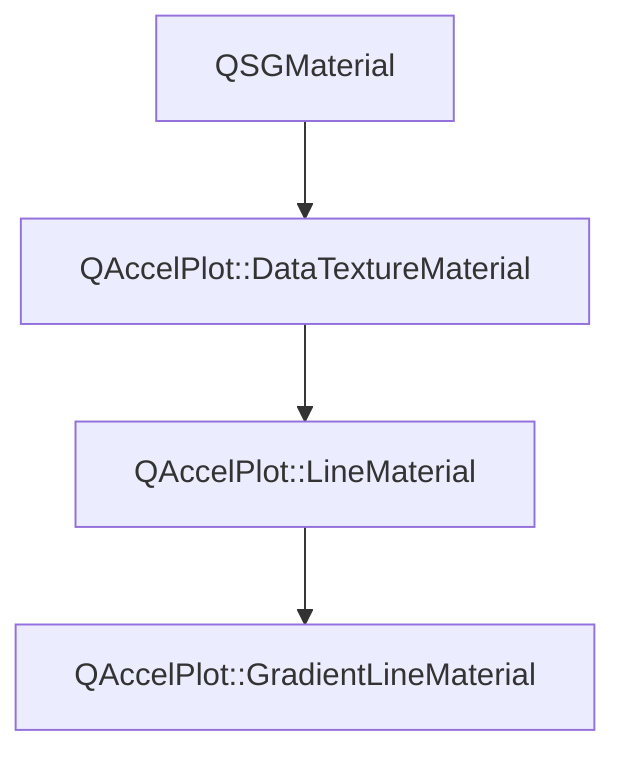

# Class QAccelPlot::LineMaterial


[**ClassList**](annotated.md) **>** [**QAccelPlot**](namespaceQAccelPlot.md) **>** [**LineMaterial**](classQAccelPlot_1_1LineMaterial.md)


_QSGMaterial for line rendering, extending_ [_**DataTextureMaterial**_](classQAccelPlot_1_1DataTextureMaterial.md) _with line-specific uniforms._[More...](#detailed-description)

* `#include <LineMaterial.hpp>`


Inherits the following classes: [QAccelPlot::DataTextureMaterial](classQAccelPlot_1_1DataTextureMaterial.md)


Inherited by the following classes: [QAccelPlot::GradientLineMaterial](classQAccelPlot_1_1GradientLineMaterial.md)


## Inheritance diagram




## Public Attributes

| Type | Name |
| ---: | :--- |
|  float | [**antialiasingEnabled**](#variable-antialiasingenabled)   = `{1.0f}`<br>_1.0 when GPU anti-aliasing is active._  |
|  float | [**antialiasingFeather**](#variable-antialiasingfeather)   = `{1.0f}`<br>_Anti-aliasing feather width in pixels._  |
|  float | [**dashOffset**](#variable-dashoffset)   = `{0.0f}`<br>_Phase offset into the dash pattern._  |
|  float | [**dashPattern**](#variable-dashpattern)   = `{}`<br>_Alternating dash/gap lengths (up to 8 entries)._  |
|  int | [**dashPatternSize**](#variable-dashpatternsize)   = `{0}`<br>_Number of valid entries in_ `dashPattern` _._ |
|  float | [**dashPeriod**](#variable-dashperiod)   = `{0.0f}`<br>_Total dash+gap cycle length in pixels._  |
|  float | [**lineWidth**](#variable-linewidth)   = `{1.0f}`<br>_Rendered line width in pixels._  |
|  float | [**pointCount**](#variable-pointcount)   = `{0.0f}`<br>_Number of data points (used to index the data texture)._  |


## Public Attributes inherited from QAccelPlot::DataTextureMaterial

See [QAccelPlot::DataTextureMaterial](classQAccelPlot_1_1DataTextureMaterial.md)

| Type | Name |
| ---: | :--- |
|  QColor | [**color**](classQAccelPlot_1_1DataTextureMaterial.md#variable-color)   = `{Qt::blue}`<br>_Line/fill color uniform._  |
|  std::unique\_ptr&lt; QSGTexture &gt; | [**dataTexture**](classQAccelPlot_1_1DataTextureMaterial.md#variable-datatexture)  <br>_Owned data texture bound to the shader sampler._  |
|  QVector2D | [**domainMax**](classQAccelPlot_1_1DataTextureMaterial.md#variable-domainmax)   = `{1.0f, 1.0f}`<br>_Maximum data-space coordinate._  |
|  QVector2D | [**domainMin**](classQAccelPlot_1_1DataTextureMaterial.md#variable-domainmin)   = `{0.0f, 0.0f}`<br>_Minimum data-space coordinate._  |
|  float | [**logScaleX**](classQAccelPlot_1_1DataTextureMaterial.md#variable-logscalex)   = `{0.0f}`<br>_1.0 when the X axis uses log scale (float for std140 UBO compatibility)._  |
|  float | [**logScaleY**](classQAccelPlot_1_1DataTextureMaterial.md#variable-logscaley)   = `{0.0f}`<br>_1.0 when the Y axis uses log scale (float for std140 UBO compatibility)._  |
|  float | [**useVertexColor**](classQAccelPlot_1_1DataTextureMaterial.md#variable-usevertexcolor)   = `{0.0f}`<br>_1.0 when per-vertex color overrides_ `color` _(float for std140 UBO compatibility)._ |
|  QVector2D | [**viewportSize**](classQAccelPlot_1_1DataTextureMaterial.md#variable-viewportsize)   = `{800.0f, 600.0f}`<br>_Viewport size in pixels._  |


## Public Functions

| Type | Name |
| ---: | :--- |
|   | [**LineMaterial**](#function-linematerial) () <br>_Constructs a_ [_**LineMaterial**_](classQAccelPlot_1_1LineMaterial.md) _with default uniform values._ |
|  QSGMaterialShader \* | [**createShader**](#function-createshader) (QSGRendererInterface::RenderMode) override const<br>_Creates and returns the line shader program._  |
|  QSGMaterialType \* | [**type**](#function-type) () override const<br>_Returns the unique material type identifier for this subclass._  |


## Public Functions inherited from QAccelPlot::DataTextureMaterial

See [QAccelPlot::DataTextureMaterial](classQAccelPlot_1_1DataTextureMaterial.md)

| Type | Name |
| ---: | :--- |
|   | [**DataTextureMaterial**](classQAccelPlot_1_1DataTextureMaterial.md#function-datatexturematerial) () <br>_Constructs an empty_ [_**DataTextureMaterial**_](classQAccelPlot_1_1DataTextureMaterial.md) _._ |
|  int | [**compare**](classQAccelPlot_1_1DataTextureMaterial.md#function-compare) (const QSGMaterial \* other) override const<br>_Compares shared uniform fields; delegates type-specific fields to_ `compareExtra()` _._ |
|  void | [**uploadTexture**](classQAccelPlot_1_1DataTextureMaterial.md#function-uploadtexture) (std::unique\_ptr&lt; QSGTexture &gt; & texture, QQuickWindow \* window, const float \* data, int floatCount) <br>_Uploads_ _floatCount_ _raw floats as an RGBA8888 data texture, reusing existing GPU/CPU buffers where possible._ |
|   | [**~DataTextureMaterial**](classQAccelPlot_1_1DataTextureMaterial.md#function-datatexturematerial) () override<br> |


## Public Static Functions inherited from QAccelPlot::DataTextureMaterial

See [QAccelPlot::DataTextureMaterial](classQAccelPlot_1_1DataTextureMaterial.md)

| Type | Name |
| ---: | :--- |
|  const QSGGeometry::AttributeSet & | [**attributeSet**](classQAccelPlot_1_1DataTextureMaterial.md#function-attributeset) () <br>_Returns the shared vertex attribute set:_ `{float` _id, float param, uchar4 color} (12 bytes)._ |
|  void | [**commitTexture**](classQAccelPlot_1_1DataTextureMaterial.md#function-committexture) (QSGMaterialShader::RenderState & state, int binding, QSGTexture \*\* texture, QSGTexture \* dataTexture) <br>_Commits_ _dataTexture_ _to sampler__binding_ _(call from_`updateSampledImage` _)._ |
|  bool | [**writeCommonUniforms**](classQAccelPlot_1_1DataTextureMaterial.md#function-writecommonuniforms) (char \* buf, int bufSize, const QMatrix4x4 & matrix, const [**DataTextureMaterial**](classQAccelPlot_1_1DataTextureMaterial.md) \* mat) <br>_Writes the shared UBO prefix (transform + color + domain + flags) into_ _buf_ _._ |


## Protected Functions

| Type | Name |
| ---: | :--- |
| virtual int | [**compareExtra**](#function-compareextra) (const QSGMaterial \* other) override const<br>_Compares line-specific uniform fields after the base-class comparison succeeds._  |


## Protected Functions inherited from QAccelPlot::DataTextureMaterial

See [QAccelPlot::DataTextureMaterial](classQAccelPlot_1_1DataTextureMaterial.md)

| Type | Name |
| ---: | :--- |
| virtual int | [**compareExtra**](classQAccelPlot_1_1DataTextureMaterial.md#function-compareextra) (const QSGMaterial \* other) const<br>_Subclass hook for_ `compare()` _— called after the shared fields compare equal._ |


## Detailed Description


Supplies line width, point count, anti-aliasing parameters, and dash pattern data to the line fragment shader (std140 offsets 116–175 in the UBO). 


    
## Public Attributes Documentation


### variable antialiasingEnabled {#variable-antialiasingenabled}

_1.0 when GPU anti-aliasing is active._ 
```C++
float QAccelPlot::LineMaterial::antialiasingEnabled;
```


<hr>


### variable antialiasingFeather {#variable-antialiasingfeather}

_Anti-aliasing feather width in pixels._ 
```C++
float QAccelPlot::LineMaterial::antialiasingFeather;
```


<hr>


### variable dashOffset {#variable-dashoffset}

_Phase offset into the dash pattern._ 
```C++
float QAccelPlot::LineMaterial::dashOffset;
```


<hr>


### variable dashPattern {#variable-dashpattern}

_Alternating dash/gap lengths (up to 8 entries)._ 
```C++
float QAccelPlot::LineMaterial::dashPattern[8];
```


<hr>


### variable dashPatternSize {#variable-dashpatternsize}

_Number of valid entries in_ `dashPattern` _._
```C++
int QAccelPlot::LineMaterial::dashPatternSize;
```


<hr>


### variable dashPeriod {#variable-dashperiod}

_Total dash+gap cycle length in pixels._ 
```C++
float QAccelPlot::LineMaterial::dashPeriod;
```


<hr>


### variable lineWidth {#variable-linewidth}

_Rendered line width in pixels._ 
```C++
float QAccelPlot::LineMaterial::lineWidth;
```


<hr>


### variable pointCount {#variable-pointcount}

_Number of data points (used to index the data texture)._ 
```C++
float QAccelPlot::LineMaterial::pointCount;
```


<hr>
## Public Functions Documentation


### function LineMaterial {#function-linematerial}

_Constructs a_ [_**LineMaterial**_](classQAccelPlot_1_1LineMaterial.md) _with default uniform values._
```C++
QAccelPlot::LineMaterial::LineMaterial () 
```


<hr>


### function createShader {#function-createshader}

_Creates and returns the line shader program._ 
```C++
QSGMaterialShader * QAccelPlot::LineMaterial::createShader (
    QSGRendererInterface::RenderMode
) override const
```


<hr>


### function type {#function-type}

_Returns the unique material type identifier for this subclass._ 
```C++
QSGMaterialType * QAccelPlot::LineMaterial::type () override const
```


<hr>
## Protected Functions Documentation


### function compareExtra {#function-compareextra}

_Compares line-specific uniform fields after the base-class comparison succeeds._ 
```C++
virtual int QAccelPlot::LineMaterial::compareExtra (
    const QSGMaterial * other
) override const
```


Implements [*QAccelPlot::DataTextureMaterial::compareExtra*](classQAccelPlot_1_1DataTextureMaterial.md#function-compareextra)


<hr>

------------------------------
The documentation for this class was generated from the following file `QAccelPlot/src/materials/LineMaterial.hpp`

