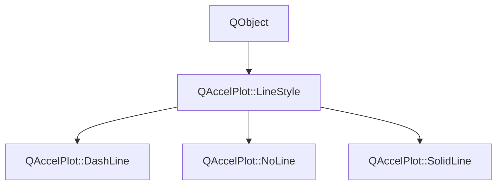

# Class QAccelPlot::LineStyle


[**ClassList**](annotated.md) **>** [**QAccelPlot**](namespaceQAccelPlot.md) **>** [**LineStyle**](classQAccelPlot_1_1LineStyle.md)


_Abstract base class for all line styles._ [More...](#detailed-description)

* `#include <LineStyle.hpp>`


Inherits the following classes: QObject


Inherited by the following classes: [QAccelPlot::DashLine](classQAccelPlot_1_1DashLine.md),  [QAccelPlot::NoLine](classQAccelPlot_1_1NoLine.md),  [QAccelPlot::SolidLine](classQAccelPlot_1_1SolidLine.md)


## Inheritance diagram




## Public Properties

| Type | Name |
| ---: | :--- |
| property QML\_ANONYMOUSbool | [**showLine**](classQAccelPlot_1_1LineStyle.md#property-showline-12)  <br>_Whether the line should be rendered. Subclasses override to suppress (e.g._ [_**NoLine**_](classQAccelPlot_1_1NoLine.md) _)._ |


## Public Signals

| Type | Name |
| ---: | :--- |
| signal void | [**styleChanged**](classQAccelPlot_1_1LineStyle.md#signal-stylechanged)  <br>_Emitted when any style property changes, triggering a curve redraw._  |


## Public Functions

| Type | Name |
| ---: | :--- |
|   | [**LineStyle**](#function-linestyle) (QObject \* parent=nullptr) <br>_Constructs an_ [_**LineStyle**_](classQAccelPlot_1_1LineStyle.md) _with the given__parent_ _._ |
| virtual [**DashParameters**](structQAccelPlot_1_1DashParameters.md) | [**dashParameters**](#function-dashparameters) () const<br>_Returns the dash parameters for this style. Default: disabled dash._  |
| virtual bool | [**showLine**](#function-showline-22) () const<br>_Returns_ `true` _if the line should be rendered. Default:_`true` _._ |


## Detailed Description


Subclasses control whether a line is drawn (`showLine()`) and supply dash parameters to the renderer via `dashParameters()`.


**See also:** [**SolidLine**](classQAccelPlot_1_1SolidLine.md), [**NoLine**](classQAccelPlot_1_1NoLine.md), [**DashLine**](classQAccelPlot_1_1DashLine.md) 


    
## Public Properties Documentation


### property showLine {#property-showline-12}

_Whether the line should be rendered. Subclasses override to suppress (e.g._ [_**NoLine**_](classQAccelPlot_1_1NoLine.md) _)._
```C++
QML_ANONYMOUSbool QAccelPlot::LineStyle::showLine;
```


<hr>
## Public Signals Documentation


### signal styleChanged {#signal-stylechanged}

_Emitted when any style property changes, triggering a curve redraw._ 
```C++
void QAccelPlot::LineStyle::styleChanged;
```


<hr>
## Public Functions Documentation


### function LineStyle {#function-linestyle}

_Constructs an_ [_**LineStyle**_](classQAccelPlot_1_1LineStyle.md) _with the given__parent_ _._
```C++
explicit QAccelPlot::LineStyle::LineStyle (
    QObject * parent=nullptr
) 
```


<hr>


### function dashParameters {#function-dashparameters}

_Returns the dash parameters for this style. Default: disabled dash._ 
```C++
virtual DashParameters QAccelPlot::LineStyle::dashParameters () const
```


<hr>


### function showLine {#function-showline-22}

_Returns_ `true` _if the line should be rendered. Default:_`true` _._
```C++
virtual bool QAccelPlot::LineStyle::showLine () const
```


<hr>

------------------------------
The documentation for this class was generated from the following file `QAccelPlot/src/linestyles/LineStyle.hpp`

