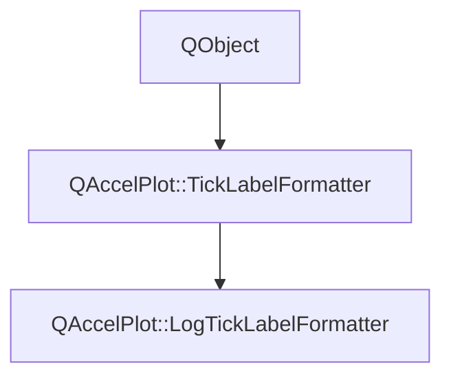

# Class QAccelPlot::LogTickLabelFormatter


[**ClassList**](annotated.md) **>** [**QAccelPlot**](namespaceQAccelPlot.md) **>** [**LogTickLabelFormatter**](classQAccelPlot_1_1LogTickLabelFormatter.md)


_A tick label formatter that produces power-of-ten labels for logarithmic axes._ [More...](#detailed-description)

* `#include <LogTickLabelFormatter.hpp>`


Inherits the following classes: [QAccelPlot::TickLabelFormatter](classQAccelPlot_1_1TickLabelFormatter.md)


## Inheritance diagram




## Public Properties inherited from QAccelPlot::TickLabelFormatter

See [QAccelPlot::TickLabelFormatter](classQAccelPlot_1_1TickLabelFormatter.md)

| Type | Name |
| ---: | :--- |
| property QML\_ANONYMOUSQJSValue | [**tickLabel**](classQAccelPlot_1_1TickLabelFormatter.md#property-ticklabel-12)  <br>_Optional JavaScript callback_ `function(value, tickStep)` _that overrides_`doFormat()` _._ |


## Public Signals inherited from QAccelPlot::TickLabelFormatter

See [QAccelPlot::TickLabelFormatter](classQAccelPlot_1_1TickLabelFormatter.md)

| Type | Name |
| ---: | :--- |
| signal void | [**formatChanged**](classQAccelPlot_1_1TickLabelFormatter.md#signal-formatchanged)  <br>_Emitted whenever a property that affects formatted output changes._  |
| signal void | [**tickLabelChanged**](classQAccelPlot_1_1TickLabelFormatter.md#signal-ticklabelchanged)  <br>_Emitted when the tickLabel property changes._  |


## Public Functions

| Type | Name |
| ---: | :--- |
|   | [**LogTickLabelFormatter**](#function-logticklabelformatter) (QObject \* parent=nullptr) <br>_Constructs a_ [_**LogTickLabelFormatter**_](classQAccelPlot_1_1LogTickLabelFormatter.md) _with the given__parent_ _._ |


## Public Functions inherited from QAccelPlot::TickLabelFormatter

See [QAccelPlot::TickLabelFormatter](classQAccelPlot_1_1TickLabelFormatter.md)

| Type | Name |
| ---: | :--- |
|   | [**TickLabelFormatter**](classQAccelPlot_1_1TickLabelFormatter.md#function-ticklabelformatter) (QObject \* parent=nullptr) <br>_Constructs an_ [_**TickLabelFormatter**_](classQAccelPlot_1_1TickLabelFormatter.md) _with the given__parent_ _._ |
|  QString | [**format**](classQAccelPlot_1_1TickLabelFormatter.md#function-format) (qreal value, qreal tickStep) const<br>_Returns the display string for_ _value_ _at the given__tickStep_ _._ |
|  void | [**setTickLabel**](classQAccelPlot_1_1TickLabelFormatter.md#function-setticklabel) (const QJSValue & tickLabel) <br>_Sets the JavaScript override callback to_ _tickLabel_ _._ |
|  QJSValue | [**tickLabel**](classQAccelPlot_1_1TickLabelFormatter.md#function-ticklabel-22) () const<br>_Returns the optional JavaScript override callback._  |


## Protected Functions

| Type | Name |
| ---: | :--- |
| virtual QString | [**doFormat**](#function-doformat) (qreal value, qreal tickStep) override const<br>_Returns a log-scale label string for_ _value_ _._ |


## Protected Functions inherited from QAccelPlot::TickLabelFormatter

See [QAccelPlot::TickLabelFormatter](classQAccelPlot_1_1TickLabelFormatter.md)

| Type | Name |
| ---: | :--- |
| virtual QString | [**doFormat**](classQAccelPlot_1_1TickLabelFormatter.md#function-doformat) (qreal value, qreal tickStep) const = 0<br>_Subclass entry point — returns the formatted label for_ _value_ _._ |


## Detailed Description


Formats each power-of-ten tick value using a superscript exponent, such as "10²".


**See also:** [**NumericTickLabelFormatter**](classQAccelPlot_1_1NumericTickLabelFormatter.md), [**TickLabelFormatter**](classQAccelPlot_1_1TickLabelFormatter.md) 


    
## Public Functions Documentation


### function LogTickLabelFormatter {#function-logticklabelformatter}

_Constructs a_ [_**LogTickLabelFormatter**_](classQAccelPlot_1_1LogTickLabelFormatter.md) _with the given__parent_ _._
```C++
explicit QAccelPlot::LogTickLabelFormatter::LogTickLabelFormatter (
    QObject * parent=nullptr
) 
```


<hr>
## Protected Functions Documentation


### function doFormat {#function-doformat}

_Returns a log-scale label string for_ _value_ _._
```C++
virtual QString QAccelPlot::LogTickLabelFormatter::doFormat (
    qreal value,
    qreal tickStep
) override const
```


Implements [*QAccelPlot::TickLabelFormatter::doFormat*](classQAccelPlot_1_1TickLabelFormatter.md#function-doformat)


<hr>

------------------------------
The documentation for this class was generated from the following file `QAccelPlot/src/formatters/LogTickLabelFormatter.hpp`

