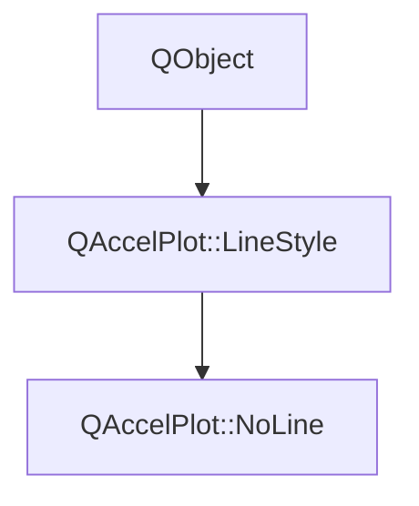

# Class QAccelPlot::NoLine


[**ClassList**](annotated.md) **>** [**QAccelPlot**](namespaceQAccelPlot.md) **>** [**NoLine**](classQAccelPlot_1_1NoLine.md)


_A line style that suppresses line rendering entirely, leaving only markers visible._ 

* `#include <NoLine.hpp>`


Inherits the following classes: [QAccelPlot::LineStyle](classQAccelPlot_1_1LineStyle.md)


## Inheritance diagram




## Public Properties inherited from QAccelPlot::LineStyle

See [QAccelPlot::LineStyle](classQAccelPlot_1_1LineStyle.md)

| Type | Name |
| ---: | :--- |
| property QML\_ANONYMOUSbool | [**showLine**](classQAccelPlot_1_1LineStyle.md#property-showline-12)  <br>_Whether the line should be rendered. Subclasses override to suppress (e.g._ [_**NoLine**_](classQAccelPlot_1_1NoLine.md) _)._ |


## Public Signals inherited from QAccelPlot::LineStyle

See [QAccelPlot::LineStyle](classQAccelPlot_1_1LineStyle.md)

| Type | Name |
| ---: | :--- |
| signal void | [**styleChanged**](classQAccelPlot_1_1LineStyle.md#signal-stylechanged)  <br>_Emitted when any style property changes, triggering a curve redraw._  |


## Public Functions

| Type | Name |
| ---: | :--- |
|   | [**NoLine**](#function-noline) (QObject \* parent=nullptr) <br>_Constructs a_ [_**NoLine**_](classQAccelPlot_1_1NoLine.md) _with the given__parent_ _._ |
| virtual bool | [**showLine**](#function-showline) () override const<br>_Returns_ `false` _, suppressing line rendering for this curve._ |


## Public Functions inherited from QAccelPlot::LineStyle

See [QAccelPlot::LineStyle](classQAccelPlot_1_1LineStyle.md)

| Type | Name |
| ---: | :--- |
|   | [**LineStyle**](classQAccelPlot_1_1LineStyle.md#function-linestyle) (QObject \* parent=nullptr) <br>_Constructs an_ [_**LineStyle**_](classQAccelPlot_1_1LineStyle.md) _with the given__parent_ _._ |
| virtual [**DashParameters**](structQAccelPlot_1_1DashParameters.md) | [**dashParameters**](classQAccelPlot_1_1LineStyle.md#function-dashparameters) () const<br>_Returns the dash parameters for this style. Default: disabled dash._  |
| virtual bool | [**showLine**](classQAccelPlot_1_1LineStyle.md#function-showline-22) () const<br>_Returns_ `true` _if the line should be rendered. Default:_`true` _._ |


## Public Functions Documentation


### function NoLine {#function-noline}

_Constructs a_ [_**NoLine**_](classQAccelPlot_1_1NoLine.md) _with the given__parent_ _._
```C++
explicit QAccelPlot::NoLine::NoLine (
    QObject * parent=nullptr
) 
```


<hr>


### function showLine {#function-showline}

_Returns_ `false` _, suppressing line rendering for this curve._
```C++
virtual bool QAccelPlot::NoLine::showLine () override const
```


Implements [*QAccelPlot::LineStyle::showLine*](classQAccelPlot_1_1LineStyle.md#function-showline-22)


<hr>

------------------------------
The documentation for this class was generated from the following file `QAccelPlot/src/linestyles/NoLine.hpp`

