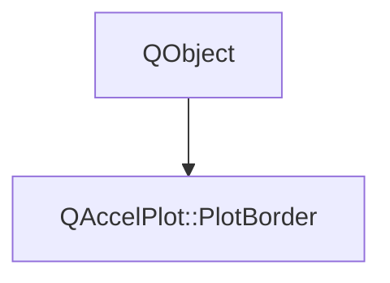

# Class QAccelPlot::PlotBorder


[**ClassList**](annotated.md) **>** [**QAccelPlot**](namespaceQAccelPlot.md) **>** [**PlotBorder**](classQAccelPlot_1_1PlotBorder.md)


_Decorative frame configuration exposed by_ `PlotView::border` _._

* `#include <PlotBorder.hpp>`


Inherits the following classes: QObject


## Inheritance diagram




## Public Properties

| Type | Name |
| ---: | :--- |
| property QML\_ANONYMOUSQColor | [**color**](classQAccelPlot_1_1PlotBorder.md#property-color-12)  <br>_Border color. Default: transparent._  |
| property qreal | [**width**](classQAccelPlot_1_1PlotBorder.md#property-width-12)  <br>_Border width in pixels. Default: 0 (disabled)._  |


## Public Signals

| Type | Name |
| ---: | :--- |
| signal void | [**colorChanged**](classQAccelPlot_1_1PlotBorder.md#signal-colorchanged)  <br> |
| signal void | [**widthChanged**](classQAccelPlot_1_1PlotBorder.md#signal-widthchanged)  <br> |


## Public Functions

| Type | Name |
| ---: | :--- |
|   | [**PlotBorder**](#function-plotborder) (QObject \* parent=nullptr) <br> |
|  QColor | [**color**](#function-color-22) () const<br> |
|  void | [**setColor**](#function-setcolor) (const QColor & color) <br> |
|  void | [**setWidth**](#function-setwidth) (qreal width) <br> |
|  qreal | [**width**](#function-width-22) () const<br> |


## Public Properties Documentation


### property color {#property-color-12}

_Border color. Default: transparent._ 
```C++
QML_ANONYMOUSQColor QAccelPlot::PlotBorder::color;
```


<hr>


### property width {#property-width-12}

_Border width in pixels. Default: 0 (disabled)._ 
```C++
qreal QAccelPlot::PlotBorder::width;
```


<hr>
## Public Signals Documentation


### signal colorChanged {#signal-colorchanged}

```C++
void QAccelPlot::PlotBorder::colorChanged;
```


<hr>


### signal widthChanged {#signal-widthchanged}

```C++
void QAccelPlot::PlotBorder::widthChanged;
```


<hr>
## Public Functions Documentation


### function PlotBorder {#function-plotborder}

```C++
explicit QAccelPlot::PlotBorder::PlotBorder (
    QObject * parent=nullptr
) 
```


<hr>


### function color {#function-color-22}

```C++
QColor QAccelPlot::PlotBorder::color () const
```


<hr>


### function setColor {#function-setcolor}

```C++
void QAccelPlot::PlotBorder::setColor (
    const QColor & color
) 
```


<hr>


### function setWidth {#function-setwidth}

```C++
void QAccelPlot::PlotBorder::setWidth (
    qreal width
) 
```


<hr>


### function width {#function-width-22}

```C++
qreal QAccelPlot::PlotBorder::width () const
```


<hr>

------------------------------
The documentation for this class was generated from the following file `QAccelPlot/src/PlotBorder.hpp`

