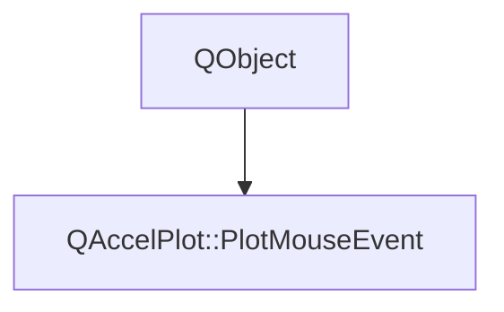

# Class QAccelPlot::PlotMouseEvent


[**ClassList**](annotated.md) **>** [**QAccelPlot**](namespaceQAccelPlot.md) **>** [**PlotMouseEvent**](classQAccelPlot_1_1PlotMouseEvent.md)


_Carries mouse event data for the mouse signals._ [More...](#detailed-description)

* `#include <PlotMouseEvent.hpp>`


Inherits the following classes: QObject


## Inheritance diagram




## Public Properties

| Type | Name |
| ---: | :--- |
| property bool | [**accepted**](classQAccelPlot_1_1PlotMouseEvent.md#property-accepted)  <br>_Whether this event has been accepted by a handler. Read via_ `isAccepted()` _; set via_`accept()` _or_`ignore()` _._ |
| property int | [**button**](classQAccelPlot_1_1PlotMouseEvent.md#property-button-12)  <br>_The mouse button involved (Qt::MouseButton value)._  |
| property int | [**modifiers**](classQAccelPlot_1_1PlotMouseEvent.md#property-modifiers-12)  <br>_Active keyboard modifiers at the time of the event (Qt::KeyboardModifiers value)._  |
| property qreal | [**x**](classQAccelPlot_1_1PlotMouseEvent.md#property-x-12)  <br>_Item-local pixel X coordinate of the event._  |
| property qreal | [**y**](classQAccelPlot_1_1PlotMouseEvent.md#property-y-12)  <br>_Item-local pixel Y coordinate of the event._  |


## Public Functions

| Type | Name |
| ---: | :--- |
|   | [**PlotMouseEvent**](#function-plotmouseevent) (QObject \* parent=nullptr) <br>_Constructs a_ [_**PlotMouseEvent**_](classQAccelPlot_1_1PlotMouseEvent.md) _with an optional_`parent` _._ |
|  Q\_INVOKABLE void | [**accept**](#function-accept) () <br>_Accepts the event, suppressing the plot's built-in handling._  |
|  int | [**button**](#function-button-22) () const<br>_Returns the mouse button involved in the event (Qt::MouseButton value)._  |
|  Q\_INVOKABLE void | [**ignore**](#function-ignore) () <br>_Ignores the event, allowing the plot's built-in handling to proceed._  |
|  bool | [**isAccepted**](#function-isaccepted) () const<br>_Returns true if the event has been accepted by a handler._  |
|  int | [**modifiers**](#function-modifiers-22) () const<br>_Returns the active keyboard modifiers at the time of the event (Qt::KeyboardModifiers value)._  |
|  void | [**reset**](#function-reset) (int button, qreal x, qreal y, int modifiers) <br>_Resets the event data for a new event. Called by_ [_**QAccelPlot**_](classQAccelPlot_1_1QAccelPlot.md) _before emitting mouse signals._ |
|  void | [**setAccepted**](#function-setaccepted) (bool accepted) <br>_Sets whether the event is accepted. Equivalent to_ `accept()` _if_`accepted` _is true, or_`ignore()` _if false._ |
|  qreal | [**x**](#function-x-22) () const<br>_Returns the item-local pixel X coordinate of the event._  |
|  qreal | [**y**](#function-y-22) () const<br>_Returns the item-local pixel Y coordinate of the event._  |


## Detailed Description


An instance of this class is passed to each mouse signal. Mirrors the Qt `QEvent` API: call `accept()` in a handler to consume the event and suppress the plot's built-in handling (dragging, double-click rescaling, etc.).


**Note:**

The object is owned by `QAccelPlot` and is reused across events — do not store a reference to it beyond the signal handler. 


    
## Public Properties Documentation


### property accepted {#property-accepted}

_Whether this event has been accepted by a handler. Read via_ `isAccepted()` _; set via_`accept()` _or_`ignore()` _._
```C++
bool QAccelPlot::PlotMouseEvent::accepted;
```


<hr>


### property button {#property-button-12}

_The mouse button involved (Qt::MouseButton value)._ 
```C++
int QAccelPlot::PlotMouseEvent::button;
```


<hr>


### property modifiers {#property-modifiers-12}

_Active keyboard modifiers at the time of the event (Qt::KeyboardModifiers value)._ 
```C++
int QAccelPlot::PlotMouseEvent::modifiers;
```


<hr>


### property x {#property-x-12}

_Item-local pixel X coordinate of the event._ 
```C++
qreal QAccelPlot::PlotMouseEvent::x;
```


<hr>


### property y {#property-y-12}

_Item-local pixel Y coordinate of the event._ 
```C++
qreal QAccelPlot::PlotMouseEvent::y;
```


<hr>
## Public Functions Documentation


### function PlotMouseEvent {#function-plotmouseevent}

_Constructs a_ [_**PlotMouseEvent**_](classQAccelPlot_1_1PlotMouseEvent.md) _with an optional_`parent` _._
```C++
explicit QAccelPlot::PlotMouseEvent::PlotMouseEvent (
    QObject * parent=nullptr
) 
```


<hr>


### function accept {#function-accept}

_Accepts the event, suppressing the plot's built-in handling._ 
```C++
Q_INVOKABLE void QAccelPlot::PlotMouseEvent::accept () 
```


<hr>


### function button {#function-button-22}

_Returns the mouse button involved in the event (Qt::MouseButton value)._ 
```C++
int QAccelPlot::PlotMouseEvent::button () const
```


<hr>


### function ignore {#function-ignore}

_Ignores the event, allowing the plot's built-in handling to proceed._ 
```C++
Q_INVOKABLE void QAccelPlot::PlotMouseEvent::ignore () 
```


<hr>


### function isAccepted {#function-isaccepted}

_Returns true if the event has been accepted by a handler._ 
```C++
bool QAccelPlot::PlotMouseEvent::isAccepted () const
```


<hr>


### function modifiers {#function-modifiers-22}

_Returns the active keyboard modifiers at the time of the event (Qt::KeyboardModifiers value)._ 
```C++
int QAccelPlot::PlotMouseEvent::modifiers () const
```


<hr>


### function reset {#function-reset}

_Resets the event data for a new event. Called by_ [_**QAccelPlot**_](classQAccelPlot_1_1QAccelPlot.md) _before emitting mouse signals._
```C++
void QAccelPlot::PlotMouseEvent::reset (
    int button,
    qreal x,
    qreal y,
    int modifiers
) 
```


<hr>


### function setAccepted {#function-setaccepted}

_Sets whether the event is accepted. Equivalent to_ `accept()` _if_`accepted` _is true, or_`ignore()` _if false._
```C++
void QAccelPlot::PlotMouseEvent::setAccepted (
    bool accepted
) 
```


<hr>


### function x {#function-x-22}

_Returns the item-local pixel X coordinate of the event._ 
```C++
qreal QAccelPlot::PlotMouseEvent::x () const
```


<hr>


### function y {#function-y-22}

_Returns the item-local pixel Y coordinate of the event._ 
```C++
qreal QAccelPlot::PlotMouseEvent::y () const
```


<hr>

------------------------------
The documentation for this class was generated from the following file `QAccelPlot/src/PlotMouseEvent.hpp`

