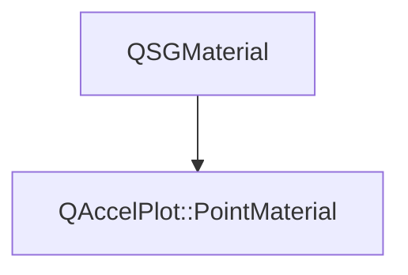

# Class QAccelPlot::PointMaterial


[**ClassList**](annotated.md) **>** [**QAccelPlot**](namespaceQAccelPlot.md) **>** [**PointMaterial**](classQAccelPlot_1_1PointMaterial.md)


_QSGMaterial for marker (point) rendering._ [More...](#detailed-description)

* `#include <PointMaterial.hpp>`


Inherits the following classes: QSGMaterial


## Inheritance diagram




## Public Attributes

| Type | Name |
| ---: | :--- |
|  float | [**antialiasingEnabled**](#variable-antialiasingenabled)   = `{1.0f}`<br>_1.0 when GPU anti-aliasing is active._  |
|  float | [**antialiasingFeather**](#variable-antialiasingfeather)   = `{1.0f}`<br>_Anti-aliasing feather width in pixels._  |
|  QColor | [**color**](#variable-color)   = `{Qt::blue}`<br>_Base marker color._  |
|  QVector2D | [**domainMax**](#variable-domainmax)   = `{1.0f, 1.0f}`<br>_Maximum data-space coordinate._  |
|  QVector2D | [**domainMin**](#variable-domainmin)   = `{0.0f, 0.0f}`<br>_Minimum data-space coordinate._  |
|  float | [**logScaleX**](#variable-logscalex)   = `{0.0f}`<br>_1.0 when the X axis uses log scale._  |
|  float | [**logScaleY**](#variable-logscaley)   = `{0.0f}`<br>_1.0 when the Y axis uses log scale._  |
|  float | [**markerSize**](#variable-markersize)   = `{4.0f}`<br>_Marker radius in pixels._  |
|  int | [**shapeType**](#variable-shapetype)   = `{0}`<br>_Marker shape: 0=Circle, 1=Square, 2=Diamond, 3=TriangleUp, 4=TriangleDown, 5=Cross._  |
|  float | [**useVertexColor**](#variable-usevertexcolor)   = `{0.0f}`<br>_1.0 when per-vertex color overrides_ `color` _._ |
|  QVector2D | [**viewportSize**](#variable-viewportsize)   = `{800.0f, 600.0f}`<br>_Viewport size in pixels._  |


## Public Functions

| Type | Name |
| ---: | :--- |
|   | [**PointMaterial**](#function-pointmaterial) () <br>_Constructs a_ [_**PointMaterial**_](classQAccelPlot_1_1PointMaterial.md) _with default uniform values._ |
|  int | [**compare**](#function-compare) (const QSGMaterial \* other) override const<br>_Compares all uniform fields for equality._  |
|  QSGMaterialShader \* | [**createShader**](#function-createshader) (QSGRendererInterface::RenderMode) override const<br>_Creates and returns the point shader program._  |
|  QSGMaterialType \* | [**type**](#function-type) () override const<br>_Returns the unique material type identifier for this class._  |
|   | [**~PointMaterial**](#function-pointmaterial) () override<br> |


## Detailed Description


Passes per-point color, domain bounds, marker size, and shape type to the point fragment shader. Unlike `LineMaterial` this class does not inherit from `DataTextureMaterial` because markers do not require a data texture. 


    
## Public Attributes Documentation


### variable antialiasingEnabled {#variable-antialiasingenabled}

_1.0 when GPU anti-aliasing is active._ 
```C++
float QAccelPlot::PointMaterial::antialiasingEnabled;
```


<hr>


### variable antialiasingFeather {#variable-antialiasingfeather}

_Anti-aliasing feather width in pixels._ 
```C++
float QAccelPlot::PointMaterial::antialiasingFeather;
```


<hr>


### variable color {#variable-color}

_Base marker color._ 
```C++
QColor QAccelPlot::PointMaterial::color;
```


<hr>


### variable domainMax {#variable-domainmax}

_Maximum data-space coordinate._ 
```C++
QVector2D QAccelPlot::PointMaterial::domainMax;
```


<hr>


### variable domainMin {#variable-domainmin}

_Minimum data-space coordinate._ 
```C++
QVector2D QAccelPlot::PointMaterial::domainMin;
```


<hr>


### variable logScaleX {#variable-logscalex}

_1.0 when the X axis uses log scale._ 
```C++
float QAccelPlot::PointMaterial::logScaleX;
```


<hr>


### variable logScaleY {#variable-logscaley}

_1.0 when the Y axis uses log scale._ 
```C++
float QAccelPlot::PointMaterial::logScaleY;
```


<hr>


### variable markerSize {#variable-markersize}

_Marker radius in pixels._ 
```C++
float QAccelPlot::PointMaterial::markerSize;
```


<hr>


### variable shapeType {#variable-shapetype}

_Marker shape: 0=Circle, 1=Square, 2=Diamond, 3=TriangleUp, 4=TriangleDown, 5=Cross._ 
```C++
int QAccelPlot::PointMaterial::shapeType;
```


<hr>


### variable useVertexColor {#variable-usevertexcolor}

_1.0 when per-vertex color overrides_ `color` _._
```C++
float QAccelPlot::PointMaterial::useVertexColor;
```


<hr>


### variable viewportSize {#variable-viewportsize}

_Viewport size in pixels._ 
```C++
QVector2D QAccelPlot::PointMaterial::viewportSize;
```


<hr>
## Public Functions Documentation


### function PointMaterial {#function-pointmaterial}

_Constructs a_ [_**PointMaterial**_](classQAccelPlot_1_1PointMaterial.md) _with default uniform values._
```C++
QAccelPlot::PointMaterial::PointMaterial () 
```


<hr>


### function compare {#function-compare}

_Compares all uniform fields for equality._ 
```C++
int QAccelPlot::PointMaterial::compare (
    const QSGMaterial * other
) override const
```


<hr>


### function createShader {#function-createshader}

_Creates and returns the point shader program._ 
```C++
QSGMaterialShader * QAccelPlot::PointMaterial::createShader (
    QSGRendererInterface::RenderMode
) override const
```


<hr>


### function type {#function-type}

_Returns the unique material type identifier for this class._ 
```C++
QSGMaterialType * QAccelPlot::PointMaterial::type () override const
```


<hr>


### function ~PointMaterial {#function-pointmaterial}

```C++
QAccelPlot::PointMaterial::~PointMaterial () override
```


<hr>

------------------------------
The documentation for this class was generated from the following file `QAccelPlot/src/materials/PointMaterial.hpp`

