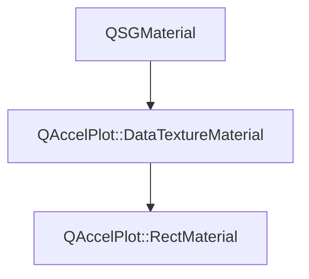

# Class QAccelPlot::RectMaterial


[**ClassList**](annotated.md) **>** [**QAccelPlot**](namespaceQAccelPlot.md) **>** [**RectMaterial**](classQAccelPlot_1_1RectMaterial.md)


_QSGMaterial for rectangle list rendering, extending_ [_**DataTextureMaterial**_](classQAccelPlot_1_1DataTextureMaterial.md) _with a rect-count uniform._

* `#include <RectMaterial.hpp>`


Inherits the following classes: [QAccelPlot::DataTextureMaterial](classQAccelPlot_1_1DataTextureMaterial.md)


## Inheritance diagram




## Public Attributes

| Type | Name |
| ---: | :--- |
|  float | [**rectCount**](#variable-rectcount)   = `{0.0f}`<br>_Number of rectangles in the data texture (used to index the sampler)._  |


## Public Attributes inherited from QAccelPlot::DataTextureMaterial

See [QAccelPlot::DataTextureMaterial](classQAccelPlot_1_1DataTextureMaterial.md)

| Type | Name |
| ---: | :--- |
|  QColor | [**color**](classQAccelPlot_1_1DataTextureMaterial.md#variable-color)   = `{Qt::blue}`<br>_Line/fill color uniform._  |
|  std::unique\_ptr&lt; QSGTexture &gt; | [**dataTexture**](classQAccelPlot_1_1DataTextureMaterial.md#variable-datatexture)  <br>_Owned data texture bound to the shader sampler._  |
|  QVector2D | [**domainMax**](classQAccelPlot_1_1DataTextureMaterial.md#variable-domainmax)   = `{1.0f, 1.0f}`<br>_Maximum data-space coordinate._  |
|  QVector2D | [**domainMin**](classQAccelPlot_1_1DataTextureMaterial.md#variable-domainmin)   = `{0.0f, 0.0f}`<br>_Minimum data-space coordinate._  |
|  float | [**logScaleX**](classQAccelPlot_1_1DataTextureMaterial.md#variable-logscalex)   = `{0.0f}`<br>_1.0 when the X axis uses log scale (float for std140 UBO compatibility)._  |
|  float | [**logScaleY**](classQAccelPlot_1_1DataTextureMaterial.md#variable-logscaley)   = `{0.0f}`<br>_1.0 when the Y axis uses log scale (float for std140 UBO compatibility)._  |
|  float | [**useVertexColor**](classQAccelPlot_1_1DataTextureMaterial.md#variable-usevertexcolor)   = `{0.0f}`<br>_1.0 when per-vertex color overrides_ `color` _(float for std140 UBO compatibility)._ |
|  QVector2D | [**viewportSize**](classQAccelPlot_1_1DataTextureMaterial.md#variable-viewportsize)   = `{800.0f, 600.0f}`<br>_Viewport size in pixels._  |


## Public Functions

| Type | Name |
| ---: | :--- |
|   | [**RectMaterial**](#function-rectmaterial) () <br>_Constructs a_ [_**RectMaterial**_](classQAccelPlot_1_1RectMaterial.md) _with default uniform values._ |
|  QSGMaterialShader \* | [**createShader**](#function-createshader) (QSGRendererInterface::RenderMode) override const<br>_Creates and returns the rectangle shader program._  |
|  QSGMaterialType \* | [**type**](#function-type) () override const<br>_Returns the unique material type identifier for this class._  |


## Public Functions inherited from QAccelPlot::DataTextureMaterial

See [QAccelPlot::DataTextureMaterial](classQAccelPlot_1_1DataTextureMaterial.md)

| Type | Name |
| ---: | :--- |
|   | [**DataTextureMaterial**](classQAccelPlot_1_1DataTextureMaterial.md#function-datatexturematerial) () <br>_Constructs an empty_ [_**DataTextureMaterial**_](classQAccelPlot_1_1DataTextureMaterial.md) _._ |
|  int | [**compare**](classQAccelPlot_1_1DataTextureMaterial.md#function-compare) (const QSGMaterial \* other) override const<br>_Compares shared uniform fields; delegates type-specific fields to_ `compareExtra()` _._ |
|  void | [**uploadTexture**](classQAccelPlot_1_1DataTextureMaterial.md#function-uploadtexture) (std::unique\_ptr&lt; QSGTexture &gt; & texture, QQuickWindow \* window, const float \* data, int floatCount) <br>_Uploads_ _floatCount_ _raw floats as an RGBA8888 data texture, reusing existing GPU/CPU buffers where possible._ |
|   | [**~DataTextureMaterial**](classQAccelPlot_1_1DataTextureMaterial.md#function-datatexturematerial) () override<br> |


## Public Static Functions inherited from QAccelPlot::DataTextureMaterial

See [QAccelPlot::DataTextureMaterial](classQAccelPlot_1_1DataTextureMaterial.md)

| Type | Name |
| ---: | :--- |
|  const QSGGeometry::AttributeSet & | [**attributeSet**](classQAccelPlot_1_1DataTextureMaterial.md#function-attributeset) () <br>_Returns the shared vertex attribute set:_ `{float` _id, float param, uchar4 color} (12 bytes)._ |
|  void | [**commitTexture**](classQAccelPlot_1_1DataTextureMaterial.md#function-committexture) (QSGMaterialShader::RenderState & state, int binding, QSGTexture \*\* texture, QSGTexture \* dataTexture) <br>_Commits_ _dataTexture_ _to sampler__binding_ _(call from_`updateSampledImage` _)._ |
|  bool | [**writeCommonUniforms**](classQAccelPlot_1_1DataTextureMaterial.md#function-writecommonuniforms) (char \* buf, int bufSize, const QMatrix4x4 & matrix, const [**DataTextureMaterial**](classQAccelPlot_1_1DataTextureMaterial.md) \* mat) <br>_Writes the shared UBO prefix (transform + color + domain + flags) into_ _buf_ _._ |


## Protected Functions

| Type | Name |
| ---: | :--- |
| virtual int | [**compareExtra**](#function-compareextra) (const QSGMaterial \* other) override const<br>_Compares the_ `rectCount` _field after the base-class comparison succeeds._ |


## Protected Functions inherited from QAccelPlot::DataTextureMaterial

See [QAccelPlot::DataTextureMaterial](classQAccelPlot_1_1DataTextureMaterial.md)

| Type | Name |
| ---: | :--- |
| virtual int | [**compareExtra**](classQAccelPlot_1_1DataTextureMaterial.md#function-compareextra) (const QSGMaterial \* other) const<br>_Subclass hook for_ `compare()` _— called after the shared fields compare equal._ |


## Public Attributes Documentation


### variable rectCount {#variable-rectcount}

_Number of rectangles in the data texture (used to index the sampler)._ 
```C++
float QAccelPlot::RectMaterial::rectCount;
```


<hr>
## Public Functions Documentation


### function RectMaterial {#function-rectmaterial}

_Constructs a_ [_**RectMaterial**_](classQAccelPlot_1_1RectMaterial.md) _with default uniform values._
```C++
QAccelPlot::RectMaterial::RectMaterial () 
```


<hr>


### function createShader {#function-createshader}

_Creates and returns the rectangle shader program._ 
```C++
QSGMaterialShader * QAccelPlot::RectMaterial::createShader (
    QSGRendererInterface::RenderMode
) override const
```


<hr>


### function type {#function-type}

_Returns the unique material type identifier for this class._ 
```C++
QSGMaterialType * QAccelPlot::RectMaterial::type () override const
```


<hr>
## Protected Functions Documentation


### function compareExtra {#function-compareextra}

_Compares the_ `rectCount` _field after the base-class comparison succeeds._
```C++
virtual int QAccelPlot::RectMaterial::compareExtra (
    const QSGMaterial * other
) override const
```


Implements [*QAccelPlot::DataTextureMaterial::compareExtra*](classQAccelPlot_1_1DataTextureMaterial.md#function-compareextra)


<hr>

------------------------------
The documentation for this class was generated from the following file `QAccelPlot/src/materials/RectMaterial.hpp`

