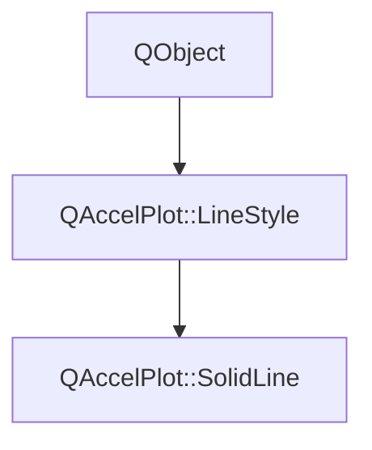

# Class QAccelPlot::SolidLine


[**ClassList**](annotated.md) **>** [**QAccelPlot**](namespaceQAccelPlot.md) **>** [**SolidLine**](classQAccelPlot_1_1SolidLine.md)


_The default line style — renders a continuous solid line with no gaps._ 

* `#include <SolidLine.hpp>`


Inherits the following classes: [QAccelPlot::LineStyle](classQAccelPlot_1_1LineStyle.md)


## Inheritance diagram




## Public Properties inherited from QAccelPlot::LineStyle

See [QAccelPlot::LineStyle](classQAccelPlot_1_1LineStyle.md)

| Type | Name |
| ---: | :--- |
| property QML\_ANONYMOUSbool | [**showLine**](classQAccelPlot_1_1LineStyle.md#property-showline-12)  <br>_Whether the line should be rendered. Subclasses override to suppress (e.g._ [_**NoLine**_](classQAccelPlot_1_1NoLine.md) _)._ |


## Public Signals inherited from QAccelPlot::LineStyle

See [QAccelPlot::LineStyle](classQAccelPlot_1_1LineStyle.md)

| Type | Name |
| ---: | :--- |
| signal void | [**styleChanged**](classQAccelPlot_1_1LineStyle.md#signal-stylechanged)  <br>_Emitted when any style property changes, triggering a curve redraw._  |


## Public Functions

| Type | Name |
| ---: | :--- |
|   | [**SolidLine**](#function-solidline) (QObject \* parent=nullptr) <br>_Constructs a_ [_**SolidLine**_](classQAccelPlot_1_1SolidLine.md) _with the given__parent_ _._ |


## Public Functions inherited from QAccelPlot::LineStyle

See [QAccelPlot::LineStyle](classQAccelPlot_1_1LineStyle.md)

| Type | Name |
| ---: | :--- |
|   | [**LineStyle**](classQAccelPlot_1_1LineStyle.md#function-linestyle) (QObject \* parent=nullptr) <br>_Constructs an_ [_**LineStyle**_](classQAccelPlot_1_1LineStyle.md) _with the given__parent_ _._ |
| virtual [**DashParameters**](structQAccelPlot_1_1DashParameters.md) | [**dashParameters**](classQAccelPlot_1_1LineStyle.md#function-dashparameters) () const<br>_Returns the dash parameters for this style. Default: disabled dash._  |
| virtual bool | [**showLine**](classQAccelPlot_1_1LineStyle.md#function-showline-22) () const<br>_Returns_ `true` _if the line should be rendered. Default:_`true` _._ |


## Public Functions Documentation


### function SolidLine {#function-solidline}

_Constructs a_ [_**SolidLine**_](classQAccelPlot_1_1SolidLine.md) _with the given__parent_ _._
```C++
explicit QAccelPlot::SolidLine::SolidLine (
    QObject * parent=nullptr
) 
```


<hr>

------------------------------
The documentation for this class was generated from the following file `QAccelPlot/src/linestyles/SolidLine.hpp`

