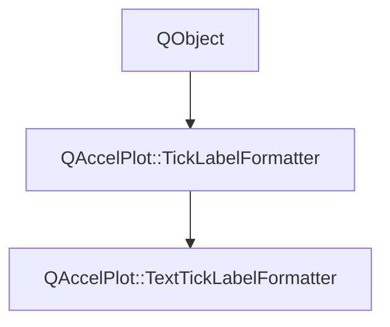

# Class QAccelPlot::TextTickLabelFormatter


[**ClassList**](annotated.md) **>** [**QAccelPlot**](namespaceQAccelPlot.md) **>** [**TextTickLabelFormatter**](classQAccelPlot_1_1TextTickLabelFormatter.md)


_A tick label formatter that maps integer tick indices to a user-supplied list of strings._ [More...](#detailed-description)

* `#include <TextTickLabelFormatter.hpp>`


Inherits the following classes: [QAccelPlot::TickLabelFormatter](classQAccelPlot_1_1TickLabelFormatter.md)


## Inheritance diagram




## Public Properties

| Type | Name |
| ---: | :--- |
| property QStringList | [**labels**](classQAccelPlot_1_1TextTickLabelFormatter.md#property-labels-12)  <br>_The ordered list of label strings, indexed by the rounded tick value._  |


## Public Properties inherited from QAccelPlot::TickLabelFormatter

See [QAccelPlot::TickLabelFormatter](classQAccelPlot_1_1TickLabelFormatter.md)

| Type | Name |
| ---: | :--- |
| property QML\_ANONYMOUSQJSValue | [**tickLabel**](classQAccelPlot_1_1TickLabelFormatter.md#property-ticklabel-12)  <br>_Optional JavaScript callback_ `function(value, tickStep)` _that overrides_`doFormat()` _._ |


## Public Signals

| Type | Name |
| ---: | :--- |
| signal void | [**labelsChanged**](classQAccelPlot_1_1TextTickLabelFormatter.md#signal-labelschanged)  <br>_Emitted when the labels property changes._  |


## Public Signals inherited from QAccelPlot::TickLabelFormatter

See [QAccelPlot::TickLabelFormatter](classQAccelPlot_1_1TickLabelFormatter.md)

| Type | Name |
| ---: | :--- |
| signal void | [**formatChanged**](classQAccelPlot_1_1TickLabelFormatter.md#signal-formatchanged)  <br>_Emitted whenever a property that affects formatted output changes._  |
| signal void | [**tickLabelChanged**](classQAccelPlot_1_1TickLabelFormatter.md#signal-ticklabelchanged)  <br>_Emitted when the tickLabel property changes._  |


## Public Functions

| Type | Name |
| ---: | :--- |
|   | [**TextTickLabelFormatter**](#function-textticklabelformatter) (QObject \* parent=nullptr) <br>_Constructs a_ [_**TextTickLabelFormatter**_](classQAccelPlot_1_1TextTickLabelFormatter.md) _with the given__parent_ _._ |
|  QStringList | [**labels**](#function-labels-22) () const<br>_Returns the current label list._  |
|  void | [**setLabels**](#function-setlabels) (const QStringList & labels) <br>_Sets the label list to_ _labels_ _._ |


## Public Functions inherited from QAccelPlot::TickLabelFormatter

See [QAccelPlot::TickLabelFormatter](classQAccelPlot_1_1TickLabelFormatter.md)

| Type | Name |
| ---: | :--- |
|   | [**TickLabelFormatter**](classQAccelPlot_1_1TickLabelFormatter.md#function-ticklabelformatter) (QObject \* parent=nullptr) <br>_Constructs an_ [_**TickLabelFormatter**_](classQAccelPlot_1_1TickLabelFormatter.md) _with the given__parent_ _._ |
|  QString | [**format**](classQAccelPlot_1_1TickLabelFormatter.md#function-format) (qreal value, qreal tickStep) const<br>_Returns the display string for_ _value_ _at the given__tickStep_ _._ |
|  void | [**setTickLabel**](classQAccelPlot_1_1TickLabelFormatter.md#function-setticklabel) (const QJSValue & tickLabel) <br>_Sets the JavaScript override callback to_ _tickLabel_ _._ |
|  QJSValue | [**tickLabel**](classQAccelPlot_1_1TickLabelFormatter.md#function-ticklabel-22) () const<br>_Returns the optional JavaScript override callback._  |


## Protected Functions

| Type | Name |
| ---: | :--- |
| virtual QString | [**doFormat**](#function-doformat) (qreal value, qreal tickStep) override const<br>_Returns the label at the index corresponding to_ _value_ _, or an empty string if out of range._ |


## Protected Functions inherited from QAccelPlot::TickLabelFormatter

See [QAccelPlot::TickLabelFormatter](classQAccelPlot_1_1TickLabelFormatter.md)

| Type | Name |
| ---: | :--- |
| virtual QString | [**doFormat**](classQAccelPlot_1_1TickLabelFormatter.md#function-doformat) (qreal value, qreal tickStep) const = 0<br>_Subclass entry point — returns the formatted label for_ _value_ _._ |


## Detailed Description


The tick value is rounded to the nearest integer and used as an index into `labels`. Values outside the list range are rendered as empty strings.


**See also:** [**NumericTickLabelFormatter**](classQAccelPlot_1_1NumericTickLabelFormatter.md), [**TickLabelFormatter**](classQAccelPlot_1_1TickLabelFormatter.md) 


    
## Public Properties Documentation


### property labels {#property-labels-12}

_The ordered list of label strings, indexed by the rounded tick value._ 
```C++
QStringList QAccelPlot::TextTickLabelFormatter::labels;
```


<hr>
## Public Signals Documentation


### signal labelsChanged {#signal-labelschanged}

_Emitted when the labels property changes._ 
```C++
void QAccelPlot::TextTickLabelFormatter::labelsChanged;
```


<hr>
## Public Functions Documentation


### function TextTickLabelFormatter {#function-textticklabelformatter}

_Constructs a_ [_**TextTickLabelFormatter**_](classQAccelPlot_1_1TextTickLabelFormatter.md) _with the given__parent_ _._
```C++
explicit QAccelPlot::TextTickLabelFormatter::TextTickLabelFormatter (
    QObject * parent=nullptr
) 
```


<hr>


### function labels {#function-labels-22}

_Returns the current label list._ 
```C++
QStringList QAccelPlot::TextTickLabelFormatter::labels () const
```


<hr>


### function setLabels {#function-setlabels}

_Sets the label list to_ _labels_ _._
```C++
void QAccelPlot::TextTickLabelFormatter::setLabels (
    const QStringList & labels
) 
```


<hr>
## Protected Functions Documentation


### function doFormat {#function-doformat}

_Returns the label at the index corresponding to_ _value_ _, or an empty string if out of range._
```C++
virtual QString QAccelPlot::TextTickLabelFormatter::doFormat (
    qreal value,
    qreal tickStep
) override const
```


Implements [*QAccelPlot::TickLabelFormatter::doFormat*](classQAccelPlot_1_1TickLabelFormatter.md#function-doformat)


<hr>

------------------------------
The documentation for this class was generated from the following file `QAccelPlot/src/formatters/TextTickLabelFormatter.hpp`

