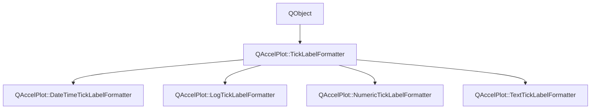

# Class QAccelPlot::TickLabelFormatter


[**ClassList**](annotated.md) **>** [**QAccelPlot**](namespaceQAccelPlot.md) **>** [**TickLabelFormatter**](classQAccelPlot_1_1TickLabelFormatter.md)


_Abstract base class for tick label formatters._ [More...](#detailed-description)

* `#include <TickLabelFormatter.hpp>`


Inherits the following classes: QObject


Inherited by the following classes: [QAccelPlot::DateTimeTickLabelFormatter](classQAccelPlot_1_1DateTimeTickLabelFormatter.md),  [QAccelPlot::LogTickLabelFormatter](classQAccelPlot_1_1LogTickLabelFormatter.md),  [QAccelPlot::NumericTickLabelFormatter](classQAccelPlot_1_1NumericTickLabelFormatter.md),  [QAccelPlot::TextTickLabelFormatter](classQAccelPlot_1_1TextTickLabelFormatter.md)


## Inheritance diagram




## Public Properties

| Type | Name |
| ---: | :--- |
| property QML\_ANONYMOUSQJSValue | [**tickLabel**](classQAccelPlot_1_1TickLabelFormatter.md#property-ticklabel-12)  <br>_Optional JavaScript callback_ `function(value, tickStep)` _that overrides_`doFormat()` _._ |


## Public Signals

| Type | Name |
| ---: | :--- |
| signal void | [**formatChanged**](classQAccelPlot_1_1TickLabelFormatter.md#signal-formatchanged)  <br>_Emitted whenever a property that affects formatted output changes._  |
| signal void | [**tickLabelChanged**](classQAccelPlot_1_1TickLabelFormatter.md#signal-ticklabelchanged)  <br>_Emitted when the tickLabel property changes._  |


## Public Functions

| Type | Name |
| ---: | :--- |
|   | [**TickLabelFormatter**](#function-ticklabelformatter) (QObject \* parent=nullptr) <br>_Constructs an_ [_**TickLabelFormatter**_](classQAccelPlot_1_1TickLabelFormatter.md) _with the given__parent_ _._ |
|  QString | [**format**](#function-format) (qreal value, qreal tickStep) const<br>_Returns the display string for_ _value_ _at the given__tickStep_ _._ |
|  void | [**setTickLabel**](#function-setticklabel) (const QJSValue & tickLabel) <br>_Sets the JavaScript override callback to_ _tickLabel_ _._ |
|  QJSValue | [**tickLabel**](#function-ticklabel-22) () const<br>_Returns the optional JavaScript override callback._  |


## Protected Functions

| Type | Name |
| ---: | :--- |
| virtual QString | [**doFormat**](#function-doformat) (qreal value, qreal tickStep) const = 0<br>_Subclass entry point — returns the formatted label for_ _value_ _._ |


## Detailed Description


Subclasses implement `doFormat()` to produce a display string for each tick value. An optional `tickLabel` JavaScript callback can override the default formatting at the QML level.


**See also:** [**NumericTickLabelFormatter**](classQAccelPlot_1_1NumericTickLabelFormatter.md), [**DateTimeTickLabelFormatter**](classQAccelPlot_1_1DateTimeTickLabelFormatter.md), [**LogTickLabelFormatter**](classQAccelPlot_1_1LogTickLabelFormatter.md), [**TextTickLabelFormatter**](classQAccelPlot_1_1TextTickLabelFormatter.md) 


    
## Public Properties Documentation


### property tickLabel {#property-ticklabel-12}

_Optional JavaScript callback_ `function(value, tickStep)` _that overrides_`doFormat()` _._
```C++
QML_ANONYMOUSQJSValue QAccelPlot::TickLabelFormatter::tickLabel;
```


<hr>
## Public Signals Documentation


### signal formatChanged {#signal-formatchanged}

_Emitted whenever a property that affects formatted output changes._ 
```C++
void QAccelPlot::TickLabelFormatter::formatChanged;
```


<hr>


### signal tickLabelChanged {#signal-ticklabelchanged}

_Emitted when the tickLabel property changes._ 
```C++
void QAccelPlot::TickLabelFormatter::tickLabelChanged;
```


<hr>
## Public Functions Documentation


### function TickLabelFormatter {#function-ticklabelformatter}

_Constructs an_ [_**TickLabelFormatter**_](classQAccelPlot_1_1TickLabelFormatter.md) _with the given__parent_ _._
```C++
explicit QAccelPlot::TickLabelFormatter::TickLabelFormatter (
    QObject * parent=nullptr
) 
```


<hr>


### function format {#function-format}

_Returns the display string for_ _value_ _at the given__tickStep_ _._
```C++
QString QAccelPlot::TickLabelFormatter::format (
    qreal value,
    qreal tickStep
) const
```


Calls the `tickLabel` JS callback if set; otherwise delegates to `doFormat()`. 


        

<hr>


### function setTickLabel {#function-setticklabel}

_Sets the JavaScript override callback to_ _tickLabel_ _._
```C++
void QAccelPlot::TickLabelFormatter::setTickLabel (
    const QJSValue & tickLabel
) 
```


<hr>


### function tickLabel {#function-ticklabel-22}

_Returns the optional JavaScript override callback._ 
```C++
QJSValue QAccelPlot::TickLabelFormatter::tickLabel () const
```


<hr>
## Protected Functions Documentation


### function doFormat {#function-doformat}

_Subclass entry point — returns the formatted label for_ _value_ _._
```C++
virtual QString QAccelPlot::TickLabelFormatter::doFormat (
    qreal value,
    qreal tickStep
) const = 0
```


<hr>

------------------------------
The documentation for this class was generated from the following file `QAccelPlot/src/formatters/TickLabelFormatter.hpp`

