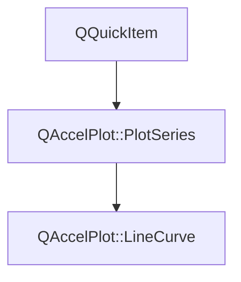

# Class QAccelPlot::LineCurve


[**ClassList**](annotated.md) **>** [**QAccelPlot**](namespaceQAccelPlot.md) **>** [**LineCurve**](classQAccelPlot_1_1LineCurve.md)


_A hardware-accelerated QML item that renders a 2D line curve with optional markers, dashing, and gradient effects._ [More...](#detailed-description)

* `#include <LineCurve.hpp>`


Inherits the following classes: [QAccelPlot::PlotSeries](classQAccelPlot_1_1PlotSeries.md)


## Inheritance diagram




## Public Types inherited from QAccelPlot::PlotSeries

See [QAccelPlot::PlotSeries](classQAccelPlot_1_1PlotSeries.md)

| Type | Name |
| ---: | :--- |
| enum  | [**LegendSymbol**](classQAccelPlot_1_1PlotSeries.md#enum-legendsymbol)  <br>_Supported default legend symbols._  |
| enum  | [**MarkerShape**](classQAccelPlot_1_1PlotSeries.md#enum-markershape)  <br>_Marker shapes shared by every series that draws markers._  |


## Public Properties

| Type | Name |
| ---: | :--- |
| property bool | [**antialiasingEnabled**](classQAccelPlot_1_1LineCurve.md#property-antialiasingenabled-12)  <br>_Whether GPU-side anti-aliasing is applied to lines and markers. Default:_ `true` _._ |
| property qreal | [**antialiasingFeather**](classQAccelPlot_1_1LineCurve.md#property-antialiasingfeather-12)  <br>_Anti-aliasing feather width in pixels. Has effect only when_ `antialiasingEnabled` _is_`true` _. Default: 1._ |
| property QColor | [**color**](classQAccelPlot_1_1LineCurve.md#property-color-12)  <br>_Base line color. Default:_ `Colors.dark.seriesPrimary` _._ |
| property QQmlListProperty&lt; [**LineCurveEffect**](classQAccelPlot_1_1LineCurveEffect.md) &gt; | [**effects**](classQAccelPlot_1_1LineCurve.md#property-effects-12)  <br>_List of visual effects (e.g._ [_**GradientFill**_](classQAccelPlot_1_1GradientFill.md) _,_[_**GradientStroke**_](classQAccelPlot_1_1GradientStroke.md) _) applied to this curve._ |
| property [**LineCurveGaps**](classQAccelPlot_1_1LineCurveGaps.md) \* | [**gaps**](classQAccelPlot_1_1LineCurve.md#property-gaps-12)  <br>_Grouped gap-rendering settings, e.g._ `gaps.nanMode` _._ |
| property bool | [**hovered**](classQAccelPlot_1_1LineCurve.md#property-hovered-12)  <br>_Read-only:_ `true` _while the mouse cursor is over the curve._ |
| property [**LineStyle**](classQAccelPlot_1_1LineStyle.md) \* | [**lineStyle**](classQAccelPlot_1_1LineCurve.md#property-linestyle-12)  <br>_Line style (_ [_**SolidLine**_](classQAccelPlot_1_1SolidLine.md) _,_[_**DashLine**_](classQAccelPlot_1_1DashLine.md) _, or_[_**NoLine**_](classQAccelPlot_1_1NoLine.md) _). Default:_[_**SolidLine**_](classQAccelPlot_1_1SolidLine.md) _._ |
| property qreal | [**lineWidth**](classQAccelPlot_1_1LineCurve.md#property-linewidth-12)  <br>_Line stroke width in pixels. Default: 1._  |
| property [**SeriesMarker**](classQAccelPlot_1_1SeriesMarker.md) \* | [**marker**](classQAccelPlot_1_1LineCurve.md#property-marker-12)  <br>_Grouped marker settings, e.g._ `marker.shape` _and_`marker.size` _._ |
| property [**DataTransition**](classQAccelPlot_1_1DataTransition.md) \* | [**transition**](classQAccelPlot_1_1LineCurve.md#property-transition-12)  <br>_Optional data transition animation applied when new data arrives._  |


## Public Properties inherited from QAccelPlot::PlotSeries

See [QAccelPlot::PlotSeries](classQAccelPlot_1_1PlotSeries.md)

| Type | Name |
| ---: | :--- |
| property [**LegendSymbol**](classQAccelPlot_1_1PlotSeries.md#enum-legendsymbol) | [**legendSymbol**](classQAccelPlot_1_1PlotSeries.md#property-legendsymbol-12)  <br>_Symbol style requested from the default legend._  |
| property QString | [**name**](classQAccelPlot_1_1PlotSeries.md#property-name-12)  <br>_Identifying name used by the default legend._  |
| property QRectF | [**plotRect**](classQAccelPlot_1_1PlotSeries.md#property-plotrect-12)  <br>_Plot area in parent-item coordinates, assigned by_ `PlotView` _._ |
| property [**Axis**](classQAccelPlot_1_1Axis.md) \* | [**xAxis**](classQAccelPlot_1_1PlotSeries.md#property-xaxis-12)  <br>_Horizontal axis used for data-to-pixel coordinate mapping._  |
| property [**Axis**](classQAccelPlot_1_1Axis.md) \* | [**yAxis**](classQAccelPlot_1_1PlotSeries.md#property-yaxis-12)  <br>_Vertical axis used for data-to-pixel coordinate mapping._  |


## Public Signals

| Type | Name |
| ---: | :--- |
| signal void | [**antialiasingEnabledChanged**](classQAccelPlot_1_1LineCurve.md#signal-antialiasingenabledchanged)  <br>_Emitted when the antialiasingEnabled property changes._  |
| signal void | [**antialiasingFeatherChanged**](classQAccelPlot_1_1LineCurve.md#signal-antialiasingfeatherchanged)  <br>_Emitted when the antialiasingFeather property changes._  |
| signal void | [**colorChanged**](classQAccelPlot_1_1LineCurve.md#signal-colorchanged)  <br>_Emitted when the color property changes._  |
| signal void | [**hoveredChanged**](classQAccelPlot_1_1LineCurve.md#signal-hoveredchanged)  <br>_Emitted when the hovered property changes._  |
| signal void | [**lineStyleChanged**](classQAccelPlot_1_1LineCurve.md#signal-linestylechanged)  <br>_Emitted when the lineStyle property changes._  |
| signal void | [**lineWidthChanged**](classQAccelPlot_1_1LineCurve.md#signal-linewidthchanged)  <br>_Emitted when the lineWidth property changes._  |
| signal void | [**transitionChanged**](classQAccelPlot_1_1LineCurve.md#signal-transitionchanged)  <br>_Emitted when the transition property changes._  |


## Public Signals inherited from QAccelPlot::PlotSeries

See [QAccelPlot::PlotSeries](classQAccelPlot_1_1PlotSeries.md)

| Type | Name |
| ---: | :--- |
| signal void | [**legendSymbolChanged**](classQAccelPlot_1_1PlotSeries.md#signal-legendsymbolchanged)  <br> |
| signal void | [**nameChanged**](classQAccelPlot_1_1PlotSeries.md#signal-namechanged)  <br> |
| signal void | [**plotRectChanged**](classQAccelPlot_1_1PlotSeries.md#signal-plotrectchanged)  <br> |
| signal void | [**xAxisChanged**](classQAccelPlot_1_1PlotSeries.md#signal-xaxischanged)  <br> |
| signal void | [**xDataRangeChanged**](classQAccelPlot_1_1PlotSeries.md#signal-xdatarangechanged) (qreal min, qreal max) <br>_Emitted when the X data extent of this series changes._  |
| signal void | [**yAxisChanged**](classQAccelPlot_1_1PlotSeries.md#signal-yaxischanged)  <br> |
| signal void | [**yDataRangeChanged**](classQAccelPlot_1_1PlotSeries.md#signal-ydatarangechanged) (qreal min, qreal max) <br>_Emitted when the Y data extent of this series changes._  |


## Public Functions

| Type | Name |
| ---: | :--- |
|   | [**LineCurve**](#function-linecurve) (QQuickItem \* parent=nullptr) <br>_Constructs a_ [_**LineCurve**_](classQAccelPlot_1_1LineCurve.md) _with the given__parent_ _._ |
|  bool | [**antialiasingEnabled**](#function-antialiasingenabled-22) () const<br>_Returns_ `true` _when GPU anti-aliasing is enabled._ |
|  qreal | [**antialiasingFeather**](#function-antialiasingfeather-22) () const<br>_Returns the anti-aliasing feather width._  |
|  Q\_INVOKABLE void | [**appendData**](#function-appenddata) (qreal x, qreal y) <br>_Appends a single data point (_ _x_ _,__y_ _) to the curve. Triggers a redraw._ |
|  Q\_INVOKABLE void | [**clearData**](#function-cleardata) () <br>_Removes all data points from the curve._  |
|  QColor | [**color**](#function-color-22) () const<br>_Returns the base line color._  |
|  QQmlListProperty&lt; [**LineCurveEffect**](classQAccelPlot_1_1LineCurveEffect.md) &gt; | [**effects**](#function-effects-22) () <br>_Returns the QML list property for attached visual effects._  |
|  [**LineCurveGaps**](classQAccelPlot_1_1LineCurveGaps.md) \* | [**gaps**](#function-gaps-22) () const<br>_Returns the grouped gap-rendering settings. The object is owned by the curve._  |
|  bool | [**hovered**](#function-hovered-22) () const<br>_Returns_ `true` _if the cursor is currently over the curve._ |
|  [**LineStyle**](classQAccelPlot_1_1LineStyle.md) \* | [**lineStyle**](#function-linestyle-22) () const<br>_Returns the active line style._  |
|  qreal | [**lineWidth**](#function-linewidth-22) () const<br>_Returns the line stroke width._  |
|  [**SeriesMarker**](classQAccelPlot_1_1SeriesMarker.md) \* | [**marker**](#function-marker-22) () const<br>_Returns the grouped marker settings. The object is owned by the curve._  |
|  void | [**postData**](#function-postdata-12) (std::vector&lt; float &gt; && xyInterleaved, int pointCount) <br>_Posts data to the curve from any thread. Equivalent to calling_ `setDataF()` _on the UI thread. The data vector is moved into the queued call; no copy is made. This call is thread-safe._ |
|  void | [**postData**](#function-postdata-22) (std::vector&lt; double &gt; && xyInterleaved, int pointCount) <br>_Posts double-precision interleaved XY data to the curve from any thread. Equivalent to calling_ `setData(std::vector<double>&&, int)` _on the UI thread. The data vector is moved into the queued call; no copy is made. This call is thread-safe._ |
|  void | [**setAntialiasingEnabled**](#function-setantialiasingenabled) (bool enabled) <br>_Sets anti-aliasing to_ _enabled_ _._ |
|  void | [**setAntialiasingFeather**](#function-setantialiasingfeather) (qreal feather) <br>_Sets the anti-aliasing feather width to_ _feather_ _pixels. Has effect only when_`antialiasingEnabled` _is_`true` _._ |
|  void | [**setColor**](#function-setcolor) (const QColor & c) <br>_Sets the line color to_ _c_ _._ |
|  Q\_INVOKABLE void | [**setData**](#function-setdata-13) (const QList&lt; QPointF &gt; & data) <br>_Replaces the curve data with_ _data_ _(a list of QPointF values)._ |
|  void | [**setData**](#function-setdata-23) (const std::vector&lt; double &gt; & xs, const std::vector&lt; double &gt; & ys) <br>_Sets data from separate X and Y vectors. If sizes don't match, the shorter length is used._  |
|  void | [**setData**](#function-setdata-33) (std::vector&lt; double &gt; && xyInterleaved, int pointCount) <br>_Sets data by moving a pre-filled interleaved double vector of_ _pointCount_ _XY pairs_`[x0, y0, x1, y1, …]` _. Retains double precision, e.g. for large timestamp values, without re-interleaving._ |
|  void | [**setDataF**](#function-setdataf-12) (const float \* xyInterleaved, int pointCount) <br>_High-performance C++ overload: sets data from a raw interleaved float array of_ _pointCount_ _XY pairs._ |
|  void | [**setDataF**](#function-setdataf-22) (std::vector&lt; float &gt; && data, int pointCount) <br>_High-performance C++ overload: sets data by moving a pre-filled float vector of_ _pointCount_ _XY pairs._ |
|  void | [**setDataFNoRange**](#function-setdatafnorange-12) (std::vector&lt; float &gt; && data, int pointCount) <br>_Like_ `setDataF(vector)` _but skips emitting_`xDataRangeChanged` _/_`yDataRangeChanged` _._ |
|  void | [**setDataFNoRange**](#function-setdatafnorange-22) (const float \* xyInterleaved, int pointCount) <br>_Like_ `setDataFNoRange(vector)` _but copies from a raw interleaved float array._ |
|  void | [**setDataFNoRangeWithCache**](#function-setdatafnorangewithcache-12) (std::vector&lt; float &gt; && data, int pointCount, std::vector&lt; char &gt; && vertexCache) <br>_Like_ `setDataFNoRange` _but also accepts a pre-built__vertexCache_ _, bypassing main-thread rebuild._ |
|  void | [**setDataFNoRangeWithCache**](#function-setdatafnorangewithcache-22) (const float \* xyInterleaved, int pointCount, std::vector&lt; char &gt; && vertexCache) <br>_Like_ `setDataFNoRangeWithCache` _but copies from a raw interleaved float array._ |
|  void | [**setLineStyle**](#function-setlinestyle) ([**LineStyle**](classQAccelPlot_1_1LineStyle.md) \* style) <br>_Sets the line style to_ _style_ _._ |
|  void | [**setLineWidth**](#function-setlinewidth) (qreal w) <br>_Sets the line stroke width to_ _w_ _pixels._ |
|  void | [**setTransition**](#function-settransition) ([**DataTransition**](classQAccelPlot_1_1DataTransition.md) \* transition) <br>_Sets the data transition to_ _transition_ _._ |
|  [**DataTransition**](classQAccelPlot_1_1DataTransition.md) \* | [**transition**](#function-transition-22) () const<br>_Returns the active data transition, or_ `nullptr` _if none._ |


## Public Functions inherited from QAccelPlot::PlotSeries

See [QAccelPlot::PlotSeries](classQAccelPlot_1_1PlotSeries.md)

| Type | Name |
| ---: | :--- |
|   | [**PlotSeries**](classQAccelPlot_1_1PlotSeries.md#function-plotseries) (QQuickItem \* parent=nullptr) <br> |
|  [**LegendSymbol**](classQAccelPlot_1_1PlotSeries.md#enum-legendsymbol) | [**legendSymbol**](classQAccelPlot_1_1PlotSeries.md#function-legendsymbol-22) () const<br> |
|  QString | [**name**](classQAccelPlot_1_1PlotSeries.md#function-name-22) () const<br> |
|  QRectF | [**plotRect**](classQAccelPlot_1_1PlotSeries.md#function-plotrect-22) () const<br> |
|  void | [**setLegendSymbol**](classQAccelPlot_1_1PlotSeries.md#function-setlegendsymbol) ([**LegendSymbol**](classQAccelPlot_1_1PlotSeries.md#enum-legendsymbol) symbol) <br> |
|  void | [**setName**](classQAccelPlot_1_1PlotSeries.md#function-setname) (const QString & name) <br> |
|  void | [**setPlotRect**](classQAccelPlot_1_1PlotSeries.md#function-setplotrect) (const QRectF & rect) <br>_Updates the series geometry to exactly cover_ _rect_ _._ |
|  void | [**setXAxis**](classQAccelPlot_1_1PlotSeries.md#function-setxaxis) ([**Axis**](classQAccelPlot_1_1Axis.md) \* axis) <br> |
|  void | [**setYAxis**](classQAccelPlot_1_1PlotSeries.md#function-setyaxis) ([**Axis**](classQAccelPlot_1_1Axis.md) \* axis) <br> |
|  [**Axis**](classQAccelPlot_1_1Axis.md) \* | [**xAxis**](classQAccelPlot_1_1PlotSeries.md#function-xaxis-22) () const<br> |
|  [**Axis**](classQAccelPlot_1_1Axis.md) \* | [**yAxis**](classQAccelPlot_1_1PlotSeries.md#function-yaxis-22) () const<br> |


## Protected Functions

| Type | Name |
| ---: | :--- |
|  bool | [**contains**](#function-contains) (const QPointF & point) override const<br>_Returns_ `true` _if__point_ _lies within the curve's hit-test region._ |
| virtual void | [**onAxisScaleChanged**](#function-onaxisscalechanged) () override<br>_Refreshes ranges and cached geometry when a bound axis changes between linear and log scale._  |


## Protected Functions inherited from QAccelPlot::PlotSeries

See [QAccelPlot::PlotSeries](classQAccelPlot_1_1PlotSeries.md)

| Type | Name |
| ---: | :--- |
|  void | [**clearDataRanges**](classQAccelPlot_1_1PlotSeries.md#function-cleardataranges) () <br>_Clears cached extents after a series has been emptied._  |
|  void | [**clearXDataRange**](classQAccelPlot_1_1PlotSeries.md#function-clearxdatarange) () <br>_Clears the cached X extent, e.g. when no sample has a valid X coordinate._  |
|  void | [**clearYDataRange**](classQAccelPlot_1_1PlotSeries.md#function-clearydatarange) () <br>_Clears the cached Y extent, e.g. when no sample has a valid Y coordinate._  |
|  void | [**extendXDataRange**](classQAccelPlot_1_1PlotSeries.md#function-extendxdatarange) (qreal x) <br>_Widens the reported X extent to include_ _x_ _._ |
|  void | [**extendYDataRange**](classQAccelPlot_1_1PlotSeries.md#function-extendydatarange) (qreal y) <br>_Widens the reported Y extent to include_ _y_ _. A non-finite__y_ _leaves the extent unchanged._ |
| virtual void | [**onAxisScaleChanged**](classQAccelPlot_1_1PlotSeries.md#function-onaxisscalechanged) () <br>_Called when a bound axis switches between linear and logarithmic scale, or a different axis is bound._  |
|  QRectF | [**resolvePlotRect**](classQAccelPlot_1_1PlotSeries.md#function-resolveplotrect) () <br>_Returns the plot area to render into, adopting it from the parent plot if needed._  |
|  void | [**setDataRanges**](classQAccelPlot_1_1PlotSeries.md#function-setdataranges) (qreal xMin, qreal xMax, qreal yMin, qreal yMax) <br>_Reports this series' data extents to its bound axes._  |
|  void | [**setXDataRange**](classQAccelPlot_1_1PlotSeries.md#function-setxdatarange) (qreal min, qreal max) <br>_Reports this series' X data extent to its bound horizontal axis. Non-finite extents are ignored._  |
|  void | [**setYDataRange**](classQAccelPlot_1_1PlotSeries.md#function-setydatarange) (qreal min, qreal max) <br>_Reports this series' Y data extent to its bound vertical axis. Non-finite extents are ignored._  |


## Detailed Description


The `setData()` overloads retain double-precision coordinates, including large timestamp values. Methods whose names end in `F` store interleaved float XY pairs `[x0, y0, x1, y1, …]`. For maximum throughput prefer `setDataF(std::vector<float>&&, int)` or `postData(std::vector<float>&&, int)`, which move an already-interleaved float buffer with zero allocation and no type conversion. `postData(std::vector<double>&&, int)` hands off a double-precision buffer from a worker thread instead. The curve is rendered on the Qt Scene Graph render thread using GPU-side data textures, making it suitable for real-time plots with millions of points.


**
**

Markers are configured through the `marker` grouped property, for example `marker.shape:  QAccelPlot.LineCurve.Circle`. No markers are drawn by default.


**
**

Visual effects (gradient stroke, gradient fill) are attached via the `effects` list property.


**
**

Animated data updates are enabled by assigning a `DrawTransition` or `MorphTransition` to `transition`.


**
**

A sample is invalid when its X or Y coordinate is NaN or ±Inf, or is not strictly positive on a log-scale axis. Invalid samples are never drawn as markers, never hit-tested, and are excluded from auto-ranging coordinate by coordinate (a finite X with an invalid Y still extends the X range). How the line and gradient fill treat them is controlled by the `gaps` grouped property: `gaps.nanMode` `Break` (default) leaves a gap, `Connect` joins the neighboring valid samples. Insert `NaN` to mark missing telemetry explicitly.


**See also:** [**Axis**](classQAccelPlot_1_1Axis.md), [**SeriesMarker**](classQAccelPlot_1_1SeriesMarker.md), [**GradientFill**](classQAccelPlot_1_1GradientFill.md), [**GradientStroke**](classQAccelPlot_1_1GradientStroke.md), [**DrawTransition**](classQAccelPlot_1_1DrawTransition.md), [**MorphTransition**](classQAccelPlot_1_1MorphTransition.md) 


    
## Public Properties Documentation


### property antialiasingEnabled {#property-antialiasingenabled-12}

_Whether GPU-side anti-aliasing is applied to lines and markers. Default:_ `true` _._
```C++
bool QAccelPlot::LineCurve::antialiasingEnabled;
```


<hr>


### property antialiasingFeather {#property-antialiasingfeather-12}

_Anti-aliasing feather width in pixels. Has effect only when_ `antialiasingEnabled` _is_`true` _. Default: 1._
```C++
qreal QAccelPlot::LineCurve::antialiasingFeather;
```


<hr>


### property color {#property-color-12}

_Base line color. Default:_ `Colors.dark.seriesPrimary` _._
```C++
QColor QAccelPlot::LineCurve::color;
```


<hr>


### property effects {#property-effects-12}

_List of visual effects (e.g._ [_**GradientFill**_](classQAccelPlot_1_1GradientFill.md) _,_[_**GradientStroke**_](classQAccelPlot_1_1GradientStroke.md) _) applied to this curve._
```C++
QQmlListProperty<LineCurveEffect> QAccelPlot::LineCurve::effects;
```


<hr>


### property gaps {#property-gaps-12}

_Grouped gap-rendering settings, e.g._ `gaps.nanMode` _._
```C++
LineCurveGaps* QAccelPlot::LineCurve::gaps;
```


<hr>


### property hovered {#property-hovered-12}

_Read-only:_ `true` _while the mouse cursor is over the curve._
```C++
bool QAccelPlot::LineCurve::hovered;
```


<hr>


### property lineStyle {#property-linestyle-12}

_Line style (_ [_**SolidLine**_](classQAccelPlot_1_1SolidLine.md) _,_[_**DashLine**_](classQAccelPlot_1_1DashLine.md) _, or_[_**NoLine**_](classQAccelPlot_1_1NoLine.md) _). Default:_[_**SolidLine**_](classQAccelPlot_1_1SolidLine.md) _._
```C++
LineStyle* QAccelPlot::LineCurve::lineStyle;
```


<hr>


### property lineWidth {#property-linewidth-12}

_Line stroke width in pixels. Default: 1._ 
```C++
qreal QAccelPlot::LineCurve::lineWidth;
```


<hr>


### property marker {#property-marker-12}

_Grouped marker settings, e.g._ `marker.shape` _and_`marker.size` _._
```C++
SeriesMarker* QAccelPlot::LineCurve::marker;
```


<hr>


### property transition {#property-transition-12}

_Optional data transition animation applied when new data arrives._ 
```C++
DataTransition* QAccelPlot::LineCurve::transition;
```


<hr>
## Public Signals Documentation


### signal antialiasingEnabledChanged {#signal-antialiasingenabledchanged}

_Emitted when the antialiasingEnabled property changes._ 
```C++
void QAccelPlot::LineCurve::antialiasingEnabledChanged;
```


<hr>


### signal antialiasingFeatherChanged {#signal-antialiasingfeatherchanged}

_Emitted when the antialiasingFeather property changes._ 
```C++
void QAccelPlot::LineCurve::antialiasingFeatherChanged;
```


<hr>


### signal colorChanged {#signal-colorchanged}

_Emitted when the color property changes._ 
```C++
void QAccelPlot::LineCurve::colorChanged;
```


<hr>


### signal hoveredChanged {#signal-hoveredchanged}

_Emitted when the hovered property changes._ 
```C++
void QAccelPlot::LineCurve::hoveredChanged;
```


<hr>


### signal lineStyleChanged {#signal-linestylechanged}

_Emitted when the lineStyle property changes._ 
```C++
void QAccelPlot::LineCurve::lineStyleChanged;
```


<hr>


### signal lineWidthChanged {#signal-linewidthchanged}

_Emitted when the lineWidth property changes._ 
```C++
void QAccelPlot::LineCurve::lineWidthChanged;
```


<hr>


### signal transitionChanged {#signal-transitionchanged}

_Emitted when the transition property changes._ 
```C++
void QAccelPlot::LineCurve::transitionChanged;
```


<hr>
## Public Functions Documentation


### function LineCurve {#function-linecurve}

_Constructs a_ [_**LineCurve**_](classQAccelPlot_1_1LineCurve.md) _with the given__parent_ _._
```C++
explicit QAccelPlot::LineCurve::LineCurve (
    QQuickItem * parent=nullptr
) 
```


<hr>


### function antialiasingEnabled {#function-antialiasingenabled-22}

_Returns_ `true` _when GPU anti-aliasing is enabled._
```C++
bool QAccelPlot::LineCurve::antialiasingEnabled () const
```


<hr>


### function antialiasingFeather {#function-antialiasingfeather-22}

_Returns the anti-aliasing feather width._ 
```C++
qreal QAccelPlot::LineCurve::antialiasingFeather () const
```


<hr>


### function appendData {#function-appenddata}

_Appends a single data point (_ _x_ _,__y_ _) to the curve. Triggers a redraw._
```C++
Q_INVOKABLE void QAccelPlot::LineCurve::appendData (
    qreal x,
    qreal y
) 
```


<hr>


### function clearData {#function-cleardata}

_Removes all data points from the curve._ 
```C++
Q_INVOKABLE void QAccelPlot::LineCurve::clearData () 
```


<hr>


### function color {#function-color-22}

_Returns the base line color._ 
```C++
QColor QAccelPlot::LineCurve::color () const
```


<hr>


### function effects {#function-effects-22}

_Returns the QML list property for attached visual effects._ 
```C++
QQmlListProperty< LineCurveEffect > QAccelPlot::LineCurve::effects () 
```


<hr>


### function gaps {#function-gaps-22}

_Returns the grouped gap-rendering settings. The object is owned by the curve._ 
```C++
LineCurveGaps * QAccelPlot::LineCurve::gaps () const
```


<hr>


### function hovered {#function-hovered-22}

_Returns_ `true` _if the cursor is currently over the curve._
```C++
bool QAccelPlot::LineCurve::hovered () const
```


<hr>


### function lineStyle {#function-linestyle-22}

_Returns the active line style._ 
```C++
LineStyle * QAccelPlot::LineCurve::lineStyle () const
```


<hr>


### function lineWidth {#function-linewidth-22}

_Returns the line stroke width._ 
```C++
qreal QAccelPlot::LineCurve::lineWidth () const
```


<hr>


### function marker {#function-marker-22}

_Returns the grouped marker settings. The object is owned by the curve._ 
```C++
SeriesMarker * QAccelPlot::LineCurve::marker () const
```


<hr>


### function postData {#function-postdata-12}

_Posts data to the curve from any thread. Equivalent to calling_ `setDataF()` _on the UI thread. The data vector is moved into the queued call; no copy is made. This call is thread-safe._
```C++
void QAccelPlot::LineCurve::postData (
    std::vector< float > && xyInterleaved,
    int pointCount
) 
```


<hr>


### function postData {#function-postdata-22}

_Posts double-precision interleaved XY data to the curve from any thread. Equivalent to calling_ `setData(std::vector<double>&&, int)` _on the UI thread. The data vector is moved into the queued call; no copy is made. This call is thread-safe._
```C++
void QAccelPlot::LineCurve::postData (
    std::vector< double > && xyInterleaved,
    int pointCount
) 
```


<hr>


### function setAntialiasingEnabled {#function-setantialiasingenabled}

_Sets anti-aliasing to_ _enabled_ _._
```C++
void QAccelPlot::LineCurve::setAntialiasingEnabled (
    bool enabled
) 
```


<hr>


### function setAntialiasingFeather {#function-setantialiasingfeather}

_Sets the anti-aliasing feather width to_ _feather_ _pixels. Has effect only when_`antialiasingEnabled` _is_`true` _._
```C++
void QAccelPlot::LineCurve::setAntialiasingFeather (
    qreal feather
) 
```


<hr>


### function setColor {#function-setcolor}

_Sets the line color to_ _c_ _._
```C++
void QAccelPlot::LineCurve::setColor (
    const QColor & c
) 
```


<hr>


### function setData {#function-setdata-13}

_Replaces the curve data with_ _data_ _(a list of QPointF values)._
```C++
Q_INVOKABLE void QAccelPlot::LineCurve::setData (
    const QList< QPointF > & data
) 
```


<hr>


### function setData {#function-setdata-23}

_Sets data from separate X and Y vectors. If sizes don't match, the shorter length is used._ 
```C++
void QAccelPlot::LineCurve::setData (
    const std::vector< double > & xs,
    const std::vector< double > & ys
) 
```


<hr>


### function setData {#function-setdata-33}

_Sets data by moving a pre-filled interleaved double vector of_ _pointCount_ _XY pairs_`[x0, y0, x1, y1, …]` _. Retains double precision, e.g. for large timestamp values, without re-interleaving._
```C++
void QAccelPlot::LineCurve::setData (
    std::vector< double > && xyInterleaved,
    int pointCount
) 
```


<hr>


### function setDataF {#function-setdataf-12}

_High-performance C++ overload: sets data from a raw interleaved float array of_ _pointCount_ _XY pairs._
```C++
void QAccelPlot::LineCurve::setDataF (
    const float * xyInterleaved,
    int pointCount
) 
```


<hr>


### function setDataF {#function-setdataf-22}

_High-performance C++ overload: sets data by moving a pre-filled float vector of_ _pointCount_ _XY pairs._
```C++
void QAccelPlot::LineCurve::setDataF (
    std::vector< float > && data,
    int pointCount
) 
```


<hr>


### function setDataFNoRange {#function-setdatafnorange-12}

_Like_ `setDataF(vector)` _but skips emitting_`xDataRangeChanged` _/_`yDataRangeChanged` _._
```C++
void QAccelPlot::LineCurve::setDataFNoRange (
    std::vector< float > && data,
    int pointCount
) 
```


<hr>


### function setDataFNoRange {#function-setdatafnorange-22}

_Like_ `setDataFNoRange(vector)` _but copies from a raw interleaved float array._
```C++
void QAccelPlot::LineCurve::setDataFNoRange (
    const float * xyInterleaved,
    int pointCount
) 
```


<hr>


### function setDataFNoRangeWithCache {#function-setdatafnorangewithcache-12}

_Like_ `setDataFNoRange` _but also accepts a pre-built__vertexCache_ _, bypassing main-thread rebuild._
```C++
void QAccelPlot::LineCurve::setDataFNoRangeWithCache (
    std::vector< float > && data,
    int pointCount,
    std::vector< char > && vertexCache
) 
```


<hr>


### function setDataFNoRangeWithCache {#function-setdatafnorangewithcache-22}

_Like_ `setDataFNoRangeWithCache` _but copies from a raw interleaved float array._
```C++
void QAccelPlot::LineCurve::setDataFNoRangeWithCache (
    const float * xyInterleaved,
    int pointCount,
    std::vector< char > && vertexCache
) 
```


<hr>


### function setLineStyle {#function-setlinestyle}

_Sets the line style to_ _style_ _._
```C++
void QAccelPlot::LineCurve::setLineStyle (
    LineStyle * style
) 
```


<hr>


### function setLineWidth {#function-setlinewidth}

_Sets the line stroke width to_ _w_ _pixels._
```C++
void QAccelPlot::LineCurve::setLineWidth (
    qreal w
) 
```


<hr>


### function setTransition {#function-settransition}

_Sets the data transition to_ _transition_ _._
```C++
void QAccelPlot::LineCurve::setTransition (
    DataTransition * transition
) 
```


<hr>


### function transition {#function-transition-22}

_Returns the active data transition, or_ `nullptr` _if none._
```C++
DataTransition * QAccelPlot::LineCurve::transition () const
```


<hr>
## Protected Functions Documentation


### function contains {#function-contains}

_Returns_ `true` _if__point_ _lies within the curve's hit-test region._
```C++
bool QAccelPlot::LineCurve::contains (
    const QPointF & point
) override const
```


<hr>


### function onAxisScaleChanged {#function-onaxisscalechanged}

_Refreshes ranges and cached geometry when a bound axis changes between linear and log scale._ 
```C++
virtual void QAccelPlot::LineCurve::onAxisScaleChanged () override
```


Implements [*QAccelPlot::PlotSeries::onAxisScaleChanged*](classQAccelPlot_1_1PlotSeries.md#function-onaxisscalechanged)


<hr>

------------------------------
The documentation for this class was generated from the following file `QAccelPlot/src/QAccelPlot/series/LineCurve.hpp`

