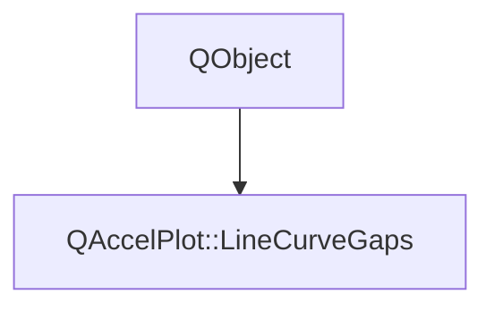

# Class QAccelPlot::LineCurveGaps


[**ClassList**](annotated.md) **>** [**QAccelPlot**](namespaceQAccelPlot.md) **>** [**LineCurveGaps**](classQAccelPlot_1_1LineCurveGaps.md)


_Controls how a_ `LineCurve` _renders gaps in its data._[More...](#detailed-description)

* `#include <LineCurveGaps.hpp>`


Inherits the following classes: QObject


## Inheritance diagram




## Public Properties

| Type | Name |
| ---: | :--- |
| property QML\_ANONYMOUSNanGapMode | [**nanMode**](classQAccelPlot_1_1LineCurveGaps.md#property-nanmode-12)  <br>_How the line and gradient fill treat invalid samples. Default:_ `NanGapMode.Break` _._ |


## Public Signals

| Type | Name |
| ---: | :--- |
| signal void | [**nanModeChanged**](classQAccelPlot_1_1LineCurveGaps.md#signal-nanmodechanged)  <br>_Emitted when the nanMode property changes._  |


## Public Functions

| Type | Name |
| ---: | :--- |
|   | [**LineCurveGaps**](#function-linecurvegaps) (QObject \* parent=nullptr) <br>_Constructs a_ [_**LineCurveGaps**_](classQAccelPlot_1_1LineCurveGaps.md) _with the given__parent_ _._ |
|  [**NanGapMode**](namespaceQAccelPlot_1_1NanGapModeNS.md#enum-mode) | [**nanMode**](#function-nanmode-22) () const<br>_Returns how invalid samples are rendered._  |
|  void | [**setNanMode**](#function-setnanmode) ([**NanGapMode**](namespaceQAccelPlot_1_1NanGapModeNS.md#enum-mode) mode) <br>_Sets how invalid samples are rendered to_ _mode_ _._ |


## Detailed Description


Accessible via the `LineCurve::gaps` CONSTANT grouped property, for example `gaps.nanMode: QAccelPlot.NanGapMode.Connect`.


A sample is invalid when its X or Y coordinate is NaN or ±Inf, or is not strictly positive on a log-scale axis. Invalid samples are never drawn as markers, never hit-tested, and are excluded from auto-ranging coordinate by coordinate, regardless of `nanMode`.


**See also:** [**LineCurve**](classQAccelPlot_1_1LineCurve.md) 


    
## Public Properties Documentation


### property nanMode {#property-nanmode-12}

_How the line and gradient fill treat invalid samples. Default:_ `NanGapMode.Break` _._
```C++
QML_ANONYMOUSNanGapMode QAccelPlot::LineCurveGaps::nanMode;
```


<hr>
## Public Signals Documentation


### signal nanModeChanged {#signal-nanmodechanged}

_Emitted when the nanMode property changes._ 
```C++
void QAccelPlot::LineCurveGaps::nanModeChanged;
```


<hr>
## Public Functions Documentation


### function LineCurveGaps {#function-linecurvegaps}

_Constructs a_ [_**LineCurveGaps**_](classQAccelPlot_1_1LineCurveGaps.md) _with the given__parent_ _._
```C++
explicit QAccelPlot::LineCurveGaps::LineCurveGaps (
    QObject * parent=nullptr
) 
```


<hr>


### function nanMode {#function-nanmode-22}

_Returns how invalid samples are rendered._ 
```C++
NanGapMode QAccelPlot::LineCurveGaps::nanMode () const
```


<hr>


### function setNanMode {#function-setnanmode}

_Sets how invalid samples are rendered to_ _mode_ _._
```C++
void QAccelPlot::LineCurveGaps::setNanMode (
    NanGapMode mode
) 
```


<hr>

------------------------------
The documentation for this class was generated from the following file `QAccelPlot/src/QAccelPlot/series/LineCurveGaps.hpp`

