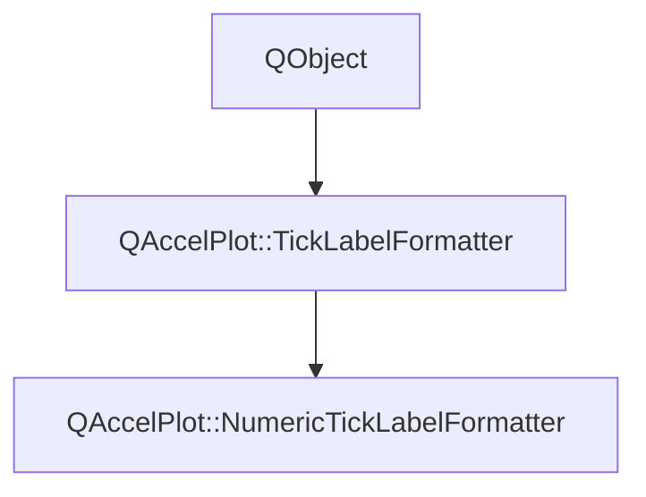

# Class QAccelPlot::NumericTickLabelFormatter


[**ClassList**](annotated.md) **>** [**QAccelPlot**](namespaceQAccelPlot.md) **>** [**NumericTickLabelFormatter**](classQAccelPlot_1_1NumericTickLabelFormatter.md)


_The default tick label formatter — produces numeric labels with automatic decimal precision._ [More...](#detailed-description)

* `#include <NumericTickLabelFormatter.hpp>`


Inherits the following classes: [QAccelPlot::TickLabelFormatter](classQAccelPlot_1_1TickLabelFormatter.md)


## Inheritance diagram




## Public Properties inherited from QAccelPlot::TickLabelFormatter

See [QAccelPlot::TickLabelFormatter](classQAccelPlot_1_1TickLabelFormatter.md)

| Type | Name |
| ---: | :--- |
| property QML\_ANONYMOUSQJSValue | [**tickLabel**](classQAccelPlot_1_1TickLabelFormatter.md#property-ticklabel-12)  <br>_Optional JavaScript callback_ `function(value, tickStep)` _that overrides_`doFormat()` _._ |


## Public Signals inherited from QAccelPlot::TickLabelFormatter

See [QAccelPlot::TickLabelFormatter](classQAccelPlot_1_1TickLabelFormatter.md)

| Type | Name |
| ---: | :--- |
| signal void | [**formatChanged**](classQAccelPlot_1_1TickLabelFormatter.md#signal-formatchanged)  <br>_Emitted whenever a property that affects formatted output changes._  |
| signal void | [**tickLabelChanged**](classQAccelPlot_1_1TickLabelFormatter.md#signal-ticklabelchanged)  <br>_Emitted when the tickLabel property changes._  |


## Public Functions

| Type | Name |
| ---: | :--- |
|   | [**NumericTickLabelFormatter**](#function-numericticklabelformatter) (QObject \* parent=nullptr) <br>_Constructs a_ [_**NumericTickLabelFormatter**_](classQAccelPlot_1_1NumericTickLabelFormatter.md) _with the given__parent_ _._ |


## Public Functions inherited from QAccelPlot::TickLabelFormatter

See [QAccelPlot::TickLabelFormatter](classQAccelPlot_1_1TickLabelFormatter.md)

| Type | Name |
| ---: | :--- |
|   | [**TickLabelFormatter**](classQAccelPlot_1_1TickLabelFormatter.md#function-ticklabelformatter) (QObject \* parent=nullptr) <br>_Constructs an_ [_**TickLabelFormatter**_](classQAccelPlot_1_1TickLabelFormatter.md) _with the given__parent_ _._ |
|  QString | [**format**](classQAccelPlot_1_1TickLabelFormatter.md#function-format) (qreal value, qreal tickStep) const<br>_Returns the display string for_ _value_ _at the given__tickStep_ _._ |
|  QString | [**formatLogTick**](classQAccelPlot_1_1TickLabelFormatter.md#function-formatlogtick) (qreal value) const<br>_Returns the display string for a major tick at_ _value_ _on a logarithmic axis._ |
|  void | [**setTickLabel**](classQAccelPlot_1_1TickLabelFormatter.md#function-setticklabel) (const QJSValue & tickLabel) <br>_Sets the JavaScript override callback to_ _tickLabel_ _._ |
|  QJSValue | [**tickLabel**](classQAccelPlot_1_1TickLabelFormatter.md#function-ticklabel-22) () const<br>_Returns the optional JavaScript override callback._  |


## Protected Functions

| Type | Name |
| ---: | :--- |
| virtual QString | [**doFormat**](#function-doformat) (qreal value, qreal tickStep) override const<br>_Returns a numeric string for_ _value_ _, precision matched to__tickStep_ _._ |
| virtual QString | [**doFormatLogTick**](#function-doformatlogtick) (qreal value) override const<br>_Returns a decade tick as a superscript power of ten, for example "10²" for 100._  |


## Protected Functions inherited from QAccelPlot::TickLabelFormatter

See [QAccelPlot::TickLabelFormatter](classQAccelPlot_1_1TickLabelFormatter.md)

| Type | Name |
| ---: | :--- |
| virtual QString | [**doFormat**](classQAccelPlot_1_1TickLabelFormatter.md#function-doformat) (qreal value, qreal tickStep) const = 0<br>_Subclass entry point — returns the formatted label for_ _value_ _._ |
| virtual QString | [**doFormatLogTick**](classQAccelPlot_1_1TickLabelFormatter.md#function-doformatlogtick) (qreal value) const<br>_Subclass entry point for log-scale major ticks — returns the label for_ _value_ _._ |


## Detailed Description


The number of decimal places is derived from _tickStep_ so that labels are neither truncated nor cluttered with unnecessary digits. Every label on a linear axis shares one tick step, so all of them show the same number of decimal places (for example 0.0, 0.5, 1.0, 1.5). Decade ticks on a logarithmic axis use superscript powers of ten (10⁻¹, 10⁰, 10¹, 10²).


**See also:** [**DateTimeTickLabelFormatter**](classQAccelPlot_1_1DateTimeTickLabelFormatter.md), [**TickLabelFormatter**](classQAccelPlot_1_1TickLabelFormatter.md) 


    
## Public Functions Documentation


### function NumericTickLabelFormatter {#function-numericticklabelformatter}

_Constructs a_ [_**NumericTickLabelFormatter**_](classQAccelPlot_1_1NumericTickLabelFormatter.md) _with the given__parent_ _._
```C++
explicit QAccelPlot::NumericTickLabelFormatter::NumericTickLabelFormatter (
    QObject * parent=nullptr
) 
```


<hr>
## Protected Functions Documentation


### function doFormat {#function-doformat}

_Returns a numeric string for_ _value_ _, precision matched to__tickStep_ _._
```C++
virtual QString QAccelPlot::NumericTickLabelFormatter::doFormat (
    qreal value,
    qreal tickStep
) override const
```


Implements [*QAccelPlot::TickLabelFormatter::doFormat*](classQAccelPlot_1_1TickLabelFormatter.md#function-doformat)


<hr>


### function doFormatLogTick {#function-doformatlogtick}

_Returns a decade tick as a superscript power of ten, for example "10²" for 100._ 
```C++
virtual QString QAccelPlot::NumericTickLabelFormatter::doFormatLogTick (
    qreal value
) override const
```


Implements [*QAccelPlot::TickLabelFormatter::doFormatLogTick*](classQAccelPlot_1_1TickLabelFormatter.md#function-doformatlogtick)


<hr>

------------------------------
The documentation for this class was generated from the following file `QAccelPlot/src/QAccelPlot/formatters/NumericTickLabelFormatter.hpp`

