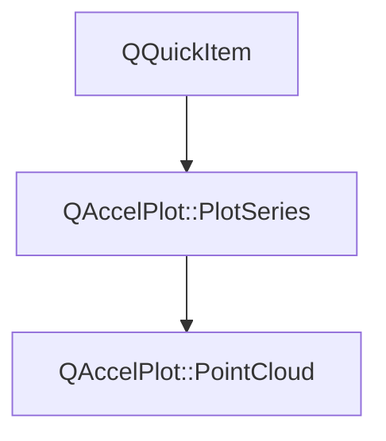

# Class QAccelPlot::PointCloud


[**ClassList**](annotated.md) **>** [**QAccelPlot**](namespaceQAccelPlot.md) **>** [**PointCloud**](classQAccelPlot_1_1PointCloud.md)


_A hardware-accelerated QML item that renders large sets of unconnected 2D points as markers._ [More...](#detailed-description)

* `#include <PointCloud.hpp>`


Inherits the following classes: [QAccelPlot::PlotSeries](classQAccelPlot_1_1PlotSeries.md)


## Inheritance diagram




## Public Types inherited from QAccelPlot::PlotSeries

See [QAccelPlot::PlotSeries](classQAccelPlot_1_1PlotSeries.md)

| Type | Name |
| ---: | :--- |
| enum  | [**LegendSymbol**](classQAccelPlot_1_1PlotSeries.md#enum-legendsymbol)  <br>_Supported default legend symbols._  |
| enum  | [**MarkerShape**](classQAccelPlot_1_1PlotSeries.md#enum-markershape)  <br>_Marker shapes shared by every series that draws markers._  |


## Public Properties

| Type | Name |
| ---: | :--- |
| property bool | [**antialiasingEnabled**](classQAccelPlot_1_1PointCloud.md#property-antialiasingenabled-12)  <br>_Whether GPU-side anti-aliasing is applied to markers. Default:_ `true` _._ |
| property qreal | [**antialiasingFeather**](classQAccelPlot_1_1PointCloud.md#property-antialiasingfeather-12)  <br>_Anti-aliasing feather width in pixels, clamped to [0, 10]. Default: 1._  |
| property QColor | [**color**](classQAccelPlot_1_1PointCloud.md#property-color-12)  <br>_Uniform marker color, also used by the legend. Default:_ `Colors.dark.seriesPrimary` _._ |
| property [**Colormap**](classQAccelPlot_1_1Colormap.md) \* | [**colormap**](classQAccelPlot_1_1PointCloud.md#property-colormap-12)  <br>_Maps per-point values to colors. Points are colored uniformly with_ `color` _when this is null or no values are stored. Default: null._ |
| property int | [**count**](classQAccelPlot_1_1PointCloud.md#property-count-12)  <br>_Read-only: number of points currently stored, including invalid ones._  |
| property qreal | [**dataValueMax**](classQAccelPlot_1_1PointCloud.md#property-datavaluemax-12)  <br>_Read-only: upper bound of the value range, taken from_ `Colormap::max` _when it is set and from the data otherwise._ |
| property qreal | [**dataValueMin**](classQAccelPlot_1_1PointCloud.md#property-datavaluemin-12)  <br>_Read-only: lower bound of the value range, taken from_ `Colormap::min` _when it is set and from the data otherwise._`ColorBar` _labels its ticks from this and_`dataValueMax` _._ |
| property bool | [**hasValues**](classQAccelPlot_1_1PointCloud.md#property-hasvalues-12)  <br>_Read-only:_ `true` _when per-point values are stored._ |
| property qreal | [**hoverRadius**](classQAccelPlot_1_1PointCloud.md#property-hoverradius-12)  <br>_Pick radius in pixels used for hover detection. Default: 6._  |
| property int | [**hoveredIndex**](classQAccelPlot_1_1PointCloud.md#property-hoveredindex-12)  <br>_Read-only: index of the point under the cursor, or -1 when none._  |
| property [**SeriesMarker**](classQAccelPlot_1_1SeriesMarker.md) \* | [**marker**](classQAccelPlot_1_1PointCloud.md#property-marker-12)  <br>_Grouped marker settings, e.g._ `marker.shape` _and_`marker.size` _._`marker.shape` _defaults to_`Circle` _and does not accept_`None` _, because a cloud always draws markers;_`marker.size` _defaults to 3._ |


## Public Properties inherited from QAccelPlot::PlotSeries

See [QAccelPlot::PlotSeries](classQAccelPlot_1_1PlotSeries.md)

| Type | Name |
| ---: | :--- |
| property [**LegendSymbol**](classQAccelPlot_1_1PlotSeries.md#enum-legendsymbol) | [**legendSymbol**](classQAccelPlot_1_1PlotSeries.md#property-legendsymbol-12)  <br>_Symbol style requested from the default legend._  |
| property QString | [**name**](classQAccelPlot_1_1PlotSeries.md#property-name-12)  <br>_Identifying name used by the default legend._  |
| property QRectF | [**plotRect**](classQAccelPlot_1_1PlotSeries.md#property-plotrect-12)  <br>_Plot area in parent-item coordinates, assigned by_ `PlotView` _._ |
| property [**Axis**](classQAccelPlot_1_1Axis.md) \* | [**xAxis**](classQAccelPlot_1_1PlotSeries.md#property-xaxis-12)  <br>_Horizontal axis used for data-to-pixel coordinate mapping._  |
| property [**Axis**](classQAccelPlot_1_1Axis.md) \* | [**yAxis**](classQAccelPlot_1_1PlotSeries.md#property-yaxis-12)  <br>_Vertical axis used for data-to-pixel coordinate mapping._  |


## Public Signals

| Type | Name |
| ---: | :--- |
| signal void | [**antialiasingEnabledChanged**](classQAccelPlot_1_1PointCloud.md#signal-antialiasingenabledchanged)  <br>_Emitted when the antialiasingEnabled property changes._  |
| signal void | [**antialiasingFeatherChanged**](classQAccelPlot_1_1PointCloud.md#signal-antialiasingfeatherchanged)  <br>_Emitted when the antialiasingFeather property changes._  |
| signal void | [**colorChanged**](classQAccelPlot_1_1PointCloud.md#signal-colorchanged)  <br>_Emitted when the color property changes._  |
| signal void | [**colormapChanged**](classQAccelPlot_1_1PointCloud.md#signal-colormapchanged)  <br>_Emitted when the colormap property changes._  |
| signal void | [**countChanged**](classQAccelPlot_1_1PointCloud.md#signal-countchanged)  <br>_Emitted when the number of points or the presence of values changes._  |
| signal void | [**hoverRadiusChanged**](classQAccelPlot_1_1PointCloud.md#signal-hoverradiuschanged)  <br>_Emitted when the hoverRadius property changes._  |
| signal void | [**hoveredIndexChanged**](classQAccelPlot_1_1PointCloud.md#signal-hoveredindexchanged)  <br>_Emitted when the hovered point changes._  |
| signal void | [**valueRangeChanged**](classQAccelPlot_1_1PointCloud.md#signal-valuerangechanged)  <br>_Emitted when_ `dataValueMin` _or_`dataValueMax` _changes._ |


## Public Signals inherited from QAccelPlot::PlotSeries

See [QAccelPlot::PlotSeries](classQAccelPlot_1_1PlotSeries.md)

| Type | Name |
| ---: | :--- |
| signal void | [**legendSymbolChanged**](classQAccelPlot_1_1PlotSeries.md#signal-legendsymbolchanged)  <br> |
| signal void | [**nameChanged**](classQAccelPlot_1_1PlotSeries.md#signal-namechanged)  <br> |
| signal void | [**plotRectChanged**](classQAccelPlot_1_1PlotSeries.md#signal-plotrectchanged)  <br> |
| signal void | [**xAxisChanged**](classQAccelPlot_1_1PlotSeries.md#signal-xaxischanged)  <br> |
| signal void | [**xDataRangeChanged**](classQAccelPlot_1_1PlotSeries.md#signal-xdatarangechanged) (qreal min, qreal max) <br>_Emitted when the X data extent of this series changes._  |
| signal void | [**yAxisChanged**](classQAccelPlot_1_1PlotSeries.md#signal-yaxischanged)  <br> |
| signal void | [**yDataRangeChanged**](classQAccelPlot_1_1PlotSeries.md#signal-ydatarangechanged) (qreal min, qreal max) <br>_Emitted when the Y data extent of this series changes._  |


## Public Functions

| Type | Name |
| ---: | :--- |
|   | [**PointCloud**](#function-pointcloud) (QQuickItem \* parent=nullptr) <br>_Constructs a_ [_**PointCloud**_](classQAccelPlot_1_1PointCloud.md) _with the given__parent_ _._ |
|  bool | [**antialiasingEnabled**](#function-antialiasingenabled-22) () const<br>_Returns_ `true` _when GPU anti-aliasing is enabled._ |
|  qreal | [**antialiasingFeather**](#function-antialiasingfeather-22) () const<br>_Returns the anti-aliasing feather width._  |
|  Q\_INVOKABLE void | [**clearData**](#function-cleardata) () <br>_Removes all points and values._  |
|  QColor | [**color**](#function-color-22) () const<br>_Returns the uniform marker color._  |
|  [**Colormap**](classQAccelPlot_1_1Colormap.md) \* | [**colormap**](#function-colormap-22) () const<br>_Returns the colormap, or_ `nullptr` _when points are colored uniformly._ |
|  bool | [**contains**](#function-contains) (const QPointF & point) override const<br>_Returns_ `true` _when a valid point lies within_`hoverRadius` _of item position__point_ _._ |
|  int | [**count**](#function-count-22) () const<br>_Returns the number of stored points._  |
|  qreal | [**dataValueMax**](#function-datavaluemax-22) () const<br>_Returns the resolved upper bound of the value range._  |
|  qreal | [**dataValueMin**](#function-datavaluemin-22) () const<br>_Returns the resolved lower bound of the value range._  |
|  bool | [**hasValues**](#function-hasvalues-22) () const<br>_Returns_ `true` _when per-point values are stored._ |
|  qreal | [**hoverRadius**](#function-hoverradius-22) () const<br>_Returns the hover pick radius in pixels._  |
|  int | [**hoveredIndex**](#function-hoveredindex-22) () const<br>_Returns the index of the hovered point, or -1._  |
|  [**SeriesMarker**](classQAccelPlot_1_1SeriesMarker.md) \* | [**marker**](#function-marker-22) () const<br>_Returns the grouped marker settings. The object is owned by the cloud._  |
|  Q\_INVOKABLE QPointF | [**pointAt**](#function-pointat) (int index) const<br>_Returns point_ _index_ _, or a NaN point when__index_ _is out of range._ |
|  int | [**pointIndexAt**](#function-pointindexat) (const QPointF & position) const<br>_Returns the index of the valid point within_ `hoverRadius` _of item position__position_ _, or -1._ |
|  void | [**postData**](#function-postdata-14) (std::vector&lt; float &gt; && xyInterleaved, int pointCount) <br>_Thread-safe: queues_ `setDataF` _(__xyInterleaved_ _,__pointCount_ _) to the item's thread._ |
|  void | [**postData**](#function-postdata-24) (std::vector&lt; float &gt; && xyInterleaved, std::vector&lt; float &gt; && values, int pointCount) <br>_Thread-safe: queues_ `setDataF` _(__xyInterleaved_ _,__values_ _,__pointCount_ _) to the item's thread._ |
|  void | [**postData**](#function-postdata-34) (std::vector&lt; double &gt; && xyInterleaved, int pointCount) <br>_Thread-safe: queues_ `setData` _(__xyInterleaved_ _,__pointCount_ _) to the item's thread._ |
|  void | [**postData**](#function-postdata-44) (std::vector&lt; double &gt; && xyInterleaved, std::vector&lt; float &gt; && values, int pointCount) <br>_Thread-safe: queues_ `setData` _(__xyInterleaved_ _,__values_ _,__pointCount_ _) to the item's thread._ |
|  void | [**setAntialiasingEnabled**](#function-setantialiasingenabled) (bool enabled) <br>_Sets anti-aliasing to_ _enabled_ _._ |
|  void | [**setAntialiasingFeather**](#function-setantialiasingfeather) (qreal feather) <br>_Sets the anti-aliasing feather width to_ _feather_ _pixels._ |
|  void | [**setColor**](#function-setcolor) (const QColor & color) <br>_Sets the uniform marker color to_ _color_ _._ |
|  void | [**setColormap**](#function-setcolormap) ([**Colormap**](classQAccelPlot_1_1Colormap.md) \* colormap) <br>_Sets the colormap to_ _colormap_ _. Pass_`nullptr` _to color every point with_`color` _._ |
|  Q\_INVOKABLE void | [**setData**](#function-setdata-13) (const QList&lt; QPointF &gt; & points) <br>_Replaces all points with_ _points_ _and clears per-point values._ |
|  void | [**setData**](#function-setdata-23) (std::vector&lt; double &gt; && xyInterleaved, int pointCount) <br>_Moves_ _pointCount_ _interleaved XY pairs of doubles into the cloud and clears values._ |
|  void | [**setData**](#function-setdata-33) (std::vector&lt; double &gt; && xyInterleaved, std::vector&lt; float &gt; && values, int pointCount) <br>_Sets double-precision positions and per-point_ _values_ _(empty, or exactly__pointCount_ _floats)._ |
|  void | [**setDataF**](#function-setdataf-13) (const float \* xyInterleaved, int pointCount) <br>_Copies_ _pointCount_ _interleaved XY pairs from__xyInterleaved_ _and clears values._ |
|  void | [**setDataF**](#function-setdataf-23) (std::vector&lt; float &gt; && xyInterleaved, int pointCount) <br>_Moves_ _xyInterleaved_ _(__pointCount_ _XY pairs) into the cloud and clears values. No copy is made._ |
|  void | [**setDataF**](#function-setdataf-33) (std::vector&lt; float &gt; && xyInterleaved, std::vector&lt; float &gt; && values, int pointCount) <br>_Sets positions and per-point_ _values_ _(empty, or exactly__pointCount_ _floats)._ |
|  void | [**setDataFNoRange**](#function-setdatafnorange) (std::vector&lt; float &gt; && xyInterleaved, std::vector&lt; float &gt; && values, int pointCount) <br>_Like_ `setDataF()` _but does not report X/Y data ranges to the axes._ |
|  void | [**setDataNoRange**](#function-setdatanorange) (std::vector&lt; double &gt; && xyInterleaved, std::vector&lt; float &gt; && values, int pointCount) <br>_Like the double_ `setData()` _but does not report X/Y data ranges to the axes._ |
|  void | [**setHoverRadius**](#function-sethoverradius) (qreal radius) <br>_Sets the hover pick radius to_ _radius_ _pixels. Negative values are clamped to 0._ |
|  Q\_INVOKABLE void | [**setValues**](#function-setvalues) (const QList&lt; qreal &gt; & values) <br>_Sets one value per point. An empty list clears values; any other size must equal_ `count` _._ |
|  Q\_INVOKABLE qreal | [**valueAt**](#function-valueat) (int index) const<br>_Returns the value of point_ _index_ _, or NaN when out of range or no values are stored._ |


## Public Functions inherited from QAccelPlot::PlotSeries

See [QAccelPlot::PlotSeries](classQAccelPlot_1_1PlotSeries.md)

| Type | Name |
| ---: | :--- |
|   | [**PlotSeries**](classQAccelPlot_1_1PlotSeries.md#function-plotseries) (QQuickItem \* parent=nullptr) <br> |
|  [**LegendSymbol**](classQAccelPlot_1_1PlotSeries.md#enum-legendsymbol) | [**legendSymbol**](classQAccelPlot_1_1PlotSeries.md#function-legendsymbol-22) () const<br> |
|  QString | [**name**](classQAccelPlot_1_1PlotSeries.md#function-name-22) () const<br> |
|  QRectF | [**plotRect**](classQAccelPlot_1_1PlotSeries.md#function-plotrect-22) () const<br> |
|  void | [**setLegendSymbol**](classQAccelPlot_1_1PlotSeries.md#function-setlegendsymbol) ([**LegendSymbol**](classQAccelPlot_1_1PlotSeries.md#enum-legendsymbol) symbol) <br> |
|  void | [**setName**](classQAccelPlot_1_1PlotSeries.md#function-setname) (const QString & name) <br> |
|  void | [**setPlotRect**](classQAccelPlot_1_1PlotSeries.md#function-setplotrect) (const QRectF & rect) <br>_Updates the series geometry to exactly cover_ _rect_ _._ |
|  void | [**setXAxis**](classQAccelPlot_1_1PlotSeries.md#function-setxaxis) ([**Axis**](classQAccelPlot_1_1Axis.md) \* axis) <br> |
|  void | [**setYAxis**](classQAccelPlot_1_1PlotSeries.md#function-setyaxis) ([**Axis**](classQAccelPlot_1_1Axis.md) \* axis) <br> |
|  [**Axis**](classQAccelPlot_1_1Axis.md) \* | [**xAxis**](classQAccelPlot_1_1PlotSeries.md#function-xaxis-22) () const<br> |
|  [**Axis**](classQAccelPlot_1_1Axis.md) \* | [**yAxis**](classQAccelPlot_1_1PlotSeries.md#function-yaxis-22) () const<br> |


## Protected Functions

| Type | Name |
| ---: | :--- |
| virtual void | [**onAxisScaleChanged**](#function-onaxisscalechanged) () override<br>_Rebuilds the origin-relative upload buffer, because log dimensions are not shifted._  |


## Protected Functions inherited from QAccelPlot::PlotSeries

See [QAccelPlot::PlotSeries](classQAccelPlot_1_1PlotSeries.md)

| Type | Name |
| ---: | :--- |
|  void | [**clearDataRanges**](classQAccelPlot_1_1PlotSeries.md#function-cleardataranges) () <br>_Clears cached extents after a series has been emptied._  |
|  void | [**clearXDataRange**](classQAccelPlot_1_1PlotSeries.md#function-clearxdatarange) () <br>_Clears the cached X extent, e.g. when no sample has a valid X coordinate._  |
|  void | [**clearYDataRange**](classQAccelPlot_1_1PlotSeries.md#function-clearydatarange) () <br>_Clears the cached Y extent, e.g. when no sample has a valid Y coordinate._  |
|  void | [**extendXDataRange**](classQAccelPlot_1_1PlotSeries.md#function-extendxdatarange) (qreal x) <br>_Widens the reported X extent to include_ _x_ _._ |
|  void | [**extendYDataRange**](classQAccelPlot_1_1PlotSeries.md#function-extendydatarange) (qreal y) <br>_Widens the reported Y extent to include_ _y_ _. A non-finite__y_ _leaves the extent unchanged._ |
| virtual void | [**onAxisScaleChanged**](classQAccelPlot_1_1PlotSeries.md#function-onaxisscalechanged) () <br>_Called when a bound axis switches between linear and logarithmic scale, or a different axis is bound._  |
|  QRectF | [**resolvePlotRect**](classQAccelPlot_1_1PlotSeries.md#function-resolveplotrect) () <br>_Returns the plot area to render into, adopting it from the parent plot if needed._  |
|  void | [**setDataRanges**](classQAccelPlot_1_1PlotSeries.md#function-setdataranges) (qreal xMin, qreal xMax, qreal yMin, qreal yMax) <br>_Reports this series' data extents to its bound axes._  |
|  void | [**setXDataRange**](classQAccelPlot_1_1PlotSeries.md#function-setxdatarange) (qreal min, qreal max) <br>_Reports this series' X data extent to its bound horizontal axis. Non-finite extents are ignored._  |
|  void | [**setYDataRange**](classQAccelPlot_1_1PlotSeries.md#function-setydatarange) (qreal min, qreal max) <br>_Reports this series' Y data extent to its bound vertical axis. Non-finite extents are ignored._  |


## Detailed Description


Every point is drawn as a GPU billboard with one of the marker shapes shared with `LineCurve`. Points are colored uniformly with `color`, or by a per-point scalar value mapped through a `Colormap`.


Positions and values are uploaded as a single data texture; the vertex buffer depends only on the point count, so updating a cloud of constant size is one texture upload per frame. Methods whose names end in `F` take interleaved float XY pairs `[x0, y0, x1, y1, …]` and an optional value vector with one float per point. `postData()` may be called from any thread.


**
**

Non-finite coordinates, and non-positive coordinates on a logarithmic axis, are kept in storage so indices stay stable, but they are not drawn, not hit-tested, and do not contribute to data ranges. A point with a non-finite value is drawn with the uniform `color`.


**
**

Coordinates are single precision. The number of renderable points is bounded by the GPU's maximum texture size: about 5.5 million points with values, or 8.3 million without, for an 8192-pixel limit, and twice that for 16384. Points beyond it are not drawn and a warning is logged once.


**See also:** [**LineCurve**](classQAccelPlot_1_1LineCurve.md), [**Axis**](classQAccelPlot_1_1Axis.md), [**PlotSeries**](classQAccelPlot_1_1PlotSeries.md), [**ColorBar**](classQAccelPlot_1_1ColorBar.md) 


    
## Public Properties Documentation


### property antialiasingEnabled {#property-antialiasingenabled-12}

_Whether GPU-side anti-aliasing is applied to markers. Default:_ `true` _._
```C++
bool QAccelPlot::PointCloud::antialiasingEnabled;
```


<hr>


### property antialiasingFeather {#property-antialiasingfeather-12}

_Anti-aliasing feather width in pixels, clamped to [0, 10]. Default: 1._ 
```C++
qreal QAccelPlot::PointCloud::antialiasingFeather;
```


<hr>


### property color {#property-color-12}

_Uniform marker color, also used by the legend. Default:_ `Colors.dark.seriesPrimary` _._
```C++
QColor QAccelPlot::PointCloud::color;
```


<hr>


### property colormap {#property-colormap-12}

_Maps per-point values to colors. Points are colored uniformly with_ `color` _when this is null or no values are stored. Default: null._
```C++
Colormap* QAccelPlot::PointCloud::colormap;
```


<hr>


### property count {#property-count-12}

_Read-only: number of points currently stored, including invalid ones._ 
```C++
int QAccelPlot::PointCloud::count;
```


<hr>


### property dataValueMax {#property-datavaluemax-12}

_Read-only: upper bound of the value range, taken from_ `Colormap::max` _when it is set and from the data otherwise._
```C++
qreal QAccelPlot::PointCloud::dataValueMax;
```


<hr>


### property dataValueMin {#property-datavaluemin-12}

_Read-only: lower bound of the value range, taken from_ `Colormap::min` _when it is set and from the data otherwise._`ColorBar` _labels its ticks from this and_`dataValueMax` _._
```C++
qreal QAccelPlot::PointCloud::dataValueMin;
```


<hr>


### property hasValues {#property-hasvalues-12}

_Read-only:_ `true` _when per-point values are stored._
```C++
bool QAccelPlot::PointCloud::hasValues;
```


<hr>


### property hoverRadius {#property-hoverradius-12}

_Pick radius in pixels used for hover detection. Default: 6._ 
```C++
qreal QAccelPlot::PointCloud::hoverRadius;
```


<hr>


### property hoveredIndex {#property-hoveredindex-12}

_Read-only: index of the point under the cursor, or -1 when none._ 
```C++
int QAccelPlot::PointCloud::hoveredIndex;
```


<hr>


### property marker {#property-marker-12}

_Grouped marker settings, e.g._ `marker.shape` _and_`marker.size` _._`marker.shape` _defaults to_`Circle` _and does not accept_`None` _, because a cloud always draws markers;_`marker.size` _defaults to 3._
```C++
SeriesMarker* QAccelPlot::PointCloud::marker;
```


<hr>
## Public Signals Documentation


### signal antialiasingEnabledChanged {#signal-antialiasingenabledchanged}

_Emitted when the antialiasingEnabled property changes._ 
```C++
void QAccelPlot::PointCloud::antialiasingEnabledChanged;
```


<hr>


### signal antialiasingFeatherChanged {#signal-antialiasingfeatherchanged}

_Emitted when the antialiasingFeather property changes._ 
```C++
void QAccelPlot::PointCloud::antialiasingFeatherChanged;
```


<hr>


### signal colorChanged {#signal-colorchanged}

_Emitted when the color property changes._ 
```C++
void QAccelPlot::PointCloud::colorChanged;
```


<hr>


### signal colormapChanged {#signal-colormapchanged}

_Emitted when the colormap property changes._ 
```C++
void QAccelPlot::PointCloud::colormapChanged;
```


<hr>


### signal countChanged {#signal-countchanged}

_Emitted when the number of points or the presence of values changes._ 
```C++
void QAccelPlot::PointCloud::countChanged;
```


<hr>


### signal hoverRadiusChanged {#signal-hoverradiuschanged}

_Emitted when the hoverRadius property changes._ 
```C++
void QAccelPlot::PointCloud::hoverRadiusChanged;
```


<hr>


### signal hoveredIndexChanged {#signal-hoveredindexchanged}

_Emitted when the hovered point changes._ 
```C++
void QAccelPlot::PointCloud::hoveredIndexChanged;
```


<hr>


### signal valueRangeChanged {#signal-valuerangechanged}

_Emitted when_ `dataValueMin` _or_`dataValueMax` _changes._
```C++
void QAccelPlot::PointCloud::valueRangeChanged;
```


<hr>
## Public Functions Documentation


### function PointCloud {#function-pointcloud}

_Constructs a_ [_**PointCloud**_](classQAccelPlot_1_1PointCloud.md) _with the given__parent_ _._
```C++
explicit QAccelPlot::PointCloud::PointCloud (
    QQuickItem * parent=nullptr
) 
```


<hr>


### function antialiasingEnabled {#function-antialiasingenabled-22}

_Returns_ `true` _when GPU anti-aliasing is enabled._
```C++
bool QAccelPlot::PointCloud::antialiasingEnabled () const
```


<hr>


### function antialiasingFeather {#function-antialiasingfeather-22}

_Returns the anti-aliasing feather width._ 
```C++
qreal QAccelPlot::PointCloud::antialiasingFeather () const
```


<hr>


### function clearData {#function-cleardata}

_Removes all points and values._ 
```C++
Q_INVOKABLE void QAccelPlot::PointCloud::clearData () 
```


<hr>


### function color {#function-color-22}

_Returns the uniform marker color._ 
```C++
QColor QAccelPlot::PointCloud::color () const
```


<hr>


### function colormap {#function-colormap-22}

_Returns the colormap, or_ `nullptr` _when points are colored uniformly._
```C++
Colormap * QAccelPlot::PointCloud::colormap () const
```


<hr>


### function contains {#function-contains}

_Returns_ `true` _when a valid point lies within_`hoverRadius` _of item position__point_ _._
```C++
bool QAccelPlot::PointCloud::contains (
    const QPointF & point
) override const
```


Hover delivery uses this test, so stacked series underneath still receive hover events away from this cloud's points. 


        

<hr>


### function count {#function-count-22}

_Returns the number of stored points._ 
```C++
int QAccelPlot::PointCloud::count () const
```


<hr>


### function dataValueMax {#function-datavaluemax-22}

_Returns the resolved upper bound of the value range._ 
```C++
qreal QAccelPlot::PointCloud::dataValueMax () const
```


<hr>


### function dataValueMin {#function-datavaluemin-22}

_Returns the resolved lower bound of the value range._ 
```C++
qreal QAccelPlot::PointCloud::dataValueMin () const
```


<hr>


### function hasValues {#function-hasvalues-22}

_Returns_ `true` _when per-point values are stored._
```C++
bool QAccelPlot::PointCloud::hasValues () const
```


<hr>


### function hoverRadius {#function-hoverradius-22}

_Returns the hover pick radius in pixels._ 
```C++
qreal QAccelPlot::PointCloud::hoverRadius () const
```


<hr>


### function hoveredIndex {#function-hoveredindex-22}

_Returns the index of the hovered point, or -1._ 
```C++
int QAccelPlot::PointCloud::hoveredIndex () const
```


<hr>


### function marker {#function-marker-22}

_Returns the grouped marker settings. The object is owned by the cloud._ 
```C++
SeriesMarker * QAccelPlot::PointCloud::marker () const
```


<hr>


### function pointAt {#function-pointat}

_Returns point_ _index_ _, or a NaN point when__index_ _is out of range._
```C++
Q_INVOKABLE QPointF QAccelPlot::PointCloud::pointAt (
    int index
) const
```


<hr>


### function pointIndexAt {#function-pointindexat}

_Returns the index of the valid point within_ `hoverRadius` _of item position__position_ _, or -1._
```C++
int QAccelPlot::PointCloud::pointIndexAt (
    const QPointF & position
) const
```


<hr>


### function postData {#function-postdata-14}

_Thread-safe: queues_ `setDataF` _(__xyInterleaved_ _,__pointCount_ _) to the item's thread._
```C++
void QAccelPlot::PointCloud::postData (
    std::vector< float > && xyInterleaved,
    int pointCount
) 
```


<hr>


### function postData {#function-postdata-24}

_Thread-safe: queues_ `setDataF` _(__xyInterleaved_ _,__values_ _,__pointCount_ _) to the item's thread._
```C++
void QAccelPlot::PointCloud::postData (
    std::vector< float > && xyInterleaved,
    std::vector< float > && values,
    int pointCount
) 
```


<hr>


### function postData {#function-postdata-34}

_Thread-safe: queues_ `setData` _(__xyInterleaved_ _,__pointCount_ _) to the item's thread._
```C++
void QAccelPlot::PointCloud::postData (
    std::vector< double > && xyInterleaved,
    int pointCount
) 
```


<hr>


### function postData {#function-postdata-44}

_Thread-safe: queues_ `setData` _(__xyInterleaved_ _,__values_ _,__pointCount_ _) to the item's thread._
```C++
void QAccelPlot::PointCloud::postData (
    std::vector< double > && xyInterleaved,
    std::vector< float > && values,
    int pointCount
) 
```


<hr>


### function setAntialiasingEnabled {#function-setantialiasingenabled}

_Sets anti-aliasing to_ _enabled_ _._
```C++
void QAccelPlot::PointCloud::setAntialiasingEnabled (
    bool enabled
) 
```


<hr>


### function setAntialiasingFeather {#function-setantialiasingfeather}

_Sets the anti-aliasing feather width to_ _feather_ _pixels._
```C++
void QAccelPlot::PointCloud::setAntialiasingFeather (
    qreal feather
) 
```


<hr>


### function setColor {#function-setcolor}

_Sets the uniform marker color to_ _color_ _._
```C++
void QAccelPlot::PointCloud::setColor (
    const QColor & color
) 
```


<hr>


### function setColormap {#function-setcolormap}

_Sets the colormap to_ _colormap_ _. Pass_`nullptr` _to color every point with_`color` _._
```C++
void QAccelPlot::PointCloud::setColormap (
    Colormap * colormap
) 
```


<hr>


### function setData {#function-setdata-13}

_Replaces all points with_ _points_ _and clears per-point values._
```C++
Q_INVOKABLE void QAccelPlot::PointCloud::setData (
    const QList< QPointF > & points
) 
```


<hr>


### function setData {#function-setdata-23}

_Moves_ _pointCount_ _interleaved XY pairs of doubles into the cloud and clears values._
```C++
void QAccelPlot::PointCloud::setData (
    std::vector< double > && xyInterleaved,
    int pointCount
) 
```


The GPU renders in single precision, so positions are uploaded relative to an origin taken from the first finite point. Coordinates far from zero, such as epoch timestamps, therefore keep their resolution. Logarithmic dimensions are never origin-shifted. 


        

<hr>


### function setData {#function-setdata-33}

_Sets double-precision positions and per-point_ _values_ _(empty, or exactly__pointCount_ _floats)._
```C++
void QAccelPlot::PointCloud::setData (
    std::vector< double > && xyInterleaved,
    std::vector< float > && values,
    int pointCount
) 
```


<hr>


### function setDataF {#function-setdataf-13}

_Copies_ _pointCount_ _interleaved XY pairs from__xyInterleaved_ _and clears values._
```C++
void QAccelPlot::PointCloud::setDataF (
    const float * xyInterleaved,
    int pointCount
) 
```


<hr>


### function setDataF {#function-setdataf-23}

_Moves_ _xyInterleaved_ _(__pointCount_ _XY pairs) into the cloud and clears values. No copy is made._
```C++
void QAccelPlot::PointCloud::setDataF (
    std::vector< float > && xyInterleaved,
    int pointCount
) 
```


<hr>


### function setDataF {#function-setdataf-33}

_Sets positions and per-point_ _values_ _(empty, or exactly__pointCount_ _floats)._
```C++
void QAccelPlot::PointCloud::setDataF (
    std::vector< float > && xyInterleaved,
    std::vector< float > && values,
    int pointCount
) 
```


<hr>


### function setDataFNoRange {#function-setdatafnorange}

_Like_ `setDataF()` _but does not report X/Y data ranges to the axes._
```C++
void QAccelPlot::PointCloud::setDataFNoRange (
    std::vector< float > && xyInterleaved,
    std::vector< float > && values,
    int pointCount
) 
```


Use it for streaming when the axes' `dataMin` / `dataMax` are managed by the application. 


        

<hr>


### function setDataNoRange {#function-setdatanorange}

_Like the double_ `setData()` _but does not report X/Y data ranges to the axes._
```C++
void QAccelPlot::PointCloud::setDataNoRange (
    std::vector< double > && xyInterleaved,
    std::vector< float > && values,
    int pointCount
) 
```


<hr>


### function setHoverRadius {#function-sethoverradius}

_Sets the hover pick radius to_ _radius_ _pixels. Negative values are clamped to 0._
```C++
void QAccelPlot::PointCloud::setHoverRadius (
    qreal radius
) 
```


<hr>


### function setValues {#function-setvalues}

_Sets one value per point. An empty list clears values; any other size must equal_ `count` _._
```C++
Q_INVOKABLE void QAccelPlot::PointCloud::setValues (
    const QList< qreal > & values
) 
```


<hr>


### function valueAt {#function-valueat}

_Returns the value of point_ _index_ _, or NaN when out of range or no values are stored._
```C++
Q_INVOKABLE qreal QAccelPlot::PointCloud::valueAt (
    int index
) const
```


<hr>
## Protected Functions Documentation


### function onAxisScaleChanged {#function-onaxisscalechanged}

_Rebuilds the origin-relative upload buffer, because log dimensions are not shifted._ 
```C++
virtual void QAccelPlot::PointCloud::onAxisScaleChanged () override
```


Implements [*QAccelPlot::PlotSeries::onAxisScaleChanged*](classQAccelPlot_1_1PlotSeries.md#function-onaxisscalechanged)


<hr>

------------------------------
The documentation for this class was generated from the following file `QAccelPlot/src/QAccelPlot/series/PointCloud.hpp`

