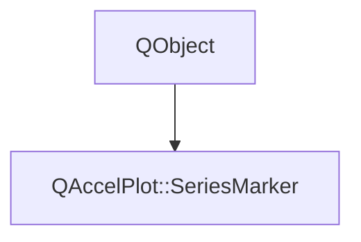

# Class QAccelPlot::SeriesMarker


[**ClassList**](annotated.md) **>** [**QAccelPlot**](namespaceQAccelPlot.md) **>** [**SeriesMarker**](classQAccelPlot_1_1SeriesMarker.md)


_Controls the markers a series draws at its data points._ [More...](#detailed-description)

* `#include <SeriesMarker.hpp>`


Inherits the following classes: QObject


## Inheritance diagram




## Public Types

| Type | Name |
| ---: | :--- |
| enum  | [**NoneShape**](#enum-noneshape)  <br>_Whether_ `MarkerShape.None` _is a valid shape for the owning series._ |


## Public Properties

| Type | Name |
| ---: | :--- |
| property bool | [**filled**](classQAccelPlot_1_1SeriesMarker.md#property-filled-12)  <br>_Whether closed marker shapes are filled. When_ `false` _they are drawn as outlines of_`strokeWidth` _inside the shape's edge. Line-like shapes (_`Cross` _,_`XCross` _,_`Asterisk` _,_`HLine` _,_`VLine` _) and_`Pixel` _are unaffected. Default:_`true` _._ |
| property QML\_ANONYMOUSPlotSeries::MarkerShape | [**shape**](classQAccelPlot_1_1SeriesMarker.md#property-shape-12)  <br>_Shape drawn at each data point. Series that always draw markers, such as_ `PointCloud` _, ignore_`MarkerShape.None` _and log a warning. Default:_`None` _on_`LineCurve` _,_`Circle` _on_`PointCloud` _._ |
| property qreal | [**size**](classQAccelPlot_1_1SeriesMarker.md#property-size-12)  <br>_Radius of each marker in pixels, clamped to at least 0. Default: 4 on_ `LineCurve` _, 3 on_`PointCloud` _._ |
| property qreal | [**strokeWidth**](classQAccelPlot_1_1SeriesMarker.md#property-strokewidth-12)  <br>_Outline width in pixels of hollow markers, clamped to at least 0. Has effect only when_ `filled` _is_`false` _. Default: 1._ |


## Public Signals

| Type | Name |
| ---: | :--- |
| signal void | [**filledChanged**](classQAccelPlot_1_1SeriesMarker.md#signal-filledchanged)  <br>_Emitted when the filled property changes._  |
| signal void | [**shapeChanged**](classQAccelPlot_1_1SeriesMarker.md#signal-shapechanged)  <br>_Emitted when the shape property changes._  |
| signal void | [**sizeChanged**](classQAccelPlot_1_1SeriesMarker.md#signal-sizechanged)  <br>_Emitted when the size property changes._  |
| signal void | [**strokeWidthChanged**](classQAccelPlot_1_1SeriesMarker.md#signal-strokewidthchanged)  <br>_Emitted when the strokeWidth property changes._  |


## Public Functions

| Type | Name |
| ---: | :--- |
|   | [**SeriesMarker**](#function-seriesmarker) ([**PlotSeries::MarkerShape**](classQAccelPlot_1_1PlotSeries.md#enum-markershape) shape, qreal size, [**NoneShape**](classQAccelPlot_1_1SeriesMarker.md#enum-noneshape) noneShape, QObject \* parent) <br>_Constructs a_ [_**SeriesMarker**_](classQAccelPlot_1_1SeriesMarker.md) _with the default__shape_ _and__size_ _, owned by__parent_ _._ |
|  bool | [**filled**](#function-filled-22) () const<br>_Returns_ `true` _if closed marker shapes are filled._ |
|  void | [**setFilled**](#function-setfilled) (bool filled) <br>_Sets whether closed marker shapes are filled (_ _filled_ _) or drawn as outlines._ |
|  void | [**setShape**](#function-setshape) ([**PlotSeries::MarkerShape**](classQAccelPlot_1_1PlotSeries.md#enum-markershape) shape) <br>_Sets the marker shape to_ _shape_ _._`MarkerShape.None` _is ignored when the series rejects it._ |
|  void | [**setSize**](#function-setsize) (qreal size) <br>_Sets the marker radius to_ _size_ _pixels. Negative values are clamped to 0._ |
|  void | [**setStrokeWidth**](#function-setstrokewidth) (qreal width) <br>_Sets the outline width of hollow markers to_ _width_ _pixels. Negative values are clamped to 0._ |
|  [**PlotSeries::MarkerShape**](classQAccelPlot_1_1PlotSeries.md#enum-markershape) | [**shape**](#function-shape-22) () const<br>_Returns the marker shape._  |
|  qreal | [**size**](#function-size-22) () const<br>_Returns the marker radius in pixels._  |
|  qreal | [**strokeWidth**](#function-strokewidth-22) () const<br>_Returns the outline width of hollow markers in pixels._  |


## Detailed Description


Accessible via the `marker` CONSTANT grouped property of `LineCurve` and `PointCloud`, for example `marker.shape:  QAccelPlot.LineCurve.Diamond`. Defaults depend on the owning series.


**See also:** [**LineCurve**](classQAccelPlot_1_1LineCurve.md), [**PointCloud**](classQAccelPlot_1_1PointCloud.md) 


    
## Public Types Documentation


### enum NoneShape {#enum-noneshape}

_Whether_ `MarkerShape.None` _is a valid shape for the owning series._
```C++
enum QAccelPlot::SeriesMarker::NoneShape {
    Accepted,
    Rejected
};
```


<hr>
## Public Properties Documentation


### property filled {#property-filled-12}

_Whether closed marker shapes are filled. When_ `false` _they are drawn as outlines of_`strokeWidth` _inside the shape's edge. Line-like shapes (_`Cross` _,_`XCross` _,_`Asterisk` _,_`HLine` _,_`VLine` _) and_`Pixel` _are unaffected. Default:_`true` _._
```C++
bool QAccelPlot::SeriesMarker::filled;
```


<hr>


### property shape {#property-shape-12}

_Shape drawn at each data point. Series that always draw markers, such as_ `PointCloud` _, ignore_`MarkerShape.None` _and log a warning. Default:_`None` _on_`LineCurve` _,_`Circle` _on_`PointCloud` _._
```C++
QML_ANONYMOUSPlotSeries::MarkerShape QAccelPlot::SeriesMarker::shape;
```


<hr>


### property size {#property-size-12}

_Radius of each marker in pixels, clamped to at least 0. Default: 4 on_ `LineCurve` _, 3 on_`PointCloud` _._
```C++
qreal QAccelPlot::SeriesMarker::size;
```


<hr>


### property strokeWidth {#property-strokewidth-12}

_Outline width in pixels of hollow markers, clamped to at least 0. Has effect only when_ `filled` _is_`false` _. Default: 1._
```C++
qreal QAccelPlot::SeriesMarker::strokeWidth;
```


<hr>
## Public Signals Documentation


### signal filledChanged {#signal-filledchanged}

_Emitted when the filled property changes._ 
```C++
void QAccelPlot::SeriesMarker::filledChanged;
```


<hr>


### signal shapeChanged {#signal-shapechanged}

_Emitted when the shape property changes._ 
```C++
void QAccelPlot::SeriesMarker::shapeChanged;
```


<hr>


### signal sizeChanged {#signal-sizechanged}

_Emitted when the size property changes._ 
```C++
void QAccelPlot::SeriesMarker::sizeChanged;
```


<hr>


### signal strokeWidthChanged {#signal-strokewidthchanged}

_Emitted when the strokeWidth property changes._ 
```C++
void QAccelPlot::SeriesMarker::strokeWidthChanged;
```


<hr>
## Public Functions Documentation


### function SeriesMarker {#function-seriesmarker}

_Constructs a_ [_**SeriesMarker**_](classQAccelPlot_1_1SeriesMarker.md) _with the default__shape_ _and__size_ _, owned by__parent_ _._
```C++
QAccelPlot::SeriesMarker::SeriesMarker (
    PlotSeries::MarkerShape shape,
    qreal size,
    NoneShape noneShape,
    QObject * parent
) 
```


<hr>


### function filled {#function-filled-22}

_Returns_ `true` _if closed marker shapes are filled._
```C++
bool QAccelPlot::SeriesMarker::filled () const
```


<hr>


### function setFilled {#function-setfilled}

_Sets whether closed marker shapes are filled (_ _filled_ _) or drawn as outlines._
```C++
void QAccelPlot::SeriesMarker::setFilled (
    bool filled
) 
```


<hr>


### function setShape {#function-setshape}

_Sets the marker shape to_ _shape_ _._`MarkerShape.None` _is ignored when the series rejects it._
```C++
void QAccelPlot::SeriesMarker::setShape (
    PlotSeries::MarkerShape shape
) 
```


<hr>


### function setSize {#function-setsize}

_Sets the marker radius to_ _size_ _pixels. Negative values are clamped to 0._
```C++
void QAccelPlot::SeriesMarker::setSize (
    qreal size
) 
```


<hr>


### function setStrokeWidth {#function-setstrokewidth}

_Sets the outline width of hollow markers to_ _width_ _pixels. Negative values are clamped to 0._
```C++
void QAccelPlot::SeriesMarker::setStrokeWidth (
    qreal width
) 
```


<hr>


### function shape {#function-shape-22}

_Returns the marker shape._ 
```C++
PlotSeries::MarkerShape QAccelPlot::SeriesMarker::shape () const
```


<hr>


### function size {#function-size-22}

_Returns the marker radius in pixels._ 
```C++
qreal QAccelPlot::SeriesMarker::size () const
```


<hr>


### function strokeWidth {#function-strokewidth-22}

_Returns the outline width of hollow markers in pixels._ 
```C++
qreal QAccelPlot::SeriesMarker::strokeWidth () const
```


<hr>

------------------------------
The documentation for this class was generated from the following file `QAccelPlot/src/QAccelPlot/series/SeriesMarker.hpp`

