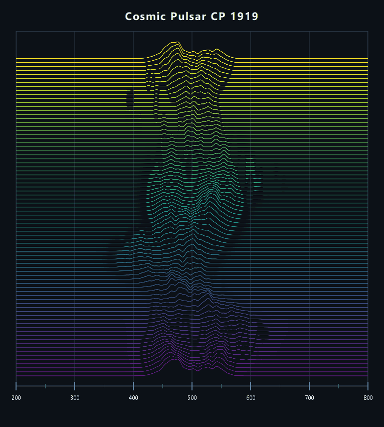
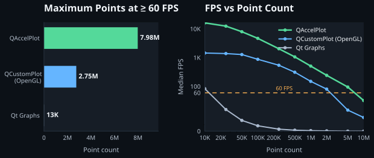

# QAccelPlot

<p align="left">
  <a href="https://github.com/michalgrabarczyk/QAccelPlot/actions/workflows/ci.yml"></a>
  <a href="https://michalgrabarczyk.github.io/QAccelPlot/"></a>
  
  
  <a href="#licensing"></a>
</p>

**QAccelPlot** is a high-performance, interactive 2D plotting library for
**Qt Quick (QML & C++)**. Powered directly by the Qt Scene Graph (QSG) and
GPU shaders, it can render **millions of points at 60+ FPS**
without downsampling or level-of-detail (LOD) reduction.

---

<div align="center">
  
  <br />
  <sub><a href="examples/pulsar_showcase/">Explore the Cosmic Pulsar example</a></sub>
</div>

## 💡 Why It Exists

QAccelPlot began with a practical need: a plot that worked cleanly with QML
layouts and property bindings while remaining responsive with large,
continuously updated datasets. None of the options I tried offered that
combination.

## ⚡ Highlights

- **GPU-Accelerated**: Capable of rendering millions of points at display refresh rate using shaders (OpenGL, Direct3D 11/12, Vulkan, Metal).
- **Interactive by Default**: Built-in panning, cursor-centered and axis-specific zoom, hover detection, and data-anchored annotations.
- **QML Integration**: Compose clean, declarative plot layouts with simple Qt Quick property bindings.
- **Efficient C++ Data Ingestion**: Stream data buffers from worker threads without blocking the UI.
- **Modern Visual Styling**: Hardware gradient fills, gradient strokes, dashes, markers, and smooth animated morph/draw transitions.

---

## 📊 Performance at a Glance

QAccelPlot is designed for large datasets that change continuously. The
benchmark below compares how many points QAccelPlot, Qt Graphs, and QCustomPlot
can replace and render each frame while sustaining 60 FPS on the same system.
QAccelPlot achieves this throughput by combining GPU vertex caching, native
data paths, and shaders to minimize per-frame overhead.



<sub>Measured on NVIDIA GeForce GTX 970 / AMD Ryzen 9 5900X / Windows 10 Pro with Qt 6.11.2 and OpenGL. Each frame replaces the complete dataset. [Read full benchmark setup & methodology →](https://michalgrabarczyk.github.io/QAccelPlot/performance-comparison/)</sub>

### Architectural Comparison

| Feature / Metric | **QAccelPlot** | **Qt Graphs** | **QCustomPlot** |
| :--- | :--- | :--- | :--- |
| **Rendering Backend** | **Qt Scene Graph** | Qt Scene Graph | QWidget paint buffers (optional OpenGL) |
| **Qt Quick / QML Native** | **Yes** — Native `QQuickItem` | Yes | No (QWidget-based) |
| **60 FPS Dataset Capacity**\* | **Up to ~8M–10M points** | ~13K points | ~2.75M (OpenGL) / ~100K (CPU) |
| **Data Ingestion Options** | **QML, bulk vector, move-optimized, cached** | Property bindings / list replace | Bulk vector / key-value copies |
| **Shaders & Transitions** | **GPU shaders, morphing & fills** | Built-in series styling | Library styling; no QML-native transitions |

<sub>* Point capacity varies with hardware. Figures shown reflect measurements on the [benchmark reference system](https://michalgrabarczyk.github.io/QAccelPlot/performance-comparison/).</sub>

---

## 🚀 Using QAccelPlot

### 1. Declare the Plot in QML

```qml
import QtQuick
import QAccelPlot as QAccelPlot

QAccelPlot.Plot {
    id: plot
    anchors.fill: parent

    xAxis: QAccelPlot.Axis {
        viewportMin: 0; viewportMax: 10
        side: QAccelPlot.Axis.Bottom; label: "Time (s)"
    }

    yAxis: QAccelPlot.Axis {
        viewportMin: -1.2; viewportMax: 1.2
        side: QAccelPlot.Axis.Left; label: "Amplitude"
    }

    QAccelPlot.LineCurve {
        objectName: "curve"
        xAxis: plot.xAxis
        yAxis: plot.yAxis
        color: "darkorange"
        lineWidth: 2
    }
}
```

The plot supports panning and cursor-centered zoom out of the box.

### 2. Set Data from C++

```cpp
auto* curve = root->findChild<QAccelPlot::LineCurve*>("curve");
const std::vector<double> times { 0, 2.5, 5, 7.5, 10 };
const std::vector<double> amplitudes { 0, 0.8, -0.6, 0.4, 0 };
curve->setData(times, amplitudes);
```

See the [Getting Started guide](https://michalgrabarczyk.github.io/QAccelPlot/getting-started/)
for complete instructions on integrating QAccelPlot into your project.
For maximum performance, see the
[Performance guide](https://michalgrabarczyk.github.io/QAccelPlot/performance/).

> [!NOTE]
> **Active Development (v0.1):** QAccelPlot is designed for production use, but its core API may still evolve before 1.0. Bug reports, compatibility notes, and feedback from real-world projects are very welcome.

---

## 🎨 Example Showcase

Explore runnable applications in the [`examples/`](examples/) directory:

| Example | Description |
| :--- | :--- |
| **[Cosmic Pulsar](examples/pulsar_showcase/)** | Animated 80-ridge CP 1919 waterfall demonstrating dense line rendering, antialiasing, and background data generation. |
| **[Realtime](examples/realtime/)** | High-frequency scrolling vibration sensor with a synchronized 20-second sliding window. |
| **[Performance Showcase](examples/performance_showcase/)** | Interactive stress test rendering up to 10M+ points with live FPS counters. |
| **[Styling & Transitions](examples/styling_and_transitions/)** | Gradient fills, stroke styles, markers, and animated data morphing transitions. |
| **[Interactive Tools](examples/interactive_tools/)** | Distance rulers, angle tools, rectangular selection, and point markers. |
| **[Custom Axis](examples/custom_axis/)** | Multi-lead ECG layouts, multi-rate waveforms, and logarithmic frequency spectra. |
| **[Axis Formats](examples/axis_formats/)** | Category, logarithmic, and date-time tick label formatters. |
| **[Annotations](examples/annotations/)** | Dynamic callouts and overlays anchored directly to data coordinates. |
| **[Quickstart](examples/quickstart/)** | Minimal standalone setup demonstrating basic plot configuration. |

---

## 🧪 Testing

QAccelPlot uses complementary test layers to catch different kinds of
regressions:

- **[Unit tests](.github/workflows/ci.yml)** cover core plotting behavior, data
  handling, axes, formatting, styling, interactions, and transitions.
- **[Performance regression benchmarks](.github/workflows/benchmark.yml)**
  help catch regressions in data-ingestion and rendering performance.
- **[Visual acceptance tests](.github/workflows/ai-regression.yml)** render
  every example across multiple Qt versions and graphics backends, using
  contract-driven AI inspection to detect visible regressions.

The visual test matrix spans Qt 6.2, 6.8, and 6.11 on OpenGL, Vulkan,
Direct3D 11/12, and Metal.

---

## 🛠️ Building from Source

### Requirements

- **CMake** 3.16 or newer
- **C++17** compatible compiler
- **Qt 6.2 or newer** with `Core`, `Gui`, `Quick`, and `ShaderTools`
- The matching `QuickPrivate` component for the default optimized build; it is
  optional when `QACCELPLOT_USE_QT_PRIVATE_API=OFF`
- A hardware-accelerated Qt Quick Scene Graph backend (OpenGL, Direct3D 11/12, Vulkan, or Metal)

QAccelPlot currently builds as a static library. To build the library and
examples:

```sh
# Configure with examples enabled
cmake -S . -B build -DCMAKE_BUILD_TYPE=Release -DQACCELPLOT_BUILD_EXAMPLES=ON

# Build library and examples
cmake --build build --config Release

# Run tests
ctest --test-dir build --output-on-failure
```

The optimized Qt Quick private-API path is enabled when available. Configure
with `-DQACCELPLOT_USE_QT_PRIVATE_API=OFF` for a public-only build; see
[Texture upload modes](docs/guide/performance.md#select-the-texture-upload-mode).

---

## 📖 Documentation

Complete guides, architectural deep-dives, and API references are hosted online:

- 🚀 **[Getting Started](https://michalgrabarczyk.github.io/QAccelPlot/getting-started/)** — Step-by-step installation and first plot.
- 🏗️ **[Concepts & Architecture](https://michalgrabarczyk.github.io/QAccelPlot/concepts/)** — Understanding Qt Scene Graph integration and data flow.
- ⚡ **[Performance Guide](https://michalgrabarczyk.github.io/QAccelPlot/performance/)** — Buffer management, efficient handoffs, and benchmarking.
- 🍳 **[Cookbook & Recipes](https://michalgrabarczyk.github.io/QAccelPlot/cookbook/)** — Focused solutions for multi-axis plots, real-time feeds, and custom styles.
- ❓ **[FAQ](https://michalgrabarczyk.github.io/QAccelPlot/faq/)** — Common questions on threading, licensing, and backends.
- 📚 **[API Reference](https://michalgrabarczyk.github.io/QAccelPlot/api/)** — Comprehensive class, property, and method documentation.

---

## 🗺️ Road to 1.0

Before the 1.0 release, the main priorities are:

- Point-cloud series for large collections of unconnected points.
- Bar charts for categorical data.
- Heatmaps for visualizing scalar values on a 2D grid.
- SVG and PNG export.
- Support for gaps and invalid samples in plotted data.
- Box zoom and configurable pan and zoom limits for each axis.
- Touch interaction, including panning and pinch zoom.

The roadmap may evolve based on feedback. Suggestions are welcome through
[GitHub Issues](https://github.com/michalgrabarczyk/QAccelPlot/issues).

---

## 🤝 Contributing & Feedback

Bug reports, feature requests, compatibility notes, and user experiences are
very welcome. Please share them through
[GitHub Issues](https://github.com/michalgrabarczyk/QAccelPlot/issues). Pull
requests are not currently accepted; see [CONTRIBUTING.md](CONTRIBUTING.md) for
more information.

---

## 📄 Licensing

QAccelPlot is available under a **dual-licensing model**:

1. **Open-Source License:** GNU General Public License v3.0 only with the **Universal FOSS Exception**. Qualifying applications distributed under an OSI-approved or FSF-free software license (e.g. MIT, BSD, Apache 2.0, LGPL) may link with QAccelPlot while retaining their own open-source license.
2. **Commercial License:** Separate commercial terms for embedding QAccelPlot in proprietary or closed-source commercial applications without GPL requirements.

📧 For commercial licensing inquiries, contact: **[qaccelplot@gmail.com](mailto:qaccelplot@gmail.com)**

| Intended Use Case | Open-Source (GPLv3 + FOSS Exception) | Commercial License |
| :--- | :--- | :--- |
| **GPLv3 Application** | ✅ Permitted under GPLv3 | Not required |
| **Qualifying FOSS (MIT, BSD, Apache, LGPL, etc.)** | ✅ Permitted under Universal FOSS Exception | Not required |
| **Commercial FOSS Product (Charging fee for FOSS)** | ✅ Permitted (Charging does not make software proprietary) | Not required |
| **Proprietary / Closed-Source Distributed Product** | ❌ Not permitted | ✅ **Required** |
| **Private / Internal Enterprise Use (No distribution)** | ✅ Permitted under GPLv3 terms | Not required |
| **Server-Side / SaaS Use (No client distribution)** | ✅ Permitted (GPLv3 has no AGPL network-copyleft clause) | Not required |

For licensing details and links to the full license texts, see
[LICENSING.md](LICENSING.md).
