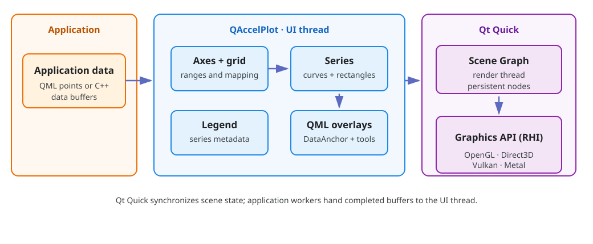

<!--
SPDX-FileCopyrightText: 2026 Michal Grabarczyk
SPDX-License-Identifier: GPL-3.0-only WITH Universal-FOSS-exception-1.0
-->

# Concepts and architecture

QAccelPlot separates plot composition, coordinate mapping, data ownership, and
rendering. Understanding those boundaries makes both QML composition and
high-rate C++ updates straightforward.

## Plot and PlotView

`PlotView` is the C++ plot container. It owns the plot area, lays out primary,
secondary, and extra axes, exposes coordinate conversion helpers, handles the
default pan and zoom behavior, and discovers series added as child items.

`Plot` is the convenient QML wrapper used by most applications. It adds a
`Legend` and the `legendVisible` property while retaining the complete
`PlotView` interface.

The plot rectangle is available as [`plotRect`][plot-rect]. It excludes the space reserved
for axes and padding, and is useful when placing clipped overlays or custom
tools above the data.

## Axes and ranges

An `Axis` has two related ranges:

- The **viewport range** ([`viewportMin`][viewport-min], [`viewportMax`][viewport-max]) is currently visible.
- The **data range** ([`dataMin`][data-min], [`dataMax`][data-max]) describes the extent reported by
  attached series.

Panning and zooming change the viewport. Calling [`rescaleToData()`][rescale-to-data] copies the
current data range into the viewport. A series reports its extent through the
axes assigned to its [`xAxis`][series-x-axis] and [`yAxis`][series-y-axis] properties.

The primary axes are [`xAxis`][plot-x-axis] and [`yAxis`][plot-y-axis].
[`x2Axis`][plot-x2-axis] and [`y2Axis`][plot-y2-axis] provide the opposite
sides, while [`extraAxes`][extra-axes] supports additional independently scaled
axes. Each series explicitly selects the axes it uses.

`AxisTicker` controls tick count, subticks, lengths, colors, fonts, rotation,
and label formatting. Built-in formatters cover numeric, date/time,
logarithmic, and categorical labels. A `TickLabelFormatter` can also invoke a
JavaScript callback for application-specific labels.

## Series

`PlotSeries` contains the properties shared by data-bearing items: its name,
axes, plot rectangle, and legend symbol.

`LineCurve` renders a line, optional point markers, line styles, gradients, and
fills. It stores points internally as interleaved floats. Data can arrive from
QML for convenience or through C++ buffer APIs for high throughput.

`RectangleList` renders a set of data-space rectangles and reports its hovered
rectangle index. It is useful for ranges, events, bars, or large collections of
simple rectangular shapes.

## Composition and overlays

The grid and series render within the plot, while ordinary QML items can be
placed above them. `DataAnchor` maps one or two data coordinates into a QML
item's geometry, allowing labels, event lines, regions, and drag handles to
remain attached to the data while the user pans or zooms.

For more specialized interaction, `PlotView` provides [`dataToPixelX()`][data-to-pixel-x],
[`dataToPixelY()`][data-to-pixel-y], [`pixelToDataX()`][pixel-to-data-x],
[`pixelToDataY()`][pixel-to-data-y], and [`isInsidePlotArea()`][is-inside-plot-area].
Plot mouse events can be accepted by a custom tool to
prevent the default pan behavior.

## Rendering and threads

Qt Quick owns the scene. QML objects and public setters normally run on the UI
thread, while Qt synchronizes scene state to the Scene Graph render thread.
QAccelPlot curve renderers create persistent Scene Graph nodes and use
precompiled shaders for the active graphics API.

The software Qt Quick backend cannot execute QAccelPlot's custom curve shaders.
Data production may happen on a worker thread, but UI objects must not be
mutated directly from that worker. Use [`LineCurve::postData()`][post-data] or queue the
handoff to the UI thread. See [Background data production](cookbook/background-data.md).

## Where to find detail

- Use this guide for workflows and design decisions.
- Use the [Cookbook](cookbook/index.md) for complete patterns.
- Use the [API reference](api.md) for individual properties, methods, and enums.
- Use the repository's
  [`examples`](https://github.com/michalgrabarczyk/QAccelPlot/tree/main/examples)
  for runnable applications.

[plot-rect]: ../api/classQAccelPlot_1_1QAccelPlot.html#ad8106ed7a0613158e29ed0137edbd248
[viewport-min]: ../api/classQAccelPlot_1_1Axis.html#a7dc4f6741ca21456941ee90ca647fcbe
[viewport-max]: ../api/classQAccelPlot_1_1Axis.html#ae7112f0aac515a9fad256f21696f3e31
[data-min]: ../api/classQAccelPlot_1_1Axis.html#a7ff8bbf8f594cce69d3a56c9b7f7dc25
[data-max]: ../api/classQAccelPlot_1_1Axis.html#ab9a1549ca7fa37509039903052111c85
[rescale-to-data]: ../api/classQAccelPlot_1_1Axis.html#a1a4057e12caae2776590a0ce4bc38a84
[series-x-axis]: ../api/classQAccelPlot_1_1PlotSeries.html#a250150d8eaea44c2608375839747b2b2
[series-y-axis]: ../api/classQAccelPlot_1_1PlotSeries.html#ae021f84424e1ea4ad44576961ac7d402
[plot-x-axis]: ../api/classQAccelPlot_1_1QAccelPlot.html#a08bb4bde1c498ad50fdfa8e48d41adf7
[plot-y-axis]: ../api/classQAccelPlot_1_1QAccelPlot.html#af489c97d929d1092be24f0e780c06a83
[plot-x2-axis]: ../api/classQAccelPlot_1_1QAccelPlot.html#a8fd3ea82835224ee95f3c4ec4bd78ff8
[plot-y2-axis]: ../api/classQAccelPlot_1_1QAccelPlot.html#ab940a26d0902b92808a8ee0885cb7455
[extra-axes]: ../api/classQAccelPlot_1_1QAccelPlot.html#a2aa8566edaee068e3517f5085fe9276b
[data-to-pixel-x]: ../api/classQAccelPlot_1_1QAccelPlot.html#a64aa564d1fae3a901d22897b8c70d514
[data-to-pixel-y]: ../api/classQAccelPlot_1_1QAccelPlot.html#af6e974159b9a04649636768ff923d797
[pixel-to-data-x]: ../api/classQAccelPlot_1_1QAccelPlot.html#a484d049dd7188040e0c450bb9590ac0c
[pixel-to-data-y]: ../api/classQAccelPlot_1_1QAccelPlot.html#abd81402f2c90d2287bb1ca41f1a35e49
[is-inside-plot-area]: ../api/classQAccelPlot_1_1QAccelPlot.html#a4d3dc663c405407222f8e1dcac3294f2
[post-data]: ../api/classQAccelPlot_1_1LineCurve.html#a8b3d0effe4bd115f091ad505a7787b2c
