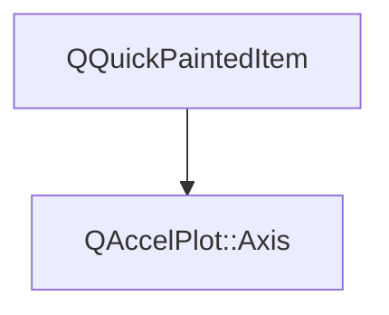

# Class QAccelPlot::Axis


[**ClassList**](annotated.md) **>** [**QAccelPlot**](namespaceQAccelPlot.md) **>** [**Axis**](classQAccelPlot_1_1Axis.md)


_A visual axis item that maps a data-space range to pixel coordinates and renders tick marks and labels._ [More...](#detailed-description)

* `#include <Axis.hpp>`


Inherits the following classes: QQuickPaintedItem


## Inheritance diagram




## Public Types

| Type | Name |
| ---: | :--- |
| enum  | [**Orientation**](#enum-orientation)  <br>_Orientation of an axis._  |
| enum  | [**Side**](#enum-side)  <br>_Side of the plot on which the axis is positioned._  |


## Public Slots

| Type | Name |
| ---: | :--- |
| slot void | [**updateDataRange**](classQAccelPlot_1_1Axis.md#slot-updatedatarange) (qreal min, qreal max) <br>_Replaces the tracked data range._  |


## Public Properties

| Type | Name |
| ---: | :--- |
| property int | [**axisLinePadding**](classQAccelPlot_1_1Axis.md#property-axislinepadding-12)  <br>_Pixels of padding between the plot area edge and the axis baseline. Default: 0._  |
| property int | [**axisTitlePadding**](classQAccelPlot_1_1Axis.md#property-axistitlepadding-12)  <br>_Pixels of padding between the axis line and the title text. Default: 30._  |
| property QColor | [**baselineColor**](classQAccelPlot_1_1Axis.md#property-baselinecolor-12)  <br>_Color of the axis baseline. Default:_ `Qt::black` _._ |
| property qreal | [**baselineWidth**](classQAccelPlot_1_1Axis.md#property-baselinewidth-12)  <br>_Width in pixels of the axis baseline. Default: 2._  |
| property qreal | [**dataMax**](classQAccelPlot_1_1Axis.md#property-datamax-12)  <br>_Maximum data value seen by the curves bound to this axis. Default: 1._  |
| property qreal | [**dataMin**](classQAccelPlot_1_1Axis.md#property-datamin-12)  <br>_Minimum data value seen by the curves bound to this axis. Default: 0._  |
| property QColor | [**hoverColor**](classQAccelPlot_1_1Axis.md#property-hovercolor-12)  <br>_Tick and label color applied when the axis is hovered. Default:_ `Qt::blue` _._ |
| property bool | [**hovered**](classQAccelPlot_1_1Axis.md#property-hovered-12)  <br>_Read-only:_ `true` _while the mouse cursor is over the axis widget._ |
| property QString | [**label**](classQAccelPlot_1_1Axis.md#property-label-12)  <br>_Optional axis label displayed alongside the axis line._  |
| property QColor | [**labelColor**](classQAccelPlot_1_1Axis.md#property-labelcolor-12)  <br>_Optional axis-label color. When invalid, the baselineColor is used._  |
| property QFont | [**labelFont**](classQAccelPlot_1_1Axis.md#property-labelfont-12)  <br>_Font used to render the axis label text. Default: application default font._  |
| property qreal | [**layoutSize**](classQAccelPlot_1_1Axis.md#property-layoutsize-12)  <br>_Layout thickness in pixels: width for vertical axes and height for horizontal axes. Default: 50._  |
| property bool | [**logScale**](classQAccelPlot_1_1Axis.md#property-logscale-12)  <br>_Whether the axis uses a base-10 logarithmic scale. Default:_ `false` _._ |
| property [**Orientation**](classQAccelPlot_1_1Axis.md#enum-orientation) | [**orientation**](classQAccelPlot_1_1Axis.md#property-orientation-12)  <br>[_**Axis**_](classQAccelPlot_1_1Axis.md) _orientation:_`Axis.Horizontal` _or_`Axis.Vertical` _._ |
| property [**Side**](classQAccelPlot_1_1Axis.md#enum-side) | [**side**](classQAccelPlot_1_1Axis.md#property-side-12)  <br>_Side of the plot on which the axis is drawn: Left, Top, Right, or Bottom. Assigned automatically for xAxis, yAxis, x2Axis, and y2Axis; set explicitly for an axis placed in extraAxes._  |
| property [**AxisTicker**](classQAccelPlot_1_1AxisTicker.md) \* | [**ticker**](classQAccelPlot_1_1Axis.md#property-ticker-12)  <br>_Read-only constant: tick appearance configuration object._  |
| property qreal | [**viewportMax**](classQAccelPlot_1_1Axis.md#property-viewportmax-12)  <br>_Upper bound of the visible range. Default: 1._  |
| property qreal | [**viewportMin**](classQAccelPlot_1_1Axis.md#property-viewportmin-12)  <br>_Lower bound of the visible range. Default: 0._  |
| property double | [**zoomScaleFactor**](classQAccelPlot_1_1Axis.md#property-zoomscalefactor-12)  <br>_Fraction by which the visible range is multiplied on each inward mouse-wheel step. Must be in (0, 1). Default: 0.9._  |


## Public Signals

| Type | Name |
| ---: | :--- |
| signal void | [**axisLinePaddingChanged**](classQAccelPlot_1_1Axis.md#signal-axislinepaddingchanged)  <br>_Emitted when the axisLinePadding property changes._  |
| signal void | [**axisTitlePaddingChanged**](classQAccelPlot_1_1Axis.md#signal-axistitlepaddingchanged)  <br>_Emitted when the axisTitlePadding property changes._  |
| signal void | [**baselineColorChanged**](classQAccelPlot_1_1Axis.md#signal-baselinecolorchanged)  <br>_Emitted when the baselineColor property changes._  |
| signal void | [**baselineWidthChanged**](classQAccelPlot_1_1Axis.md#signal-baselinewidthchanged)  <br>_Emitted when the baselineWidth property changes._  |
| signal void | [**dataMaxChanged**](classQAccelPlot_1_1Axis.md#signal-datamaxchanged)  <br>_Emitted when the dataMax property changes._  |
| signal void | [**dataMinChanged**](classQAccelPlot_1_1Axis.md#signal-dataminchanged)  <br>_Emitted when the dataMin property changes._  |
| signal void | [**doubleClicked**](classQAccelPlot_1_1Axis.md#signal-doubleclicked)  <br>_Emitted when the user double-clicks the axis widget._  |
| signal void | [**hoverColorChanged**](classQAccelPlot_1_1Axis.md#signal-hovercolorchanged)  <br>_Emitted when the hoverColor property changes._  |
| signal void | [**hoveredChanged**](classQAccelPlot_1_1Axis.md#signal-hoveredchanged)  <br>_Emitted when the hovered property changes._  |
| signal void | [**labelChanged**](classQAccelPlot_1_1Axis.md#signal-labelchanged)  <br>_Emitted when the label property changes._  |
| signal void | [**labelColorChanged**](classQAccelPlot_1_1Axis.md#signal-labelcolorchanged)  <br>_Emitted when the labelColor property changes._  |
| signal void | [**labelFontChanged**](classQAccelPlot_1_1Axis.md#signal-labelfontchanged)  <br>_Emitted when the labelFont property changes._  |
| signal void | [**layoutSizeChanged**](classQAccelPlot_1_1Axis.md#signal-layoutsizechanged)  <br>_Emitted when the layoutSize property changes._  |
| signal void | [**logScaleChanged**](classQAccelPlot_1_1Axis.md#signal-logscalechanged)  <br>_Emitted when the logScale property changes._  |
| signal void | [**orientationChanged**](classQAccelPlot_1_1Axis.md#signal-orientationchanged)  <br>_Emitted when the orientation property changes._  |
| signal void | [**rangeChanged**](classQAccelPlot_1_1Axis.md#signal-rangechanged)  <br>_Emitted when either viewportMin or viewportMax changes._  |
| signal void | [**sideChanged**](classQAccelPlot_1_1Axis.md#signal-sidechanged)  <br>_Emitted when the side property changes._  |
| signal void | [**viewportMaxChanged**](classQAccelPlot_1_1Axis.md#signal-viewportmaxchanged)  <br>_Emitted when the viewportMax property changes._  |
| signal void | [**viewportMinChanged**](classQAccelPlot_1_1Axis.md#signal-viewportminchanged)  <br>_Emitted when the viewportMin property changes._  |
| signal void | [**zoomScaleFactorChanged**](classQAccelPlot_1_1Axis.md#signal-zoomscalefactorchanged)  <br>_Emitted when the zoomScaleFactor property changes._  |


## Public Functions

| Type | Name |
| ---: | :--- |
|   | [**Axis**](#function-axis) (QQuickItem \* parent=nullptr, [**Side**](classQAccelPlot_1_1Axis.md#enum-side) side=Bottom) <br>_Constructs an_ [_**Axis**_](classQAccelPlot_1_1Axis.md) _with the given__parent_ _and initial__side_ _._ |
|  int | [**axisLinePadding**](#function-axislinepadding-22) () const<br>_Returns the axis line padding in pixels._  |
|  int | [**axisTitlePadding**](#function-axistitlepadding-22) () const<br>_Returns the axis title padding in pixels._  |
|  QColor | [**baselineColor**](#function-baselinecolor-22) () const<br>_Returns the axis baseline color._  |
|  qreal | [**baselineWidth**](#function-baselinewidth-22) () const<br>_Returns the axis baseline width in pixels._  |
|  qreal | [**coordToPixel**](#function-coordtopixel) (qreal value, qreal length) const<br>_Maps a data-space_ _value_ _to a pixel position along an axis of__length_ _pixels._ |
|  qreal | [**dataMax**](#function-datamax-22) () const<br>_Returns the maximum data value tracked by bound curves._  |
|  qreal | [**dataMin**](#function-datamin-22) () const<br>_Returns the minimum data value tracked by bound curves._  |
|  QColor | [**hoverColor**](#function-hovercolor-22) () const<br>_Returns the hovered tick/label color._  |
|  bool | [**hovered**](#function-hovered-22) () const<br>_Returns_ `true` _if the mouse is currently over the axis widget._ |
|  qreal | [**inwardTickOverlap**](#function-inwardtickoverlap) () const<br>_Returns the inward tick overlap beyond the axis line padding, used by PlotView to size the plot area._  |
|  QString | [**label**](#function-label-22) () const<br>_Returns the axis label string._  |
|  QColor | [**labelColor**](#function-labelcolor-22) () const<br>_Returns the axis-label color, or an invalid color when it follows baselineColor._  |
|  QFont | [**labelFont**](#function-labelfont-22) () const<br>_Returns the axis label font._  |
|  qreal | [**labelOverflow**](#function-labeloverflow) () const<br>_Returns extra width/height needed to accommodate edge tick labels that extend beyond the axis bounds._  |
|  qreal | [**layoutSize**](#function-layoutsize-22) () const<br>_Returns the layout thickness in pixels._  |
|  bool | [**logScale**](#function-logscale-22) () const<br>_Returns_ `true` _when log scale is active._ |
|  [**Orientation**](classQAccelPlot_1_1Axis.md#enum-orientation) | [**orientation**](#function-orientation-22) () const<br>_Returns the axis orientation._  |
|  void | [**paint**](#function-paint) (QPainter \* painter) override<br>_Paints the axis widget (tick marks, labels, label text, background)._  |
|  qreal | [**pixelToCoord**](#function-pixeltocoord) (qreal pos, qreal length) const<br>_Maps a pixel_ _pos_ _along an axis of__length_ _pixels back to a data-space value._ |
|  Q\_INVOKABLE void | [**rescaleToData**](#function-rescaletodata) () <br>_Sets_ `viewportMin` _and_`viewportMax` _to the current_`dataMin` _/_`dataMax` _range._ |
|  void | [**setAxisLinePadding**](#function-setaxislinepadding) (int padding) <br>_Sets the axis line padding to_ _padding_ _pixels._ |
|  void | [**setAxisTitlePadding**](#function-setaxistitlepadding) (int padding) <br>_Sets the axis title padding to_ _padding_ _pixels._ |
|  void | [**setBaselineColor**](#function-setbaselinecolor) (const QColor & c) <br>_Sets the axis baseline color to_ _c_ _._ |
|  void | [**setBaselineWidth**](#function-setbaselinewidth) (qreal width) <br>_Sets the axis baseline width to_ _width_ _pixels. Negative values are clamped to zero._ |
|  void | [**setDataMax**](#function-setdatamax) (qreal m) <br>_Sets the tracked data maximum to_ _m_ _._ |
|  void | [**setDataMin**](#function-setdatamin) (qreal m) <br>_Sets the tracked data minimum to_ _m_ _._ |
|  void | [**setHoverColor**](#function-sethovercolor) (const QColor & c) <br>_Sets the hovered color to_ _c_ _._ |
|  void | [**setLabel**](#function-setlabel) (const QString & t) <br>_Sets the axis label to_ _t_ _._ |
|  void | [**setLabelColor**](#function-setlabelcolor) (const QColor & c) <br>_Sets the axis-label color to_ _c_ _. An invalid color restores the baselineColor fallback._ |
|  void | [**setLabelFont**](#function-setlabelfont) (const QFont & f) <br>_Sets the axis label font to_ _f_ _._ |
|  void | [**setLayoutSize**](#function-setlayoutsize) (qreal size) <br>_Sets the layout thickness to_ _size_ _pixels. Negative values are clamped to zero._ |
|  void | [**setLogScale**](#function-setlogscale) (bool on) <br>_Sets log-scale mode to_ _on_ _._ |
|  void | [**setOrientation**](#function-setorientation) ([**Orientation**](classQAccelPlot_1_1Axis.md#enum-orientation) o) <br>_Sets the axis orientation to_ _o_ _._ |
|  void | [**setSide**](#function-setside) ([**Side**](classQAccelPlot_1_1Axis.md#enum-side) s) <br>_Sets the axis side to_ _s_ _._ |
|  void | [**setViewportMax**](#function-setviewportmax) (qreal m) <br>_Sets the upper bound of the visible range to_ _m_ _._ |
|  void | [**setViewportMin**](#function-setviewportmin) (qreal m) <br>_Sets the lower bound of the visible range to_ _m_ _._ |
|  void | [**setZoomScaleFactor**](#function-setzoomscalefactor) (double factor) <br>_Sets the zoom scale factor to_ _factor_ _(clamped to the range (0, 1))._ |
|  [**Side**](classQAccelPlot_1_1Axis.md#enum-side) | [**side**](#function-side-22) () const<br>_Returns the axis side._  |
|  [**AxisTicker**](classQAccelPlot_1_1AxisTicker.md) \* | [**ticker**](#function-ticker-22) () const<br>_Returns the tick configuration object._  |
|  Q\_INVOKABLE void | [**toggleLogScale**](#function-togglelogscale) () <br>_Toggles the log-scale mode on or off._  |
|  qreal | [**viewportMax**](#function-viewportmax-22) () const<br>_Returns the upper bound of the visible range._  |
|  qreal | [**viewportMin**](#function-viewportmin-22) () const<br>_Returns the lower bound of the visible range._  |
|  double | [**zoomScaleFactor**](#function-zoomscalefactor-22) () const<br>_Returns the zoom scale factor._  |


## Protected Functions

| Type | Name |
| ---: | :--- |
|  void | [**hoverEnterEvent**](#function-hoverenterevent) (QHoverEvent \* event) override<br> |
|  void | [**hoverLeaveEvent**](#function-hoverleaveevent) (QHoverEvent \* event) override<br> |
|  void | [**keyPressEvent**](#function-keypressevent) (QKeyEvent \* event) override<br> |
|  void | [**mouseDoubleClickEvent**](#function-mousedoubleclickevent) (QMouseEvent \* event) override<br> |
|  void | [**mouseMoveEvent**](#function-mousemoveevent) (QMouseEvent \* event) override<br> |
|  void | [**mousePressEvent**](#function-mousepressevent) (QMouseEvent \* event) override<br> |
|  void | [**mouseReleaseEvent**](#function-mousereleaseevent) (QMouseEvent \* event) override<br> |


## Detailed Description


Assign an [**Axis**](classQAccelPlot_1_1Axis.md) to the corresponding property of `PlotView` (`xAxis`, `yAxis`, etc.) to connect it to the plot. Tick appearance is configured via the `ticker` property. Supports linear and logarithmic scaling, mouse-driven pan/zoom, and custom label formatters. Set the inherited `visible` property to `false` to hide the axis and reclaim its layout space while preserving its range, coordinate mapping, and plot-wide navigation behavior.


**See also:** PlotView, [**AxisTicker**](classQAccelPlot_1_1AxisTicker.md), [**TickLabelFormatter**](classQAccelPlot_1_1TickLabelFormatter.md) 


    
## Public Types Documentation


### enum Orientation {#enum-orientation}

_Orientation of an axis._ 
```C++
enum QAccelPlot::Axis::Orientation {
    Horizontal,
    Vertical
};
```


<hr>


### enum Side {#enum-side}

_Side of the plot on which the axis is positioned._ 
```C++
enum QAccelPlot::Axis::Side {
    Left,
    Top,
    Right,
    Bottom
};
```


<hr>
## Public Properties Documentation


### property axisLinePadding {#property-axislinepadding-12}

_Pixels of padding between the plot area edge and the axis baseline. Default: 0._ 
```C++
int QAccelPlot::Axis::axisLinePadding;
```


<hr>


### property axisTitlePadding {#property-axistitlepadding-12}

_Pixels of padding between the axis line and the title text. Default: 30._ 
```C++
int QAccelPlot::Axis::axisTitlePadding;
```


<hr>


### property baselineColor {#property-baselinecolor-12}

_Color of the axis baseline. Default:_ `Qt::black` _._
```C++
QColor QAccelPlot::Axis::baselineColor;
```


<hr>


### property baselineWidth {#property-baselinewidth-12}

_Width in pixels of the axis baseline. Default: 2._ 
```C++
qreal QAccelPlot::Axis::baselineWidth;
```


<hr>


### property dataMax {#property-datamax-12}

_Maximum data value seen by the curves bound to this axis. Default: 1._ 
```C++
qreal QAccelPlot::Axis::dataMax;
```


<hr>


### property dataMin {#property-datamin-12}

_Minimum data value seen by the curves bound to this axis. Default: 0._ 
```C++
qreal QAccelPlot::Axis::dataMin;
```


<hr>


### property hoverColor {#property-hovercolor-12}

_Tick and label color applied when the axis is hovered. Default:_ `Qt::blue` _._
```C++
QColor QAccelPlot::Axis::hoverColor;
```


<hr>


### property hovered {#property-hovered-12}

_Read-only:_ `true` _while the mouse cursor is over the axis widget._
```C++
bool QAccelPlot::Axis::hovered;
```


<hr>


### property label {#property-label-12}

_Optional axis label displayed alongside the axis line._ 
```C++
QString QAccelPlot::Axis::label;
```


<hr>


### property labelColor {#property-labelcolor-12}

_Optional axis-label color. When invalid, the baselineColor is used._ 
```C++
QColor QAccelPlot::Axis::labelColor;
```


<hr>


### property labelFont {#property-labelfont-12}

_Font used to render the axis label text. Default: application default font._ 
```C++
QFont QAccelPlot::Axis::labelFont;
```


<hr>


### property layoutSize {#property-layoutsize-12}

_Layout thickness in pixels: width for vertical axes and height for horizontal axes. Default: 50._ 
```C++
qreal QAccelPlot::Axis::layoutSize;
```


<hr>


### property logScale {#property-logscale-12}

_Whether the axis uses a base-10 logarithmic scale. Default:_ `false` _._
```C++
bool QAccelPlot::Axis::logScale;
```


<hr>


### property orientation {#property-orientation-12}

[_**Axis**_](classQAccelPlot_1_1Axis.md) _orientation:_`Axis.Horizontal` _or_`Axis.Vertical` _._
```C++
Orientation QAccelPlot::Axis::orientation;
```


<hr>


### property side {#property-side-12}

_Side of the plot on which the axis is drawn: Left, Top, Right, or Bottom. Assigned automatically for xAxis, yAxis, x2Axis, and y2Axis; set explicitly for an axis placed in extraAxes._ 
```C++
Side QAccelPlot::Axis::side;
```


<hr>


### property ticker {#property-ticker-12}

_Read-only constant: tick appearance configuration object._ 
```C++
AxisTicker* QAccelPlot::Axis::ticker;
```


<hr>


### property viewportMax {#property-viewportmax-12}

_Upper bound of the visible range. Default: 1._ 
```C++
qreal QAccelPlot::Axis::viewportMax;
```


<hr>


### property viewportMin {#property-viewportmin-12}

_Lower bound of the visible range. Default: 0._ 
```C++
qreal QAccelPlot::Axis::viewportMin;
```


<hr>


### property zoomScaleFactor {#property-zoomscalefactor-12}

_Fraction by which the visible range is multiplied on each inward mouse-wheel step. Must be in (0, 1). Default: 0.9._ 
```C++
double QAccelPlot::Axis::zoomScaleFactor;
```


On a zoom-in step the range is multiplied by this value; on zoom-out by its reciprocal. Decrease the factor (e.g. 0.5) to zoom faster; increase it toward 1.0 (e.g. 0.95) to zoom more slowly. 


        

<hr>
## Public Slots Documentation


### slot updateDataRange {#slot-updatedatarange}

_Replaces the tracked data range._ 
```C++
void QAccelPlot::Axis::updateDataRange;
```


**Parameters:**


* `min` New minimum data value. 
* `max` New maximum data value. 


        

<hr>
## Public Signals Documentation


### signal axisLinePaddingChanged {#signal-axislinepaddingchanged}

_Emitted when the axisLinePadding property changes._ 
```C++
void QAccelPlot::Axis::axisLinePaddingChanged;
```


<hr>


### signal axisTitlePaddingChanged {#signal-axistitlepaddingchanged}

_Emitted when the axisTitlePadding property changes._ 
```C++
void QAccelPlot::Axis::axisTitlePaddingChanged;
```


<hr>


### signal baselineColorChanged {#signal-baselinecolorchanged}

_Emitted when the baselineColor property changes._ 
```C++
void QAccelPlot::Axis::baselineColorChanged;
```


<hr>


### signal baselineWidthChanged {#signal-baselinewidthchanged}

_Emitted when the baselineWidth property changes._ 
```C++
void QAccelPlot::Axis::baselineWidthChanged;
```


<hr>


### signal dataMaxChanged {#signal-datamaxchanged}

_Emitted when the dataMax property changes._ 
```C++
void QAccelPlot::Axis::dataMaxChanged;
```


<hr>


### signal dataMinChanged {#signal-dataminchanged}

_Emitted when the dataMin property changes._ 
```C++
void QAccelPlot::Axis::dataMinChanged;
```


<hr>


### signal doubleClicked {#signal-doubleclicked}

_Emitted when the user double-clicks the axis widget._ 
```C++
void QAccelPlot::Axis::doubleClicked;
```


<hr>


### signal hoverColorChanged {#signal-hovercolorchanged}

_Emitted when the hoverColor property changes._ 
```C++
void QAccelPlot::Axis::hoverColorChanged;
```


<hr>


### signal hoveredChanged {#signal-hoveredchanged}

_Emitted when the hovered property changes._ 
```C++
void QAccelPlot::Axis::hoveredChanged;
```


<hr>


### signal labelChanged {#signal-labelchanged}

_Emitted when the label property changes._ 
```C++
void QAccelPlot::Axis::labelChanged;
```


<hr>


### signal labelColorChanged {#signal-labelcolorchanged}

_Emitted when the labelColor property changes._ 
```C++
void QAccelPlot::Axis::labelColorChanged;
```


<hr>


### signal labelFontChanged {#signal-labelfontchanged}

_Emitted when the labelFont property changes._ 
```C++
void QAccelPlot::Axis::labelFontChanged;
```


<hr>


### signal layoutSizeChanged {#signal-layoutsizechanged}

_Emitted when the layoutSize property changes._ 
```C++
void QAccelPlot::Axis::layoutSizeChanged;
```


<hr>


### signal logScaleChanged {#signal-logscalechanged}

_Emitted when the logScale property changes._ 
```C++
void QAccelPlot::Axis::logScaleChanged;
```


<hr>


### signal orientationChanged {#signal-orientationchanged}

_Emitted when the orientation property changes._ 
```C++
void QAccelPlot::Axis::orientationChanged;
```


<hr>


### signal rangeChanged {#signal-rangechanged}

_Emitted when either viewportMin or viewportMax changes._ 
```C++
void QAccelPlot::Axis::rangeChanged;
```


<hr>


### signal sideChanged {#signal-sidechanged}

_Emitted when the side property changes._ 
```C++
void QAccelPlot::Axis::sideChanged;
```


<hr>


### signal viewportMaxChanged {#signal-viewportmaxchanged}

_Emitted when the viewportMax property changes._ 
```C++
void QAccelPlot::Axis::viewportMaxChanged;
```


<hr>


### signal viewportMinChanged {#signal-viewportminchanged}

_Emitted when the viewportMin property changes._ 
```C++
void QAccelPlot::Axis::viewportMinChanged;
```


<hr>


### signal zoomScaleFactorChanged {#signal-zoomscalefactorchanged}

_Emitted when the zoomScaleFactor property changes._ 
```C++
void QAccelPlot::Axis::zoomScaleFactorChanged;
```


<hr>
## Public Functions Documentation


### function Axis {#function-axis}

_Constructs an_ [_**Axis**_](classQAccelPlot_1_1Axis.md) _with the given__parent_ _and initial__side_ _._
```C++
explicit QAccelPlot::Axis::Axis (
    QQuickItem * parent=nullptr,
    Side side=Bottom
) 
```


<hr>


### function axisLinePadding {#function-axislinepadding-22}

_Returns the axis line padding in pixels._ 
```C++
int QAccelPlot::Axis::axisLinePadding () const
```


<hr>


### function axisTitlePadding {#function-axistitlepadding-22}

_Returns the axis title padding in pixels._ 
```C++
int QAccelPlot::Axis::axisTitlePadding () const
```


<hr>


### function baselineColor {#function-baselinecolor-22}

_Returns the axis baseline color._ 
```C++
QColor QAccelPlot::Axis::baselineColor () const
```


<hr>


### function baselineWidth {#function-baselinewidth-22}

_Returns the axis baseline width in pixels._ 
```C++
qreal QAccelPlot::Axis::baselineWidth () const
```


<hr>


### function coordToPixel {#function-coordtopixel}

_Maps a data-space_ _value_ _to a pixel position along an axis of__length_ _pixels._
```C++
qreal QAccelPlot::Axis::coordToPixel (
    qreal value,
    qreal length
) const
```


<hr>


### function dataMax {#function-datamax-22}

_Returns the maximum data value tracked by bound curves._ 
```C++
qreal QAccelPlot::Axis::dataMax () const
```


<hr>


### function dataMin {#function-datamin-22}

_Returns the minimum data value tracked by bound curves._ 
```C++
qreal QAccelPlot::Axis::dataMin () const
```


<hr>


### function hoverColor {#function-hovercolor-22}

_Returns the hovered tick/label color._ 
```C++
QColor QAccelPlot::Axis::hoverColor () const
```


<hr>


### function hovered {#function-hovered-22}

_Returns_ `true` _if the mouse is currently over the axis widget._
```C++
bool QAccelPlot::Axis::hovered () const
```


<hr>


### function inwardTickOverlap {#function-inwardtickoverlap}

_Returns the inward tick overlap beyond the axis line padding, used by PlotView to size the plot area._ 
```C++
qreal QAccelPlot::Axis::inwardTickOverlap () const
```


<hr>


### function label {#function-label-22}

_Returns the axis label string._ 
```C++
QString QAccelPlot::Axis::label () const
```


<hr>


### function labelColor {#function-labelcolor-22}

_Returns the axis-label color, or an invalid color when it follows baselineColor._ 
```C++
QColor QAccelPlot::Axis::labelColor () const
```


<hr>


### function labelFont {#function-labelfont-22}

_Returns the axis label font._ 
```C++
QFont QAccelPlot::Axis::labelFont () const
```


<hr>


### function labelOverflow {#function-labeloverflow}

_Returns extra width/height needed to accommodate edge tick labels that extend beyond the axis bounds._ 
```C++
qreal QAccelPlot::Axis::labelOverflow () const
```


<hr>


### function layoutSize {#function-layoutsize-22}

_Returns the layout thickness in pixels._ 
```C++
qreal QAccelPlot::Axis::layoutSize () const
```


<hr>


### function logScale {#function-logscale-22}

_Returns_ `true` _when log scale is active._
```C++
bool QAccelPlot::Axis::logScale () const
```


<hr>


### function orientation {#function-orientation-22}

_Returns the axis orientation._ 
```C++
Orientation QAccelPlot::Axis::orientation () const
```


<hr>


### function paint {#function-paint}

_Paints the axis widget (tick marks, labels, label text, background)._ 
```C++
void QAccelPlot::Axis::paint (
    QPainter * painter
) override
```


<hr>


### function pixelToCoord {#function-pixeltocoord}

_Maps a pixel_ _pos_ _along an axis of__length_ _pixels back to a data-space value._
```C++
qreal QAccelPlot::Axis::pixelToCoord (
    qreal pos,
    qreal length
) const
```


<hr>


### function rescaleToData {#function-rescaletodata}

_Sets_ `viewportMin` _and_`viewportMax` _to the current_`dataMin` _/_`dataMax` _range._
```C++
Q_INVOKABLE void QAccelPlot::Axis::rescaleToData () 
```


<hr>


### function setAxisLinePadding {#function-setaxislinepadding}

_Sets the axis line padding to_ _padding_ _pixels._
```C++
void QAccelPlot::Axis::setAxisLinePadding (
    int padding
) 
```


<hr>


### function setAxisTitlePadding {#function-setaxistitlepadding}

_Sets the axis title padding to_ _padding_ _pixels._
```C++
void QAccelPlot::Axis::setAxisTitlePadding (
    int padding
) 
```


<hr>


### function setBaselineColor {#function-setbaselinecolor}

_Sets the axis baseline color to_ _c_ _._
```C++
void QAccelPlot::Axis::setBaselineColor (
    const QColor & c
) 
```


<hr>


### function setBaselineWidth {#function-setbaselinewidth}

_Sets the axis baseline width to_ _width_ _pixels. Negative values are clamped to zero._
```C++
void QAccelPlot::Axis::setBaselineWidth (
    qreal width
) 
```


<hr>


### function setDataMax {#function-setdatamax}

_Sets the tracked data maximum to_ _m_ _._
```C++
void QAccelPlot::Axis::setDataMax (
    qreal m
) 
```


<hr>


### function setDataMin {#function-setdatamin}

_Sets the tracked data minimum to_ _m_ _._
```C++
void QAccelPlot::Axis::setDataMin (
    qreal m
) 
```


<hr>


### function setHoverColor {#function-sethovercolor}

_Sets the hovered color to_ _c_ _._
```C++
void QAccelPlot::Axis::setHoverColor (
    const QColor & c
) 
```


<hr>


### function setLabel {#function-setlabel}

_Sets the axis label to_ _t_ _._
```C++
void QAccelPlot::Axis::setLabel (
    const QString & t
) 
```


<hr>


### function setLabelColor {#function-setlabelcolor}

_Sets the axis-label color to_ _c_ _. An invalid color restores the baselineColor fallback._
```C++
void QAccelPlot::Axis::setLabelColor (
    const QColor & c
) 
```


<hr>


### function setLabelFont {#function-setlabelfont}

_Sets the axis label font to_ _f_ _._
```C++
void QAccelPlot::Axis::setLabelFont (
    const QFont & f
) 
```


<hr>


### function setLayoutSize {#function-setlayoutsize}

_Sets the layout thickness to_ _size_ _pixels. Negative values are clamped to zero._
```C++
void QAccelPlot::Axis::setLayoutSize (
    qreal size
) 
```


<hr>


### function setLogScale {#function-setlogscale}

_Sets log-scale mode to_ _on_ _._
```C++
void QAccelPlot::Axis::setLogScale (
    bool on
) 
```


<hr>


### function setOrientation {#function-setorientation}

_Sets the axis orientation to_ _o_ _._
```C++
void QAccelPlot::Axis::setOrientation (
    Orientation o
) 
```


<hr>


### function setSide {#function-setside}

_Sets the axis side to_ _s_ _._
```C++
void QAccelPlot::Axis::setSide (
    Side s
) 
```


<hr>


### function setViewportMax {#function-setviewportmax}

_Sets the upper bound of the visible range to_ _m_ _._
```C++
void QAccelPlot::Axis::setViewportMax (
    qreal m
) 
```


<hr>


### function setViewportMin {#function-setviewportmin}

_Sets the lower bound of the visible range to_ _m_ _._
```C++
void QAccelPlot::Axis::setViewportMin (
    qreal m
) 
```


<hr>


### function setZoomScaleFactor {#function-setzoomscalefactor}

_Sets the zoom scale factor to_ _factor_ _(clamped to the range (0, 1))._
```C++
void QAccelPlot::Axis::setZoomScaleFactor (
    double factor
) 
```


Smaller values (e.g. 0.5) produce faster zooming; values closer to 1.0 (e.g. 0.95) produce slower zooming. 


        

<hr>


### function side {#function-side-22}

_Returns the axis side._ 
```C++
Side QAccelPlot::Axis::side () const
```


<hr>


### function ticker {#function-ticker-22}

_Returns the tick configuration object._ 
```C++
AxisTicker * QAccelPlot::Axis::ticker () const
```


<hr>


### function toggleLogScale {#function-togglelogscale}

_Toggles the log-scale mode on or off._ 
```C++
Q_INVOKABLE void QAccelPlot::Axis::toggleLogScale () 
```


<hr>


### function viewportMax {#function-viewportmax-22}

_Returns the upper bound of the visible range._ 
```C++
qreal QAccelPlot::Axis::viewportMax () const
```


<hr>


### function viewportMin {#function-viewportmin-22}

_Returns the lower bound of the visible range._ 
```C++
qreal QAccelPlot::Axis::viewportMin () const
```


<hr>


### function zoomScaleFactor {#function-zoomscalefactor-22}

_Returns the zoom scale factor._ 
```C++
double QAccelPlot::Axis::zoomScaleFactor () const
```


<hr>
## Protected Functions Documentation


### function hoverEnterEvent {#function-hoverenterevent}

```C++
void QAccelPlot::Axis::hoverEnterEvent (
    QHoverEvent * event
) override
```


<hr>


### function hoverLeaveEvent {#function-hoverleaveevent}

```C++
void QAccelPlot::Axis::hoverLeaveEvent (
    QHoverEvent * event
) override
```


<hr>


### function keyPressEvent {#function-keypressevent}

```C++
void QAccelPlot::Axis::keyPressEvent (
    QKeyEvent * event
) override
```


<hr>


### function mouseDoubleClickEvent {#function-mousedoubleclickevent}

```C++
void QAccelPlot::Axis::mouseDoubleClickEvent (
    QMouseEvent * event
) override
```


<hr>


### function mouseMoveEvent {#function-mousemoveevent}

```C++
void QAccelPlot::Axis::mouseMoveEvent (
    QMouseEvent * event
) override
```


<hr>


### function mousePressEvent {#function-mousepressevent}

```C++
void QAccelPlot::Axis::mousePressEvent (
    QMouseEvent * event
) override
```


<hr>


### function mouseReleaseEvent {#function-mousereleaseevent}

```C++
void QAccelPlot::Axis::mouseReleaseEvent (
    QMouseEvent * event
) override
```


<hr>

------------------------------
The documentation for this class was generated from the following file `QAccelPlot/src/axis/Axis.hpp`

