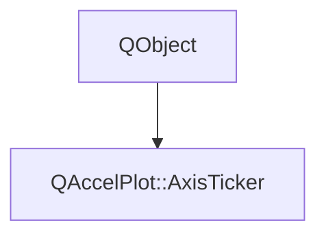

# Class QAccelPlot::AxisTicker


[**ClassList**](annotated.md) **>** [**QAccelPlot**](namespaceQAccelPlot.md) **>** [**AxisTicker**](classQAccelPlot_1_1AxisTicker.md)


_Controls the visual appearance of ticks, sub-ticks, and tick labels on an_ `Axis` _._[More...](#detailed-description)

* `#include <AxisTicker.hpp>`


Inherits the following classes: QObject


## Inheritance diagram




## Public Properties

| Type | Name |
| ---: | :--- |
| property QColor | [**subtickColor**](classQAccelPlot_1_1AxisTicker.md#property-subtickcolor-12)  <br>_Color of sub-tick marks. Default:_ `Qt::darkGray` _._ |
| property int | [**subtickCount**](classQAccelPlot_1_1AxisTicker.md#property-subtickcount-12)  <br>_Number of sub-tick intervals between adjacent major ticks. Default: 10._  |
| property qreal | [**subtickLength**](classQAccelPlot_1_1AxisTicker.md#property-subticklength-12)  <br>_Convenience setter for both_ `subtickLengthIn` _and_`subtickLengthOut` _simultaneously._ |
| property qreal | [**subtickLengthIn**](classQAccelPlot_1_1AxisTicker.md#property-subticklengthin-12)  <br>_Inward length in pixels of sub-tick marks. Default: 4._  |
| property qreal | [**subtickLengthOut**](classQAccelPlot_1_1AxisTicker.md#property-subticklengthout-12)  <br>_Outward length in pixels of sub-tick marks. Default: 4._  |
| property qreal | [**subtickWidth**](classQAccelPlot_1_1AxisTicker.md#property-subtickwidth-12)  <br>_Width in pixels of sub-tick mark lines. Default: 1._  |
| property QML\_ANONYMOUSQColor | [**tickColor**](classQAccelPlot_1_1AxisTicker.md#property-tickcolor-12)  <br>_Color of major tick marks. Default:_ `Qt::black` _._ |
| property int | [**tickCount**](classQAccelPlot_1_1AxisTicker.md#property-tickcount-12)  <br>_Target number of major tick marks. Actual count is adjusted for "nice" values. Default: 5._  |
| property QColor | [**tickLabelColor**](classQAccelPlot_1_1AxisTicker.md#property-ticklabelcolor-12)  <br>_Optional color of tick labels. When invalid, the tickColor is used._  |
| property QFont | [**tickLabelFont**](classQAccelPlot_1_1AxisTicker.md#property-ticklabelfont-12)  <br>_Font used to render tick labels. Default: application default font._  |
| property [**TickLabelFormatter**](classQAccelPlot_1_1TickLabelFormatter.md) \* | [**tickLabelFormatter**](classQAccelPlot_1_1AxisTicker.md#property-ticklabelformatter-12)  <br>_Optional custom formatter for tick labels. When_ `nullptr` _the default_[_**NumericTickLabelFormatter**_](classQAccelPlot_1_1NumericTickLabelFormatter.md) _is used._ |
| property qreal | [**tickLabelPadding**](classQAccelPlot_1_1AxisTicker.md#property-ticklabelpadding-12)  <br>_Spacing in pixels between a tick mark and its label. Default: 5._  |
| property qreal | [**tickLabelRotation**](classQAccelPlot_1_1AxisTicker.md#property-ticklabelrotation-12)  <br>_Rotation angle in degrees applied to each tick label. Default: 0._  |
| property qreal | [**tickLength**](classQAccelPlot_1_1AxisTicker.md#property-ticklength-12)  <br>_Convenience setter for both_ `tickLengthIn` _and_`tickLengthOut` _simultaneously._ |
| property qreal | [**tickLengthIn**](classQAccelPlot_1_1AxisTicker.md#property-ticklengthin-12)  <br>_Length in pixels of the portion of a major tick that extends into the plot area. Default: 8._  |
| property qreal | [**tickLengthOut**](classQAccelPlot_1_1AxisTicker.md#property-ticklengthout-12)  <br>_Length in pixels of the portion of a major tick that extends outside the plot area. Default: 8._  |
| property qreal | [**tickWidth**](classQAccelPlot_1_1AxisTicker.md#property-tickwidth-12)  <br>_Width in pixels of major tick mark lines. Default: 2._  |


## Public Signals

| Type | Name |
| ---: | :--- |
| signal void | [**subtickColorChanged**](classQAccelPlot_1_1AxisTicker.md#signal-subtickcolorchanged)  <br>_Emitted when the subtickColor property changes._  |
| signal void | [**subtickCountChanged**](classQAccelPlot_1_1AxisTicker.md#signal-subtickcountchanged)  <br>_Emitted when the subtickCount property changes._  |
| signal void | [**subtickLengthChanged**](classQAccelPlot_1_1AxisTicker.md#signal-subticklengthchanged)  <br>_Emitted when the subtickLength convenience property changes._  |
| signal void | [**subtickLengthInChanged**](classQAccelPlot_1_1AxisTicker.md#signal-subticklengthinchanged)  <br>_Emitted when the subtickLengthIn property changes._  |
| signal void | [**subtickLengthOutChanged**](classQAccelPlot_1_1AxisTicker.md#signal-subticklengthoutchanged)  <br>_Emitted when the subtickLengthOut property changes._  |
| signal void | [**subtickWidthChanged**](classQAccelPlot_1_1AxisTicker.md#signal-subtickwidthchanged)  <br>_Emitted when the subtickWidth property changes._  |
| signal void | [**tickColorChanged**](classQAccelPlot_1_1AxisTicker.md#signal-tickcolorchanged)  <br>_Emitted when the tickColor property changes._  |
| signal void | [**tickCountChanged**](classQAccelPlot_1_1AxisTicker.md#signal-tickcountchanged)  <br>_Emitted when the tickCount property changes._  |
| signal void | [**tickLabelColorChanged**](classQAccelPlot_1_1AxisTicker.md#signal-ticklabelcolorchanged)  <br>_Emitted when the tickLabelColor property changes._  |
| signal void | [**tickLabelFontChanged**](classQAccelPlot_1_1AxisTicker.md#signal-ticklabelfontchanged)  <br>_Emitted when the tickLabelFont property changes._  |
| signal void | [**tickLabelFormatChanged**](classQAccelPlot_1_1AxisTicker.md#signal-ticklabelformatchanged)  <br>_Emitted when the current formatter's output configuration changes._  |
| signal void | [**tickLabelFormatterChanged**](classQAccelPlot_1_1AxisTicker.md#signal-ticklabelformatterchanged)  <br>_Emitted when the tickLabelFormatter property changes._  |
| signal void | [**tickLabelPaddingChanged**](classQAccelPlot_1_1AxisTicker.md#signal-ticklabelpaddingchanged)  <br>_Emitted when the tickLabelPadding property changes._  |
| signal void | [**tickLabelRotationChanged**](classQAccelPlot_1_1AxisTicker.md#signal-ticklabelrotationchanged)  <br>_Emitted when the tickLabelRotation property changes._  |
| signal void | [**tickLengthChanged**](classQAccelPlot_1_1AxisTicker.md#signal-ticklengthchanged)  <br>_Emitted when the tickLength convenience property changes._  |
| signal void | [**tickLengthInChanged**](classQAccelPlot_1_1AxisTicker.md#signal-ticklengthinchanged)  <br>_Emitted when the tickLengthIn property changes._  |
| signal void | [**tickLengthOutChanged**](classQAccelPlot_1_1AxisTicker.md#signal-ticklengthoutchanged)  <br>_Emitted when the tickLengthOut property changes._  |
| signal void | [**tickWidthChanged**](classQAccelPlot_1_1AxisTicker.md#signal-tickwidthchanged)  <br>_Emitted when the tickWidth property changes._  |


## Public Functions

| Type | Name |
| ---: | :--- |
|   | [**AxisTicker**](#function-axisticker) (QObject \* parent=nullptr) <br>_Constructs an_ [_**AxisTicker**_](classQAccelPlot_1_1AxisTicker.md) _with the given__parent_ _._ |
|  void | [**setSubtickColor**](#function-setsubtickcolor) (const QColor & c) <br>_Sets the sub-tick color to_ _c_ _._ |
|  void | [**setSubtickCount**](#function-setsubtickcount) (int count) <br>_Sets the sub-tick interval count to_ _count_ _._ |
|  void | [**setSubtickLength**](#function-setsubticklength) (qreal length) <br>_Sets both_ `subtickLengthIn` _and_`subtickLengthOut` _to__length_ _._ |
|  void | [**setSubtickLengthIn**](#function-setsubticklengthin) (qreal length) <br>_Sets the inward sub-tick length to_ _length_ _._ |
|  void | [**setSubtickLengthOut**](#function-setsubticklengthout) (qreal length) <br>_Sets the outward sub-tick length to_ _length_ _._ |
|  void | [**setSubtickWidth**](#function-setsubtickwidth) (qreal width) <br>_Sets the sub-tick line width to_ _width_ _._ |
|  void | [**setTickColor**](#function-settickcolor) (const QColor & c) <br>_Sets the major tick color to_ _c_ _._ |
|  void | [**setTickCount**](#function-settickcount) (int count) <br>_Sets the target major tick count to_ _count_ _._ |
|  void | [**setTickLabelColor**](#function-setticklabelcolor) (const QColor & c) <br>_Sets the tick-label color to_ _c_ _. An invalid color restores the tickColor fallback._ |
|  void | [**setTickLabelFont**](#function-setticklabelfont) (const QFont & f) <br>_Sets the tick label font to_ _f_ _._ |
|  void | [**setTickLabelFormatter**](#function-setticklabelformatter) ([**TickLabelFormatter**](classQAccelPlot_1_1TickLabelFormatter.md) \* formatter) <br>_Sets the tick label formatter to_ _formatter_ _._ |
|  void | [**setTickLabelPadding**](#function-setticklabelpadding) (qreal padding) <br>_Sets the tick label padding to_ _padding_ _._ |
|  void | [**setTickLabelRotation**](#function-setticklabelrotation) (qreal rotation) <br>_Sets the tick label rotation to_ _rotation_ _degrees._ |
|  void | [**setTickLength**](#function-setticklength) (qreal length) <br>_Sets both_ `tickLengthIn` _and_`tickLengthOut` _to__length_ _._ |
|  void | [**setTickLengthIn**](#function-setticklengthin) (qreal length) <br>_Sets the inward major tick length to_ _length_ _._ |
|  void | [**setTickLengthOut**](#function-setticklengthout) (qreal length) <br>_Sets the outward major tick length to_ _length_ _._ |
|  void | [**setTickWidth**](#function-settickwidth) (qreal width) <br>_Sets the major tick line width to_ _width_ _._ |
|  QColor | [**subtickColor**](#function-subtickcolor-22) () const<br>_Returns the sub-tick color._  |
|  int | [**subtickCount**](#function-subtickcount-22) () const<br>_Returns the sub-tick interval count._  |
|  qreal | [**subtickLength**](#function-subticklength-22) () const<br>_Returns the shared inward+outward sub-tick length (reads_ `subtickLengthIn` _)._ |
|  qreal | [**subtickLengthIn**](#function-subticklengthin-22) () const<br>_Returns the inward sub-tick length._  |
|  qreal | [**subtickLengthOut**](#function-subticklengthout-22) () const<br>_Returns the outward sub-tick length._  |
|  qreal | [**subtickWidth**](#function-subtickwidth-22) () const<br>_Returns the sub-tick line width._  |
|  QColor | [**tickColor**](#function-tickcolor-22) () const<br>_Returns the major tick color._  |
|  int | [**tickCount**](#function-tickcount-22) () const<br>_Returns the target number of major ticks._  |
|  QColor | [**tickLabelColor**](#function-ticklabelcolor-22) () const<br>_Returns the tick-label color, or an invalid color when it follows tickColor._  |
|  QFont | [**tickLabelFont**](#function-ticklabelfont-22) () const<br>_Returns the tick label font._  |
|  [**TickLabelFormatter**](classQAccelPlot_1_1TickLabelFormatter.md) \* | [**tickLabelFormatter**](#function-ticklabelformatter-22) () const<br>_Returns the custom tick label formatter, or_ `nullptr` _if using the default._ |
|  qreal | [**tickLabelPadding**](#function-ticklabelpadding-22) () const<br>_Returns the tick label padding._  |
|  qreal | [**tickLabelRotation**](#function-ticklabelrotation-22) () const<br>_Returns the tick label rotation in degrees._  |
|  qreal | [**tickLength**](#function-ticklength-22) () const<br>_Returns the shared inward+outward tick length (reads_ `tickLengthIn` _)._ |
|  qreal | [**tickLengthIn**](#function-ticklengthin-22) () const<br>_Returns the inward major tick length._  |
|  qreal | [**tickLengthOut**](#function-ticklengthout-22) () const<br>_Returns the outward major tick length._  |
|  qreal | [**tickWidth**](#function-tickwidth-22) () const<br>_Returns the major tick line width._  |


## Detailed Description


Accessible via the `Axis::ticker` CONSTANT property. Changes are applied on the next paint event.


**See also:** [**Axis**](classQAccelPlot_1_1Axis.md) 


    
## Public Properties Documentation


### property subtickColor {#property-subtickcolor-12}

_Color of sub-tick marks. Default:_ `Qt::darkGray` _._
```C++
QColor QAccelPlot::AxisTicker::subtickColor;
```


<hr>


### property subtickCount {#property-subtickcount-12}

_Number of sub-tick intervals between adjacent major ticks. Default: 10._ 
```C++
int QAccelPlot::AxisTicker::subtickCount;
```


<hr>


### property subtickLength {#property-subticklength-12}

_Convenience setter for both_ `subtickLengthIn` _and_`subtickLengthOut` _simultaneously._
```C++
qreal QAccelPlot::AxisTicker::subtickLength;
```


<hr>


### property subtickLengthIn {#property-subticklengthin-12}

_Inward length in pixels of sub-tick marks. Default: 4._ 
```C++
qreal QAccelPlot::AxisTicker::subtickLengthIn;
```


<hr>


### property subtickLengthOut {#property-subticklengthout-12}

_Outward length in pixels of sub-tick marks. Default: 4._ 
```C++
qreal QAccelPlot::AxisTicker::subtickLengthOut;
```


<hr>


### property subtickWidth {#property-subtickwidth-12}

_Width in pixels of sub-tick mark lines. Default: 1._ 
```C++
qreal QAccelPlot::AxisTicker::subtickWidth;
```


<hr>


### property tickColor {#property-tickcolor-12}

_Color of major tick marks. Default:_ `Qt::black` _._
```C++
QML_ANONYMOUSQColor QAccelPlot::AxisTicker::tickColor;
```


<hr>


### property tickCount {#property-tickcount-12}

_Target number of major tick marks. Actual count is adjusted for "nice" values. Default: 5._ 
```C++
int QAccelPlot::AxisTicker::tickCount;
```


<hr>


### property tickLabelColor {#property-ticklabelcolor-12}

_Optional color of tick labels. When invalid, the tickColor is used._ 
```C++
QColor QAccelPlot::AxisTicker::tickLabelColor;
```


<hr>


### property tickLabelFont {#property-ticklabelfont-12}

_Font used to render tick labels. Default: application default font._ 
```C++
QFont QAccelPlot::AxisTicker::tickLabelFont;
```


<hr>


### property tickLabelFormatter {#property-ticklabelformatter-12}

_Optional custom formatter for tick labels. When_ `nullptr` _the default_[_**NumericTickLabelFormatter**_](classQAccelPlot_1_1NumericTickLabelFormatter.md) _is used._
```C++
TickLabelFormatter* QAccelPlot::AxisTicker::tickLabelFormatter;
```


<hr>


### property tickLabelPadding {#property-ticklabelpadding-12}

_Spacing in pixels between a tick mark and its label. Default: 5._ 
```C++
qreal QAccelPlot::AxisTicker::tickLabelPadding;
```


<hr>


### property tickLabelRotation {#property-ticklabelrotation-12}

_Rotation angle in degrees applied to each tick label. Default: 0._ 
```C++
qreal QAccelPlot::AxisTicker::tickLabelRotation;
```


<hr>


### property tickLength {#property-ticklength-12}

_Convenience setter for both_ `tickLengthIn` _and_`tickLengthOut` _simultaneously._
```C++
qreal QAccelPlot::AxisTicker::tickLength;
```


<hr>


### property tickLengthIn {#property-ticklengthin-12}

_Length in pixels of the portion of a major tick that extends into the plot area. Default: 8._ 
```C++
qreal QAccelPlot::AxisTicker::tickLengthIn;
```


<hr>


### property tickLengthOut {#property-ticklengthout-12}

_Length in pixels of the portion of a major tick that extends outside the plot area. Default: 8._ 
```C++
qreal QAccelPlot::AxisTicker::tickLengthOut;
```


<hr>


### property tickWidth {#property-tickwidth-12}

_Width in pixels of major tick mark lines. Default: 2._ 
```C++
qreal QAccelPlot::AxisTicker::tickWidth;
```


<hr>
## Public Signals Documentation


### signal subtickColorChanged {#signal-subtickcolorchanged}

_Emitted when the subtickColor property changes._ 
```C++
void QAccelPlot::AxisTicker::subtickColorChanged;
```


<hr>


### signal subtickCountChanged {#signal-subtickcountchanged}

_Emitted when the subtickCount property changes._ 
```C++
void QAccelPlot::AxisTicker::subtickCountChanged;
```


<hr>


### signal subtickLengthChanged {#signal-subticklengthchanged}

_Emitted when the subtickLength convenience property changes._ 
```C++
void QAccelPlot::AxisTicker::subtickLengthChanged;
```


<hr>


### signal subtickLengthInChanged {#signal-subticklengthinchanged}

_Emitted when the subtickLengthIn property changes._ 
```C++
void QAccelPlot::AxisTicker::subtickLengthInChanged;
```


<hr>


### signal subtickLengthOutChanged {#signal-subticklengthoutchanged}

_Emitted when the subtickLengthOut property changes._ 
```C++
void QAccelPlot::AxisTicker::subtickLengthOutChanged;
```


<hr>


### signal subtickWidthChanged {#signal-subtickwidthchanged}

_Emitted when the subtickWidth property changes._ 
```C++
void QAccelPlot::AxisTicker::subtickWidthChanged;
```


<hr>


### signal tickColorChanged {#signal-tickcolorchanged}

_Emitted when the tickColor property changes._ 
```C++
void QAccelPlot::AxisTicker::tickColorChanged;
```


<hr>


### signal tickCountChanged {#signal-tickcountchanged}

_Emitted when the tickCount property changes._ 
```C++
void QAccelPlot::AxisTicker::tickCountChanged;
```


<hr>


### signal tickLabelColorChanged {#signal-ticklabelcolorchanged}

_Emitted when the tickLabelColor property changes._ 
```C++
void QAccelPlot::AxisTicker::tickLabelColorChanged;
```


<hr>


### signal tickLabelFontChanged {#signal-ticklabelfontchanged}

_Emitted when the tickLabelFont property changes._ 
```C++
void QAccelPlot::AxisTicker::tickLabelFontChanged;
```


<hr>


### signal tickLabelFormatChanged {#signal-ticklabelformatchanged}

_Emitted when the current formatter's output configuration changes._ 
```C++
void QAccelPlot::AxisTicker::tickLabelFormatChanged;
```


<hr>


### signal tickLabelFormatterChanged {#signal-ticklabelformatterchanged}

_Emitted when the tickLabelFormatter property changes._ 
```C++
void QAccelPlot::AxisTicker::tickLabelFormatterChanged;
```


<hr>


### signal tickLabelPaddingChanged {#signal-ticklabelpaddingchanged}

_Emitted when the tickLabelPadding property changes._ 
```C++
void QAccelPlot::AxisTicker::tickLabelPaddingChanged;
```


<hr>


### signal tickLabelRotationChanged {#signal-ticklabelrotationchanged}

_Emitted when the tickLabelRotation property changes._ 
```C++
void QAccelPlot::AxisTicker::tickLabelRotationChanged;
```


<hr>


### signal tickLengthChanged {#signal-ticklengthchanged}

_Emitted when the tickLength convenience property changes._ 
```C++
void QAccelPlot::AxisTicker::tickLengthChanged;
```


<hr>


### signal tickLengthInChanged {#signal-ticklengthinchanged}

_Emitted when the tickLengthIn property changes._ 
```C++
void QAccelPlot::AxisTicker::tickLengthInChanged;
```


<hr>


### signal tickLengthOutChanged {#signal-ticklengthoutchanged}

_Emitted when the tickLengthOut property changes._ 
```C++
void QAccelPlot::AxisTicker::tickLengthOutChanged;
```


<hr>


### signal tickWidthChanged {#signal-tickwidthchanged}

_Emitted when the tickWidth property changes._ 
```C++
void QAccelPlot::AxisTicker::tickWidthChanged;
```


<hr>
## Public Functions Documentation


### function AxisTicker {#function-axisticker}

_Constructs an_ [_**AxisTicker**_](classQAccelPlot_1_1AxisTicker.md) _with the given__parent_ _._
```C++
explicit QAccelPlot::AxisTicker::AxisTicker (
    QObject * parent=nullptr
) 
```


<hr>


### function setSubtickColor {#function-setsubtickcolor}

_Sets the sub-tick color to_ _c_ _._
```C++
void QAccelPlot::AxisTicker::setSubtickColor (
    const QColor & c
) 
```


<hr>


### function setSubtickCount {#function-setsubtickcount}

_Sets the sub-tick interval count to_ _count_ _._
```C++
void QAccelPlot::AxisTicker::setSubtickCount (
    int count
) 
```


<hr>


### function setSubtickLength {#function-setsubticklength}

_Sets both_ `subtickLengthIn` _and_`subtickLengthOut` _to__length_ _._
```C++
void QAccelPlot::AxisTicker::setSubtickLength (
    qreal length
) 
```


<hr>


### function setSubtickLengthIn {#function-setsubticklengthin}

_Sets the inward sub-tick length to_ _length_ _._
```C++
void QAccelPlot::AxisTicker::setSubtickLengthIn (
    qreal length
) 
```


<hr>


### function setSubtickLengthOut {#function-setsubticklengthout}

_Sets the outward sub-tick length to_ _length_ _._
```C++
void QAccelPlot::AxisTicker::setSubtickLengthOut (
    qreal length
) 
```


<hr>


### function setSubtickWidth {#function-setsubtickwidth}

_Sets the sub-tick line width to_ _width_ _._
```C++
void QAccelPlot::AxisTicker::setSubtickWidth (
    qreal width
) 
```


<hr>


### function setTickColor {#function-settickcolor}

_Sets the major tick color to_ _c_ _._
```C++
void QAccelPlot::AxisTicker::setTickColor (
    const QColor & c
) 
```


<hr>


### function setTickCount {#function-settickcount}

_Sets the target major tick count to_ _count_ _._
```C++
void QAccelPlot::AxisTicker::setTickCount (
    int count
) 
```


<hr>


### function setTickLabelColor {#function-setticklabelcolor}

_Sets the tick-label color to_ _c_ _. An invalid color restores the tickColor fallback._
```C++
void QAccelPlot::AxisTicker::setTickLabelColor (
    const QColor & c
) 
```


<hr>


### function setTickLabelFont {#function-setticklabelfont}

_Sets the tick label font to_ _f_ _._
```C++
void QAccelPlot::AxisTicker::setTickLabelFont (
    const QFont & f
) 
```


<hr>


### function setTickLabelFormatter {#function-setticklabelformatter}

_Sets the tick label formatter to_ _formatter_ _._
```C++
void QAccelPlot::AxisTicker::setTickLabelFormatter (
    TickLabelFormatter * formatter
) 
```


<hr>


### function setTickLabelPadding {#function-setticklabelpadding}

_Sets the tick label padding to_ _padding_ _._
```C++
void QAccelPlot::AxisTicker::setTickLabelPadding (
    qreal padding
) 
```


<hr>


### function setTickLabelRotation {#function-setticklabelrotation}

_Sets the tick label rotation to_ _rotation_ _degrees._
```C++
void QAccelPlot::AxisTicker::setTickLabelRotation (
    qreal rotation
) 
```


<hr>


### function setTickLength {#function-setticklength}

_Sets both_ `tickLengthIn` _and_`tickLengthOut` _to__length_ _._
```C++
void QAccelPlot::AxisTicker::setTickLength (
    qreal length
) 
```


<hr>


### function setTickLengthIn {#function-setticklengthin}

_Sets the inward major tick length to_ _length_ _._
```C++
void QAccelPlot::AxisTicker::setTickLengthIn (
    qreal length
) 
```


<hr>


### function setTickLengthOut {#function-setticklengthout}

_Sets the outward major tick length to_ _length_ _._
```C++
void QAccelPlot::AxisTicker::setTickLengthOut (
    qreal length
) 
```


<hr>


### function setTickWidth {#function-settickwidth}

_Sets the major tick line width to_ _width_ _._
```C++
void QAccelPlot::AxisTicker::setTickWidth (
    qreal width
) 
```


<hr>


### function subtickColor {#function-subtickcolor-22}

_Returns the sub-tick color._ 
```C++
QColor QAccelPlot::AxisTicker::subtickColor () const
```


<hr>


### function subtickCount {#function-subtickcount-22}

_Returns the sub-tick interval count._ 
```C++
int QAccelPlot::AxisTicker::subtickCount () const
```


<hr>


### function subtickLength {#function-subticklength-22}

_Returns the shared inward+outward sub-tick length (reads_ `subtickLengthIn` _)._
```C++
qreal QAccelPlot::AxisTicker::subtickLength () const
```


<hr>


### function subtickLengthIn {#function-subticklengthin-22}

_Returns the inward sub-tick length._ 
```C++
qreal QAccelPlot::AxisTicker::subtickLengthIn () const
```


<hr>


### function subtickLengthOut {#function-subticklengthout-22}

_Returns the outward sub-tick length._ 
```C++
qreal QAccelPlot::AxisTicker::subtickLengthOut () const
```


<hr>


### function subtickWidth {#function-subtickwidth-22}

_Returns the sub-tick line width._ 
```C++
qreal QAccelPlot::AxisTicker::subtickWidth () const
```


<hr>


### function tickColor {#function-tickcolor-22}

_Returns the major tick color._ 
```C++
QColor QAccelPlot::AxisTicker::tickColor () const
```


<hr>


### function tickCount {#function-tickcount-22}

_Returns the target number of major ticks._ 
```C++
int QAccelPlot::AxisTicker::tickCount () const
```


<hr>


### function tickLabelColor {#function-ticklabelcolor-22}

_Returns the tick-label color, or an invalid color when it follows tickColor._ 
```C++
QColor QAccelPlot::AxisTicker::tickLabelColor () const
```


<hr>


### function tickLabelFont {#function-ticklabelfont-22}

_Returns the tick label font._ 
```C++
QFont QAccelPlot::AxisTicker::tickLabelFont () const
```


<hr>


### function tickLabelFormatter {#function-ticklabelformatter-22}

_Returns the custom tick label formatter, or_ `nullptr` _if using the default._
```C++
TickLabelFormatter * QAccelPlot::AxisTicker::tickLabelFormatter () const
```


<hr>


### function tickLabelPadding {#function-ticklabelpadding-22}

_Returns the tick label padding._ 
```C++
qreal QAccelPlot::AxisTicker::tickLabelPadding () const
```


<hr>


### function tickLabelRotation {#function-ticklabelrotation-22}

_Returns the tick label rotation in degrees._ 
```C++
qreal QAccelPlot::AxisTicker::tickLabelRotation () const
```


<hr>


### function tickLength {#function-ticklength-22}

_Returns the shared inward+outward tick length (reads_ `tickLengthIn` _)._
```C++
qreal QAccelPlot::AxisTicker::tickLength () const
```


<hr>


### function tickLengthIn {#function-ticklengthin-22}

_Returns the inward major tick length._ 
```C++
qreal QAccelPlot::AxisTicker::tickLengthIn () const
```


<hr>


### function tickLengthOut {#function-ticklengthout-22}

_Returns the outward major tick length._ 
```C++
qreal QAccelPlot::AxisTicker::tickLengthOut () const
```


<hr>


### function tickWidth {#function-tickwidth-22}

_Returns the major tick line width._ 
```C++
qreal QAccelPlot::AxisTicker::tickWidth () const
```


<hr>

------------------------------
The documentation for this class was generated from the following file `QAccelPlot/src/axis/AxisTicker.hpp`

