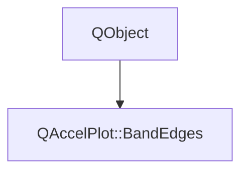

# Class QAccelPlot::BandEdges


[**ClassList**](annotated.md) **>** [**QAccelPlot**](namespaceQAccelPlot.md) **>** [**BandEdges**](classQAccelPlot_1_1BandEdges.md)


_Controls the lines a_ `BandSeries` _draws along its lower and upper edges._[More...](#detailed-description)

* `#include <BandEdges.hpp>`


Inherits the following classes: QObject


## Inheritance diagram




## Public Properties

| Type | Name |
| ---: | :--- |
| property QColor | [**color**](classQAccelPlot_1_1BandEdges.md#property-color-12)  <br>_Edge line color. Default: an invalid color, which draws the band's_ `color` _at full opacity._ |
| property [**LineStyle**](classQAccelPlot_1_1LineStyle.md) \* | [**lineStyle**](classQAccelPlot_1_1BandEdges.md#property-linestyle-12)  <br>_Edge line style (_ [_**SolidLine**_](classQAccelPlot_1_1SolidLine.md) _,_[_**DashLine**_](classQAccelPlot_1_1DashLine.md) _, or_[_**NoLine**_](classQAccelPlot_1_1NoLine.md) _). Default:_[_**SolidLine**_](classQAccelPlot_1_1SolidLine.md) _._ |
| property QML\_ANONYMOUSqreal | [**width**](classQAccelPlot_1_1BandEdges.md#property-width-12)  <br>_Edge line width in pixels, clamped to at least 0. Default: 0, no edge lines._  |


## Public Signals

| Type | Name |
| ---: | :--- |
| signal void | [**colorChanged**](classQAccelPlot_1_1BandEdges.md#signal-colorchanged)  <br>_Emitted when the color property changes._  |
| signal void | [**lineStyleChanged**](classQAccelPlot_1_1BandEdges.md#signal-linestylechanged)  <br>_Emitted when the lineStyle property changes._  |
| signal void | [**widthChanged**](classQAccelPlot_1_1BandEdges.md#signal-widthchanged)  <br>_Emitted when the width property changes._  |


## Public Functions

| Type | Name |
| ---: | :--- |
|   | [**BandEdges**](#function-bandedges) (QObject \* parent=nullptr) <br>_Constructs a_ [_**BandEdges**_](classQAccelPlot_1_1BandEdges.md) _owned by__parent_ _._ |
|  QColor | [**color**](#function-color-22) () const<br>_Returns the edge line color._  |
|  [**LineStyle**](classQAccelPlot_1_1LineStyle.md) \* | [**lineStyle**](#function-linestyle-22) () const<br>_Returns the edge line style, or_ `nullptr` _after the assigned style is destroyed._ |
|  void | [**setColor**](#function-setcolor) (const QColor & color) <br>_Sets the edge line color to_ _color_ _._ |
|  void | [**setLineStyle**](#function-setlinestyle) ([**LineStyle**](classQAccelPlot_1_1LineStyle.md) \* style) <br>_Sets the edge line style to_ _style_ _. The style is not owned._ |
|  void | [**setWidth**](#function-setwidth) (qreal width) <br>_Sets the edge line width to_ _width_ _pixels. Negative values are clamped to 0._ |
|  qreal | [**width**](#function-width-22) () const<br>_Returns the edge line width in pixels._  |


## Detailed Description


Accessible via the `edges` CONSTANT grouped property of `BandSeries`, for example `edges.width: 1`.


**See also:** [**BandSeries**](classQAccelPlot_1_1BandSeries.md) 


    
## Public Properties Documentation


### property color {#property-color-12}

_Edge line color. Default: an invalid color, which draws the band's_ `color` _at full opacity._
```C++
QColor QAccelPlot::BandEdges::color;
```


<hr>


### property lineStyle {#property-linestyle-12}

_Edge line style (_ [_**SolidLine**_](classQAccelPlot_1_1SolidLine.md) _,_[_**DashLine**_](classQAccelPlot_1_1DashLine.md) _, or_[_**NoLine**_](classQAccelPlot_1_1NoLine.md) _). Default:_[_**SolidLine**_](classQAccelPlot_1_1SolidLine.md) _._
```C++
LineStyle* QAccelPlot::BandEdges::lineStyle;
```


<hr>


### property width {#property-width-12}

_Edge line width in pixels, clamped to at least 0. Default: 0, no edge lines._ 
```C++
QML_ANONYMOUSqreal QAccelPlot::BandEdges::width;
```


<hr>
## Public Signals Documentation


### signal colorChanged {#signal-colorchanged}

_Emitted when the color property changes._ 
```C++
void QAccelPlot::BandEdges::colorChanged;
```


<hr>


### signal lineStyleChanged {#signal-linestylechanged}

_Emitted when the lineStyle property changes._ 
```C++
void QAccelPlot::BandEdges::lineStyleChanged;
```


<hr>


### signal widthChanged {#signal-widthchanged}

_Emitted when the width property changes._ 
```C++
void QAccelPlot::BandEdges::widthChanged;
```


<hr>
## Public Functions Documentation


### function BandEdges {#function-bandedges}

_Constructs a_ [_**BandEdges**_](classQAccelPlot_1_1BandEdges.md) _owned by__parent_ _._
```C++
explicit QAccelPlot::BandEdges::BandEdges (
    QObject * parent=nullptr
) 
```


<hr>


### function color {#function-color-22}

_Returns the edge line color._ 
```C++
QColor QAccelPlot::BandEdges::color () const
```


<hr>


### function lineStyle {#function-linestyle-22}

_Returns the edge line style, or_ `nullptr` _after the assigned style is destroyed._
```C++
LineStyle * QAccelPlot::BandEdges::lineStyle () const
```


<hr>


### function setColor {#function-setcolor}

_Sets the edge line color to_ _color_ _._
```C++
void QAccelPlot::BandEdges::setColor (
    const QColor & color
) 
```


<hr>


### function setLineStyle {#function-setlinestyle}

_Sets the edge line style to_ _style_ _. The style is not owned._
```C++
void QAccelPlot::BandEdges::setLineStyle (
    LineStyle * style
) 
```


<hr>


### function setWidth {#function-setwidth}

_Sets the edge line width to_ _width_ _pixels. Negative values are clamped to 0._
```C++
void QAccelPlot::BandEdges::setWidth (
    qreal width
) 
```


<hr>


### function width {#function-width-22}

_Returns the edge line width in pixels._ 
```C++
qreal QAccelPlot::BandEdges::width () const
```


<hr>

------------------------------
The documentation for this class was generated from the following file `QAccelPlot/src/QAccelPlot/series/BandEdges.hpp`

