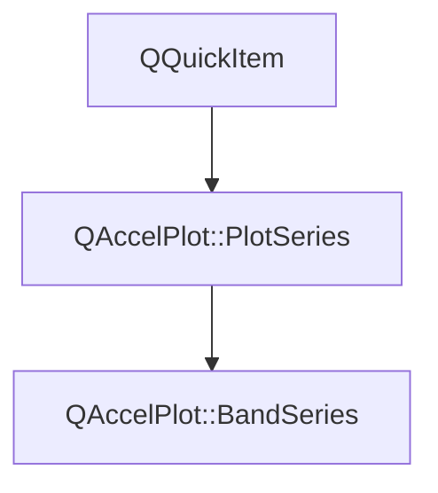

# Class QAccelPlot::BandSeries


[**ClassList**](annotated.md) **>** [**QAccelPlot**](namespaceQAccelPlot.md) **>** [**BandSeries**](classQAccelPlot_1_1BandSeries.md)


_A hardware-accelerated QML item that fills the area between a low and a high value at each X._ [More...](#detailed-description)

* `#include <BandSeries.hpp>`


Inherits the following classes: [QAccelPlot::PlotSeries](classQAccelPlot_1_1PlotSeries.md)


## Inheritance diagram




## Public Types inherited from QAccelPlot::PlotSeries

See [QAccelPlot::PlotSeries](classQAccelPlot_1_1PlotSeries.md)

| Type | Name |
| ---: | :--- |
| enum  | [**LegendSymbol**](classQAccelPlot_1_1PlotSeries.md#enum-legendsymbol)  <br>_Supported default legend symbols._  |
| enum  | [**MarkerShape**](classQAccelPlot_1_1PlotSeries.md#enum-markershape)  <br>_Marker shapes shared by every series that draws markers._  |


## Public Properties

| Type | Name |
| ---: | :--- |
| property QColor | [**color**](classQAccelPlot_1_1BandSeries.md#property-color-12)  <br>_Fill color. Default:_ `Colors.dark.seriesPrimary` _with alpha 64._ |
| property int | [**count**](classQAccelPlot_1_1BandSeries.md#property-count-12)  <br>_Read-only: number of samples currently loaded._  |
| property [**BandEdges**](classQAccelPlot_1_1BandEdges.md) \* | [**edges**](classQAccelPlot_1_1BandSeries.md#property-edges-12)  <br>_Grouped edge line settings, e.g._ `edges.width` _and_`edges.lineStyle` _. No edge lines by default._ |
| property bool | [**hovered**](classQAccelPlot_1_1BandSeries.md#property-hovered-12)  <br>_Read-only:_ `true` _while the mouse cursor is inside the band._ |


## Public Properties inherited from QAccelPlot::PlotSeries

See [QAccelPlot::PlotSeries](classQAccelPlot_1_1PlotSeries.md)

| Type | Name |
| ---: | :--- |
| property quint64 | [**dataRevision**](classQAccelPlot_1_1PlotSeries.md#property-datarevision-12)  <br>_Revision incremented by every accepted change of the series' records._  |
| property [**QAccelPlot::SeriesInspection**](classQAccelPlot_1_1SeriesInspection.md) \* | [**inspection**](classQAccelPlot_1_1PlotSeries.md#property-inspection-12)  <br>_Read-only constant: data queries for this series._  |
| property [**LegendSymbol**](classQAccelPlot_1_1PlotSeries.md#enum-legendsymbol) | [**legendSymbol**](classQAccelPlot_1_1PlotSeries.md#property-legendsymbol-12)  <br>_Symbol style requested from the default legend._  |
| property QString | [**name**](classQAccelPlot_1_1PlotSeries.md#property-name-12)  <br>_Identifying name used by the default legend._  |
| property QRectF | [**plotRect**](classQAccelPlot_1_1PlotSeries.md#property-plotrect-12)  <br>_Plot area in parent-item coordinates, assigned by_ `PlotView` _._ |
| property [**Axis**](classQAccelPlot_1_1Axis.md) \* | [**xAxis**](classQAccelPlot_1_1PlotSeries.md#property-xaxis-12)  <br>_Horizontal axis used for data-to-pixel coordinate mapping._  |
| property [**Axis**](classQAccelPlot_1_1Axis.md) \* | [**yAxis**](classQAccelPlot_1_1PlotSeries.md#property-yaxis-12)  <br>_Vertical axis used for data-to-pixel coordinate mapping._  |


## Public Signals

| Type | Name |
| ---: | :--- |
| signal void | [**colorChanged**](classQAccelPlot_1_1BandSeries.md#signal-colorchanged)  <br>_Emitted when the color property changes._  |
| signal void | [**countChanged**](classQAccelPlot_1_1BandSeries.md#signal-countchanged)  <br>_Emitted when the sample count changes._  |
| signal void | [**hoveredChanged**](classQAccelPlot_1_1BandSeries.md#signal-hoveredchanged)  <br>_Emitted when the hovered property changes._  |


## Public Signals inherited from QAccelPlot::PlotSeries

See [QAccelPlot::PlotSeries](classQAccelPlot_1_1PlotSeries.md)

| Type | Name |
| ---: | :--- |
| signal void | [**dataRevisionChanged**](classQAccelPlot_1_1PlotSeries.md#signal-datarevisionchanged)  <br>_Emitted when the dataRevision property changes._  |
| signal void | [**legendSymbolChanged**](classQAccelPlot_1_1PlotSeries.md#signal-legendsymbolchanged)  <br> |
| signal void | [**nameChanged**](classQAccelPlot_1_1PlotSeries.md#signal-namechanged)  <br> |
| signal void | [**plotRectChanged**](classQAccelPlot_1_1PlotSeries.md#signal-plotrectchanged)  <br> |
| signal void | [**xAxisChanged**](classQAccelPlot_1_1PlotSeries.md#signal-xaxischanged)  <br> |
| signal void | [**xDataRangeChanged**](classQAccelPlot_1_1PlotSeries.md#signal-xdatarangechanged) (qreal min, qreal max) <br>_Emitted when the X data extent of this series changes._  |
| signal void | [**yAxisChanged**](classQAccelPlot_1_1PlotSeries.md#signal-yaxischanged)  <br> |
| signal void | [**yDataRangeChanged**](classQAccelPlot_1_1PlotSeries.md#signal-ydatarangechanged) (qreal min, qreal max) <br>_Emitted when the Y data extent of this series changes._  |


## Public Functions

| Type | Name |
| ---: | :--- |
|   | [**BandSeries**](#function-bandseries) (QQuickItem \* parent=nullptr) <br>_Constructs a_ [_**BandSeries**_](classQAccelPlot_1_1BandSeries.md) _with the given__parent_ _._ |
|  Q\_INVOKABLE void | [**appendData**](#function-appenddata) (qreal x, qreal low, qreal high) <br>_Appends the sample (_ _x_ _,__low_ _,__high_ _). Triggers a redraw._ |
| virtual Q\_INVOKABLE void | [**clearData**](#function-cleardata) () override<br>_Removes all samples._  |
|  QColor | [**color**](#function-color-22) () const<br>_Returns the fill color._  |
|  bool | [**contains**](#function-contains) (const QPointF & point) override const<br>_Returns_ `true` _when item position__point_ _lies inside the band or on an edge line._ |
|  int | [**count**](#function-count-22) () const<br>_Returns the number of samples currently loaded._  |
|  [**BandEdges**](classQAccelPlot_1_1BandEdges.md) \* | [**edges**](#function-edges-22) () const<br>_Returns the grouped edge line settings. The object is owned by the series._  |
|  bool | [**hovered**](#function-hovered-22) () const<br>_Returns_ `true` _while the cursor is inside the band._ |
| virtual void | [**postData**](#function-postdata-12) (std::vector&lt; double &gt; && data, int sampleCount) override<br>_Thread-safe: queues_ `setData` _(__data_ _,__sampleCount_ _) to the item's thread. No copy is made._ |
| virtual void | [**postData**](#function-postdata-22) (std::vector&lt; float &gt; && data, int sampleCount) override<br>_Thread-safe: queues_ `setDataF` _(__data_ _,__sampleCount_ _) to the item's thread. No copy is made._ |
|  void | [**setColor**](#function-setcolor) (const QColor & color) <br>_Sets the fill color to_ _color_ _._ |
|  Q\_INVOKABLE void | [**setData**](#function-setdata-14) (const QList&lt; qreal &gt; & xs, const QList&lt; qreal &gt; & lows, const QList&lt; qreal &gt; & highs) <br>_Replaces the samples with_ _xs_ _,__lows_ _, and__highs_ _. If the sizes differ, the shortest length is used._ |
|  void | [**setData**](#function-setdata-24) (const std::vector&lt; double &gt; & xs, const std::vector&lt; double &gt; & lows, const std::vector&lt; double &gt; & highs) <br>_Replaces the samples with_ _xs_ _,__lows_ _, and__highs_ _. If the sizes differ, the shortest length is used._ |
| virtual void | [**setData**](#function-setdata-34) (const double \* data, int sampleCount) override<br>_Copies_ _sampleCount_ _interleaved_`(x, low, high)` _double triples, retaining full precision._ |
| virtual void | [**setData**](#function-setdata-44) (std::vector&lt; double &gt; && data, int sampleCount) override<br>_Moves_ _data_ _(__sampleCount_ _× 3 doubles: x, low, high) into the series. No copy is made._ |
| virtual void | [**setDataF**](#function-setdataf-12) (const float \* data, int sampleCount) override<br>_High-performance C++ overload: copies_ _sampleCount_ _× 3 floats (x, low, high) from__data_ _._ |
| virtual void | [**setDataF**](#function-setdataf-22) (std::vector&lt; float &gt; && data, int sampleCount) override<br>_High-performance C++ overload: moves_ _data_ _(__sampleCount_ _× 3 floats) into the series._ |
| virtual void | [**setDataFNoRange**](#function-setdatafnorange-12) (const float \* data, int sampleCount) override<br>_Like_ `setDataFNoRange(vector)` _but copies from a raw interleaved float array._ |
| virtual void | [**setDataFNoRange**](#function-setdatafnorange-22) (std::vector&lt; float &gt; && data, int sampleCount) override<br>_Like_ `setDataF(vector)` _but does not report X/Y data ranges to the axes._ |
| virtual void | [**setDataNoRange**](#function-setdatanorange-12) (const double \* data, int sampleCount) override<br>_Like_ `setDataNoRange(vector)` _but copies from a raw interleaved double array._ |
| virtual void | [**setDataNoRange**](#function-setdatanorange-22) (std::vector&lt; double &gt; && data, int sampleCount) override<br>_Like_ `setData(vector)` _but does not report X/Y data ranges to the axes._ |
|  Q\_INVOKABLE QVariantMap | [**valueAt**](#function-valueat) (qreal x) const<br>_Returns the band at data coordinate_ _x_ _as an object with_`x` _,_`low` _, and_`high` _properties._ |


## Public Functions inherited from QAccelPlot::PlotSeries

See [QAccelPlot::PlotSeries](classQAccelPlot_1_1PlotSeries.md)

| Type | Name |
| ---: | :--- |
|   | [**PlotSeries**](classQAccelPlot_1_1PlotSeries.md#function-plotseries) (QQuickItem \* parent=nullptr) <br> |
| virtual void | [**clearData**](classQAccelPlot_1_1PlotSeries.md#function-cleardata) () = 0<br>_Removes all records from the series._  |
|  quint64 | [**dataRevision**](classQAccelPlot_1_1PlotSeries.md#function-datarevision-22) () const<br>_Returns the current data revision._  |
|  [**SeriesInspection**](classQAccelPlot_1_1SeriesInspection.md) \* | [**inspection**](classQAccelPlot_1_1PlotSeries.md#function-inspection-22) () const<br>_Returns the data queries for this series; created on first use and owned by the series._  |
|  [**LegendSymbol**](classQAccelPlot_1_1PlotSeries.md#enum-legendsymbol) | [**legendSymbol**](classQAccelPlot_1_1PlotSeries.md#function-legendsymbol-22) () const<br> |
|  QString | [**name**](classQAccelPlot_1_1PlotSeries.md#function-name-22) () const<br> |
|  QRectF | [**plotRect**](classQAccelPlot_1_1PlotSeries.md#function-plotrect-22) () const<br> |
| virtual void | [**postData**](classQAccelPlot_1_1PlotSeries.md#function-postdata-12) (std::vector&lt; double &gt; && data, int count) = 0<br>_Queues a moved double buffer for assignment on the series' thread._  |
| virtual void | [**postData**](classQAccelPlot_1_1PlotSeries.md#function-postdata-22) (std::vector&lt; float &gt; && data, int count) = 0<br>_Queues a moved float buffer for assignment on the series' thread._  |
| virtual void | [**setData**](classQAccelPlot_1_1PlotSeries.md#function-setdata-12) (const double \* data, int count) = 0<br>_Replaces the series data with_ _count_ _records copied from an interleaved double array. Each concrete series defines its record layout (XY pairs or rectangle edges)._ |
| virtual void | [**setData**](classQAccelPlot_1_1PlotSeries.md#function-setdata-22) (std::vector&lt; double &gt; && data, int count) = 0<br>_Replaces the series data by moving an interleaved double buffer._  |
| virtual void | [**setDataF**](classQAccelPlot_1_1PlotSeries.md#function-setdataf-12) (const float \* data, int count) = 0<br>_Replaces the series data with_ _count_ _records copied from an interleaved float array._ |
| virtual void | [**setDataF**](classQAccelPlot_1_1PlotSeries.md#function-setdataf-22) (std::vector&lt; float &gt; && data, int count) = 0<br>_Replaces the series data by moving an interleaved float buffer._  |
| virtual void | [**setDataFNoRange**](classQAccelPlot_1_1PlotSeries.md#function-setdatafnorange-12) (const float \* data, int count) = 0<br>_Copies float records without reporting new data ranges to the axes._  |
| virtual void | [**setDataFNoRange**](classQAccelPlot_1_1PlotSeries.md#function-setdatafnorange-22) (std::vector&lt; float &gt; && data, int count) = 0<br>_Moves float records without reporting new data ranges to the axes._  |
| virtual void | [**setDataNoRange**](classQAccelPlot_1_1PlotSeries.md#function-setdatanorange-12) (const double \* data, int count) = 0<br>_Copies double records without reporting new data ranges to the axes._  |
| virtual void | [**setDataNoRange**](classQAccelPlot_1_1PlotSeries.md#function-setdatanorange-22) (std::vector&lt; double &gt; && data, int count) = 0<br>_Moves double records without reporting new data ranges to the axes._  |
|  void | [**setLegendSymbol**](classQAccelPlot_1_1PlotSeries.md#function-setlegendsymbol) ([**LegendSymbol**](classQAccelPlot_1_1PlotSeries.md#enum-legendsymbol) symbol) <br> |
|  void | [**setName**](classQAccelPlot_1_1PlotSeries.md#function-setname) (const QString & name) <br> |
|  void | [**setPlotRect**](classQAccelPlot_1_1PlotSeries.md#function-setplotrect) (const QRectF & rect) <br>_Updates the series geometry to exactly cover_ _rect_ _._ |
|  void | [**setXAxis**](classQAccelPlot_1_1PlotSeries.md#function-setxaxis) ([**Axis**](classQAccelPlot_1_1Axis.md) \* axis) <br> |
|  void | [**setYAxis**](classQAccelPlot_1_1PlotSeries.md#function-setyaxis) ([**Axis**](classQAccelPlot_1_1Axis.md) \* axis) <br> |
|  [**Axis**](classQAccelPlot_1_1Axis.md) \* | [**xAxis**](classQAccelPlot_1_1PlotSeries.md#function-xaxis-22) () const<br> |
|  [**Axis**](classQAccelPlot_1_1Axis.md) \* | [**yAxis**](classQAccelPlot_1_1PlotSeries.md#function-yaxis-22) () const<br> |


## Protected Types inherited from QAccelPlot::PlotSeries

See [QAccelPlot::PlotSeries](classQAccelPlot_1_1PlotSeries.md)

| Type | Name |
| ---: | :--- |
| enum  | [**DataChange**](classQAccelPlot_1_1PlotSeries.md#enum-datachange)  <br>_How the records changed in a data update._  |


## Protected Functions

| Type | Name |
| ---: | :--- |
| virtual void | [**onAxisRangeChanged**](#function-onaxisrangechanged) () override<br>_Moves the render origin to the new viewport when the float render data would lose precision there._  |
| virtual void | [**onAxisScaleChanged**](#function-onaxisscalechanged) () override<br>_Refreshes ranges and uploaded coordinates when a bound axis changes between linear and log scale._  |


## Protected Functions inherited from QAccelPlot::PlotSeries

See [QAccelPlot::PlotSeries](classQAccelPlot_1_1PlotSeries.md)

| Type | Name |
| ---: | :--- |
|  void | [**clearDataRanges**](classQAccelPlot_1_1PlotSeries.md#function-cleardataranges) () <br>_Clears cached extents after a series has been emptied._  |
|  void | [**clearXDataRange**](classQAccelPlot_1_1PlotSeries.md#function-clearxdatarange) () <br>_Clears the cached X extent, e.g. when no sample has a valid X coordinate._  |
|  void | [**clearYDataRange**](classQAccelPlot_1_1PlotSeries.md#function-clearydatarange) () <br>_Clears the cached Y extent, e.g. when no sample has a valid Y coordinate._  |
|  void | [**extendXDataRange**](classQAccelPlot_1_1PlotSeries.md#function-extendxdatarange) (qreal x) <br>_Widens the reported X extent to include_ _x_ _._ |
|  void | [**extendYDataRange**](classQAccelPlot_1_1PlotSeries.md#function-extendydatarange) (qreal y) <br>_Widens the reported Y extent to include_ _y_ _. A non-finite__y_ _leaves the extent unchanged._ |
| virtual bool | [**inspectionAvailable**](classQAccelPlot_1_1PlotSeries.md#function-inspectionavailable) () const<br>_Returns false while the records are ambiguous, such as during a data transition. Default: true._  |
|  void | [**inspectionDataChanged**](classQAccelPlot_1_1PlotSeries.md#function-inspectiondatachanged) ([**DataChange**](classQAccelPlot_1_1PlotSeries.md#enum-datachange) change=DataChange::Replaced) <br>_Advances the data revision and refreshes the data queries. Call after every accepted record change._  |
| virtual [**InspectionRecord**](structQAccelPlot_1_1InspectionRecord.md) | [**inspectionRecord**](classQAccelPlot_1_1PlotSeries.md#function-inspectionrecord) (int index) const<br>_Returns the native record at_ _index_ _for series that are not plain XY series. Default: unsupported._ |
| virtual [**InspectionRecord**](structQAccelPlot_1_1InspectionRecord.md) | [**inspectionRecordAt**](classQAccelPlot_1_1PlotSeries.md#function-inspectionrecordat) (const QPointF & position) const<br>_Returns the native record drawn at the series-local_ _position_ _. Default: unsupported._ |
| virtual [**InspectionSource**](structQAccelPlot_1_1InspectionSource.md) | [**inspectionSource**](classQAccelPlot_1_1PlotSeries.md#function-inspectionsource) () const<br>_Returns a view of the XY records that sample queries search. The default has none._  |
|  void | [**invalidateInspection**](classQAccelPlot_1_1PlotSeries.md#function-invalidateinspection) () <br>_Refreshes the data queries after record validity changed without a data change, such as an axis scale switch._  |
| virtual void | [**onAxisRangeChanged**](classQAccelPlot_1_1PlotSeries.md#function-onaxisrangechanged) () <br>_Called when the viewport of a bound axis changes. The default implementation schedules a repaint._  |
| virtual void | [**onAxisScaleChanged**](classQAccelPlot_1_1PlotSeries.md#function-onaxisscalechanged) () <br>_Called when a bound axis switches between linear and logarithmic scale, or a different axis is bound._  |
|  QRectF | [**resolvePlotRect**](classQAccelPlot_1_1PlotSeries.md#function-resolveplotrect) () const<br>_Returns the plot area to render into:_ `plotRect` _when set, otherwise the item's current size._ |
|  void | [**setDataRanges**](classQAccelPlot_1_1PlotSeries.md#function-setdataranges) (qreal xMin, qreal xMax, qreal yMin, qreal yMax) <br>_Reports this series' data extents to its bound axes._  |
|  void | [**setXDataRange**](classQAccelPlot_1_1PlotSeries.md#function-setxdatarange) (qreal min, qreal max) <br>_Reports this series' X data extent to its bound horizontal axis. Non-finite extents are ignored._  |
|  void | [**setYDataRange**](classQAccelPlot_1_1PlotSeries.md#function-setydatarange) (qreal min, qreal max) <br>_Reports this series' Y data extent to its bound vertical axis. Non-finite extents are ignored._  |
|  std::optional&lt; [**DataExtent**](structQAccelPlot_1_1PlotSeries_1_1DataExtent.md) &gt; | [**xDataRange**](classQAccelPlot_1_1PlotSeries.md#function-xdatarange) () const<br>_Returns this series' X data range, or_ `std::nullopt` _when it has none._ |
|  std::optional&lt; [**DataExtent**](structQAccelPlot_1_1PlotSeries_1_1DataExtent.md) &gt; | [**yDataRange**](classQAccelPlot_1_1PlotSeries.md#function-ydatarange) () const<br>_Returns this series' Y data range, or_ `std::nullopt` _when it has none._ |


## Detailed Description


Samples are stored as interleaved `(x, low, high)` triples and uploaded to the GPU as a float data texture once per data change; panning and zooming only change shader uniforms. Dashed edge lines are the exception: zooming recomputes their dash positions on the CPU. The `setData()` overloads keep doubles and upload them relative to an origin near the viewport, so large coordinates such as epoch timestamps stay precise. The `setDataF()` overloads store floats and upload them without conversion.


Draw a center line with a separate `LineCurve`. `edges` draws lines along the lower and upper edges of the filled band.


**
**

At each sample the band spans from the smaller to the larger of `low` and `high`. X values are expected in ascending order: `hovered` and `valueAt()` work only when they are.


**
**

A sample is invalid when `x`, `low`, or `high` is NaN or ±Inf, or is not strictly positive on a log-scale axis. The fill and the edge lines leave a gap at invalid samples. Auto-ranging skips invalid values one by one.


**
**

At most 16,777,216 (2^24) samples are drawn, fewer on GPUs whose maximum texture size is below 6144. Samples beyond the limit are not drawn, and a warning is logged once.


**See also:** [**LineCurve**](classQAccelPlot_1_1LineCurve.md), [**BandEdges**](classQAccelPlot_1_1BandEdges.md) 


    
## Public Properties Documentation


### property color {#property-color-12}

_Fill color. Default:_ `Colors.dark.seriesPrimary` _with alpha 64._
```C++
QColor QAccelPlot::BandSeries::color;
```


<hr>


### property count {#property-count-12}

_Read-only: number of samples currently loaded._ 
```C++
int QAccelPlot::BandSeries::count;
```


<hr>


### property edges {#property-edges-12}

_Grouped edge line settings, e.g._ `edges.width` _and_`edges.lineStyle` _. No edge lines by default._
```C++
BandEdges* QAccelPlot::BandSeries::edges;
```


<hr>


### property hovered {#property-hovered-12}

_Read-only:_ `true` _while the mouse cursor is inside the band._
```C++
bool QAccelPlot::BandSeries::hovered;
```


<hr>
## Public Signals Documentation


### signal colorChanged {#signal-colorchanged}

_Emitted when the color property changes._ 
```C++
void QAccelPlot::BandSeries::colorChanged;
```


<hr>


### signal countChanged {#signal-countchanged}

_Emitted when the sample count changes._ 
```C++
void QAccelPlot::BandSeries::countChanged;
```


<hr>


### signal hoveredChanged {#signal-hoveredchanged}

_Emitted when the hovered property changes._ 
```C++
void QAccelPlot::BandSeries::hoveredChanged;
```


<hr>
## Public Functions Documentation


### function BandSeries {#function-bandseries}

_Constructs a_ [_**BandSeries**_](classQAccelPlot_1_1BandSeries.md) _with the given__parent_ _._
```C++
explicit QAccelPlot::BandSeries::BandSeries (
    QQuickItem * parent=nullptr
) 
```


<hr>


### function appendData {#function-appenddata}

_Appends the sample (_ _x_ _,__low_ _,__high_ _). Triggers a redraw._
```C++
Q_INVOKABLE void QAccelPlot::BandSeries::appendData (
    qreal x,
    qreal low,
    qreal high
) 
```


<hr>


### function clearData {#function-cleardata}

_Removes all samples._ 
```C++
virtual Q_INVOKABLE void QAccelPlot::BandSeries::clearData () override
```


Implements [*QAccelPlot::PlotSeries::clearData*](classQAccelPlot_1_1PlotSeries.md#function-cleardata)


<hr>


### function color {#function-color-22}

_Returns the fill color._ 
```C++
QColor QAccelPlot::BandSeries::color () const
```


<hr>


### function contains {#function-contains}

_Returns_ `true` _when item position__point_ _lies inside the band or on an edge line._
```C++
bool QAccelPlot::BandSeries::contains (
    const QPointF & point
) override const
```


Hover delivery uses this test, so stacked series underneath still receive hover events outside the band. 


        

<hr>


### function count {#function-count-22}

_Returns the number of samples currently loaded._ 
```C++
int QAccelPlot::BandSeries::count () const
```


<hr>


### function edges {#function-edges-22}

_Returns the grouped edge line settings. The object is owned by the series._ 
```C++
BandEdges * QAccelPlot::BandSeries::edges () const
```


<hr>


### function hovered {#function-hovered-22}

_Returns_ `true` _while the cursor is inside the band._
```C++
bool QAccelPlot::BandSeries::hovered () const
```


<hr>


### function postData {#function-postdata-12}

_Thread-safe: queues_ `setData` _(__data_ _,__sampleCount_ _) to the item's thread. No copy is made._
```C++
virtual void QAccelPlot::BandSeries::postData (
    std::vector< double > && data,
    int sampleCount
) override
```


Implements [*QAccelPlot::PlotSeries::postData*](classQAccelPlot_1_1PlotSeries.md#function-postdata-12)


<hr>


### function postData {#function-postdata-22}

_Thread-safe: queues_ `setDataF` _(__data_ _,__sampleCount_ _) to the item's thread. No copy is made._
```C++
virtual void QAccelPlot::BandSeries::postData (
    std::vector< float > && data,
    int sampleCount
) override
```


Implements [*QAccelPlot::PlotSeries::postData*](classQAccelPlot_1_1PlotSeries.md#function-postdata-22)


<hr>


### function setColor {#function-setcolor}

_Sets the fill color to_ _color_ _._
```C++
void QAccelPlot::BandSeries::setColor (
    const QColor & color
) 
```


<hr>


### function setData {#function-setdata-14}

_Replaces the samples with_ _xs_ _,__lows_ _, and__highs_ _. If the sizes differ, the shortest length is used._
```C++
Q_INVOKABLE void QAccelPlot::BandSeries::setData (
    const QList< qreal > & xs,
    const QList< qreal > & lows,
    const QList< qreal > & highs
) 
```


<hr>


### function setData {#function-setdata-24}

_Replaces the samples with_ _xs_ _,__lows_ _, and__highs_ _. If the sizes differ, the shortest length is used._
```C++
void QAccelPlot::BandSeries::setData (
    const std::vector< double > & xs,
    const std::vector< double > & lows,
    const std::vector< double > & highs
) 
```


<hr>


### function setData {#function-setdata-34}

_Copies_ _sampleCount_ _interleaved_`(x, low, high)` _double triples, retaining full precision._
```C++
virtual void QAccelPlot::BandSeries::setData (
    const double * data,
    int sampleCount
) override
```


Implements [*QAccelPlot::PlotSeries::setData*](classQAccelPlot_1_1PlotSeries.md#function-setdata-12)


<hr>


### function setData {#function-setdata-44}

_Moves_ _data_ _(__sampleCount_ _× 3 doubles: x, low, high) into the series. No copy is made._
```C++
virtual void QAccelPlot::BandSeries::setData (
    std::vector< double > && data,
    int sampleCount
) override
```


Implements [*QAccelPlot::PlotSeries::setData*](classQAccelPlot_1_1PlotSeries.md#function-setdata-22)


<hr>


### function setDataF {#function-setdataf-12}

_High-performance C++ overload: copies_ _sampleCount_ _× 3 floats (x, low, high) from__data_ _._
```C++
virtual void QAccelPlot::BandSeries::setDataF (
    const float * data,
    int sampleCount
) override
```


Implements [*QAccelPlot::PlotSeries::setDataF*](classQAccelPlot_1_1PlotSeries.md#function-setdataf-12)


<hr>


### function setDataF {#function-setdataf-22}

_High-performance C++ overload: moves_ _data_ _(__sampleCount_ _× 3 floats) into the series._
```C++
virtual void QAccelPlot::BandSeries::setDataF (
    std::vector< float > && data,
    int sampleCount
) override
```


Implements [*QAccelPlot::PlotSeries::setDataF*](classQAccelPlot_1_1PlotSeries.md#function-setdataf-22)


<hr>


### function setDataFNoRange {#function-setdatafnorange-12}

_Like_ `setDataFNoRange(vector)` _but copies from a raw interleaved float array._
```C++
virtual void QAccelPlot::BandSeries::setDataFNoRange (
    const float * data,
    int sampleCount
) override
```


Implements [*QAccelPlot::PlotSeries::setDataFNoRange*](classQAccelPlot_1_1PlotSeries.md#function-setdatafnorange-12)


<hr>


### function setDataFNoRange {#function-setdatafnorange-22}

_Like_ `setDataF(vector)` _but does not report X/Y data ranges to the axes._
```C++
virtual void QAccelPlot::BandSeries::setDataFNoRange (
    std::vector< float > && data,
    int sampleCount
) override
```


Implements [*QAccelPlot::PlotSeries::setDataFNoRange*](classQAccelPlot_1_1PlotSeries.md#function-setdatafnorange-22)


<hr>


### function setDataNoRange {#function-setdatanorange-12}

_Like_ `setDataNoRange(vector)` _but copies from a raw interleaved double array._
```C++
virtual void QAccelPlot::BandSeries::setDataNoRange (
    const double * data,
    int sampleCount
) override
```


Implements [*QAccelPlot::PlotSeries::setDataNoRange*](classQAccelPlot_1_1PlotSeries.md#function-setdatanorange-12)


<hr>


### function setDataNoRange {#function-setdatanorange-22}

_Like_ `setData(vector)` _but does not report X/Y data ranges to the axes._
```C++
virtual void QAccelPlot::BandSeries::setDataNoRange (
    std::vector< double > && data,
    int sampleCount
) override
```


Implements [*QAccelPlot::PlotSeries::setDataNoRange*](classQAccelPlot_1_1PlotSeries.md#function-setdatanorange-22)


<hr>


### function valueAt {#function-valueat}

_Returns the band at data coordinate_ _x_ _as an object with_`x` _,_`low` _, and_`high` _properties._
```C++
Q_INVOKABLE QVariantMap QAccelPlot::BandSeries::valueAt (
    qreal x
) const
```


`low` and `high` are interpolated between the neighboring samples as drawn, with `low` ≤ `high`. At an X shared by several samples they cover all of them. Returns an empty object when _x_ lies outside the samples, next to an invalid sample, or when the X values are not in ascending order. 


        

<hr>
## Protected Functions Documentation


### function onAxisRangeChanged {#function-onaxisrangechanged}

_Moves the render origin to the new viewport when the float render data would lose precision there._ 
```C++
virtual void QAccelPlot::BandSeries::onAxisRangeChanged () override
```


Implements [*QAccelPlot::PlotSeries::onAxisRangeChanged*](classQAccelPlot_1_1PlotSeries.md#function-onaxisrangechanged)


<hr>


### function onAxisScaleChanged {#function-onaxisscalechanged}

_Refreshes ranges and uploaded coordinates when a bound axis changes between linear and log scale._ 
```C++
virtual void QAccelPlot::BandSeries::onAxisScaleChanged () override
```


Implements [*QAccelPlot::PlotSeries::onAxisScaleChanged*](classQAccelPlot_1_1PlotSeries.md#function-onaxisscalechanged)


<hr>

------------------------------
The documentation for this class was generated from the following file `QAccelPlot/src/QAccelPlot/series/BandSeries.hpp`

