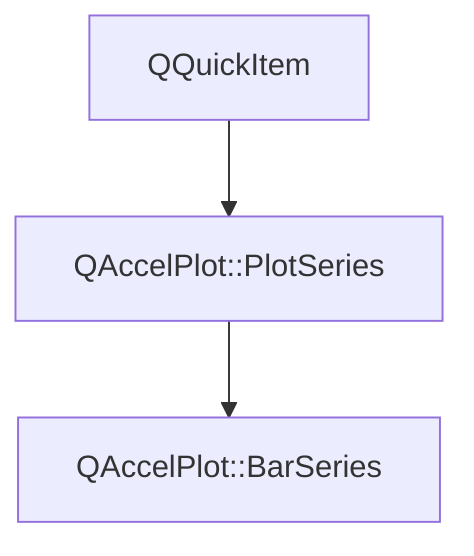

# Class QAccelPlot::BarSeries


[**ClassList**](annotated.md) **>** [**QAccelPlot**](namespaceQAccelPlot.md) **>** [**BarSeries**](classQAccelPlot_1_1BarSeries.md)


_A hardware-accelerated QML item that renders a bar chart._ [More...](#detailed-description)

* `#include <BarSeries.hpp>`


Inherits the following classes: [QAccelPlot::PlotSeries](classQAccelPlot_1_1PlotSeries.md)


## Inheritance diagram




## Public Types inherited from QAccelPlot::PlotSeries

See [QAccelPlot::PlotSeries](classQAccelPlot_1_1PlotSeries.md)

| Type | Name |
| ---: | :--- |
| enum  | [**LegendSymbol**](classQAccelPlot_1_1PlotSeries.md#enum-legendsymbol)  <br>_Supported default legend symbols._  |
| enum  | [**MarkerShape**](classQAccelPlot_1_1PlotSeries.md#enum-markershape)  <br>_Marker shapes shared by every series that draws markers._  |


## Public Properties

| Type | Name |
| ---: | :--- |
| property qreal | [**barOffset**](classQAccelPlot_1_1BarSeries.md#property-baroffset-12)  <br>_Shift of every bar along the position axis in data units, e.g. for grouped bars. Default: 0._  |
| property qreal | [**barWidth**](classQAccelPlot_1_1BarSeries.md#property-barwidth-12)  <br>_Bar width in position-axis data units. Default: 0.8. Clamped to at least 0._  |
| property qreal | [**baselineValue**](classQAccelPlot_1_1BarSeries.md#property-baselinevalue-12)  <br>_Value the bars start from. Default: 0._  |
| property [**RectangleBorder**](classQAccelPlot_1_1RectangleBorder.md) \* | [**border**](classQAccelPlot_1_1BarSeries.md#property-border-12)  <br>_Grouped outline settings, e.g._ `border.width` _and_`border.color` _. No outline by default._ |
| property QList&lt; QColor &gt; | [**categoryColors**](classQAccelPlot_1_1BarSeries.md#property-categorycolors-12)  <br>_Fill colors indexed by each bar's_ `category` _. Default: empty._ |
| property QColor | [**color**](classQAccelPlot_1_1BarSeries.md#property-color-12)  <br>_Fill color of bars without a category color. Default:_ `Colors.dark.seriesPrimary` _._ |
| property int | [**count**](classQAccelPlot_1_1BarSeries.md#property-count-12)  <br>_Read-only: number of bars currently loaded._  |
| property QColor | [**hoverColor**](classQAccelPlot_1_1BarSeries.md#property-hovercolor-12)  <br>_Fill color of the bar under the cursor. Default: an invalid color, no highlight._  |
| property int | [**hoveredIndex**](classQAccelPlot_1_1BarSeries.md#property-hoveredindex-12)  <br>_Read-only: index of the bar under the cursor, or -1 when none._  |
| property qreal | [**minimumWidth**](classQAccelPlot_1_1BarSeries.md#property-minimumwidth-12)  <br>_Minimum drawn bar width in pixels, so bars stay visible when zoomed out. Default: 1. Clamped to at least 0._  |
| property Qt::Orientation | [**orientation**](classQAccelPlot_1_1BarSeries.md#property-orientation-12)  <br>_Direction the bars grow in. Default:_ `Qt.Vertical` _, positions on the X axis and values on the Y axis._ |
| property [**DataTransition**](classQAccelPlot_1_1DataTransition.md) \* | [**transition**](classQAccelPlot_1_1BarSeries.md#property-transition-12)  <br>_Optional data transition animation applied when new data arrives._  |


## Public Properties inherited from QAccelPlot::PlotSeries

See [QAccelPlot::PlotSeries](classQAccelPlot_1_1PlotSeries.md)

| Type | Name |
| ---: | :--- |
| property quint64 | [**dataRevision**](classQAccelPlot_1_1PlotSeries.md#property-datarevision-12)  <br>_Revision incremented by every accepted change of the series' records._  |
| property [**QAccelPlot::SeriesInspection**](classQAccelPlot_1_1SeriesInspection.md) \* | [**inspection**](classQAccelPlot_1_1PlotSeries.md#property-inspection-12)  <br>_Read-only constant: data queries for this series._  |
| property [**LegendSymbol**](classQAccelPlot_1_1PlotSeries.md#enum-legendsymbol) | [**legendSymbol**](classQAccelPlot_1_1PlotSeries.md#property-legendsymbol-12)  <br>_Symbol style requested from the default legend._  |
| property QString | [**name**](classQAccelPlot_1_1PlotSeries.md#property-name-12)  <br>_Identifying name used by the default legend._  |
| property QRectF | [**plotRect**](classQAccelPlot_1_1PlotSeries.md#property-plotrect-12)  <br>_Plot area in parent-item coordinates, assigned by_ `PlotView` _._ |
| property [**Axis**](classQAccelPlot_1_1Axis.md) \* | [**xAxis**](classQAccelPlot_1_1PlotSeries.md#property-xaxis-12)  <br>_Horizontal axis used for data-to-pixel coordinate mapping._  |
| property [**Axis**](classQAccelPlot_1_1Axis.md) \* | [**yAxis**](classQAccelPlot_1_1PlotSeries.md#property-yaxis-12)  <br>_Vertical axis used for data-to-pixel coordinate mapping._  |


## Public Signals

| Type | Name |
| ---: | :--- |
| signal void | [**barOffsetChanged**](classQAccelPlot_1_1BarSeries.md#signal-baroffsetchanged)  <br>_Emitted when the barOffset property changes._  |
| signal void | [**barWidthChanged**](classQAccelPlot_1_1BarSeries.md#signal-barwidthchanged)  <br>_Emitted when the barWidth property changes._  |
| signal void | [**baselineValueChanged**](classQAccelPlot_1_1BarSeries.md#signal-baselinevaluechanged)  <br>_Emitted when the baselineValue property changes._  |
| signal void | [**categoryColorsChanged**](classQAccelPlot_1_1BarSeries.md#signal-categorycolorschanged)  <br>_Emitted when the categoryColors property changes._  |
| signal void | [**colorChanged**](classQAccelPlot_1_1BarSeries.md#signal-colorchanged)  <br>_Emitted when the color property changes._  |
| signal void | [**countChanged**](classQAccelPlot_1_1BarSeries.md#signal-countchanged)  <br>_Emitted when the bar count changes._  |
| signal void | [**hoverColorChanged**](classQAccelPlot_1_1BarSeries.md#signal-hovercolorchanged)  <br>_Emitted when the hoverColor property changes._  |
| signal void | [**hoveredIndexChanged**](classQAccelPlot_1_1BarSeries.md#signal-hoveredindexchanged)  <br>_Emitted when the hovered bar index changes._  |
| signal void | [**minimumWidthChanged**](classQAccelPlot_1_1BarSeries.md#signal-minimumwidthchanged)  <br>_Emitted when the minimumWidth property changes._  |
| signal void | [**orientationChanged**](classQAccelPlot_1_1BarSeries.md#signal-orientationchanged)  <br>_Emitted when the orientation property changes._  |
| signal void | [**transitionChanged**](classQAccelPlot_1_1BarSeries.md#signal-transitionchanged)  <br>_Emitted when the transition property changes._  |


## Public Signals inherited from QAccelPlot::PlotSeries

See [QAccelPlot::PlotSeries](classQAccelPlot_1_1PlotSeries.md)

| Type | Name |
| ---: | :--- |
| signal void | [**dataRevisionChanged**](classQAccelPlot_1_1PlotSeries.md#signal-datarevisionchanged)  <br>_Emitted when the dataRevision property changes._  |
| signal void | [**legendSymbolChanged**](classQAccelPlot_1_1PlotSeries.md#signal-legendsymbolchanged)  <br> |
| signal void | [**nameChanged**](classQAccelPlot_1_1PlotSeries.md#signal-namechanged)  <br> |
| signal void | [**plotRectChanged**](classQAccelPlot_1_1PlotSeries.md#signal-plotrectchanged)  <br> |
| signal void | [**xAxisChanged**](classQAccelPlot_1_1PlotSeries.md#signal-xaxischanged)  <br> |
| signal void | [**yAxisChanged**](classQAccelPlot_1_1PlotSeries.md#signal-yaxischanged)  <br> |


## Public Functions

| Type | Name |
| ---: | :--- |
|   | [**BarSeries**](#function-barseries) (QQuickItem \* parent=nullptr) <br>_Constructs a_ [_**BarSeries**_](classQAccelPlot_1_1BarSeries.md) _with the given__parent_ _._ |
|  Q\_INVOKABLE QVariantMap | [**barAt**](#function-barat) (int index) const<br>_Returns bar_ _index_ _as an object with_`position` _and_`value` _, or_`from` _,_`to` _, and_`value` _for a ranged bar._ |
|  int | [**barIndexAt**](#function-barindexat) (const QPointF & position) const<br>_Returns the index of the topmost bar under item position_ _position_ _, or -1._ |
|  qreal | [**barOffset**](#function-baroffset-22) () const<br>_Returns the shift of every bar along the position axis in data units._  |
|  qreal | [**barWidth**](#function-barwidth-22) () const<br>_Returns the bar width in position-axis data units._  |
|  qreal | [**baselineValue**](#function-baselinevalue-22) () const<br>_Returns the value the bars start from._  |
|  [**RectangleBorder**](classQAccelPlot_1_1RectangleBorder.md) \* | [**border**](#function-border-22) () const<br>_Returns the grouped outline settings. The object is owned by the series._  |
|  QList&lt; QColor &gt; | [**categoryColors**](#function-categorycolors-22) () const<br>_Returns the fill colors indexed by category._  |
| virtual Q\_INVOKABLE void | [**clearData**](#function-cleardata) () override<br>_Removes all bars._  |
|  QColor | [**color**](#function-color-22) () const<br>_Returns the bar fill color._  |
|  bool | [**contains**](#function-contains) (const QPointF & point) override const<br>_Returns_ `true` _when a bar lies under item position__point_ _._ |
|  int | [**count**](#function-count-22) () const<br>_Returns the number of bars currently loaded._  |
|  QColor | [**hoverColor**](#function-hovercolor-22) () const<br>_Returns the fill color of the hovered bar._  |
|  int | [**hoveredIndex**](#function-hoveredindex-22) () const<br>_Returns the index of the hovered bar, or -1 if none._  |
|  qreal | [**minimumWidth**](#function-minimumwidth-22) () const<br>_Returns the minimum drawn bar width in pixels._  |
|  Qt::Orientation | [**orientation**](#function-orientation-22) () const<br>_Returns the direction the bars grow in._  |
| virtual void | [**postData**](#function-postdata-14) (std::vector&lt; double &gt; && data, int barCount) override<br>_Thread-safe: queues_ `setData` _(__data_ _,__barCount_ _) to the item's thread._ |
|  void | [**postData**](#function-postdata-24) (std::vector&lt; double &gt; && data, std::vector&lt; int &gt; && categories, int barCount) <br>_Thread-safe: queues_ `setData` _(__data_ _,__categories_ _,__barCount_ _) to the item's thread._ |
| virtual void | [**postData**](#function-postdata-34) (std::vector&lt; float &gt; && data, int barCount) override<br>_Thread-safe: queues_ `setDataF` _(__data_ _,__barCount_ _) to the item's thread._ |
|  void | [**postData**](#function-postdata-44) (std::vector&lt; float &gt; && data, std::vector&lt; int &gt; && categories, int barCount) <br>_Thread-safe: queues_ `setDataF` _(__data_ _,__categories_ _,__barCount_ _) to the item's thread._ |
|  void | [**postRangedData**](#function-postrangeddata) (std::vector&lt; double &gt; && data, int barCount) <br>_Thread-safe: queues_ `setRangedData` _(__data_ _,__barCount_ _) to the item's thread._ |
|  void | [**setBarOffset**](#function-setbaroffset) (qreal offset) <br>_Sets the shift of every bar along the position axis to_ _offset_ _data units._ |
|  void | [**setBarWidth**](#function-setbarwidth) (qreal width) <br>_Sets the bar width to_ _width_ _data units. Negative values are clamped to 0._ |
|  void | [**setBaselineValue**](#function-setbaselinevalue) (qreal baselineValue) <br>_Sets the value the bars start from to_ _baselineValue_ _. NaN is ignored._ |
|  Q\_INVOKABLE void | [**setCategories**](#function-setcategories) (const QList&lt; int &gt; & categories) <br>_Sets one category per bar. An empty list clears categories; any other size must equal_ `count` _._ |
|  void | [**setCategoryColors**](#function-setcategorycolors) (const QList&lt; QColor &gt; & colors) <br>_Sets the fill colors indexed by category to_ _colors_ _._ |
|  void | [**setColor**](#function-setcolor) (const QColor & color) <br>_Sets the fill color to_ _color_ _._ |
|  Q\_INVOKABLE void | [**setData**](#function-setdata-18) (const QVariantList & bars) <br>_Loads bars from_ _bars_ _, a QML list of numbers or objects._ |
| virtual void | [**setData**](#function-setdata-28) (const double \* data, int barCount) override<br>_Loads bars from a C++ raw double array of_ _barCount_ _interleaved (position, value) pairs._ |
| virtual void | [**setData**](#function-setdata-38) (std::vector&lt; double &gt; && data, int barCount) override<br>_Moves_ _data_ _(__barCount_ _× 2 doubles: position, value) into the series and clears categories. No copy is made._ |
|  void | [**setData**](#function-setdata-48) (std::vector&lt; double &gt; && data, std::vector&lt; int &gt; && categories, int barCount) <br>_Moves_ _data_ _and per-bar__categories_ _(empty, or exactly__barCount_ _) into the series._ |
| virtual void | [**setData**](#function-setdata-58) (const double \* data, int count) <br>_Replaces the series data with_ _count_ _records copied from an interleaved double array. Each concrete series defines its record layout (XY pairs or rectangle edges)._ |
| virtual void | [**setData**](#function-setdata-68) (std::vector&lt; double &gt; && data, int count) <br>_Replaces the series data by moving an interleaved double buffer._  |
|  void | [**setData**](#function-setdata-78) (const double \* data, int count, const [**DataBounds**](structQAccelPlot_1_1PlotSeries_1_1DataBounds.md) & bounds) <br>_Like_ `setData` _(__data_ _,__count_ _), with the data extents given as__bounds_ _instead of scanned for._ |
|  void | [**setData**](#function-setdata-88) (std::vector&lt; double &gt; && data, int count, const [**DataBounds**](structQAccelPlot_1_1PlotSeries_1_1DataBounds.md) & bounds) <br>_Like_ `setData` _(__data_ _,__count_ _), with the data extents given as__bounds_ _instead of scanned for._ |
| virtual void | [**setDataF**](#function-setdataf-17) (const float \* data, int barCount) override<br>_High-performance C++ overload: copies_ _barCount_ _× 2 floats (position, value) from__data_ _and clears categories._ |
| virtual void | [**setDataF**](#function-setdataf-27) (std::vector&lt; float &gt; && data, int barCount) override<br>_High-performance C++ overload: moves_ _data_ _(__barCount_ _× 2 floats) into the series and clears categories._ |
|  void | [**setDataF**](#function-setdataf-37) (std::vector&lt; float &gt; && data, std::vector&lt; int &gt; && categories, int barCount) <br>_Like_ `setDataF` _(__data_ _,__barCount_ _) and also moves per-bar__categories_ _(empty, or exactly__barCount_ _) into the series._ |
| virtual void | [**setDataF**](#function-setdataf-47) (const float \* data, int count) <br>_Replaces the series data with_ _count_ _records copied from an interleaved float array._ |
| virtual void | [**setDataF**](#function-setdataf-57) (std::vector&lt; float &gt; && data, int count) <br>_Replaces the series data by moving an interleaved float buffer._  |
|  void | [**setDataF**](#function-setdataf-67) (const float \* data, int count, const [**DataBounds**](structQAccelPlot_1_1PlotSeries_1_1DataBounds.md) & bounds) <br>_Like_ `setDataF` _(__data_ _,__count_ _), with the data extents given as__bounds_ _instead of scanned for._ |
|  void | [**setDataF**](#function-setdataf-77) (std::vector&lt; float &gt; && data, int count, const [**DataBounds**](structQAccelPlot_1_1PlotSeries_1_1DataBounds.md) & bounds) <br>_Like_ `setDataF` _(__data_ _,__count_ _), with the data extents given as__bounds_ _instead of scanned for._ |
|  void | [**setHoverColor**](#function-sethovercolor) (const QColor & color) <br>_Sets the fill color of the hovered bar to_ _color_ _. An invalid color disables the highlight._ |
|  void | [**setMinimumWidth**](#function-setminimumwidth) (qreal width) <br>_Sets the minimum drawn bar width to_ _width_ _pixels. Negative values are clamped to 0._ |
|  void | [**setOrientation**](#function-setorientation) (Qt::Orientation orientation) <br>_Sets the direction the bars grow in to_ _orientation_ _._ |
|  void | [**setRangedData**](#function-setrangeddata-12) (std::vector&lt; double &gt; && data, int barCount) <br>_Moves ranged bars into the series:_ _data_ _holds__barCount_ _× 3 doubles (from, to, value). Clears categories._ |
|  void | [**setRangedData**](#function-setrangeddata-22) (std::vector&lt; double &gt; && data, std::vector&lt; int &gt; && categories, int barCount) <br>_Like_ `setRangedData` _(__data_ _,__barCount_ _) and also moves per-bar__categories_ _(empty, or exactly__barCount_ _) into the series._ |
|  void | [**setTransition**](#function-settransition) ([**DataTransition**](classQAccelPlot_1_1DataTransition.md) \* transition) <br>_Sets the data transition to_ _transition_ _._ |
|  [**DataTransition**](classQAccelPlot_1_1DataTransition.md) \* | [**transition**](#function-transition-22) () const<br>_Returns the active data transition, or_ `nullptr` _if none._ |
|   | [**~BarSeries**](#function-barseries) () override<br>_Destroys the series, ending its animation on the assigned transition._  |


## Public Functions inherited from QAccelPlot::PlotSeries

See [QAccelPlot::PlotSeries](classQAccelPlot_1_1PlotSeries.md)

| Type | Name |
| ---: | :--- |
|   | [**PlotSeries**](classQAccelPlot_1_1PlotSeries.md#function-plotseries) (QQuickItem \* parent=nullptr) <br> |
| virtual void | [**clearData**](classQAccelPlot_1_1PlotSeries.md#function-cleardata) () = 0<br>_Removes all records from the series._  |
|  quint64 | [**dataRevision**](classQAccelPlot_1_1PlotSeries.md#function-datarevision-22) () const<br>_Returns the current data revision._  |
|  [**SeriesInspection**](classQAccelPlot_1_1SeriesInspection.md) \* | [**inspection**](classQAccelPlot_1_1PlotSeries.md#function-inspection-22) () const<br>_Returns the data queries for this series; created on first use and owned by the series._  |
|  [**LegendSymbol**](classQAccelPlot_1_1PlotSeries.md#enum-legendsymbol) | [**legendSymbol**](classQAccelPlot_1_1PlotSeries.md#function-legendsymbol-22) () const<br> |
|  QString | [**name**](classQAccelPlot_1_1PlotSeries.md#function-name-22) () const<br> |
|  QRectF | [**plotRect**](classQAccelPlot_1_1PlotSeries.md#function-plotrect-22) () const<br> |
| virtual void | [**postData**](classQAccelPlot_1_1PlotSeries.md#function-postdata-12) (std::vector&lt; double &gt; && data, int count) = 0<br>_Queues a moved double buffer for assignment on the series' thread._  |
| virtual void | [**postData**](classQAccelPlot_1_1PlotSeries.md#function-postdata-22) (std::vector&lt; float &gt; && data, int count) = 0<br>_Queues a moved float buffer for assignment on the series' thread._  |
| virtual void | [**setData**](classQAccelPlot_1_1PlotSeries.md#function-setdata-14) (const double \* data, int count) = 0<br>_Replaces the series data with_ _count_ _records copied from an interleaved double array. Each concrete series defines its record layout (XY pairs or rectangle edges)._ |
| virtual void | [**setData**](classQAccelPlot_1_1PlotSeries.md#function-setdata-24) (std::vector&lt; double &gt; && data, int count) = 0<br>_Replaces the series data by moving an interleaved double buffer._  |
|  void | [**setData**](classQAccelPlot_1_1PlotSeries.md#function-setdata-34) (const double \* data, int count, const [**DataBounds**](structQAccelPlot_1_1PlotSeries_1_1DataBounds.md) & bounds) <br>_Like_ `setData` _(__data_ _,__count_ _), with the data extents given as__bounds_ _instead of scanned for._ |
|  void | [**setData**](classQAccelPlot_1_1PlotSeries.md#function-setdata-44) (std::vector&lt; double &gt; && data, int count, const [**DataBounds**](structQAccelPlot_1_1PlotSeries_1_1DataBounds.md) & bounds) <br>_Like_ `setData` _(__data_ _,__count_ _), with the data extents given as__bounds_ _instead of scanned for._ |
| virtual void | [**setDataF**](classQAccelPlot_1_1PlotSeries.md#function-setdataf-14) (const float \* data, int count) = 0<br>_Replaces the series data with_ _count_ _records copied from an interleaved float array._ |
| virtual void | [**setDataF**](classQAccelPlot_1_1PlotSeries.md#function-setdataf-24) (std::vector&lt; float &gt; && data, int count) = 0<br>_Replaces the series data by moving an interleaved float buffer._  |
|  void | [**setDataF**](classQAccelPlot_1_1PlotSeries.md#function-setdataf-34) (const float \* data, int count, const [**DataBounds**](structQAccelPlot_1_1PlotSeries_1_1DataBounds.md) & bounds) <br>_Like_ `setDataF` _(__data_ _,__count_ _), with the data extents given as__bounds_ _instead of scanned for._ |
|  void | [**setDataF**](classQAccelPlot_1_1PlotSeries.md#function-setdataf-44) (std::vector&lt; float &gt; && data, int count, const [**DataBounds**](structQAccelPlot_1_1PlotSeries_1_1DataBounds.md) & bounds) <br>_Like_ `setDataF` _(__data_ _,__count_ _), with the data extents given as__bounds_ _instead of scanned for._ |
|  void | [**setLegendSymbol**](classQAccelPlot_1_1PlotSeries.md#function-setlegendsymbol) ([**LegendSymbol**](classQAccelPlot_1_1PlotSeries.md#enum-legendsymbol) symbol) <br> |
|  void | [**setName**](classQAccelPlot_1_1PlotSeries.md#function-setname) (const QString & name) <br> |
|  void | [**setPlotRect**](classQAccelPlot_1_1PlotSeries.md#function-setplotrect) (const QRectF & rect) <br>_Updates the series geometry to exactly cover_ _rect_ _._ |
|  void | [**setXAxis**](classQAccelPlot_1_1PlotSeries.md#function-setxaxis) ([**Axis**](classQAccelPlot_1_1Axis.md) \* axis) <br> |
|  void | [**setYAxis**](classQAccelPlot_1_1PlotSeries.md#function-setyaxis) ([**Axis**](classQAccelPlot_1_1Axis.md) \* axis) <br> |
|  [**Axis**](classQAccelPlot_1_1Axis.md) \* | [**xAxis**](classQAccelPlot_1_1PlotSeries.md#function-xaxis-22) () const<br> |
|  std::optional&lt; [**DataExtent**](structQAccelPlot_1_1PlotSeries_1_1DataExtent.md) &gt; | [**xDataRange**](classQAccelPlot_1_1PlotSeries.md#function-xdatarange) () const<br>_Returns the extent this series reports to its horizontal axis, or_ `std::nullopt` _when it has none._ |
|  [**Axis**](classQAccelPlot_1_1Axis.md) \* | [**yAxis**](classQAccelPlot_1_1PlotSeries.md#function-yaxis-22) () const<br> |
|  std::optional&lt; [**DataExtent**](structQAccelPlot_1_1PlotSeries_1_1DataExtent.md) &gt; | [**yDataRange**](classQAccelPlot_1_1PlotSeries.md#function-ydatarange) () const<br>_Returns the extent this series reports to its vertical axis, or_ `std::nullopt` _when it has none._ |
|   | [**~PlotSeries**](classQAccelPlot_1_1PlotSeries.md#function-plotseries) () override<br> |


## Protected Types inherited from QAccelPlot::PlotSeries

See [QAccelPlot::PlotSeries](classQAccelPlot_1_1PlotSeries.md)

| Type | Name |
| ---: | :--- |
| enum  | [**DataChange**](classQAccelPlot_1_1PlotSeries.md#enum-datachange)  <br>_How the records changed in a data update._  |


## Protected Functions

| Type | Name |
| ---: | :--- |
| virtual [**DataRanges**](structQAccelPlot_1_1PlotSeries_1_1DataRanges.md) | [**computeDataRanges**](#function-computedataranges) () override const<br>_Scans the records for their extents. The default implementation has none._  |
|  void | [**hoverEnterEvent**](#function-hoverenterevent) (QHoverEvent \* event) override<br> |
|  void | [**hoverLeaveEvent**](#function-hoverleaveevent) (QHoverEvent \* event) override<br> |
|  void | [**hoverMoveEvent**](#function-hovermoveevent) (QHoverEvent \* event) override<br> |
| virtual [**InspectionRecord**](structQAccelPlot_1_1InspectionRecord.md) | [**inspectionRecord**](#function-inspectionrecord) (int index) override const<br>_Returns the bar at_ _index_ _with its position, value, and category._ |
| virtual [**InspectionRecord**](structQAccelPlot_1_1InspectionRecord.md) | [**inspectionRecordAt**](#function-inspectionrecordat) (const QPointF & position) override const<br>_Returns the bar drawn at the series-local_ _position_ _._ |
| virtual void | [**onAxisScaleChanged**](#function-onaxisscalechanged) () override<br>_Refreshes data ranges and uploaded coordinates when an axis changes scale._  |
|  QSGNode \* | [**updatePaintNode**](#function-updatepaintnode) (QSGNode \* oldNode, UpdatePaintNodeData \*) override<br> |


## Protected Functions inherited from QAccelPlot::PlotSeries

See [QAccelPlot::PlotSeries](classQAccelPlot_1_1PlotSeries.md)

| Type | Name |
| ---: | :--- |
| virtual [**DataRanges**](structQAccelPlot_1_1PlotSeries_1_1DataRanges.md) | [**computeDataRanges**](classQAccelPlot_1_1PlotSeries.md#function-computedataranges) () const<br>_Scans the records for their extents. The default implementation has none._  |
|  bool | [**event**](classQAccelPlot_1_1PlotSeries.md#function-event) (QEvent \* event) override<br>_Withholds hover events from a series beneath another series under the cursor._  |
|  void | [**extendXDataRange**](classQAccelPlot_1_1PlotSeries.md#function-extendxdatarange) (qreal x) <br>_Widens the X extent to include_ _x_ _and notifies the bound axes._ |
|  void | [**extendYDataRange**](classQAccelPlot_1_1PlotSeries.md#function-extendydatarange) (qreal y) <br>_Widens the Y extent to include_ _y_ _. A non-finite__y_ _leaves the extent unchanged._ |
| virtual bool | [**inspectionAvailable**](classQAccelPlot_1_1PlotSeries.md#function-inspectionavailable) () const<br>_Returns false while the records are ambiguous, such as during a data transition. Default: true._  |
|  void | [**inspectionDataChanged**](classQAccelPlot_1_1PlotSeries.md#function-inspectiondatachanged) ([**DataChange**](classQAccelPlot_1_1PlotSeries.md#enum-datachange) change=DataChange::Replaced) <br>_Advances the data revision and refreshes the data queries. Call after every accepted record change._  |
| virtual [**InspectionRecord**](structQAccelPlot_1_1InspectionRecord.md) | [**inspectionRecord**](classQAccelPlot_1_1PlotSeries.md#function-inspectionrecord) (int index) const<br>_Returns the native record at_ _index_ _for series that are not plain XY series. Default: unsupported._ |
| virtual [**InspectionRecord**](structQAccelPlot_1_1InspectionRecord.md) | [**inspectionRecordAt**](classQAccelPlot_1_1PlotSeries.md#function-inspectionrecordat) (const QPointF & position) const<br>_Returns the native record drawn at the series-local_ _position_ _. Default: unsupported._ |
| virtual [**InspectionSource**](structQAccelPlot_1_1InspectionSource.md) | [**inspectionSource**](classQAccelPlot_1_1PlotSeries.md#function-inspectionsource) () const<br>_Returns a view of the XY records that sample queries search. The default has none._  |
|  void | [**invalidateDataRanges**](classQAccelPlot_1_1PlotSeries.md#function-invalidatedataranges) () <br>_Discards the cached extents and notifies the bound axes._  |
|  void | [**invalidateInspection**](classQAccelPlot_1_1PlotSeries.md#function-invalidateinspection) () <br>_Refreshes the data queries after record validity changed without a data change, such as an axis scale switch._  |
| virtual void | [**onAxisRangeChanged**](classQAccelPlot_1_1PlotSeries.md#function-onaxisrangechanged) () <br>_Called when the viewport of a bound axis changes. The default implementation schedules a repaint._  |
| virtual void | [**onAxisScaleChanged**](classQAccelPlot_1_1PlotSeries.md#function-onaxisscalechanged) () <br>_Called when a bound axis switches between linear and logarithmic scale, or a different axis is bound._  |
|  QRectF | [**resolvePlotRect**](classQAccelPlot_1_1PlotSeries.md#function-resolveplotrect) () const<br>_Returns the plot area to render into:_ `plotRect` _when set, otherwise the item's current size._ |


## Detailed Description


Each bar is a (position, value) pair. A vertical bar is centered on `position` along the X axis and spans from `baselineValue` to `value` along the Y axis; `orientation` `Qt.Horizontal` swaps the axes. Bars are uploaded to the GPU as a float data texture of two floats per bar, and `barWidth`, `barOffset`, and `baselineValue` are applied in the shader, so changing them does not re-upload the data. The `setData()` overloads keep doubles and upload them relative to an origin near the data, so large positions such as epoch timestamps stay precise.


Bars with a NaN or infinite position, or a NaN value, are not drawn or hovered. An infinite value extends the bar to the plot edge. Values below `baselineValue` extend the bar the other way.


A ranged bar is a (from, to, value) triple that spans from `from` to `to` along the position axis, e.g. a histogram bin. `barWidth` and `barOffset` do not apply to ranged bars. A ranged bar with a NaN edge is not drawn, and an infinite edge extends it to the plot edge. A series holds either ranged bars or (position, value) bars.


Each bar can carry a `category`, an index into `categoryColors`. Bars without a category, or with one outside `categoryColors`, use `color`. For grouped bars, use one series per group with a narrower `barWidth` and a different `barOffset`.


**
**

Assign a `MorphTransition` or `DrawTransition` to `transition` to animate data updates. With `MorphTransition`, bars move to their new position and value, new bars grow from `baselineValue`, and removed bars shrink to it. Bars that change between ranged and (position, value) all grow in. `count`, `barAt()`, the data ranges, hover, and inspection use the new data from the start of the animation. While a transition is enabled, the `setDataF()` overloads store doubles. `clearData()`, and replacing, clearing, or cancelling `transition`, skip to the new data.


**
**

Up to 16,777,216 (2^24) bars are drawn correctly, as the shader indexes bars in single precision.


**See also:** [**RectangleSeries**](classQAccelPlot_1_1RectangleSeries.md), [**Axis**](classQAccelPlot_1_1Axis.md), [**MorphTransition**](classQAccelPlot_1_1MorphTransition.md), [**DrawTransition**](classQAccelPlot_1_1DrawTransition.md) 


    
## Public Properties Documentation


### property barOffset {#property-baroffset-12}

_Shift of every bar along the position axis in data units, e.g. for grouped bars. Default: 0._ 
```C++
qreal QAccelPlot::BarSeries::barOffset;
```


<hr>


### property barWidth {#property-barwidth-12}

_Bar width in position-axis data units. Default: 0.8. Clamped to at least 0._ 
```C++
qreal QAccelPlot::BarSeries::barWidth;
```


<hr>


### property baselineValue {#property-baselinevalue-12}

_Value the bars start from. Default: 0._ 
```C++
qreal QAccelPlot::BarSeries::baselineValue;
```


`-Infinity`, or a non-positive baseline on a logarithmic value axis, starts the bars at the plot edge. 


        

<hr>


### property border {#property-border-12}

_Grouped outline settings, e.g._ `border.width` _and_`border.color` _. No outline by default._
```C++
RectangleBorder* QAccelPlot::BarSeries::border;
```


<hr>


### property categoryColors {#property-categorycolors-12}

_Fill colors indexed by each bar's_ `category` _. Default: empty._
```C++
QList<QColor> QAccelPlot::BarSeries::categoryColors;
```


<hr>


### property color {#property-color-12}

_Fill color of bars without a category color. Default:_ `Colors.dark.seriesPrimary` _._
```C++
QColor QAccelPlot::BarSeries::color;
```


<hr>


### property count {#property-count-12}

_Read-only: number of bars currently loaded._ 
```C++
int QAccelPlot::BarSeries::count;
```


<hr>


### property hoverColor {#property-hovercolor-12}

_Fill color of the bar under the cursor. Default: an invalid color, no highlight._ 
```C++
QColor QAccelPlot::BarSeries::hoverColor;
```


<hr>


### property hoveredIndex {#property-hoveredindex-12}

_Read-only: index of the bar under the cursor, or -1 when none._ 
```C++
int QAccelPlot::BarSeries::hoveredIndex;
```


<hr>


### property minimumWidth {#property-minimumwidth-12}

_Minimum drawn bar width in pixels, so bars stay visible when zoomed out. Default: 1. Clamped to at least 0._ 
```C++
qreal QAccelPlot::BarSeries::minimumWidth;
```


<hr>


### property orientation {#property-orientation-12}

_Direction the bars grow in. Default:_ `Qt.Vertical` _, positions on the X axis and values on the Y axis._
```C++
Qt::Orientation QAccelPlot::BarSeries::orientation;
```


<hr>


### property transition {#property-transition-12}

_Optional data transition animation applied when new data arrives._ 
```C++
DataTransition* QAccelPlot::BarSeries::transition;
```


<hr>
## Public Signals Documentation


### signal barOffsetChanged {#signal-baroffsetchanged}

_Emitted when the barOffset property changes._ 
```C++
void QAccelPlot::BarSeries::barOffsetChanged;
```


<hr>


### signal barWidthChanged {#signal-barwidthchanged}

_Emitted when the barWidth property changes._ 
```C++
void QAccelPlot::BarSeries::barWidthChanged;
```


<hr>


### signal baselineValueChanged {#signal-baselinevaluechanged}

_Emitted when the baselineValue property changes._ 
```C++
void QAccelPlot::BarSeries::baselineValueChanged;
```


<hr>


### signal categoryColorsChanged {#signal-categorycolorschanged}

_Emitted when the categoryColors property changes._ 
```C++
void QAccelPlot::BarSeries::categoryColorsChanged;
```


<hr>


### signal colorChanged {#signal-colorchanged}

_Emitted when the color property changes._ 
```C++
void QAccelPlot::BarSeries::colorChanged;
```


<hr>


### signal countChanged {#signal-countchanged}

_Emitted when the bar count changes._ 
```C++
void QAccelPlot::BarSeries::countChanged;
```


<hr>


### signal hoverColorChanged {#signal-hovercolorchanged}

_Emitted when the hoverColor property changes._ 
```C++
void QAccelPlot::BarSeries::hoverColorChanged;
```


<hr>


### signal hoveredIndexChanged {#signal-hoveredindexchanged}

_Emitted when the hovered bar index changes._ 
```C++
void QAccelPlot::BarSeries::hoveredIndexChanged;
```


<hr>


### signal minimumWidthChanged {#signal-minimumwidthchanged}

_Emitted when the minimumWidth property changes._ 
```C++
void QAccelPlot::BarSeries::minimumWidthChanged;
```


<hr>


### signal orientationChanged {#signal-orientationchanged}

_Emitted when the orientation property changes._ 
```C++
void QAccelPlot::BarSeries::orientationChanged;
```


<hr>


### signal transitionChanged {#signal-transitionchanged}

_Emitted when the transition property changes._ 
```C++
void QAccelPlot::BarSeries::transitionChanged;
```


<hr>
## Public Functions Documentation


### function BarSeries {#function-barseries}

_Constructs a_ [_**BarSeries**_](classQAccelPlot_1_1BarSeries.md) _with the given__parent_ _._
```C++
explicit QAccelPlot::BarSeries::BarSeries (
    QQuickItem * parent=nullptr
) 
```


<hr>


### function barAt {#function-barat}

_Returns bar_ _index_ _as an object with_`position` _and_`value` _, or_`from` _,_`to` _, and_`value` _for a ranged bar._
```C++
Q_INVOKABLE QVariantMap QAccelPlot::BarSeries::barAt (
    int index
) const
```


Includes `category` when categories are set. Returns an empty object when _index_ is out of range. 


        

<hr>


### function barIndexAt {#function-barindexat}

_Returns the index of the topmost bar under item position_ _position_ _, or -1._
```C++
int QAccelPlot::BarSeries::barIndexAt (
    const QPointF & position
) const
```


<hr>


### function barOffset {#function-baroffset-22}

_Returns the shift of every bar along the position axis in data units._ 
```C++
qreal QAccelPlot::BarSeries::barOffset () const
```


<hr>


### function barWidth {#function-barwidth-22}

_Returns the bar width in position-axis data units._ 
```C++
qreal QAccelPlot::BarSeries::barWidth () const
```


<hr>


### function baselineValue {#function-baselinevalue-22}

_Returns the value the bars start from._ 
```C++
qreal QAccelPlot::BarSeries::baselineValue () const
```


<hr>


### function border {#function-border-22}

_Returns the grouped outline settings. The object is owned by the series._ 
```C++
RectangleBorder * QAccelPlot::BarSeries::border () const
```


<hr>


### function categoryColors {#function-categorycolors-22}

_Returns the fill colors indexed by category._ 
```C++
QList< QColor > QAccelPlot::BarSeries::categoryColors () const
```


<hr>


### function clearData {#function-cleardata}

_Removes all bars._ 
```C++
virtual Q_INVOKABLE void QAccelPlot::BarSeries::clearData () override
```


Implements [*QAccelPlot::PlotSeries::clearData*](classQAccelPlot_1_1PlotSeries.md#function-cleardata)


<hr>


### function color {#function-color-22}

_Returns the bar fill color._ 
```C++
QColor QAccelPlot::BarSeries::color () const
```


<hr>


### function contains {#function-contains}

_Returns_ `true` _when a bar lies under item position__point_ _._
```C++
bool QAccelPlot::BarSeries::contains (
    const QPointF & point
) override const
```


Hover delivery uses this test, so stacked series underneath still receive hover events outside the bars. 


        

<hr>


### function count {#function-count-22}

_Returns the number of bars currently loaded._ 
```C++
int QAccelPlot::BarSeries::count () const
```


<hr>


### function hoverColor {#function-hovercolor-22}

_Returns the fill color of the hovered bar._ 
```C++
QColor QAccelPlot::BarSeries::hoverColor () const
```


<hr>


### function hoveredIndex {#function-hoveredindex-22}

_Returns the index of the hovered bar, or -1 if none._ 
```C++
int QAccelPlot::BarSeries::hoveredIndex () const
```


<hr>


### function minimumWidth {#function-minimumwidth-22}

_Returns the minimum drawn bar width in pixels._ 
```C++
qreal QAccelPlot::BarSeries::minimumWidth () const
```


<hr>


### function orientation {#function-orientation-22}

_Returns the direction the bars grow in._ 
```C++
Qt::Orientation QAccelPlot::BarSeries::orientation () const
```


<hr>


### function postData {#function-postdata-14}

_Thread-safe: queues_ `setData` _(__data_ _,__barCount_ _) to the item's thread._
```C++
virtual void QAccelPlot::BarSeries::postData (
    std::vector< double > && data,
    int barCount
) override
```


Implements [*QAccelPlot::PlotSeries::postData*](classQAccelPlot_1_1PlotSeries.md#function-postdata-12)


<hr>


### function postData {#function-postdata-24}

_Thread-safe: queues_ `setData` _(__data_ _,__categories_ _,__barCount_ _) to the item's thread._
```C++
void QAccelPlot::BarSeries::postData (
    std::vector< double > && data,
    std::vector< int > && categories,
    int barCount
) 
```


<hr>


### function postData {#function-postdata-34}

_Thread-safe: queues_ `setDataF` _(__data_ _,__barCount_ _) to the item's thread._
```C++
virtual void QAccelPlot::BarSeries::postData (
    std::vector< float > && data,
    int barCount
) override
```


Implements [*QAccelPlot::PlotSeries::postData*](classQAccelPlot_1_1PlotSeries.md#function-postdata-22)


<hr>


### function postData {#function-postdata-44}

_Thread-safe: queues_ `setDataF` _(__data_ _,__categories_ _,__barCount_ _) to the item's thread._
```C++
void QAccelPlot::BarSeries::postData (
    std::vector< float > && data,
    std::vector< int > && categories,
    int barCount
) 
```


<hr>


### function postRangedData {#function-postrangeddata}

_Thread-safe: queues_ `setRangedData` _(__data_ _,__barCount_ _) to the item's thread._
```C++
void QAccelPlot::BarSeries::postRangedData (
    std::vector< double > && data,
    int barCount
) 
```


<hr>


### function setBarOffset {#function-setbaroffset}

_Sets the shift of every bar along the position axis to_ _offset_ _data units._
```C++
void QAccelPlot::BarSeries::setBarOffset (
    qreal offset
) 
```


<hr>


### function setBarWidth {#function-setbarwidth}

_Sets the bar width to_ _width_ _data units. Negative values are clamped to 0._
```C++
void QAccelPlot::BarSeries::setBarWidth (
    qreal width
) 
```


<hr>


### function setBaselineValue {#function-setbaselinevalue}

_Sets the value the bars start from to_ _baselineValue_ _. NaN is ignored._
```C++
void QAccelPlot::BarSeries::setBaselineValue (
    qreal baselineValue
) 
```


<hr>


### function setCategories {#function-setcategories}

_Sets one category per bar. An empty list clears categories; any other size must equal_ `count` _._
```C++
Q_INVOKABLE void QAccelPlot::BarSeries::setCategories (
    const QList< int > & categories
) 
```


<hr>


### function setCategoryColors {#function-setcategorycolors}

_Sets the fill colors indexed by category to_ _colors_ _._
```C++
void QAccelPlot::BarSeries::setCategoryColors (
    const QList< QColor > & colors
) 
```


<hr>


### function setColor {#function-setcolor}

_Sets the fill color to_ _color_ _._
```C++
void QAccelPlot::BarSeries::setColor (
    const QColor & color
) 
```


<hr>


### function setData {#function-setdata-18}

_Loads bars from_ _bars_ _, a QML list of numbers or objects._
```C++
Q_INVOKABLE void QAccelPlot::BarSeries::setData (
    const QVariantList & bars
) 
```


A number is the value of a bar at position = its list index. An object has `position`, `value`, and an optional integer `category` that selects the fill color from `categoryColors`. A missing `position` is the list index; a missing `value` is NaN.


When any object has `from` or `to`, all bars are ranged: each object has `from`, `to`, `value`, and an optional `category`, and a missing `from` or `to` is NaN. 


        

<hr>


### function setData {#function-setdata-28}

_Loads bars from a C++ raw double array of_ _barCount_ _interleaved (position, value) pairs._
```C++
virtual void QAccelPlot::BarSeries::setData (
    const double * data,
    int barCount
) override
```


Implements [*QAccelPlot::PlotSeries::setData*](classQAccelPlot_1_1PlotSeries.md#function-setdata-14)


<hr>


### function setData {#function-setdata-38}

_Moves_ _data_ _(__barCount_ _× 2 doubles: position, value) into the series and clears categories. No copy is made._
```C++
virtual void QAccelPlot::BarSeries::setData (
    std::vector< double > && data,
    int barCount
) override
```


Implements [*QAccelPlot::PlotSeries::setData*](classQAccelPlot_1_1PlotSeries.md#function-setdata-24)


<hr>


### function setData {#function-setdata-48}

_Moves_ _data_ _and per-bar__categories_ _(empty, or exactly__barCount_ _) into the series._
```C++
void QAccelPlot::BarSeries::setData (
    std::vector< double > && data,
    std::vector< int > && categories,
    int barCount
) 
```


<hr>


### function setData {#function-setdata-58}

_Replaces the series data with_ _count_ _records copied from an interleaved double array. Each concrete series defines its record layout (XY pairs or rectangle edges)._
```C++
virtual void QAccelPlot::BarSeries::setData (
    const double * data,
    int count
) 
```


Implements [*QAccelPlot::PlotSeries::setData*](classQAccelPlot_1_1PlotSeries.md#function-setdata-14)


<hr>


### function setData {#function-setdata-68}

_Replaces the series data by moving an interleaved double buffer._ 
```C++
virtual void QAccelPlot::BarSeries::setData (
    std::vector< double > && data,
    int count
) 
```


Implements [*QAccelPlot::PlotSeries::setData*](classQAccelPlot_1_1PlotSeries.md#function-setdata-24)


<hr>


### function setData {#function-setdata-78}

_Like_ `setData` _(__data_ _,__count_ _), with the data extents given as__bounds_ _instead of scanned for._
```C++
void QAccelPlot::BarSeries::setData (
    const double * data,
    int count,
    const DataBounds & bounds
) 
```


<hr>


### function setData {#function-setdata-88}

_Like_ `setData` _(__data_ _,__count_ _), with the data extents given as__bounds_ _instead of scanned for._
```C++
void QAccelPlot::BarSeries::setData (
    std::vector< double > && data,
    int count,
    const DataBounds & bounds
) 
```


<hr>


### function setDataF {#function-setdataf-17}

_High-performance C++ overload: copies_ _barCount_ _× 2 floats (position, value) from__data_ _and clears categories._
```C++
virtual void QAccelPlot::BarSeries::setDataF (
    const float * data,
    int barCount
) override
```


Implements [*QAccelPlot::PlotSeries::setDataF*](classQAccelPlot_1_1PlotSeries.md#function-setdataf-14)


<hr>


### function setDataF {#function-setdataf-27}

_High-performance C++ overload: moves_ _data_ _(__barCount_ _× 2 floats) into the series and clears categories._
```C++
virtual void QAccelPlot::BarSeries::setDataF (
    std::vector< float > && data,
    int barCount
) override
```


Implements [*QAccelPlot::PlotSeries::setDataF*](classQAccelPlot_1_1PlotSeries.md#function-setdataf-24)


<hr>


### function setDataF {#function-setdataf-37}

_Like_ `setDataF` _(__data_ _,__barCount_ _) and also moves per-bar__categories_ _(empty, or exactly__barCount_ _) into the series._
```C++
void QAccelPlot::BarSeries::setDataF (
    std::vector< float > && data,
    std::vector< int > && categories,
    int barCount
) 
```


<hr>


### function setDataF {#function-setdataf-47}

_Replaces the series data with_ _count_ _records copied from an interleaved float array._
```C++
virtual void QAccelPlot::BarSeries::setDataF (
    const float * data,
    int count
) 
```


Implements [*QAccelPlot::PlotSeries::setDataF*](classQAccelPlot_1_1PlotSeries.md#function-setdataf-14)


<hr>


### function setDataF {#function-setdataf-57}

_Replaces the series data by moving an interleaved float buffer._ 
```C++
virtual void QAccelPlot::BarSeries::setDataF (
    std::vector< float > && data,
    int count
) 
```


Implements [*QAccelPlot::PlotSeries::setDataF*](classQAccelPlot_1_1PlotSeries.md#function-setdataf-24)


<hr>


### function setDataF {#function-setdataf-67}

_Like_ `setDataF` _(__data_ _,__count_ _), with the data extents given as__bounds_ _instead of scanned for._
```C++
void QAccelPlot::BarSeries::setDataF (
    const float * data,
    int count,
    const DataBounds & bounds
) 
```


<hr>


### function setDataF {#function-setdataf-77}

_Like_ `setDataF` _(__data_ _,__count_ _), with the data extents given as__bounds_ _instead of scanned for._
```C++
void QAccelPlot::BarSeries::setDataF (
    std::vector< float > && data,
    int count,
    const DataBounds & bounds
) 
```


<hr>


### function setHoverColor {#function-sethovercolor}

_Sets the fill color of the hovered bar to_ _color_ _. An invalid color disables the highlight._
```C++
void QAccelPlot::BarSeries::setHoverColor (
    const QColor & color
) 
```


<hr>


### function setMinimumWidth {#function-setminimumwidth}

_Sets the minimum drawn bar width to_ _width_ _pixels. Negative values are clamped to 0._
```C++
void QAccelPlot::BarSeries::setMinimumWidth (
    qreal width
) 
```


<hr>


### function setOrientation {#function-setorientation}

_Sets the direction the bars grow in to_ _orientation_ _._
```C++
void QAccelPlot::BarSeries::setOrientation (
    Qt::Orientation orientation
) 
```


<hr>


### function setRangedData {#function-setrangeddata-12}

_Moves ranged bars into the series:_ _data_ _holds__barCount_ _× 3 doubles (from, to, value). Clears categories._
```C++
void QAccelPlot::BarSeries::setRangedData (
    std::vector< double > && data,
    int barCount
) 
```


<hr>


### function setRangedData {#function-setrangeddata-22}

_Like_ `setRangedData` _(__data_ _,__barCount_ _) and also moves per-bar__categories_ _(empty, or exactly__barCount_ _) into the series._
```C++
void QAccelPlot::BarSeries::setRangedData (
    std::vector< double > && data,
    std::vector< int > && categories,
    int barCount
) 
```


<hr>


### function setTransition {#function-settransition}

_Sets the data transition to_ _transition_ _._
```C++
void QAccelPlot::BarSeries::setTransition (
    DataTransition * transition
) 
```


<hr>


### function transition {#function-transition-22}

_Returns the active data transition, or_ `nullptr` _if none._
```C++
DataTransition * QAccelPlot::BarSeries::transition () const
```


<hr>


### function ~BarSeries {#function-barseries}

_Destroys the series, ending its animation on the assigned transition._ 
```C++
QAccelPlot::BarSeries::~BarSeries () override
```


<hr>
## Protected Functions Documentation


### function computeDataRanges {#function-computedataranges}

_Scans the records for their extents. The default implementation has none._ 
```C++
virtual DataRanges QAccelPlot::BarSeries::computeDataRanges () override const
```


Called when a data range is read after `invalidateDataRanges()`, so a series that nothing asks for its range never scans. 


        
Implements [*QAccelPlot::PlotSeries::computeDataRanges*](classQAccelPlot_1_1PlotSeries.md#function-computedataranges)


<hr>


### function hoverEnterEvent {#function-hoverenterevent}

```C++
void QAccelPlot::BarSeries::hoverEnterEvent (
    QHoverEvent * event
) override
```


<hr>


### function hoverLeaveEvent {#function-hoverleaveevent}

```C++
void QAccelPlot::BarSeries::hoverLeaveEvent (
    QHoverEvent * event
) override
```


<hr>


### function hoverMoveEvent {#function-hovermoveevent}

```C++
void QAccelPlot::BarSeries::hoverMoveEvent (
    QHoverEvent * event
) override
```


<hr>


### function inspectionRecord {#function-inspectionrecord}

_Returns the bar at_ _index_ _with its position, value, and category._
```C++
virtual InspectionRecord QAccelPlot::BarSeries::inspectionRecord (
    int index
) override const
```


Implements [*QAccelPlot::PlotSeries::inspectionRecord*](classQAccelPlot_1_1PlotSeries.md#function-inspectionrecord)


<hr>


### function inspectionRecordAt {#function-inspectionrecordat}

_Returns the bar drawn at the series-local_ _position_ _._
```C++
virtual InspectionRecord QAccelPlot::BarSeries::inspectionRecordAt (
    const QPointF & position
) override const
```


Implements [*QAccelPlot::PlotSeries::inspectionRecordAt*](classQAccelPlot_1_1PlotSeries.md#function-inspectionrecordat)


<hr>


### function onAxisScaleChanged {#function-onaxisscalechanged}

_Refreshes data ranges and uploaded coordinates when an axis changes scale._ 
```C++
virtual void QAccelPlot::BarSeries::onAxisScaleChanged () override
```


Implements [*QAccelPlot::PlotSeries::onAxisScaleChanged*](classQAccelPlot_1_1PlotSeries.md#function-onaxisscalechanged)


<hr>


### function updatePaintNode {#function-updatepaintnode}

```C++
QSGNode * QAccelPlot::BarSeries::updatePaintNode (
    QSGNode * oldNode,
    UpdatePaintNodeData *
) override
```


<hr>

------------------------------
The documentation for this class was generated from the following file `QAccelPlot/src/QAccelPlot/series/BarSeries.hpp`

