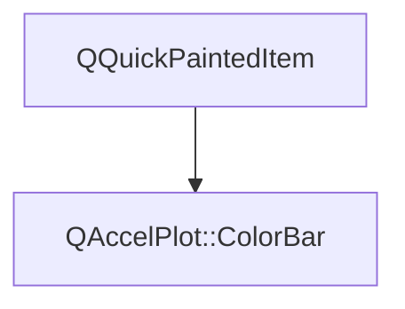

# Class QAccelPlot::ColorBar


[**ClassList**](annotated.md) **>** [**QAccelPlot**](namespaceQAccelPlot.md) **>** [**ColorBar**](classQAccelPlot_1_1ColorBar.md)


_A continuous key that shows how a series'_ `Colormap` _maps values to colors._[More...](#detailed-description)

* `#include <ColorBar.hpp>`


Inherits the following classes: QQuickPaintedItem


## Inheritance diagram


```mermaid
flowchart TB
  classQAccelPlot_1_1ColorBar["QAccelPlot::ColorBar"]

  external_base_classQAccelPlot_1_1ColorBar_1["QQuickPaintedItem"]
  external_base_classQAccelPlot_1_1ColorBar_1 --> classQAccelPlot_1_1ColorBar

```


## Public Types

| Type | Name |
| ---: | :--- |
| enum  | [**Orientation**](#enum-orientation)  <br>_Direction of the color ramp._  |


## Public Properties

| Type | Name |
| ---: | :--- |
| property qreal | [**barThickness**](classQAccelPlot_1_1ColorBar.md#property-barthickness-12)  <br>_Thickness in pixels of the color strip across the ramp direction. Default: 12._  |
| property QColor | [**borderColor**](classQAccelPlot_1_1ColorBar.md#property-bordercolor-12)  <br>_Color of the outline around the strip. Default:_ `Colors.dark.axisLine` _._ |
| property qreal | [**borderWidth**](classQAccelPlot_1_1ColorBar.md#property-borderwidth-12)  <br>_Width in pixels of the outline around the strip. 0 draws no outline. Default: 1._  |
| property bool | [**hovered**](classQAccelPlot_1_1ColorBar.md#property-hovered-12)  <br>_Read-only:_ `true` _while the mouse cursor is over the bar. Reported only while_`interactive` _is set._ |
| property bool | [**interactive**](classQAccelPlot_1_1ColorBar.md#property-interactive-12)  <br>_Whether dragging, the mouse wheel, and double-clicking change the colormap's value range. Default:_ `false` _._ |
| property QString | [**label**](classQAccelPlot_1_1ColorBar.md#property-label-12)  <br>_Optional title drawn beside the tick labels. Default: empty._  |
| property QColor | [**labelColor**](classQAccelPlot_1_1ColorBar.md#property-labelcolor-12)  <br>_Color of the title. Default:_ `Colors.dark.axisLine` _._ |
| property QFont | [**labelFont**](classQAccelPlot_1_1ColorBar.md#property-labelfont-12)  <br>_Font of the title. Default: application default font._  |
| property qreal | [**labelPadding**](classQAccelPlot_1_1ColorBar.md#property-labelpadding-12)  <br>_Gap in pixels between the tick labels and the title. Default: 6._  |
| property [**Orientation**](classQAccelPlot_1_1ColorBar.md#enum-orientation) | [**orientation**](classQAccelPlot_1_1ColorBar.md#property-orientation-12)  <br>_Direction of the ramp:_ `ColorBar.Vertical` _or_`ColorBar.Horizontal` _. Default:_`Vertical` _._ |
| property [**PointCloud**](classQAccelPlot_1_1PointCloud.md) \* | [**series**](classQAccelPlot_1_1ColorBar.md#property-series-12)  <br>_Series whose colormap and resolved value range are shown. Default: null._  |
| property qreal | [**tickLabelWidth**](classQAccelPlot_1_1ColorBar.md#property-ticklabelwidth-12)  <br>_Width in pixels reserved for the tick labels of a vertical bar. Default: 16._  |
| property [**AxisTicker**](classQAccelPlot_1_1AxisTicker.md) \* | [**ticker**](classQAccelPlot_1_1ColorBar.md#property-ticker-12)  <br>_Read-only constant: tick appearance, count, and label formatter._  |
| property double | [**zoomScaleFactor**](classQAccelPlot_1_1ColorBar.md#property-zoomscalefactor-12)  <br>_Fraction by which the value range is multiplied on each inward mouse-wheel step. Must be in (0, 1). Default: 0.9._  |


## Public Signals

| Type | Name |
| ---: | :--- |
| signal void | [**barThicknessChanged**](classQAccelPlot_1_1ColorBar.md#signal-barthicknesschanged)  <br>_Emitted when the barThickness property changes._  |
| signal void | [**borderColorChanged**](classQAccelPlot_1_1ColorBar.md#signal-bordercolorchanged)  <br>_Emitted when the borderColor property changes._  |
| signal void | [**borderWidthChanged**](classQAccelPlot_1_1ColorBar.md#signal-borderwidthchanged)  <br>_Emitted when the borderWidth property changes._  |
| signal void | [**hoveredChanged**](classQAccelPlot_1_1ColorBar.md#signal-hoveredchanged)  <br>_Emitted when the hovered property changes._  |
| signal void | [**interactiveChanged**](classQAccelPlot_1_1ColorBar.md#signal-interactivechanged)  <br>_Emitted when the interactive property changes._  |
| signal void | [**labelChanged**](classQAccelPlot_1_1ColorBar.md#signal-labelchanged)  <br>_Emitted when the label property changes._  |
| signal void | [**labelColorChanged**](classQAccelPlot_1_1ColorBar.md#signal-labelcolorchanged)  <br>_Emitted when the labelColor property changes._  |
| signal void | [**labelFontChanged**](classQAccelPlot_1_1ColorBar.md#signal-labelfontchanged)  <br>_Emitted when the labelFont property changes._  |
| signal void | [**labelPaddingChanged**](classQAccelPlot_1_1ColorBar.md#signal-labelpaddingchanged)  <br>_Emitted when the labelPadding property changes._  |
| signal void | [**orientationChanged**](classQAccelPlot_1_1ColorBar.md#signal-orientationchanged)  <br>_Emitted when the orientation property changes._  |
| signal void | [**seriesChanged**](classQAccelPlot_1_1ColorBar.md#signal-serieschanged)  <br>_Emitted when the series property changes._  |
| signal void | [**tickLabelWidthChanged**](classQAccelPlot_1_1ColorBar.md#signal-ticklabelwidthchanged)  <br>_Emitted when the tickLabelWidth property changes._  |
| signal void | [**zoomScaleFactorChanged**](classQAccelPlot_1_1ColorBar.md#signal-zoomscalefactorchanged)  <br>_Emitted when the zoomScaleFactor property changes._  |


## Public Functions

| Type | Name |
| ---: | :--- |
|   | [**ColorBar**](#function-colorbar) (QQuickItem \* parent=nullptr) <br>_Constructs a_ [_**ColorBar**_](classQAccelPlot_1_1ColorBar.md) _with the given__parent_ _._ |
|  qreal | [**barThickness**](#function-barthickness-22) () const<br>_Returns the strip thickness in pixels._  |
|  QColor | [**borderColor**](#function-bordercolor-22) () const<br>_Returns the strip outline color._  |
|  qreal | [**borderWidth**](#function-borderwidth-22) () const<br>_Returns the strip outline width in pixels._  |
|  bool | [**hovered**](#function-hovered-22) () const<br>_Returns_ `true` _while the mouse cursor is over an interactive bar._ |
|  bool | [**interactive**](#function-interactive-22) () const<br>_Returns whether the gestures that change the colormap's value range are enabled._  |
|  QString | [**label**](#function-label-22) () const<br>_Returns the title._  |
|  QColor | [**labelColor**](#function-labelcolor-22) () const<br>_Returns the title color._  |
|  QFont | [**labelFont**](#function-labelfont-22) () const<br>_Returns the title font._  |
|  qreal | [**labelPadding**](#function-labelpadding-22) () const<br>_Returns the gap between the tick labels and the title in pixels._  |
|  [**Orientation**](classQAccelPlot_1_1ColorBar.md#enum-orientation) | [**orientation**](#function-orientation-22) () const<br>_Returns the ramp direction._  |
|  void | [**paint**](#function-paint) (QPainter \* painter) override<br>_Paints the strip, ticks, tick labels, and title computed in_ `updatePolish()` _._ |
|  qreal | [**pixelToValue**](#function-pixeltovalue) (qreal pixel, qreal length) const<br>_Maps a_ _pixel_ _position along a strip of__length_ _pixels back to a value._ |
|  Q\_INVOKABLE void | [**rescaleToData**](#function-rescaletodata) () <br>_Unsets the colormap's_ `min` _and_`max` _, so the range is resolved from the data again._ |
|  [**PointCloud**](classQAccelPlot_1_1PointCloud.md) \* | [**series**](#function-series-22) () const<br>_Returns the series whose colormap is shown, or_ `nullptr` _._ |
|  void | [**setBarThickness**](#function-setbarthickness) (qreal thickness) <br>_Sets the strip thickness to_ _thickness_ _pixels. Negative values are clamped to 0._ |
|  void | [**setBorderColor**](#function-setbordercolor) (const QColor & color) <br>_Sets the strip outline color to_ _color_ _._ |
|  void | [**setBorderWidth**](#function-setborderwidth) (qreal width) <br>_Sets the strip outline width to_ _width_ _pixels. Negative values are clamped to 0._ |
|  void | [**setInteractive**](#function-setinteractive) (bool interactive) <br>_Sets whether the gestures that change the colormap's value range are enabled to_ _interactive_ _._ |
|  void | [**setLabel**](#function-setlabel) (const QString & label) <br>_Sets the title to_ _label_ _._ |
|  void | [**setLabelColor**](#function-setlabelcolor) (const QColor & color) <br>_Sets the title color to_ _color_ _._ |
|  void | [**setLabelFont**](#function-setlabelfont) (const QFont & font) <br>_Sets the title font to_ _font_ _._ |
|  void | [**setLabelPadding**](#function-setlabelpadding) (qreal padding) <br>_Sets the gap between the tick labels and the title to_ _padding_ _pixels. Negative values are clamped to 0._ |
|  void | [**setOrientation**](#function-setorientation) ([**Orientation**](classQAccelPlot_1_1ColorBar.md#enum-orientation) orientation) <br>_Sets the ramp direction to_ _orientation_ _._ |
|  void | [**setSeries**](#function-setseries) ([**PointCloud**](classQAccelPlot_1_1PointCloud.md) \* series) <br>_Sets the series whose colormap is shown to_ _series_ _._ |
|  void | [**setTickLabelWidth**](#function-setticklabelwidth) (qreal width) <br>_Sets the width reserved for tick labels to_ _width_ _pixels. Negative values are clamped to 0._ |
|  void | [**setZoomScaleFactor**](#function-setzoomscalefactor) (double factor) <br>_Sets the zoom scale factor to_ _factor_ _(clamped to the range (0, 1))._ |
|  qreal | [**tickLabelWidth**](#function-ticklabelwidth-22) () const<br>_Returns the width reserved for tick labels in pixels._  |
|  [**AxisTicker**](classQAccelPlot_1_1AxisTicker.md) \* | [**ticker**](#function-ticker-22) () const<br>_Returns the tick configuration object. The object is owned by the color bar._  |
|  qreal | [**valueToPixel**](#function-valuetopixel) (qreal value, qreal length) const<br>_Maps_ _value_ _to a pixel position along a strip of__length_ _pixels._ |
|  double | [**zoomScaleFactor**](#function-zoomscalefactor-22) () const<br>_Returns the zoom scale factor._  |


## Protected Functions

| Type | Name |
| ---: | :--- |
|  void | [**geometryChange**](#function-geometrychange) (const QRectF & newGeometry, const QRectF & oldGeometry) override<br>_Schedules a new layout when the item is resized._  |
|  void | [**hoverEnterEvent**](#function-hoverenterevent) (QHoverEvent \* event) override<br>_Marks the bar as hovered._  |
|  void | [**hoverLeaveEvent**](#function-hoverleaveevent) (QHoverEvent \* event) override<br>_Clears the hovered state._  |
|  void | [**mouseDoubleClickEvent**](#function-mousedoubleclickevent) (QMouseEvent \* event) override<br>_Calls_ `rescaleToData()` _on a left-button double-click while_`interactive` _is set._ |
|  void | [**mouseMoveEvent**](#function-mousemoveevent) (QMouseEvent \* event) override<br>_Pans the value range by the distance dragged along the ramp._  |
|  void | [**mousePressEvent**](#function-mousepressevent) (QMouseEvent \* event) override<br>_Starts panning the value range on a left-button press while_ `interactive` _is set._ |
|  void | [**mouseReleaseEvent**](#function-mousereleaseevent) (QMouseEvent \* event) override<br>_Ends panning on a left-button release._  |
|  void | [**mouseUngrabEvent**](#function-mouseungrabevent) () override<br>_Ends panning when the mouse grab is lost._  |
|  void | [**updatePolish**](#function-updatepolish) () override<br>_Captures the colormap, formats tick labels, and lays out the bar on the GUI thread, ahead of_ `paint()` _._ |
|  void | [**wheelEvent**](#function-wheelevent) (QWheelEvent \* event) override<br>_Zooms the value range around the value under the cursor while_ `interactive` _is set._ |


## Detailed Description


Draws the series' color ramp as a strip, with ticks and labels for the value range the series resolved (`PointCloud::dataValueMin` and `PointCloud::dataValueMax`). Ticks follow the colormap's `norm`, so a `Log` colormap gets decade ticks. The bar redraws when the colormap, the resolved range, or the assigned colormap changes. Nothing is drawn while the series has no colormap.


A vertical bar has its minimum at the bottom, with ticks on the right and `label` beside them, reading top to bottom. A horizontal bar has its minimum on the left, with ticks and `label` below. Position the bar like any item, for example inside the plot area:


```C++
QAccelPlot.ColorBar {
    series: cloud
    label: "Intensity"
    x: plot.plotRect.right - width - 8
    y: plot.plotRect.y + 8
}
```


The implicit size fits the strip, ticks, tick labels, and `label`, with a length of 160 pixels along the ramp. A vertical bar gives its tick labels the fixed `tickLabelWidth` and clips wider ones. Tick labels at the ends are kept inside the item.


With `interactive` set, a left drag along the ramp pans the colormap's value range, the mouse wheel zooms it around the value under the cursor, and a double-click calls `rescaleToData()`. The gestures write `Colormap::min` and `Colormap::max`, so every series sharing the colormap follows. A QML binding on either bound overrides them when it is next evaluated.


**See also:** [**PointCloud**](classQAccelPlot_1_1PointCloud.md), [**Colormap**](classQAccelPlot_1_1Colormap.md), [**AxisTicker**](classQAccelPlot_1_1AxisTicker.md) 


    
## Public Types Documentation


### enum Orientation {#enum-orientation}

_Direction of the color ramp._ 
```C++
enum QAccelPlot::ColorBar::Orientation {
    Horizontal,
    Vertical
};
```


<hr>
## Public Properties Documentation


### property barThickness {#property-barthickness-12}

_Thickness in pixels of the color strip across the ramp direction. Default: 12._ 
```C++
qreal QAccelPlot::ColorBar::barThickness;
```


<hr>


### property borderColor {#property-bordercolor-12}

_Color of the outline around the strip. Default:_ `Colors.dark.axisLine` _._
```C++
QColor QAccelPlot::ColorBar::borderColor;
```


<hr>


### property borderWidth {#property-borderwidth-12}

_Width in pixels of the outline around the strip. 0 draws no outline. Default: 1._ 
```C++
qreal QAccelPlot::ColorBar::borderWidth;
```


<hr>


### property hovered {#property-hovered-12}

_Read-only:_ `true` _while the mouse cursor is over the bar. Reported only while_`interactive` _is set._
```C++
bool QAccelPlot::ColorBar::hovered;
```


<hr>


### property interactive {#property-interactive-12}

_Whether dragging, the mouse wheel, and double-clicking change the colormap's value range. Default:_ `false` _._
```C++
bool QAccelPlot::ColorBar::interactive;
```


While `false`, the bar leaves mouse and wheel events to the items below it. 


        

<hr>


### property label {#property-label-12}

_Optional title drawn beside the tick labels. Default: empty._ 
```C++
QString QAccelPlot::ColorBar::label;
```


<hr>


### property labelColor {#property-labelcolor-12}

_Color of the title. Default:_ `Colors.dark.axisLine` _._
```C++
QColor QAccelPlot::ColorBar::labelColor;
```


<hr>


### property labelFont {#property-labelfont-12}

_Font of the title. Default: application default font._ 
```C++
QFont QAccelPlot::ColorBar::labelFont;
```


<hr>


### property labelPadding {#property-labelpadding-12}

_Gap in pixels between the tick labels and the title. Default: 6._ 
```C++
qreal QAccelPlot::ColorBar::labelPadding;
```


<hr>


### property orientation {#property-orientation-12}

_Direction of the ramp:_ `ColorBar.Vertical` _or_`ColorBar.Horizontal` _. Default:_`Vertical` _._
```C++
Orientation QAccelPlot::ColorBar::orientation;
```


<hr>


### property series {#property-series-12}

_Series whose colormap and resolved value range are shown. Default: null._ 
```C++
PointCloud* QAccelPlot::ColorBar::series;
```


<hr>


### property tickLabelWidth {#property-ticklabelwidth-12}

_Width in pixels reserved for the tick labels of a vertical bar. Default: 16._ 
```C++
qreal QAccelPlot::ColorBar::tickLabelWidth;
```


The width is fixed, so the implicit width and the title stay in place while the labels change. Labels wider than it are clipped. Ignored by horizontal bars. 


        

<hr>


### property ticker {#property-ticker-12}

_Read-only constant: tick appearance, count, and label formatter._ 
```C++
AxisTicker* QAccelPlot::ColorBar::ticker;
```


Defaults differ from `Axis :` `tickLengthIn` 0, `tickLengthOut` 4, `subtickLengthIn` 0, `subtickLengthOut` 2, `subtickCount` 0, and `tickWidth` 1. 


        

<hr>


### property zoomScaleFactor {#property-zoomscalefactor-12}

_Fraction by which the value range is multiplied on each inward mouse-wheel step. Must be in (0, 1). Default: 0.9._ 
```C++
double QAccelPlot::ColorBar::zoomScaleFactor;
```


On a zoom-out step the range is multiplied by the reciprocal. Used only while `interactive` is set. 


        

<hr>
## Public Signals Documentation


### signal barThicknessChanged {#signal-barthicknesschanged}

_Emitted when the barThickness property changes._ 
```C++
void QAccelPlot::ColorBar::barThicknessChanged;
```


<hr>


### signal borderColorChanged {#signal-bordercolorchanged}

_Emitted when the borderColor property changes._ 
```C++
void QAccelPlot::ColorBar::borderColorChanged;
```


<hr>


### signal borderWidthChanged {#signal-borderwidthchanged}

_Emitted when the borderWidth property changes._ 
```C++
void QAccelPlot::ColorBar::borderWidthChanged;
```


<hr>


### signal hoveredChanged {#signal-hoveredchanged}

_Emitted when the hovered property changes._ 
```C++
void QAccelPlot::ColorBar::hoveredChanged;
```


<hr>


### signal interactiveChanged {#signal-interactivechanged}

_Emitted when the interactive property changes._ 
```C++
void QAccelPlot::ColorBar::interactiveChanged;
```


<hr>


### signal labelChanged {#signal-labelchanged}

_Emitted when the label property changes._ 
```C++
void QAccelPlot::ColorBar::labelChanged;
```


<hr>


### signal labelColorChanged {#signal-labelcolorchanged}

_Emitted when the labelColor property changes._ 
```C++
void QAccelPlot::ColorBar::labelColorChanged;
```


<hr>


### signal labelFontChanged {#signal-labelfontchanged}

_Emitted when the labelFont property changes._ 
```C++
void QAccelPlot::ColorBar::labelFontChanged;
```


<hr>


### signal labelPaddingChanged {#signal-labelpaddingchanged}

_Emitted when the labelPadding property changes._ 
```C++
void QAccelPlot::ColorBar::labelPaddingChanged;
```


<hr>


### signal orientationChanged {#signal-orientationchanged}

_Emitted when the orientation property changes._ 
```C++
void QAccelPlot::ColorBar::orientationChanged;
```


<hr>


### signal seriesChanged {#signal-serieschanged}

_Emitted when the series property changes._ 
```C++
void QAccelPlot::ColorBar::seriesChanged;
```


<hr>


### signal tickLabelWidthChanged {#signal-ticklabelwidthchanged}

_Emitted when the tickLabelWidth property changes._ 
```C++
void QAccelPlot::ColorBar::tickLabelWidthChanged;
```


<hr>


### signal zoomScaleFactorChanged {#signal-zoomscalefactorchanged}

_Emitted when the zoomScaleFactor property changes._ 
```C++
void QAccelPlot::ColorBar::zoomScaleFactorChanged;
```


<hr>
## Public Functions Documentation


### function ColorBar {#function-colorbar}

_Constructs a_ [_**ColorBar**_](classQAccelPlot_1_1ColorBar.md) _with the given__parent_ _._
```C++
explicit QAccelPlot::ColorBar::ColorBar (
    QQuickItem * parent=nullptr
) 
```


<hr>


### function barThickness {#function-barthickness-22}

_Returns the strip thickness in pixels._ 
```C++
qreal QAccelPlot::ColorBar::barThickness () const
```


<hr>


### function borderColor {#function-bordercolor-22}

_Returns the strip outline color._ 
```C++
QColor QAccelPlot::ColorBar::borderColor () const
```


<hr>


### function borderWidth {#function-borderwidth-22}

_Returns the strip outline width in pixels._ 
```C++
qreal QAccelPlot::ColorBar::borderWidth () const
```


<hr>


### function hovered {#function-hovered-22}

_Returns_ `true` _while the mouse cursor is over an interactive bar._
```C++
bool QAccelPlot::ColorBar::hovered () const
```


<hr>


### function interactive {#function-interactive-22}

_Returns whether the gestures that change the colormap's value range are enabled._ 
```C++
bool QAccelPlot::ColorBar::interactive () const
```


<hr>


### function label {#function-label-22}

_Returns the title._ 
```C++
QString QAccelPlot::ColorBar::label () const
```


<hr>


### function labelColor {#function-labelcolor-22}

_Returns the title color._ 
```C++
QColor QAccelPlot::ColorBar::labelColor () const
```


<hr>


### function labelFont {#function-labelfont-22}

_Returns the title font._ 
```C++
QFont QAccelPlot::ColorBar::labelFont () const
```


<hr>


### function labelPadding {#function-labelpadding-22}

_Returns the gap between the tick labels and the title in pixels._ 
```C++
qreal QAccelPlot::ColorBar::labelPadding () const
```


<hr>


### function orientation {#function-orientation-22}

_Returns the ramp direction._ 
```C++
Orientation QAccelPlot::ColorBar::orientation () const
```


<hr>


### function paint {#function-paint}

_Paints the strip, ticks, tick labels, and title computed in_ `updatePolish()` _._
```C++
void QAccelPlot::ColorBar::paint (
    QPainter * painter
) override
```


<hr>


### function pixelToValue {#function-pixeltovalue}

_Maps a_ _pixel_ _position along a strip of__length_ _pixels back to a value._
```C++
qreal QAccelPlot::ColorBar::pixelToValue (
    qreal pixel,
    qreal length
) const
```


The inverse of `valueToPixel()`. Returns the range minimum when _length_ is 0. 


        

<hr>


### function rescaleToData {#function-rescaletodata}

_Unsets the colormap's_ `min` _and_`max` _, so the range is resolved from the data again._
```C++
Q_INVOKABLE void QAccelPlot::ColorBar::rescaleToData () 
```


<hr>


### function series {#function-series-22}

_Returns the series whose colormap is shown, or_ `nullptr` _._
```C++
PointCloud * QAccelPlot::ColorBar::series () const
```


<hr>


### function setBarThickness {#function-setbarthickness}

_Sets the strip thickness to_ _thickness_ _pixels. Negative values are clamped to 0._
```C++
void QAccelPlot::ColorBar::setBarThickness (
    qreal thickness
) 
```


<hr>


### function setBorderColor {#function-setbordercolor}

_Sets the strip outline color to_ _color_ _._
```C++
void QAccelPlot::ColorBar::setBorderColor (
    const QColor & color
) 
```


<hr>


### function setBorderWidth {#function-setborderwidth}

_Sets the strip outline width to_ _width_ _pixels. Negative values are clamped to 0._
```C++
void QAccelPlot::ColorBar::setBorderWidth (
    qreal width
) 
```


<hr>


### function setInteractive {#function-setinteractive}

_Sets whether the gestures that change the colormap's value range are enabled to_ _interactive_ _._
```C++
void QAccelPlot::ColorBar::setInteractive (
    bool interactive
) 
```


<hr>


### function setLabel {#function-setlabel}

_Sets the title to_ _label_ _._
```C++
void QAccelPlot::ColorBar::setLabel (
    const QString & label
) 
```


<hr>


### function setLabelColor {#function-setlabelcolor}

_Sets the title color to_ _color_ _._
```C++
void QAccelPlot::ColorBar::setLabelColor (
    const QColor & color
) 
```


<hr>


### function setLabelFont {#function-setlabelfont}

_Sets the title font to_ _font_ _._
```C++
void QAccelPlot::ColorBar::setLabelFont (
    const QFont & font
) 
```


<hr>


### function setLabelPadding {#function-setlabelpadding}

_Sets the gap between the tick labels and the title to_ _padding_ _pixels. Negative values are clamped to 0._
```C++
void QAccelPlot::ColorBar::setLabelPadding (
    qreal padding
) 
```


<hr>


### function setOrientation {#function-setorientation}

_Sets the ramp direction to_ _orientation_ _._
```C++
void QAccelPlot::ColorBar::setOrientation (
    Orientation orientation
) 
```


<hr>


### function setSeries {#function-setseries}

_Sets the series whose colormap is shown to_ _series_ _._
```C++
void QAccelPlot::ColorBar::setSeries (
    PointCloud * series
) 
```


<hr>


### function setTickLabelWidth {#function-setticklabelwidth}

_Sets the width reserved for tick labels to_ _width_ _pixels. Negative values are clamped to 0._
```C++
void QAccelPlot::ColorBar::setTickLabelWidth (
    qreal width
) 
```


<hr>


### function setZoomScaleFactor {#function-setzoomscalefactor}

_Sets the zoom scale factor to_ _factor_ _(clamped to the range (0, 1))._
```C++
void QAccelPlot::ColorBar::setZoomScaleFactor (
    double factor
) 
```


<hr>


### function tickLabelWidth {#function-ticklabelwidth-22}

_Returns the width reserved for tick labels in pixels._ 
```C++
qreal QAccelPlot::ColorBar::tickLabelWidth () const
```


<hr>


### function ticker {#function-ticker-22}

_Returns the tick configuration object. The object is owned by the color bar._ 
```C++
AxisTicker * QAccelPlot::ColorBar::ticker () const
```


<hr>


### function valueToPixel {#function-valuetopixel}

_Maps_ _value_ _to a pixel position along a strip of__length_ _pixels._
```C++
qreal QAccelPlot::ColorBar::valueToPixel (
    qreal value,
    qreal length
) const
```


Horizontal bars measure from the left edge, vertical bars from the top edge. Uses the range and normalization captured at the last polish, so it matches what `paint()` draws. 


        

<hr>


### function zoomScaleFactor {#function-zoomscalefactor-22}

_Returns the zoom scale factor._ 
```C++
double QAccelPlot::ColorBar::zoomScaleFactor () const
```


<hr>
## Protected Functions Documentation


### function geometryChange {#function-geometrychange}

_Schedules a new layout when the item is resized._ 
```C++
void QAccelPlot::ColorBar::geometryChange (
    const QRectF & newGeometry,
    const QRectF & oldGeometry
) override
```


<hr>


### function hoverEnterEvent {#function-hoverenterevent}

_Marks the bar as hovered._ 
```C++
void QAccelPlot::ColorBar::hoverEnterEvent (
    QHoverEvent * event
) override
```


<hr>


### function hoverLeaveEvent {#function-hoverleaveevent}

_Clears the hovered state._ 
```C++
void QAccelPlot::ColorBar::hoverLeaveEvent (
    QHoverEvent * event
) override
```


<hr>


### function mouseDoubleClickEvent {#function-mousedoubleclickevent}

_Calls_ `rescaleToData()` _on a left-button double-click while_`interactive` _is set._
```C++
void QAccelPlot::ColorBar::mouseDoubleClickEvent (
    QMouseEvent * event
) override
```


<hr>


### function mouseMoveEvent {#function-mousemoveevent}

_Pans the value range by the distance dragged along the ramp._ 
```C++
void QAccelPlot::ColorBar::mouseMoveEvent (
    QMouseEvent * event
) override
```


<hr>


### function mousePressEvent {#function-mousepressevent}

_Starts panning the value range on a left-button press while_ `interactive` _is set._
```C++
void QAccelPlot::ColorBar::mousePressEvent (
    QMouseEvent * event
) override
```


<hr>


### function mouseReleaseEvent {#function-mousereleaseevent}

_Ends panning on a left-button release._ 
```C++
void QAccelPlot::ColorBar::mouseReleaseEvent (
    QMouseEvent * event
) override
```


<hr>


### function mouseUngrabEvent {#function-mouseungrabevent}

_Ends panning when the mouse grab is lost._ 
```C++
void QAccelPlot::ColorBar::mouseUngrabEvent () override
```


<hr>


### function updatePolish {#function-updatepolish}

_Captures the colormap, formats tick labels, and lays out the bar on the GUI thread, ahead of_ `paint()` _._
```C++
void QAccelPlot::ColorBar::updatePolish () override
```


<hr>


### function wheelEvent {#function-wheelevent}

_Zooms the value range around the value under the cursor while_ `interactive` _is set._
```C++
void QAccelPlot::ColorBar::wheelEvent (
    QWheelEvent * event
) override
```


<hr>

------------------------------
The documentation for this class was generated from the following file `QAccelPlot/src/QAccelPlot/axis/ColorBar.hpp`

