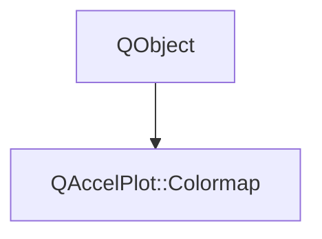

# Class QAccelPlot::Colormap


[**ClassList**](annotated.md) **>** [**QAccelPlot**](namespaceQAccelPlot.md) **>** [**Colormap**](classQAccelPlot_1_1Colormap.md)


_Maps data values to colors: a color ramp plus the rule that places a value on it._ [More...](#detailed-description)

* `#include <Colormap.hpp>`


Inherits the following classes: QObject


## Inheritance diagram




## Public Types

| Type | Name |
| ---: | :--- |
| enum  | [**Normalization**](#enum-normalization)  <br>_How a value is mapped onto the [0, 1] ramp coordinate._  |
| enum  | [**Preset**](#enum-preset)  <br>_Built-in color ramps._  |


## Public Properties

| Type | Name |
| ---: | :--- |
| property qreal | [**max**](classQAccelPlot_1_1Colormap.md#property-max-12)  <br>_Value at ramp position 1. Unset (NaN) resolves it from the data. Default: unset._  |
| property qreal | [**min**](classQAccelPlot_1_1Colormap.md#property-min-12)  <br>_Value at ramp position 0. Unset (NaN) resolves it from the data. Default: unset._  |
| property [**Normalization**](classQAccelPlot_1_1Colormap.md#enum-normalization) | [**norm**](classQAccelPlot_1_1Colormap.md#property-norm-12)  <br>_How a value is placed on the ramp. Default:_ `Linear` _._ |
| property [**Preset**](classQAccelPlot_1_1Colormap.md#enum-preset) | [**preset**](classQAccelPlot_1_1Colormap.md#property-preset-12)  <br>_Built-in color ramp. Ignored when_ `stops` _is non-empty. Default:_`Viridis` _._ |
| property QQmlListProperty&lt; QObject &gt; | [**stops**](classQAccelPlot_1_1Colormap.md#property-stops-12)  <br>_Custom ramp as a list of objects with_ `position` _and_`color` _, such as_`GradientStop` _. Overrides_`preset` _when non-empty._ |


## Public Signals

| Type | Name |
| ---: | :--- |
| signal void | [**colormapChanged**](classQAccelPlot_1_1Colormap.md#signal-colormapchanged)  <br>_Emitted when the ramp, its bounds, or the normalization changes._  |


## Public Functions

| Type | Name |
| ---: | :--- |
|   | [**Colormap**](#function-colormap) (QObject \* parent=nullptr) <br>_Constructs a_ [_**Colormap**_](classQAccelPlot_1_1Colormap.md) _with the given__parent_ _._ |
|  qreal | [**max**](#function-max-22) () const<br>_Returns the fixed upper bound, or NaN when it is resolved from the data._  |
|  qreal | [**min**](#function-min-22) () const<br>_Returns the fixed lower bound, or NaN when it is resolved from the data._  |
|  [**Normalization**](classQAccelPlot_1_1Colormap.md#enum-normalization) | [**norm**](#function-norm-22) () const<br>_Returns the normalization._  |
|  [**Preset**](classQAccelPlot_1_1Colormap.md#enum-preset) | [**preset**](#function-preset-22) () const<br>_Returns the built-in ramp._  |
|  const std::vector&lt; [**GradientStopData**](structQAccelPlot_1_1GradientStopData.md) &gt; & | [**resolvedStops**](#function-resolvedstops) () const<br>_Returns the resolved ramp stops, in position order and covering [0, 1]._  |
|  void | [**setMax**](#function-setmax) (qreal value) <br>_Sets the fixed upper bound to_ _value_ _. NaN resolves it from the data._ |
|  void | [**setMin**](#function-setmin) (qreal value) <br>_Sets the fixed lower bound to_ _value_ _. NaN resolves it from the data._ |
|  void | [**setNorm**](#function-setnorm) ([**Normalization**](classQAccelPlot_1_1Colormap.md#enum-normalization) norm) <br>_Sets the normalization to_ _norm_ _._ |
|  void | [**setPreset**](#function-setpreset) ([**Preset**](classQAccelPlot_1_1Colormap.md#enum-preset) preset) <br>_Sets the built-in ramp to_ _preset_ _._ |
|  QQmlListProperty&lt; QObject &gt; | [**stops**](#function-stops-22) () <br>_Returns the custom ramp stops, empty when the preset supplies the ramp._  |


## Detailed Description


A colormap has no geometry. It is a one-dimensional ramp addressed by a normalized coordinate in [0, 1], and `norm` decides how a value reaches that coordinate. Series that color by value, such as `PointCloud`, index the ramp with each point's value. Effects that paint a ramp across the plot, such as `GradientFill` and `GradientStroke`, supply the coordinate from a position instead and own that geometry themselves, so they use only the ramp.


The ramp comes from `preset`, or from `stops` when a custom ramp is given. `min` and `max` bound the value range; leaving either unset resolves it from the data, so one colormap can be shared between series that resolve different ranges. Each series reports what it resolved, for example through `PointCloud::dataValueMin()`.


**See also:** [**PointCloud**](classQAccelPlot_1_1PointCloud.md), [**GradientFill**](classQAccelPlot_1_1GradientFill.md), [**GradientStroke**](classQAccelPlot_1_1GradientStroke.md) 


    
## Public Types Documentation


### enum Normalization {#enum-normalization}

_How a value is mapped onto the [0, 1] ramp coordinate._ 
```C++
enum QAccelPlot::Colormap::Normalization {
    Linear,
    Log
};
```


<hr>


### enum Preset {#enum-preset}

_Built-in color ramps._ 
```C++
enum QAccelPlot::Colormap::Preset {
    Viridis,
    Plasma,
    Inferno,
    Magma,
    Turbo,
    Grayscale,
    Rainbow
};
```


The perceptually uniform ramps are sampled from the matplotlib originals. Prefer them over `Rainbow`, whose uneven lightness invents boundaries that are not in the data. 


        

<hr>
## Public Properties Documentation


### property max {#property-max-12}

_Value at ramp position 1. Unset (NaN) resolves it from the data. Default: unset._ 
```C++
qreal QAccelPlot::Colormap::max;
```


<hr>


### property min {#property-min-12}

_Value at ramp position 0. Unset (NaN) resolves it from the data. Default: unset._ 
```C++
qreal QAccelPlot::Colormap::min;
```


<hr>


### property norm {#property-norm-12}

_How a value is placed on the ramp. Default:_ `Linear` _._
```C++
Normalization QAccelPlot::Colormap::norm;
```


<hr>


### property preset {#property-preset-12}

_Built-in color ramp. Ignored when_ `stops` _is non-empty. Default:_`Viridis` _._
```C++
Preset QAccelPlot::Colormap::preset;
```


<hr>


### property stops {#property-stops-12}

_Custom ramp as a list of objects with_ `position` _and_`color` _, such as_`GradientStop` _. Overrides_`preset` _when non-empty._
```C++
QQmlListProperty<QObject> QAccelPlot::Colormap::stops;
```


<hr>
## Public Signals Documentation


### signal colormapChanged {#signal-colormapchanged}

_Emitted when the ramp, its bounds, or the normalization changes._ 
```C++
void QAccelPlot::Colormap::colormapChanged;
```


<hr>
## Public Functions Documentation


### function Colormap {#function-colormap}

_Constructs a_ [_**Colormap**_](classQAccelPlot_1_1Colormap.md) _with the given__parent_ _._
```C++
explicit QAccelPlot::Colormap::Colormap (
    QObject * parent=nullptr
) 
```


<hr>


### function max {#function-max-22}

_Returns the fixed upper bound, or NaN when it is resolved from the data._ 
```C++
qreal QAccelPlot::Colormap::max () const
```


<hr>


### function min {#function-min-22}

_Returns the fixed lower bound, or NaN when it is resolved from the data._ 
```C++
qreal QAccelPlot::Colormap::min () const
```


<hr>


### function norm {#function-norm-22}

_Returns the normalization._ 
```C++
Normalization QAccelPlot::Colormap::norm () const
```


<hr>


### function preset {#function-preset-22}

_Returns the built-in ramp._ 
```C++
Preset QAccelPlot::Colormap::preset () const
```


<hr>


### function resolvedStops {#function-resolvedstops}

_Returns the resolved ramp stops, in position order and covering [0, 1]._ 
```C++
const std::vector< GradientStopData > & QAccelPlot::Colormap::resolvedStops () const
```


Custom `stops` when set, otherwise the `preset` ramp. 


        

<hr>


### function setMax {#function-setmax}

_Sets the fixed upper bound to_ _value_ _. NaN resolves it from the data._
```C++
void QAccelPlot::Colormap::setMax (
    qreal value
) 
```


<hr>


### function setMin {#function-setmin}

_Sets the fixed lower bound to_ _value_ _. NaN resolves it from the data._
```C++
void QAccelPlot::Colormap::setMin (
    qreal value
) 
```


<hr>


### function setNorm {#function-setnorm}

_Sets the normalization to_ _norm_ _._
```C++
void QAccelPlot::Colormap::setNorm (
    Normalization norm
) 
```


<hr>


### function setPreset {#function-setpreset}

_Sets the built-in ramp to_ _preset_ _._
```C++
void QAccelPlot::Colormap::setPreset (
    Preset preset
) 
```


<hr>


### function stops {#function-stops-22}

_Returns the custom ramp stops, empty when the preset supplies the ramp._ 
```C++
QQmlListProperty< QObject > QAccelPlot::Colormap::stops () 
```


<hr>

------------------------------
The documentation for this class was generated from the following file `QAccelPlot/src/QAccelPlot/effects/Colormap.hpp`

