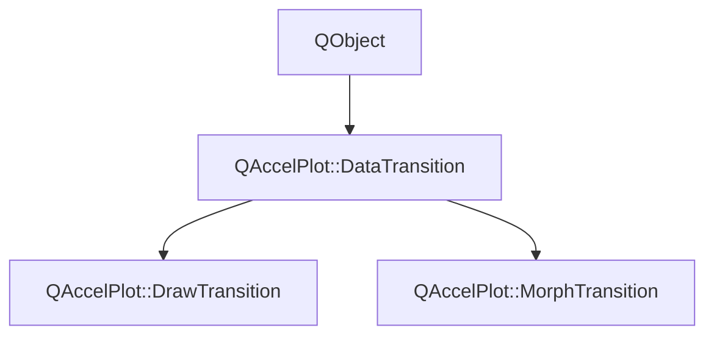

# Class QAccelPlot::DataTransition


[**ClassList**](annotated.md) **>** [**QAccelPlot**](namespaceQAccelPlot.md) **>** [**DataTransition**](classQAccelPlot_1_1DataTransition.md)


_Abstract base class for animated data transitions on plot elements._ [More...](#detailed-description)

* `#include <DataTransition.hpp>`


Inherits the following classes: QObject


Inherited by the following classes: [QAccelPlot::DrawTransition](classQAccelPlot_1_1DrawTransition.md),  [QAccelPlot::MorphTransition](classQAccelPlot_1_1MorphTransition.md)


## Inheritance diagram




## Classes

| Type | Name |
| ---: | :--- |
| struct | [**Dataset**](structQAccelPlot_1_1DataTransition_1_1Dataset.md) <br>_Data a transition animates:_ `count` _items of_`stride` _values each, e.g. XY points with a stride of 2._ |
| class | [**Run**](classQAccelPlot_1_1DataTransition_1_1Run.md) <br>_One animation of a transition on one host element._  |


## Public Properties

| Type | Name |
| ---: | :--- |
| property QML\_ANONYMOUSint | [**duration**](classQAccelPlot_1_1DataTransition.md#property-duration-12)  <br>_Duration of the transition in milliseconds. Default: 300._  |
| property QEasingCurve | [**easing**](classQAccelPlot_1_1DataTransition.md#property-easing-12)  <br>_Easing curve applied to the animation progress. Default:_ `QEasingCurve::Linear` _._ |
| property bool | [**enabled**](classQAccelPlot_1_1DataTransition.md#property-enabled-12)  <br>_Whether the transition is active. When_ `false` _, data updates are applied instantly._ |
| property bool | [**running**](classQAccelPlot_1_1DataTransition.md#property-running-12)  <br>_Read-only:_ `true` _while the transition is playing on at least one element._ |


## Public Signals

| Type | Name |
| ---: | :--- |
| signal void | [**durationChanged**](classQAccelPlot_1_1DataTransition.md#signal-durationchanged)  <br>_Emitted when the duration property changes._  |
| signal void | [**easingChanged**](classQAccelPlot_1_1DataTransition.md#signal-easingchanged)  <br>_Emitted when the easing property changes._  |
| signal void | [**enabledChanged**](classQAccelPlot_1_1DataTransition.md#signal-enabledchanged)  <br>_Emitted when the enabled property changes._  |
| signal void | [**runningChanged**](classQAccelPlot_1_1DataTransition.md#signal-runningchanged)  <br>_Emitted when the running property changes._  |


## Public Functions

| Type | Name |
| ---: | :--- |
|   | [**DataTransition**](#function-datatransition) (QObject \* parent=nullptr) <br>_Constructs an_ [_**DataTransition**_](classQAccelPlot_1_1DataTransition.md) _with the given__parent_ _._ |
|  bool | [**advance**](#function-advance) ([**Run**](classQAccelPlot_1_1DataTransition_1_1Run.md) & run, std::vector&lt; double &gt; & outData, int & outPointCount) <br>_Advances_ _run_ _by one frame, writing the interpolated data into__outData_ _._ |
|  void | [**cancel**](#function-cancel) () <br>_Ends every active run immediately._  |
|  int | [**duration**](#function-duration-22) () const<br>_Returns the animation duration in milliseconds._  |
|  QEasingCurve | [**easing**](#function-easing-22) () const<br>_Returns the easing curve._  |
|  bool | [**enabled**](#function-enabled-22) () const<br>_Returns_ `true` _if the transition is enabled._ |
|  bool | [**running**](#function-running-22) () const<br>_Returns_ `true` _while at least one run is active._ |
|  void | [**setDuration**](#function-setduration) (int duration) <br>_Sets the animation duration to_ _duration_ _milliseconds._ |
|  void | [**setEasing**](#function-seteasing) (const QEasingCurve & easing) <br>_Sets the easing curve to_ _easing_ _._ |
|  void | [**setEnabled**](#function-setenabled) (bool enabled) <br>_Sets the enabled state to_ _enabled_ _._ |
|  void | [**start**](#function-start) ([**Run**](classQAccelPlot_1_1DataTransition_1_1Run.md) & run, const std::vector&lt; double &gt; & currentData, int currentPointCount, std::vector&lt; double &gt; && newData, int newPointCount, int stride=2) <br>_Starts_ _run_ _from__currentData_ _to__newData_ _, restarting it if it is already active._ |
|   | [**~DataTransition**](#function-datatransition) () override<br>_Destroys the transition. Its runs stay pending, so their hosts can still show the target data._  |


## Protected Functions

| Type | Name |
| ---: | :--- |
| virtual void | [**interpolate**](#function-interpolate) (double easedProgress, const [**Dataset**](structQAccelPlot_1_1DataTransition_1_1Dataset.md) & from, const [**Dataset**](structQAccelPlot_1_1DataTransition_1_1Dataset.md) & to, [**Dataset**](structQAccelPlot_1_1DataTransition_1_1Dataset.md) & out) = 0<br>_Subclass entry point — writes the dataset between_ _from_ _and__to_ _at__easedProgress_ _into__out_ _._ |


## Detailed Description


Subclasses implement `interpolate()` to define how the element animates between an old dataset and a new one. The transition is driven frame-by-frame by `advance()`, which the host element calls on the GUI thread before each scene graph synchronization, so `runningChanged` is always emitted on the GUI thread.


One transition can be assigned to several elements. Each element keeps its own `Run` with the data it animates between, so the elements animate independently.


**See also:** [**DrawTransition**](classQAccelPlot_1_1DrawTransition.md), [**MorphTransition**](classQAccelPlot_1_1MorphTransition.md), [**LineCurve**](classQAccelPlot_1_1LineCurve.md), [**BarSeries**](classQAccelPlot_1_1BarSeries.md) 


    
## Public Properties Documentation


### property duration {#property-duration-12}

_Duration of the transition in milliseconds. Default: 300._ 
```C++
QML_ANONYMOUSint QAccelPlot::DataTransition::duration;
```


<hr>


### property easing {#property-easing-12}

_Easing curve applied to the animation progress. Default:_ `QEasingCurve::Linear` _._
```C++
QEasingCurve QAccelPlot::DataTransition::easing;
```


<hr>


### property enabled {#property-enabled-12}

_Whether the transition is active. When_ `false` _, data updates are applied instantly._
```C++
bool QAccelPlot::DataTransition::enabled;
```


<hr>


### property running {#property-running-12}

_Read-only:_ `true` _while the transition is playing on at least one element._
```C++
bool QAccelPlot::DataTransition::running;
```


<hr>
## Public Signals Documentation


### signal durationChanged {#signal-durationchanged}

_Emitted when the duration property changes._ 
```C++
void QAccelPlot::DataTransition::durationChanged;
```


<hr>


### signal easingChanged {#signal-easingchanged}

_Emitted when the easing property changes._ 
```C++
void QAccelPlot::DataTransition::easingChanged;
```


<hr>


### signal enabledChanged {#signal-enabledchanged}

_Emitted when the enabled property changes._ 
```C++
void QAccelPlot::DataTransition::enabledChanged;
```


<hr>


### signal runningChanged {#signal-runningchanged}

_Emitted when the running property changes._ 
```C++
void QAccelPlot::DataTransition::runningChanged;
```


<hr>
## Public Functions Documentation


### function DataTransition {#function-datatransition}

_Constructs an_ [_**DataTransition**_](classQAccelPlot_1_1DataTransition.md) _with the given__parent_ _._
```C++
explicit QAccelPlot::DataTransition::DataTransition (
    QObject * parent=nullptr
) 
```


<hr>


### function advance {#function-advance}

_Advances_ _run_ _by one frame, writing the interpolated data into__outData_ _._
```C++
bool QAccelPlot::DataTransition::advance (
    Run & run,
    std::vector< double > & outData,
    int & outPointCount
) 
```


When the duration has elapsed, writes the target data and finishes the run. 

**Returns:**

`true` if _run_ is still active after this call. 


        

<hr>


### function cancel {#function-cancel}

_Ends every active run immediately._ 
```C++
void QAccelPlot::DataTransition::cancel () 
```


The runs stay pending; hosts show the target data after `running` turns `false`. 


        

<hr>


### function duration {#function-duration-22}

_Returns the animation duration in milliseconds._ 
```C++
int QAccelPlot::DataTransition::duration () const
```


<hr>


### function easing {#function-easing-22}

_Returns the easing curve._ 
```C++
QEasingCurve QAccelPlot::DataTransition::easing () const
```


<hr>


### function enabled {#function-enabled-22}

_Returns_ `true` _if the transition is enabled._
```C++
bool QAccelPlot::DataTransition::enabled () const
```


<hr>


### function running {#function-running-22}

_Returns_ `true` _while at least one run is active._
```C++
bool QAccelPlot::DataTransition::running () const
```


<hr>


### function setDuration {#function-setduration}

_Sets the animation duration to_ _duration_ _milliseconds._
```C++
void QAccelPlot::DataTransition::setDuration (
    int duration
) 
```


<hr>


### function setEasing {#function-seteasing}

_Sets the easing curve to_ _easing_ _._
```C++
void QAccelPlot::DataTransition::setEasing (
    const QEasingCurve & easing
) 
```


<hr>


### function setEnabled {#function-setenabled}

_Sets the enabled state to_ _enabled_ _._
```C++
void QAccelPlot::DataTransition::setEnabled (
    bool enabled
) 
```


<hr>


### function start {#function-start}

_Starts_ _run_ _from__currentData_ _to__newData_ _, restarting it if it is already active._
```C++
void QAccelPlot::DataTransition::start (
    Run & run,
    const std::vector< double > & currentData,
    int currentPointCount,
    std::vector< double > && newData,
    int newPointCount,
    int stride=2
) 
```


**Parameters:**


* `run` [**Run**](classQAccelPlot_1_1DataTransition_1_1Run.md) of the host element; ended first if another transition advances it. 
* `currentData` Current double buffer (copied as the _from_ state). 
* `currentPointCount` Number of points in _currentData_. 
* `newData` Target double buffer (moved as the _to_ state). 
* `newPointCount` Number of points in _newData_. 
* `stride` Number of values per point in both buffers. Default: 2, XY points. 


        

<hr>


### function ~DataTransition {#function-datatransition}

_Destroys the transition. Its runs stay pending, so their hosts can still show the target data._ 
```C++
QAccelPlot::DataTransition::~DataTransition () override
```


<hr>
## Protected Functions Documentation


### function interpolate {#function-interpolate}

_Subclass entry point — writes the dataset between_ _from_ _and__to_ _at__easedProgress_ _into__out_ _._
```C++
virtual void QAccelPlot::DataTransition::interpolate (
    double easedProgress,
    const Dataset & from,
    const Dataset & to,
    Dataset & out
) = 0
```


_easedProgress_ runs from 0 to 1 and leaves that range with an overshooting easing curve. _from_ and _to_ share one stride, which _out_ already has; set its `values` and `count`. 


        

<hr>

------------------------------
The documentation for this class was generated from the following file `QAccelPlot/src/QAccelPlot/transitions/DataTransition.hpp`

