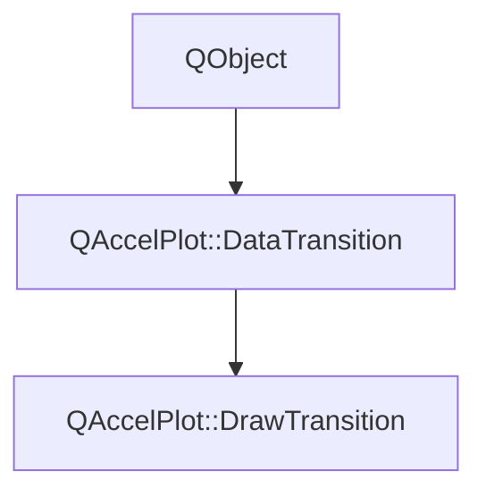

# Class QAccelPlot::DrawTransition


[**ClassList**](annotated.md) **>** [**QAccelPlot**](namespaceQAccelPlot.md) **>** [**DrawTransition**](classQAccelPlot_1_1DrawTransition.md)


_An animation transition that reveals the target data point by point from start to end._ [More...](#detailed-description)

* `#include <DrawTransition.hpp>`


Inherits the following classes: [QAccelPlot::DataTransition](classQAccelPlot_1_1DataTransition.md)


## Inheritance diagram




## Public Properties inherited from QAccelPlot::DataTransition

See [QAccelPlot::DataTransition](classQAccelPlot_1_1DataTransition.md)

| Type | Name |
| ---: | :--- |
| property QML\_ANONYMOUSint | [**duration**](classQAccelPlot_1_1DataTransition.md#property-duration-12)  <br>_Duration of the transition in milliseconds. Default: 300._  |
| property QEasingCurve | [**easing**](classQAccelPlot_1_1DataTransition.md#property-easing-12)  <br>_Easing curve applied to the animation progress. Default:_ `QEasingCurve::Linear` _._ |
| property bool | [**enabled**](classQAccelPlot_1_1DataTransition.md#property-enabled-12)  <br>_Whether the transition is active. When_ `false` _, data updates are applied instantly._ |
| property bool | [**running**](classQAccelPlot_1_1DataTransition.md#property-running-12)  <br>_Read-only:_ `true` _while the transition is playing on at least one element._ |


## Public Signals inherited from QAccelPlot::DataTransition

See [QAccelPlot::DataTransition](classQAccelPlot_1_1DataTransition.md)

| Type | Name |
| ---: | :--- |
| signal void | [**durationChanged**](classQAccelPlot_1_1DataTransition.md#signal-durationchanged)  <br>_Emitted when the duration property changes._  |
| signal void | [**easingChanged**](classQAccelPlot_1_1DataTransition.md#signal-easingchanged)  <br>_Emitted when the easing property changes._  |
| signal void | [**enabledChanged**](classQAccelPlot_1_1DataTransition.md#signal-enabledchanged)  <br>_Emitted when the enabled property changes._  |
| signal void | [**runningChanged**](classQAccelPlot_1_1DataTransition.md#signal-runningchanged)  <br>_Emitted when the running property changes._  |


## Public Functions

| Type | Name |
| ---: | :--- |
|   | [**DrawTransition**](#function-drawtransition) (QObject \* parent=nullptr) <br>_Constructs a_ [_**DrawTransition**_](classQAccelPlot_1_1DrawTransition.md) _with the given__parent_ _._ |


## Public Functions inherited from QAccelPlot::DataTransition

See [QAccelPlot::DataTransition](classQAccelPlot_1_1DataTransition.md)

| Type | Name |
| ---: | :--- |
|   | [**DataTransition**](classQAccelPlot_1_1DataTransition.md#function-datatransition) (QObject \* parent=nullptr) <br>_Constructs an_ [_**DataTransition**_](classQAccelPlot_1_1DataTransition.md) _with the given__parent_ _._ |
|  bool | [**advance**](classQAccelPlot_1_1DataTransition.md#function-advance) ([**Run**](classQAccelPlot_1_1DataTransition_1_1Run.md) & run, std::vector&lt; double &gt; & outData, int & outPointCount) <br>_Advances_ _run_ _by one frame, writing the interpolated data into__outData_ _._ |
|  void | [**cancel**](classQAccelPlot_1_1DataTransition.md#function-cancel) () <br>_Ends every active run immediately._  |
|  int | [**duration**](classQAccelPlot_1_1DataTransition.md#function-duration-22) () const<br>_Returns the animation duration in milliseconds._  |
|  QEasingCurve | [**easing**](classQAccelPlot_1_1DataTransition.md#function-easing-22) () const<br>_Returns the easing curve._  |
|  bool | [**enabled**](classQAccelPlot_1_1DataTransition.md#function-enabled-22) () const<br>_Returns_ `true` _if the transition is enabled._ |
|  bool | [**running**](classQAccelPlot_1_1DataTransition.md#function-running-22) () const<br>_Returns_ `true` _while at least one run is active._ |
|  void | [**setDuration**](classQAccelPlot_1_1DataTransition.md#function-setduration) (int duration) <br>_Sets the animation duration to_ _duration_ _milliseconds._ |
|  void | [**setEasing**](classQAccelPlot_1_1DataTransition.md#function-seteasing) (const QEasingCurve & easing) <br>_Sets the easing curve to_ _easing_ _._ |
|  void | [**setEnabled**](classQAccelPlot_1_1DataTransition.md#function-setenabled) (bool enabled) <br>_Sets the enabled state to_ _enabled_ _._ |
|  void | [**start**](classQAccelPlot_1_1DataTransition.md#function-start) ([**Run**](classQAccelPlot_1_1DataTransition_1_1Run.md) & run, const std::vector&lt; double &gt; & currentData, int currentPointCount, std::vector&lt; double &gt; && newData, int newPointCount, int stride=2) <br>_Starts_ _run_ _from__currentData_ _to__newData_ _, restarting it if it is already active._ |
|   | [**~DataTransition**](classQAccelPlot_1_1DataTransition.md#function-datatransition) () override<br>_Destroys the transition. Its runs stay pending, so their hosts can still show the target data._  |


## Protected Functions

| Type | Name |
| ---: | :--- |
| virtual void | [**interpolate**](#function-interpolate) (double easedProgress, const [**Dataset**](structQAccelPlot_1_1DataTransition_1_1Dataset.md) & from, const [**Dataset**](structQAccelPlot_1_1DataTransition_1_1Dataset.md) & to, [**Dataset**](structQAccelPlot_1_1DataTransition_1_1Dataset.md) & out) override<br>_Writes the first points of_ _to_ _into__out:_ _their share is__easedProgress_ _, and at least one is kept._ |


## Protected Functions inherited from QAccelPlot::DataTransition

See [QAccelPlot::DataTransition](classQAccelPlot_1_1DataTransition.md)

| Type | Name |
| ---: | :--- |
| virtual void | [**interpolate**](classQAccelPlot_1_1DataTransition.md#function-interpolate) (double easedProgress, const [**Dataset**](structQAccelPlot_1_1DataTransition_1_1Dataset.md) & from, const [**Dataset**](structQAccelPlot_1_1DataTransition_1_1Dataset.md) & to, [**Dataset**](structQAccelPlot_1_1DataTransition_1_1Dataset.md) & out) = 0<br>_Subclass entry point — writes the dataset between_ _from_ _and__to_ _at__easedProgress_ _into__out_ _._ |


## Detailed Description


Assign to `LineCurve::transition` to draw the new curve in, or to `BarSeries::transition` to show the new bars one after another.


**See also:** [**MorphTransition**](classQAccelPlot_1_1MorphTransition.md), [**DataTransition**](classQAccelPlot_1_1DataTransition.md) 


    
## Public Functions Documentation


### function DrawTransition {#function-drawtransition}

_Constructs a_ [_**DrawTransition**_](classQAccelPlot_1_1DrawTransition.md) _with the given__parent_ _._
```C++
explicit QAccelPlot::DrawTransition::DrawTransition (
    QObject * parent=nullptr
) 
```


<hr>
## Protected Functions Documentation


### function interpolate {#function-interpolate}

_Writes the first points of_ _to_ _into__out:_ _their share is__easedProgress_ _, and at least one is kept._
```C++
virtual void QAccelPlot::DrawTransition::interpolate (
    double easedProgress,
    const Dataset & from,
    const Dataset & to,
    Dataset & out
) override
```


Implements [*QAccelPlot::DataTransition::interpolate*](classQAccelPlot_1_1DataTransition.md#function-interpolate)


<hr>

------------------------------
The documentation for this class was generated from the following file `QAccelPlot/src/QAccelPlot/transitions/DrawTransition.hpp`

