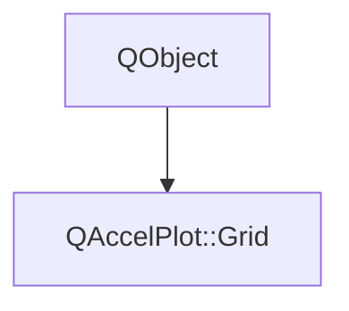

# Class QAccelPlot::Grid


[**ClassList**](annotated.md) **>** [**QAccelPlot**](namespaceQAccelPlot.md) **>** [**Grid**](classQAccelPlot_1_1Grid.md)


_Configuration object that controls the appearance of the plot grid._ [More...](#detailed-description)

* `#include <Grid.hpp>`


Inherits the following classes: QObject


## Inheritance diagram




## Public Properties

| Type | Name |
| ---: | :--- |
| property QColor | [**gridColor**](classQAccelPlot_1_1Grid.md#property-gridcolor-12)  <br>_Color of the major grid lines. Default:_ `#8c8c8c` _._ |
| property bool | [**gridHorizontalLinesVisible**](classQAccelPlot_1_1Grid.md#property-gridhorizontallinesvisible-12)  <br>_Whether horizontal major grid lines are visible. Default:_ `true` _._ |
| property bool | [**gridVerticalLinesVisible**](classQAccelPlot_1_1Grid.md#property-gridverticallinesvisible-12)  <br>_Whether vertical major grid lines are visible. Default:_ `true` _._ |
| property bool | [**gridVisible**](classQAccelPlot_1_1Grid.md#property-gridvisible-12)  <br>_Whether major grid lines are visible. Default:_ `true` _._ |
| property QML\_ANONYMOUSqreal | [**lineWidth**](classQAccelPlot_1_1Grid.md#property-linewidth-12)  <br>_Width in pixels of the major grid lines. Default: 2._  |
| property QColor | [**subGridColor**](classQAccelPlot_1_1Grid.md#property-subgridcolor-12)  <br>_Color of the sub-grid lines. Default:_ `#b4b4b4` _._ |
| property bool | [**subGridHorizontalLinesVisible**](classQAccelPlot_1_1Grid.md#property-subgridhorizontallinesvisible-12)  <br>_Whether horizontal sub-grid lines are visible. Default:_ `true` _._ |
| property qreal | [**subGridLineWidth**](classQAccelPlot_1_1Grid.md#property-subgridlinewidth-12)  <br>_Width in pixels of the sub-grid lines. Default: 1._  |
| property bool | [**subGridVerticalLinesVisible**](classQAccelPlot_1_1Grid.md#property-subgridverticallinesvisible-12)  <br>_Whether vertical sub-grid lines are visible. Default:_ `true` _._ |
| property bool | [**subGridVisible**](classQAccelPlot_1_1Grid.md#property-subgridvisible-12)  <br>_Whether sub-grid lines are visible. Default:_ `true` _._ |


## Public Signals

| Type | Name |
| ---: | :--- |
| signal void | [**gridColorChanged**](classQAccelPlot_1_1Grid.md#signal-gridcolorchanged)  <br>_Emitted when the gridColor property changes._  |
| signal void | [**gridHorizontalLinesVisibleChanged**](classQAccelPlot_1_1Grid.md#signal-gridhorizontallinesvisiblechanged)  <br>_Emitted when the gridHorizontalLinesVisible property changes._  |
| signal void | [**gridVerticalLinesVisibleChanged**](classQAccelPlot_1_1Grid.md#signal-gridverticallinesvisiblechanged)  <br>_Emitted when the gridVerticalLinesVisible property changes._  |
| signal void | [**gridVisibleChanged**](classQAccelPlot_1_1Grid.md#signal-gridvisiblechanged)  <br>_Emitted when the gridVisible property changes._  |
| signal void | [**lineWidthChanged**](classQAccelPlot_1_1Grid.md#signal-linewidthchanged)  <br>_Emitted when the lineWidth property changes._  |
| signal void | [**subGridColorChanged**](classQAccelPlot_1_1Grid.md#signal-subgridcolorchanged)  <br>_Emitted when the subGridColor property changes._  |
| signal void | [**subGridHorizontalLinesVisibleChanged**](classQAccelPlot_1_1Grid.md#signal-subgridhorizontallinesvisiblechanged)  <br>_Emitted when the subGridHorizontalLinesVisible property changes._  |
| signal void | [**subGridLineWidthChanged**](classQAccelPlot_1_1Grid.md#signal-subgridlinewidthchanged)  <br>_Emitted when the subGridLineWidth property changes._  |
| signal void | [**subGridVerticalLinesVisibleChanged**](classQAccelPlot_1_1Grid.md#signal-subgridverticallinesvisiblechanged)  <br>_Emitted when the subGridVerticalLinesVisible property changes._  |
| signal void | [**subGridVisibleChanged**](classQAccelPlot_1_1Grid.md#signal-subgridvisiblechanged)  <br>_Emitted when the subGridVisible property changes._  |


## Public Functions

| Type | Name |
| ---: | :--- |
|   | [**Grid**](#function-grid) (QObject \* parent=nullptr) <br>_Constructs a_ [_**Grid**_](classQAccelPlot_1_1Grid.md) _with the given__parent_ _._ |
|  QColor | [**gridColor**](#function-gridcolor-22) () const<br>_Returns the major grid line color._  |
|  bool | [**gridHorizontalLinesVisible**](#function-gridhorizontallinesvisible-22) () const<br>_Returns_ `true` _if horizontal major grid lines are visible._ |
|  bool | [**gridVerticalLinesVisible**](#function-gridverticallinesvisible-22) () const<br>_Returns_ `true` _if vertical major grid lines are visible._ |
|  bool | [**gridVisible**](#function-gridvisible-22) () const<br>_Returns_ `true` _if major grid lines are visible._ |
|  qreal | [**lineWidth**](#function-linewidth-22) () const<br>_Returns the major grid line width._  |
|  void | [**setGridColor**](#function-setgridcolor) (const QColor & c) <br>_Sets the major grid line color to_ _c_ _._ |
|  void | [**setGridHorizontalLinesVisible**](#function-setgridhorizontallinesvisible) (bool on) <br>_Sets horizontal major grid line visibility to_ _on_ _._ |
|  void | [**setGridVerticalLinesVisible**](#function-setgridverticallinesvisible) (bool on) <br>_Sets vertical major grid line visibility to_ _on_ _._ |
|  void | [**setGridVisible**](#function-setgridvisible) (bool on) <br>_Sets major grid line visibility to_ _on_ _._ |
|  void | [**setLineWidth**](#function-setlinewidth) (qreal w) <br>_Sets the major grid line width to_ _w_ _._ |
|  void | [**setSubGridColor**](#function-setsubgridcolor) (const QColor & c) <br>_Sets the sub-grid line color to_ _c_ _._ |
|  void | [**setSubGridHorizontalLinesVisible**](#function-setsubgridhorizontallinesvisible) (bool on) <br>_Sets horizontal sub-grid line visibility to_ _on_ _._ |
|  void | [**setSubGridLineWidth**](#function-setsubgridlinewidth) (qreal w) <br>_Sets the sub-grid line width to_ _w_ _._ |
|  void | [**setSubGridVerticalLinesVisible**](#function-setsubgridverticallinesvisible) (bool on) <br>_Sets vertical sub-grid line visibility to_ _on_ _._ |
|  void | [**setSubGridVisible**](#function-setsubgridvisible) (bool on) <br>_Sets sub-grid line visibility to_ _on_ _._ |
|  QColor | [**subGridColor**](#function-subgridcolor-22) () const<br>_Returns the sub-grid line color._  |
|  bool | [**subGridHorizontalLinesVisible**](#function-subgridhorizontallinesvisible-22) () const<br>_Returns_ `true` _if horizontal sub-grid lines are visible._ |
|  qreal | [**subGridLineWidth**](#function-subgridlinewidth-22) () const<br>_Returns the sub-grid line width._  |
|  bool | [**subGridVerticalLinesVisible**](#function-subgridverticallinesvisible-22) () const<br>_Returns_ `true` _if vertical sub-grid lines are visible._ |
|  bool | [**subGridVisible**](#function-subgridvisible-22) () const<br>_Returns_ `true` _if sub-grid lines are visible._ |


## Detailed Description


Exposed as a CONSTANT property on `PlotView`. Major grid lines are drawn at the same positions as the X/Y axis ticks; sub-grid lines are drawn between them.


**See also:** PlotView 


    
## Public Properties Documentation


### property gridColor {#property-gridcolor-12}

_Color of the major grid lines. Default:_ `#8c8c8c` _._
```C++
QColor QAccelPlot::Grid::gridColor;
```


<hr>


### property gridHorizontalLinesVisible {#property-gridhorizontallinesvisible-12}

_Whether horizontal major grid lines are visible. Default:_ `true` _._
```C++
bool QAccelPlot::Grid::gridHorizontalLinesVisible;
```


<hr>


### property gridVerticalLinesVisible {#property-gridverticallinesvisible-12}

_Whether vertical major grid lines are visible. Default:_ `true` _._
```C++
bool QAccelPlot::Grid::gridVerticalLinesVisible;
```


<hr>


### property gridVisible {#property-gridvisible-12}

_Whether major grid lines are visible. Default:_ `true` _._
```C++
bool QAccelPlot::Grid::gridVisible;
```


<hr>


### property lineWidth {#property-linewidth-12}

_Width in pixels of the major grid lines. Default: 2._ 
```C++
QML_ANONYMOUSqreal QAccelPlot::Grid::lineWidth;
```


<hr>


### property subGridColor {#property-subgridcolor-12}

_Color of the sub-grid lines. Default:_ `#b4b4b4` _._
```C++
QColor QAccelPlot::Grid::subGridColor;
```


<hr>


### property subGridHorizontalLinesVisible {#property-subgridhorizontallinesvisible-12}

_Whether horizontal sub-grid lines are visible. Default:_ `true` _._
```C++
bool QAccelPlot::Grid::subGridHorizontalLinesVisible;
```


<hr>


### property subGridLineWidth {#property-subgridlinewidth-12}

_Width in pixels of the sub-grid lines. Default: 1._ 
```C++
qreal QAccelPlot::Grid::subGridLineWidth;
```


<hr>


### property subGridVerticalLinesVisible {#property-subgridverticallinesvisible-12}

_Whether vertical sub-grid lines are visible. Default:_ `true` _._
```C++
bool QAccelPlot::Grid::subGridVerticalLinesVisible;
```


<hr>


### property subGridVisible {#property-subgridvisible-12}

_Whether sub-grid lines are visible. Default:_ `true` _._
```C++
bool QAccelPlot::Grid::subGridVisible;
```


<hr>
## Public Signals Documentation


### signal gridColorChanged {#signal-gridcolorchanged}

_Emitted when the gridColor property changes._ 
```C++
void QAccelPlot::Grid::gridColorChanged;
```


<hr>


### signal gridHorizontalLinesVisibleChanged {#signal-gridhorizontallinesvisiblechanged}

_Emitted when the gridHorizontalLinesVisible property changes._ 
```C++
void QAccelPlot::Grid::gridHorizontalLinesVisibleChanged;
```


<hr>


### signal gridVerticalLinesVisibleChanged {#signal-gridverticallinesvisiblechanged}

_Emitted when the gridVerticalLinesVisible property changes._ 
```C++
void QAccelPlot::Grid::gridVerticalLinesVisibleChanged;
```


<hr>


### signal gridVisibleChanged {#signal-gridvisiblechanged}

_Emitted when the gridVisible property changes._ 
```C++
void QAccelPlot::Grid::gridVisibleChanged;
```


<hr>


### signal lineWidthChanged {#signal-linewidthchanged}

_Emitted when the lineWidth property changes._ 
```C++
void QAccelPlot::Grid::lineWidthChanged;
```


<hr>


### signal subGridColorChanged {#signal-subgridcolorchanged}

_Emitted when the subGridColor property changes._ 
```C++
void QAccelPlot::Grid::subGridColorChanged;
```


<hr>


### signal subGridHorizontalLinesVisibleChanged {#signal-subgridhorizontallinesvisiblechanged}

_Emitted when the subGridHorizontalLinesVisible property changes._ 
```C++
void QAccelPlot::Grid::subGridHorizontalLinesVisibleChanged;
```


<hr>


### signal subGridLineWidthChanged {#signal-subgridlinewidthchanged}

_Emitted when the subGridLineWidth property changes._ 
```C++
void QAccelPlot::Grid::subGridLineWidthChanged;
```


<hr>


### signal subGridVerticalLinesVisibleChanged {#signal-subgridverticallinesvisiblechanged}

_Emitted when the subGridVerticalLinesVisible property changes._ 
```C++
void QAccelPlot::Grid::subGridVerticalLinesVisibleChanged;
```


<hr>


### signal subGridVisibleChanged {#signal-subgridvisiblechanged}

_Emitted when the subGridVisible property changes._ 
```C++
void QAccelPlot::Grid::subGridVisibleChanged;
```


<hr>
## Public Functions Documentation


### function Grid {#function-grid}

_Constructs a_ [_**Grid**_](classQAccelPlot_1_1Grid.md) _with the given__parent_ _._
```C++
explicit QAccelPlot::Grid::Grid (
    QObject * parent=nullptr
) 
```


<hr>


### function gridColor {#function-gridcolor-22}

_Returns the major grid line color._ 
```C++
QColor QAccelPlot::Grid::gridColor () const
```


<hr>


### function gridHorizontalLinesVisible {#function-gridhorizontallinesvisible-22}

_Returns_ `true` _if horizontal major grid lines are visible._
```C++
bool QAccelPlot::Grid::gridHorizontalLinesVisible () const
```


<hr>


### function gridVerticalLinesVisible {#function-gridverticallinesvisible-22}

_Returns_ `true` _if vertical major grid lines are visible._
```C++
bool QAccelPlot::Grid::gridVerticalLinesVisible () const
```


<hr>


### function gridVisible {#function-gridvisible-22}

_Returns_ `true` _if major grid lines are visible._
```C++
bool QAccelPlot::Grid::gridVisible () const
```


<hr>


### function lineWidth {#function-linewidth-22}

_Returns the major grid line width._ 
```C++
qreal QAccelPlot::Grid::lineWidth () const
```


<hr>


### function setGridColor {#function-setgridcolor}

_Sets the major grid line color to_ _c_ _._
```C++
void QAccelPlot::Grid::setGridColor (
    const QColor & c
) 
```


<hr>


### function setGridHorizontalLinesVisible {#function-setgridhorizontallinesvisible}

_Sets horizontal major grid line visibility to_ _on_ _._
```C++
void QAccelPlot::Grid::setGridHorizontalLinesVisible (
    bool on
) 
```


<hr>


### function setGridVerticalLinesVisible {#function-setgridverticallinesvisible}

_Sets vertical major grid line visibility to_ _on_ _._
```C++
void QAccelPlot::Grid::setGridVerticalLinesVisible (
    bool on
) 
```


<hr>


### function setGridVisible {#function-setgridvisible}

_Sets major grid line visibility to_ _on_ _._
```C++
void QAccelPlot::Grid::setGridVisible (
    bool on
) 
```


<hr>


### function setLineWidth {#function-setlinewidth}

_Sets the major grid line width to_ _w_ _._
```C++
void QAccelPlot::Grid::setLineWidth (
    qreal w
) 
```


<hr>


### function setSubGridColor {#function-setsubgridcolor}

_Sets the sub-grid line color to_ _c_ _._
```C++
void QAccelPlot::Grid::setSubGridColor (
    const QColor & c
) 
```


<hr>


### function setSubGridHorizontalLinesVisible {#function-setsubgridhorizontallinesvisible}

_Sets horizontal sub-grid line visibility to_ _on_ _._
```C++
void QAccelPlot::Grid::setSubGridHorizontalLinesVisible (
    bool on
) 
```


<hr>


### function setSubGridLineWidth {#function-setsubgridlinewidth}

_Sets the sub-grid line width to_ _w_ _._
```C++
void QAccelPlot::Grid::setSubGridLineWidth (
    qreal w
) 
```


<hr>


### function setSubGridVerticalLinesVisible {#function-setsubgridverticallinesvisible}

_Sets vertical sub-grid line visibility to_ _on_ _._
```C++
void QAccelPlot::Grid::setSubGridVerticalLinesVisible (
    bool on
) 
```


<hr>


### function setSubGridVisible {#function-setsubgridvisible}

_Sets sub-grid line visibility to_ _on_ _._
```C++
void QAccelPlot::Grid::setSubGridVisible (
    bool on
) 
```


<hr>


### function subGridColor {#function-subgridcolor-22}

_Returns the sub-grid line color._ 
```C++
QColor QAccelPlot::Grid::subGridColor () const
```


<hr>


### function subGridHorizontalLinesVisible {#function-subgridhorizontallinesvisible-22}

_Returns_ `true` _if horizontal sub-grid lines are visible._
```C++
bool QAccelPlot::Grid::subGridHorizontalLinesVisible () const
```


<hr>


### function subGridLineWidth {#function-subgridlinewidth-22}

_Returns the sub-grid line width._ 
```C++
qreal QAccelPlot::Grid::subGridLineWidth () const
```


<hr>


### function subGridVerticalLinesVisible {#function-subgridverticallinesvisible-22}

_Returns_ `true` _if vertical sub-grid lines are visible._
```C++
bool QAccelPlot::Grid::subGridVerticalLinesVisible () const
```


<hr>


### function subGridVisible {#function-subgridvisible-22}

_Returns_ `true` _if sub-grid lines are visible._
```C++
bool QAccelPlot::Grid::subGridVisible () const
```


<hr>

------------------------------
The documentation for this class was generated from the following file `QAccelPlot/src/grid/Grid.hpp`

