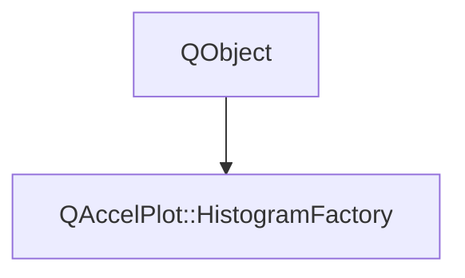

# Class QAccelPlot::HistogramFactory


[**ClassList**](annotated.md) **>** [**QAccelPlot**](namespaceQAccelPlot.md) **>** [**HistogramFactory**](classQAccelPlot_1_1HistogramFactory.md)


_QML singleton_ `Histogram` _that creates_[_**Histogram**_](classQAccelPlot_1_1Histogram.md) _values from JavaScript arrays._[More...](#detailed-description)

* `#include <HistogramFactory.hpp>`


Inherits the following classes: QObject


## Inheritance diagram




## Public Functions

| Type | Name |
| ---: | :--- |
|   | [**HistogramFactory**](#function-histogramfactory) (QObject \* parent=nullptr) <br>_Constructs the factory with the given_ _parent_ _._ |
|  Q\_INVOKABLE QList&lt; qreal &gt; | [**decadeEdges**](#function-decadeedges) (qreal min, qreal max) const<br>_Returns the edges from_ _min_ _to__max_ _at 1, 2, ..., 9 times each power of ten: the ticks of a logarithmic axis._ |
|  Q\_INVOKABLE::QAccelPlot::Histogram | [**fromCounts**](#function-fromcounts) (const QList&lt; qreal &gt; & edges, const QList&lt; qreal &gt; & counts) const<br>_Wraps data that is already binned:_ _counts_ _has one value per bin between__edges_ _._ |
|  Q\_INVOKABLE::QAccelPlot::Histogram | [**fromSamples**](#function-fromsamples-12) (const QList&lt; qreal &gt; & samples, const QVariant & bins) const<br>_Counts_ _samples_ _into bins._ |
|  Q\_INVOKABLE::QAccelPlot::Histogram | [**fromSamples**](#function-fromsamples-22) (const QList&lt; qreal &gt; & samples, int binCount, qreal min, qreal max) const<br>_Counts_ _samples_ _into__binCount_ _equal bins from__min_ _to__max_ _._ |
|  Q\_INVOKABLE QList&lt; qreal &gt; | [**linearEdges**](#function-linearedges) (qreal min, qreal max, int binCount) const<br>_Returns_ _binCount_ _+ 1 equally spaced edges from__min_ _to__max_ _._ |
|  Q\_INVOKABLE QList&lt; qreal &gt; | [**logEdges**](#function-logedges) (qreal min, qreal max, int binCount) const<br>_Returns_ _binCount_ _+ 1 edges from__min_ _to__max_ _, equally spaced on a logarithmic axis._ |


## Detailed Description


**
**


```C++
import QAccelPlot as QAccelPlot

QAccelPlot.BarSeries {
    Component.onCompleted: setData(QAccelPlot.Histogram.fromSamples(samples, 40).bars())
}
```


C++ code uses the static functions of [**Histogram**](classQAccelPlot_1_1Histogram.md) instead.


**See also:** [**Histogram**](classQAccelPlot_1_1Histogram.md) 


    
## Public Functions Documentation


### function HistogramFactory {#function-histogramfactory}

_Constructs the factory with the given_ _parent_ _._
```C++
explicit QAccelPlot::HistogramFactory::HistogramFactory (
    QObject * parent=nullptr
) 
```


<hr>


### function decadeEdges {#function-decadeedges}

_Returns the edges from_ _min_ _to__max_ _at 1, 2, ..., 9 times each power of ten: the ticks of a logarithmic axis._
```C++
Q_INVOKABLE QList< qreal > QAccelPlot::HistogramFactory::decadeEdges (
    qreal min,
    qreal max
) const
```


<hr>


### function fromCounts {#function-fromcounts}

_Wraps data that is already binned:_ _counts_ _has one value per bin between__edges_ _._
```C++
Q_INVOKABLE::QAccelPlot::Histogram QAccelPlot::HistogramFactory::fromCounts (
    const QList< qreal > & edges,
    const QList< qreal > & counts
) const
```


<hr>


### function fromSamples {#function-fromsamples-12}

_Counts_ _samples_ _into bins._
```C++
Q_INVOKABLE::QAccelPlot::Histogram QAccelPlot::HistogramFactory::fromSamples (
    const QList< qreal > & samples,
    const QVariant & bins
) const
```


_bins_ is either a number of equal bins spanning the finite samples, or a list of finite, strictly increasing edges. 


        

<hr>


### function fromSamples {#function-fromsamples-22}

_Counts_ _samples_ _into__binCount_ _equal bins from__min_ _to__max_ _._
```C++
Q_INVOKABLE::QAccelPlot::Histogram QAccelPlot::HistogramFactory::fromSamples (
    const QList< qreal > & samples,
    int binCount,
    qreal min,
    qreal max
) const
```


<hr>


### function linearEdges {#function-linearedges}

_Returns_ _binCount_ _+ 1 equally spaced edges from__min_ _to__max_ _._
```C++
Q_INVOKABLE QList< qreal > QAccelPlot::HistogramFactory::linearEdges (
    qreal min,
    qreal max,
    int binCount
) const
```


<hr>


### function logEdges {#function-logedges}

_Returns_ _binCount_ _+ 1 edges from__min_ _to__max_ _, equally spaced on a logarithmic axis._
```C++
Q_INVOKABLE QList< qreal > QAccelPlot::HistogramFactory::logEdges (
    qreal min,
    qreal max,
    int binCount
) const
```


<hr>

------------------------------
The documentation for this class was generated from the following file `QAccelPlot/src/QAccelPlot/data/HistogramFactory.hpp`

