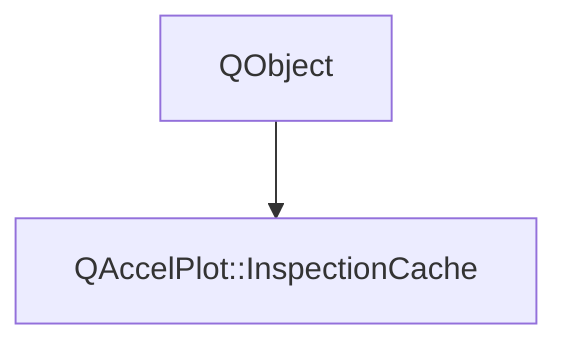

# Class QAccelPlot::InspectionCache


[**ClassList**](annotated.md) **>** [**QAccelPlot**](namespaceQAccelPlot.md) **>** [**InspectionCache**](classQAccelPlot_1_1InspectionCache.md)


_Builds an_ `InspectionIndex` _on a worker thread from a snapshot of a series' records._

* `#include <InspectionCache.hpp>`


Inherits the following classes: QObject


## Inheritance diagram




## Classes

| Type | Name |
| ---: | :--- |
| class | [**Host**](classQAccelPlot_1_1InspectionCache_1_1Host.md) <br>_Series-side callbacks; all are invoked on the series' thread._  |


## Public Functions

| Type | Name |
| ---: | :--- |
|   | [**InspectionCache**](#function-inspectioncache) ([**Host**](classQAccelPlot_1_1InspectionCache_1_1Host.md) & host) <br> |
|  const [**InspectionIndex**](classQAccelPlot_1_1InspectionIndex.md) \* | [**index**](#function-index) () const<br>_Returns the index for the current records, or null while none is ready._  |
|  void | [**invalidate**](#function-invalidate) () <br>_Drops the index, the request for one, and pending work._  |
|  void | [**request**](#function-request) () <br>_Starts building an index unless one is ready or already in progress._  |
|  bool | [**requested**](#function-requested) () const<br> |
|   | [**~InspectionCache**](#function-inspectioncache) () override<br> |


## Public Functions Documentation


### function InspectionCache {#function-inspectioncache}

```C++
explicit QAccelPlot::InspectionCache::InspectionCache (
    Host & host
) 
```


<hr>


### function index {#function-index}

_Returns the index for the current records, or null while none is ready._ 
```C++
const InspectionIndex * QAccelPlot::InspectionCache::index () const
```


<hr>


### function invalidate {#function-invalidate}

_Drops the index, the request for one, and pending work._ 
```C++
void QAccelPlot::InspectionCache::invalidate () 
```


<hr>


### function request {#function-request}

_Starts building an index unless one is ready or already in progress._ 
```C++
void QAccelPlot::InspectionCache::request () 
```


<hr>


### function requested {#function-requested}

```C++
bool QAccelPlot::InspectionCache::requested () const
```


<hr>


### function ~InspectionCache {#function-inspectioncache}

```C++
QAccelPlot::InspectionCache::~InspectionCache () override
```


<hr>

------------------------------
The documentation for this class was generated from the following file `QAccelPlot/src/QAccelPlot/inspection/internal/InspectionCache.hpp`

