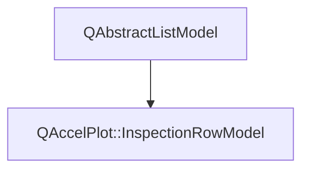

# Class QAccelPlot::InspectionRowModel


[**ClassList**](annotated.md) **>** [**QAccelPlot**](namespaceQAccelPlot.md) **>** [**InspectionRowModel**](classQAccelPlot_1_1InspectionRowModel.md)


_List model with one stable row per inspected series._ [More...](#detailed-description)

* `#include <InspectionRowModel.hpp>`


Inherits the following classes: QAbstractListModel


## Inheritance diagram




## Public Types

| Type | Name |
| ---: | :--- |
| enum  | [**Role**](#enum-role)  <br>_Data roles; the QML role names are listed in the class description._  |


## Public Properties

| Type | Name |
| ---: | :--- |
| property QML\_ANONYMOUSint | [**count**](classQAccelPlot_1_1InspectionRowModel.md#property-count-12)  <br>_Number of rows._  |


## Public Signals

| Type | Name |
| ---: | :--- |
| signal void | [**countChanged**](classQAccelPlot_1_1InspectionRowModel.md#signal-countchanged)  <br>_Emitted when the count property changes._  |


## Public Functions

| Type | Name |
| ---: | :--- |
|   | [**InspectionRowModel**](#function-inspectionrowmodel) (QObject \* parent=nullptr) <br>_Constructs an empty model._  |
|  int | [**count**](#function-count-22) () const<br>_Returns the number of rows._  |
|  QVariant | [**data**](#function-data) (const QModelIndex & index, int role) override const<br>_Returns the value of_ _role_ _for the row at__index_ _._ |
|  Q\_INVOKABLE QVariantMap | [**get**](#function-get) (int row) const<br>_Returns every role of_ _row_ _keyed by role name, or an empty map when out of range._ |
|  void | [**retainSeries**](#function-retainseries) (const QList&lt; [**PlotSeries**](classQAccelPlot_1_1PlotSeries.md) \* &gt; & series) <br>_Removes rows whose series is destroyed or not in_ _series_ _._ |
|  QHash&lt; int, QByteArray &gt; | [**roleNames**](#function-rolenames) () override const<br>_Returns the QML role names._  |
|  int | [**rowCount**](#function-rowcount) (const QModelIndex & parent={}) override const<br>_Returns the number of rows._  |
|  const QList&lt; [**InspectionRow**](structQAccelPlot_1_1InspectionRow.md) &gt; & | [**rows**](#function-rows) () const<br>_Returns the current rows._  |
|  void | [**setRows**](#function-setrows) (const QList&lt; [**InspectionRow**](structQAccelPlot_1_1InspectionRow.md) &gt; & rows) <br>_Replaces the rows, updating them in place when the series are unchanged._  |


## Detailed Description


Provided by `PlotInspector::model` and `SelectionTool::model`. Rows are added and removed only when the set of inspected series changes; cursor movement updates rows in place, so delegates are reused.


Roles: `series`, `seriesName`, `seriesColor`, `valid`, `sampleStatus`, `sampleIndex`, `sampleX`, `sampleY`, `sampleValue`, `xText`, `yText`, `pixelPosition`, `distance`, `interpolated`, `hasSummary`, `summaryStatus`, `summaryCount`, `minimum`, `maximum`, `mean`, `standardDeviation`, `minimumIndex`, `maximumIndex`, `minimumText`, `maximumText`, and `meanText`. 


    
## Public Types Documentation


### enum Role {#enum-role}

_Data roles; the QML role names are listed in the class description._ 
```C++
enum QAccelPlot::InspectionRowModel::Role {
    SeriesRole = Qt::UserRole + 1,
    SeriesNameRole,
    SeriesColorRole,
    ValidRole,
    SampleStatusRole,
    SampleIndexRole,
    SampleXRole,
    SampleYRole,
    SampleValueRole,
    XTextRole,
    YTextRole,
    PixelPositionRole,
    DistanceRole,
    InterpolatedRole,
    HasSummaryRole,
    SummaryStatusRole,
    SummaryCountRole,
    MinimumRole,
    MaximumRole,
    MeanRole,
    StandardDeviationRole,
    MinimumIndexRole,
    MaximumIndexRole,
    MinimumTextRole,
    MaximumTextRole,
    MeanTextRole
};
```


<hr>
## Public Properties Documentation


### property count {#property-count-12}

_Number of rows._ 
```C++
QML_ANONYMOUSint QAccelPlot::InspectionRowModel::count;
```


<hr>
## Public Signals Documentation


### signal countChanged {#signal-countchanged}

_Emitted when the count property changes._ 
```C++
void QAccelPlot::InspectionRowModel::countChanged;
```


<hr>
## Public Functions Documentation


### function InspectionRowModel {#function-inspectionrowmodel}

_Constructs an empty model._ 
```C++
explicit QAccelPlot::InspectionRowModel::InspectionRowModel (
    QObject * parent=nullptr
) 
```


<hr>


### function count {#function-count-22}

_Returns the number of rows._ 
```C++
int QAccelPlot::InspectionRowModel::count () const
```


<hr>


### function data {#function-data}

_Returns the value of_ _role_ _for the row at__index_ _._
```C++
QVariant QAccelPlot::InspectionRowModel::data (
    const QModelIndex & index,
    int role
) override const
```


<hr>


### function get {#function-get}

_Returns every role of_ _row_ _keyed by role name, or an empty map when out of range._
```C++
Q_INVOKABLE QVariantMap QAccelPlot::InspectionRowModel::get (
    int row
) const
```


<hr>


### function retainSeries {#function-retainseries}

_Removes rows whose series is destroyed or not in_ _series_ _._
```C++
void QAccelPlot::InspectionRowModel::retainSeries (
    const QList< PlotSeries * > & series
) 
```


<hr>


### function roleNames {#function-rolenames}

_Returns the QML role names._ 
```C++
QHash< int, QByteArray > QAccelPlot::InspectionRowModel::roleNames () override const
```


<hr>


### function rowCount {#function-rowcount}

_Returns the number of rows._ 
```C++
int QAccelPlot::InspectionRowModel::rowCount (
    const QModelIndex & parent={}
) override const
```


<hr>


### function rows {#function-rows}

_Returns the current rows._ 
```C++
const QList< InspectionRow > & QAccelPlot::InspectionRowModel::rows () const
```


<hr>


### function setRows {#function-setrows}

_Replaces the rows, updating them in place when the series are unchanged._ 
```C++
void QAccelPlot::InspectionRowModel::setRows (
    const QList< InspectionRow > & rows
) 
```


<hr>

------------------------------
The documentation for this class was generated from the following file `QAccelPlot/src/QAccelPlot/inspection/InspectionRowModel.hpp`

