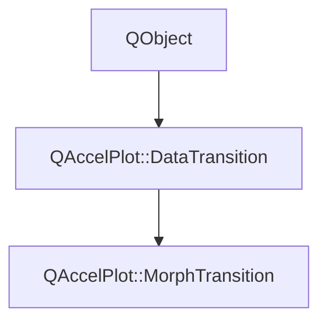

# Class QAccelPlot::MorphTransition


[**ClassList**](annotated.md) **>** [**QAccelPlot**](namespaceQAccelPlot.md) **>** [**MorphTransition**](classQAccelPlot_1_1MorphTransition.md)


_An animation transition that smoothly interpolates point positions between two datasets._ [More...](#detailed-description)

* `#include <MorphTransition.hpp>`


Inherits the following classes: [QAccelPlot::DataTransition](classQAccelPlot_1_1DataTransition.md)


## Inheritance diagram




## Public Properties inherited from QAccelPlot::DataTransition

See [QAccelPlot::DataTransition](classQAccelPlot_1_1DataTransition.md)

| Type | Name |
| ---: | :--- |
| property QML\_ANONYMOUSint | [**duration**](classQAccelPlot_1_1DataTransition.md#property-duration-12)  <br>_Duration of the transition in milliseconds. Default: 300._  |
| property QEasingCurve | [**easing**](classQAccelPlot_1_1DataTransition.md#property-easing-12)  <br>_Easing curve applied to the animation progress. Default:_ `QEasingCurve::Linear` _._ |
| property bool | [**enabled**](classQAccelPlot_1_1DataTransition.md#property-enabled-12)  <br>_Whether the transition is active. When_ `false` _, data updates are applied instantly._ |
| property bool | [**running**](classQAccelPlot_1_1DataTransition.md#property-running-12)  <br>_Read-only:_ `true` _while the transition is playing._ |


## Public Signals inherited from QAccelPlot::DataTransition

See [QAccelPlot::DataTransition](classQAccelPlot_1_1DataTransition.md)

| Type | Name |
| ---: | :--- |
| signal void | [**durationChanged**](classQAccelPlot_1_1DataTransition.md#signal-durationchanged)  <br>_Emitted when the duration property changes._  |
| signal void | [**easingChanged**](classQAccelPlot_1_1DataTransition.md#signal-easingchanged)  <br>_Emitted when the easing property changes._  |
| signal void | [**enabledChanged**](classQAccelPlot_1_1DataTransition.md#signal-enabledchanged)  <br>_Emitted when the enabled property changes._  |
| signal void | [**runningChanged**](classQAccelPlot_1_1DataTransition.md#signal-runningchanged)  <br>_Emitted when the running property changes._  |


## Public Functions

| Type | Name |
| ---: | :--- |
|   | [**MorphTransition**](#function-morphtransition) (QObject \* parent=nullptr) <br>_Constructs a_ [_**MorphTransition**_](classQAccelPlot_1_1MorphTransition.md) _with the given__parent_ _._ |


## Public Functions inherited from QAccelPlot::DataTransition

See [QAccelPlot::DataTransition](classQAccelPlot_1_1DataTransition.md)

| Type | Name |
| ---: | :--- |
|   | [**DataTransition**](classQAccelPlot_1_1DataTransition.md#function-datatransition) (QObject \* parent=nullptr) <br>_Constructs an_ [_**DataTransition**_](classQAccelPlot_1_1DataTransition.md) _with the given__parent_ _._ |
|  bool | [**advance**](classQAccelPlot_1_1DataTransition.md#function-advance) (std::vector&lt; double &gt; & outData, int & outPointCount) <br>_Advances the animation by one frame, writing the interpolated data into_ _outData_ _._ |
|  void | [**cancel**](classQAccelPlot_1_1DataTransition.md#function-cancel) () <br>_Cancels the running transition immediately._  |
|  int | [**duration**](classQAccelPlot_1_1DataTransition.md#function-duration-22) () const<br>_Returns the animation duration in milliseconds._  |
|  QEasingCurve | [**easing**](classQAccelPlot_1_1DataTransition.md#function-easing-22) () const<br>_Returns the easing curve._  |
|  bool | [**enabled**](classQAccelPlot_1_1DataTransition.md#function-enabled-22) () const<br>_Returns_ `true` _if the transition is enabled._ |
|  bool | [**running**](classQAccelPlot_1_1DataTransition.md#function-running-22) () const<br>_Returns_ `true` _while a transition is actively playing._ |
|  void | [**setDuration**](classQAccelPlot_1_1DataTransition.md#function-setduration) (int duration) <br>_Sets the animation duration to_ _duration_ _milliseconds._ |
|  void | [**setEasing**](classQAccelPlot_1_1DataTransition.md#function-seteasing) (const QEasingCurve & easing) <br>_Sets the easing curve to_ _easing_ _._ |
|  void | [**setEnabled**](classQAccelPlot_1_1DataTransition.md#function-setenabled) (bool enabled) <br>_Sets the enabled state to_ _enabled_ _._ |
|  void | [**start**](classQAccelPlot_1_1DataTransition.md#function-start) (const std::vector&lt; double &gt; & currentData, int currentPointCount, std::vector&lt; double &gt; && newData, int newPointCount) <br>_Starts a new transition from_ _currentData_ _to__newData_ _._ |


## Protected Functions

| Type | Name |
| ---: | :--- |
| virtual void | [**interpolate**](#function-interpolate) (double easedProgress, const std::vector&lt; double &gt; & fromData, int fromPointCount, const std::vector&lt; double &gt; & toData, int toPointCount, std::vector&lt; double &gt; & outData, int & outPointCount) override<br>_Interpolates point positions between the two datasets at_ _easedProgress_ _(0–1)._ |


## Protected Functions inherited from QAccelPlot::DataTransition

See [QAccelPlot::DataTransition](classQAccelPlot_1_1DataTransition.md)

| Type | Name |
| ---: | :--- |
| virtual void | [**interpolate**](classQAccelPlot_1_1DataTransition.md#function-interpolate) (double easedProgress, const std::vector&lt; double &gt; & fromData, int fromPointCount, const std::vector&lt; double &gt; & toData, int toPointCount, std::vector&lt; double &gt; & outData, int & outPointCount) = 0<br>_Subclass entry point — computes the interpolated dataset at_ _easedProgress_ _(0–1)._ |


## Detailed Description


Each point is linearly blended from its old position to its new position. When the point counts differ, the shorter dataset is resampled to match.


**See also:** [**DrawTransition**](classQAccelPlot_1_1DrawTransition.md), [**DataTransition**](classQAccelPlot_1_1DataTransition.md) 


    
## Public Functions Documentation


### function MorphTransition {#function-morphtransition}

_Constructs a_ [_**MorphTransition**_](classQAccelPlot_1_1MorphTransition.md) _with the given__parent_ _._
```C++
explicit QAccelPlot::MorphTransition::MorphTransition (
    QObject * parent=nullptr
) 
```


<hr>
## Protected Functions Documentation


### function interpolate {#function-interpolate}

_Interpolates point positions between the two datasets at_ _easedProgress_ _(0–1)._
```C++
virtual void QAccelPlot::MorphTransition::interpolate (
    double easedProgress,
    const std::vector< double > & fromData,
    int fromPointCount,
    const std::vector< double > & toData,
    int toPointCount,
    std::vector< double > & outData,
    int & outPointCount
) override
```


Implements [*QAccelPlot::DataTransition::interpolate*](classQAccelPlot_1_1DataTransition.md#function-interpolate)


<hr>

------------------------------
The documentation for this class was generated from the following file `QAccelPlot/src/transitions/MorphTransition.hpp`

