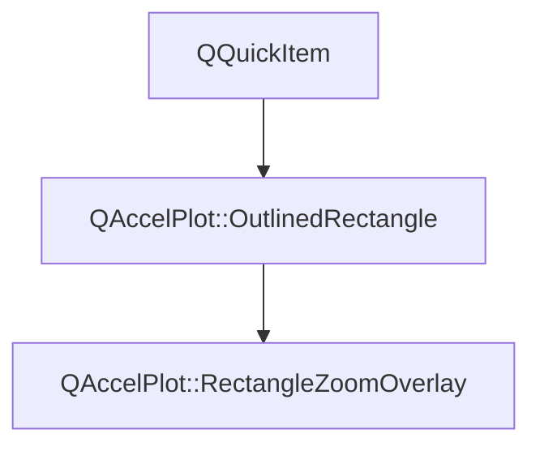

# Class QAccelPlot::OutlinedRectangle


[**ClassList**](annotated.md) **>** [**QAccelPlot**](namespaceQAccelPlot.md) **>** [**OutlinedRectangle**](classQAccelPlot_1_1OutlinedRectangle.md)


_Item that fills its bounds and outlines them with a line of one logical pixel._ 

* `#include <OutlinedRectangle.hpp>`


Inherits the following classes: QQuickItem


Inherited by the following classes: [QAccelPlot::RectangleZoomOverlay](classQAccelPlot_1_1RectangleZoomOverlay.md)


## Inheritance diagram




## Public Functions

| Type | Name |
| ---: | :--- |
|   | [**OutlinedRectangle**](#function-outlinedrectangle) (QQuickItem \* parent=nullptr) <br> |
|  void | [**setColors**](#function-setcolors) (const QColor & fill, const QColor & border) <br>_Sets the_ _fill_ _and__border_ _colors._ |


## Protected Functions

| Type | Name |
| ---: | :--- |
|  QSGNode \* | [**updatePaintNode**](#function-updatepaintnode) (QSGNode \* oldNode, UpdatePaintNodeData \*) override<br> |


## Public Functions Documentation


### function OutlinedRectangle {#function-outlinedrectangle}

```C++
explicit QAccelPlot::OutlinedRectangle::OutlinedRectangle (
    QQuickItem * parent=nullptr
) 
```


<hr>


### function setColors {#function-setcolors}

_Sets the_ _fill_ _and__border_ _colors._
```C++
void QAccelPlot::OutlinedRectangle::setColors (
    const QColor & fill,
    const QColor & border
) 
```


<hr>
## Protected Functions Documentation


### function updatePaintNode {#function-updatepaintnode}

```C++
QSGNode * QAccelPlot::OutlinedRectangle::updatePaintNode (
    QSGNode * oldNode,
    UpdatePaintNodeData *
) override
```


<hr>

------------------------------
The documentation for this class was generated from the following file `QAccelPlot/src/QAccelPlot/internal/OutlinedRectangle.hpp`

