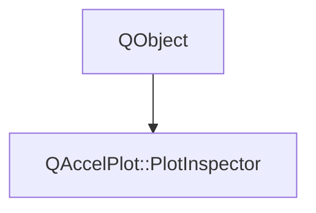

# Class QAccelPlot::PlotInspector


[**ClassList**](annotated.md) **>** [**QAccelPlot**](namespaceQAccelPlot.md) **>** [**PlotInspector**](classQAccelPlot_1_1PlotInspector.md)


_Inspects every visible XY series of a plot at a cursor and publishes one model row per series._ [More...](#detailed-description)

* `#include <PlotInspector.hpp>`


Inherits the following classes: QObject


## Inheritance diagram




## Public Types

| Type | Name |
| ---: | :--- |
| enum  | [**Mode**](#enum-mode)  <br>_How each series is matched to the cursor._  |


## Public Properties

| Type | Name |
| ---: | :--- |
| property bool | [**active**](classQAccelPlot_1_1PlotInspector.md#property-active-12)  <br>_True while enabled and the cursor is inside the plot area._  |
| property qreal | [**cursorX**](classQAccelPlot_1_1PlotInspector.md#property-cursorx-12)  <br>_Cursor X on the plot's primary X axis: the pointer's while_ `followPointer` _is true, NaN when it is outside._ |
| property QString | [**cursorXText**](classQAccelPlot_1_1PlotInspector.md#property-cursorxtext-12)  <br>_Crosshair X formatted by the plot's primary X axis._  |
| property qreal | [**cursorY**](classQAccelPlot_1_1PlotInspector.md#property-cursory-12)  <br>_Cursor Y on the plot's primary Y axis; see_ `cursorX` _. NaN leaves the cursor without a Y._ |
| property QString | [**cursorYText**](classQAccelPlot_1_1PlotInspector.md#property-cursorytext-12)  <br>_Crosshair Y formatted by the plot's primary Y axis; empty without a cursor Y._  |
| property QQmlListProperty&lt; QObject &gt; | [**data**](classQAccelPlot_1_1PlotInspector.md#property-data-12)  <br>_Default property: objects declared inside the inspector._  |
| property bool | [**enabled**](classQAccelPlot_1_1PlotInspector.md#property-enabled-12)  <br>_Enables queries. A disabled inspector is inactive and does no work. Default: true._  |
| property QList&lt; [**PlotSeries**](classQAccelPlot_1_1PlotSeries.md) \* &gt; | [**excludedSeries**](classQAccelPlot_1_1PlotInspector.md#property-excludedseries-12)  <br>_Series never inspected, even when listed in_ `includedSeries` _._ |
| property bool | [**followPointer**](classQAccelPlot_1_1PlotInspector.md#property-followpointer-12)  <br>_Whether the cursor follows the plot's pointer. When false it stays at_ `cursorX` _and_`cursorY` _. Default: true._ |
| property QList&lt; [**PlotSeries**](classQAccelPlot_1_1PlotSeries.md) \* &gt; | [**includedSeries**](classQAccelPlot_1_1PlotInspector.md#property-includedseries-12)  <br>_Series to inspect; an empty list inspects every series of the plot._  |
| property bool | [**interpolate**](classQAccelPlot_1_1PlotInspector.md#property-interpolate-12)  <br>_In_ `NearestX` _and_`NearestY` _mode, reports the point on the line between two consecutive samples instead of the nearer one. Default: false._ |
| property [**Mode**](classQAccelPlot_1_1PlotInspector.md#enum-mode) | [**mode**](classQAccelPlot_1_1PlotInspector.md#property-mode-12)  <br>`NearestX` _and_`NearestY` _report each series at the cursor's X or Y;_`NearestXY` _picks by on-screen distance. Default: NearestX._ |
| property [**QAccelPlot::InspectionRowModel**](classQAccelPlot_1_1InspectionRowModel.md) \* | [**model**](classQAccelPlot_1_1PlotInspector.md#property-model-12)  <br>_Read-only constant: one row per inspected series._  |
| property [**QAccelPlot::QAccelPlot**](classQAccelPlot_1_1QAccelPlot.md) \* | [**plot**](classQAccelPlot_1_1PlotInspector.md#property-plot-12)  <br>_Plot whose series are inspected._  |
| property QPointF | [**position**](classQAccelPlot_1_1PlotInspector.md#property-position-12)  <br>_Crosshair position in plot-local logical pixels; a coordinate the cursor lacks is NaN._  |
| property qreal | [**radius**](classQAccelPlot_1_1PlotInspector.md#property-radius-12)  <br>_Pick distance in logical pixels. In_ `NearestX` _and_`NearestY` _mode it only limits matches beyond a series' extreme samples. Default: 16._ |
| property bool | [**snapToSample**](classQAccelPlot_1_1PlotInspector.md#property-snaptosample-12)  <br>_Moves the crosshair to the closest matching sample. Default: false._  |
| property bool | [**summaries**](classQAccelPlot_1_1PlotInspector.md#property-summaries-12)  <br>_Adds Y statistics of the samples around the cursor to every row. Default: false._  |
| property qreal | [**summaryRadius**](classQAccelPlot_1_1PlotInspector.md#property-summaryradius-12)  <br>_Half-width of the summary neighborhood in logical pixels. Default: 0.5._  |
| property int | [**validCount**](classQAccelPlot_1_1PlotInspector.md#property-validcount-12)  <br>_Number of rows with a matching sample._  |


## Public Signals

| Type | Name |
| ---: | :--- |
| signal void | [**activeChanged**](classQAccelPlot_1_1PlotInspector.md#signal-activechanged)  <br>_Emitted when the active property changes._  |
| signal void | [**cursorChanged**](classQAccelPlot_1_1PlotInspector.md#signal-cursorchanged)  <br>_Emitted when the cursor coordinates or their texts change._  |
| signal void | [**enabledChanged**](classQAccelPlot_1_1PlotInspector.md#signal-enabledchanged)  <br>_Emitted when the enabled property changes._  |
| signal void | [**excludedSeriesChanged**](classQAccelPlot_1_1PlotInspector.md#signal-excludedserieschanged)  <br>_Emitted when the excludedSeries property changes._  |
| signal void | [**followPointerChanged**](classQAccelPlot_1_1PlotInspector.md#signal-followpointerchanged)  <br>_Emitted when the followPointer property changes._  |
| signal void | [**includedSeriesChanged**](classQAccelPlot_1_1PlotInspector.md#signal-includedserieschanged)  <br>_Emitted when the includedSeries property changes._  |
| signal void | [**interpolateChanged**](classQAccelPlot_1_1PlotInspector.md#signal-interpolatechanged)  <br>_Emitted when the interpolate property changes._  |
| signal void | [**modeChanged**](classQAccelPlot_1_1PlotInspector.md#signal-modechanged)  <br>_Emitted when the mode property changes._  |
| signal void | [**plotChanged**](classQAccelPlot_1_1PlotInspector.md#signal-plotchanged)  <br>_Emitted when the plot property changes._  |
| signal void | [**positionChanged**](classQAccelPlot_1_1PlotInspector.md#signal-positionchanged)  <br>_Emitted when the position property changes._  |
| signal void | [**radiusChanged**](classQAccelPlot_1_1PlotInspector.md#signal-radiuschanged)  <br>_Emitted when the radius property changes._  |
| signal void | [**refreshed**](classQAccelPlot_1_1PlotInspector.md#signal-refreshed)  <br>_Emitted after every refresh that published results._  |
| signal void | [**snapToSampleChanged**](classQAccelPlot_1_1PlotInspector.md#signal-snaptosamplechanged)  <br>_Emitted when the snapToSample property changes._  |
| signal void | [**summariesChanged**](classQAccelPlot_1_1PlotInspector.md#signal-summarieschanged)  <br>_Emitted when the summaries property changes._  |
| signal void | [**summaryRadiusChanged**](classQAccelPlot_1_1PlotInspector.md#signal-summaryradiuschanged)  <br>_Emitted when the summaryRadius property changes._  |
| signal void | [**validCountChanged**](classQAccelPlot_1_1PlotInspector.md#signal-validcountchanged)  <br>_Emitted when the validCount property changes._  |


## Public Functions

| Type | Name |
| ---: | :--- |
|   | [**PlotInspector**](#function-plotinspector) (QObject \* parent=nullptr) <br>_Constructs an inspector without a plot._  |
|  bool | [**active**](#function-active-22) () const<br>_Returns whether the cursor is inside the plot area._  |
|  qreal | [**cursorX**](#function-cursorx-22) () const<br>_Returns the cursor X on the plot's primary X axis._  |
|  QString | [**cursorXText**](#function-cursorxtext-22) () const<br>_Returns the formatted crosshair X._  |
|  qreal | [**cursorY**](#function-cursory-22) () const<br>_Returns the cursor Y on the plot's primary Y axis._  |
|  QString | [**cursorYText**](#function-cursorytext-22) () const<br>_Returns the formatted crosshair Y._  |
|  QQmlListProperty&lt; QObject &gt; | [**data**](#function-data-22) () <br>_Returns the objects declared inside the inspector._  |
|  bool | [**enabled**](#function-enabled-22) () const<br>_Returns whether queries are enabled._  |
|  QList&lt; [**PlotSeries**](classQAccelPlot_1_1PlotSeries.md) \* &gt; | [**excludedSeries**](#function-excludedseries-22) () const<br>_Returns the series never inspected, without destroyed entries._  |
|  bool | [**followPointer**](#function-followpointer-22) () const<br>_Returns whether the cursor follows the plot's pointer._  |
|  QList&lt; [**PlotSeries**](classQAccelPlot_1_1PlotSeries.md) \* &gt; | [**includedSeries**](#function-includedseries-22) () const<br>_Returns the series to inspect, without destroyed entries._  |
|  bool | [**interpolate**](#function-interpolate-22) () const<br>_Returns whether_ `NearestX` _and_`NearestY` _rows are interpolated between samples._ |
|  [**Mode**](classQAccelPlot_1_1PlotInspector.md#enum-mode) | [**mode**](#function-mode-22) () const<br>_Returns the matching mode._  |
|  [**InspectionRowModel**](classQAccelPlot_1_1InspectionRowModel.md) \* | [**model**](#function-model-22) () const<br>_Returns the row model._  |
|  [**::QAccelPlot::QAccelPlot**](classQAccelPlot_1_1QAccelPlot.md) \* | [**plot**](#function-plot-22) () const<br>_Returns the inspected plot._  |
|  QPointF | [**position**](#function-position-22) () const<br>_Returns the crosshair position in plot-local logical pixels._  |
|  qreal | [**radius**](#function-radius-22) () const<br>_Returns the pick distance in logical pixels._  |
|  Q\_INVOKABLE void | [**refresh**](#function-refresh) () <br>_Runs the queries now instead of on the next event-loop pass._  |
|  void | [**setCursorX**](#function-setcursorx) (qreal x) <br>_Sets the cursor X used while_ `followPointer` _is false._ |
|  void | [**setCursorY**](#function-setcursory) (qreal y) <br>_Sets the cursor Y used while_ `followPointer` _is false._ |
|  void | [**setEnabled**](#function-setenabled) (bool enabled) <br>_Enables or disables queries._  |
|  void | [**setExcludedSeries**](#function-setexcludedseries) (const QList&lt; [**PlotSeries**](classQAccelPlot_1_1PlotSeries.md) \* &gt; & series) <br>_Sets the series never inspected._  |
|  void | [**setFollowPointer**](#function-setfollowpointer) (bool follow) <br>_Switches between following the pointer and a cursor set from code._  |
|  void | [**setIncludedSeries**](#function-setincludedseries) (const QList&lt; [**PlotSeries**](classQAccelPlot_1_1PlotSeries.md) \* &gt; & series) <br>_Sets the series to inspect._  |
|  void | [**setInterpolate**](#function-setinterpolate) (bool enabled) <br>_Enables or disables interpolation between consecutive samples._  |
|  void | [**setMode**](#function-setmode) ([**Mode**](classQAccelPlot_1_1PlotInspector.md#enum-mode) mode) <br>_Sets the matching mode._  |
|  void | [**setPlot**](#function-setplot) ([**::QAccelPlot::QAccelPlot**](classQAccelPlot_1_1QAccelPlot.md) \* plot) <br>_Sets the inspected plot._  |
|  void | [**setRadius**](#function-setradius) (qreal radius) <br>_Sets the pick distance; negative and NaN values are ignored._  |
|  void | [**setSnapToSample**](#function-setsnaptosample) (bool enabled) <br>_Enables or disables crosshair snapping._  |
|  void | [**setSummaries**](#function-setsummaries) (bool enabled) <br>_Enables or disables neighborhood statistics._  |
|  void | [**setSummaryRadius**](#function-setsummaryradius) (qreal radius) <br>_Sets the summary half-width; negative and nonfinite values are ignored._  |
|  bool | [**snapToSample**](#function-snaptosample-22) () const<br>_Returns whether the crosshair snaps to the closest matching sample._  |
|  Q\_INVOKABLE void | [**stepCursor**](#function-stepcursor) (int steps) <br>_Moves the cursor_ _steps_ _source records along the first matching series and stops following the pointer._ |
|  bool | [**summaries**](#function-summaries-22) () const<br>_Returns whether rows include neighborhood statistics._  |
|  qreal | [**summaryRadius**](#function-summaryradius-22) () const<br>_Returns the summary half-width in logical pixels._  |
|  int | [**validCount**](#function-validcount-22) () const<br>_Returns the number of rows with a matching sample._  |
|   | [**~PlotInspector**](#function-plotinspector) () override<br>_Destroys the inspector and the objects declared inside it._  |


## Detailed Description


The cursor follows the plot's pointer by default; set `followPointer` to `false` and write `cursorX` to drive it from code, for example to link the crosshairs of several plots. Results are refreshed at most once per event-loop pass.


In QML, declare `Crosshair`, `InspectionMarkers`, and `InspectionTooltip` inside the inspector: they receive it as their `inspector` and are stacked in declaration order, the last one on top.


**See also:** [**SeriesInspection**](classQAccelPlot_1_1SeriesInspection.md), [**InspectionRowModel**](classQAccelPlot_1_1InspectionRowModel.md) 


    
## Public Types Documentation


### enum Mode {#enum-mode}

_How each series is matched to the cursor._ 
```C++
enum QAccelPlot::PlotInspector::Mode {
    NearestX,
    NearestY,
    NearestXY
};
```


<hr>
## Public Properties Documentation


### property active {#property-active-12}

_True while enabled and the cursor is inside the plot area._ 
```C++
bool QAccelPlot::PlotInspector::active;
```


<hr>


### property cursorX {#property-cursorx-12}

_Cursor X on the plot's primary X axis: the pointer's while_ `followPointer` _is true, NaN when it is outside._
```C++
qreal QAccelPlot::PlotInspector::cursorX;
```


A written value is used while `followPointer` is false. 


        

<hr>


### property cursorXText {#property-cursorxtext-12}

_Crosshair X formatted by the plot's primary X axis._ 
```C++
QString QAccelPlot::PlotInspector::cursorXText;
```


<hr>


### property cursorY {#property-cursory-12}

_Cursor Y on the plot's primary Y axis; see_ `cursorX` _. NaN leaves the cursor without a Y._
```C++
qreal QAccelPlot::PlotInspector::cursorY;
```


<hr>


### property cursorYText {#property-cursorytext-12}

_Crosshair Y formatted by the plot's primary Y axis; empty without a cursor Y._ 
```C++
QString QAccelPlot::PlotInspector::cursorYText;
```


<hr>


### property data {#property-data-12}

_Default property: objects declared inside the inspector._ 
```C++
QQmlListProperty<QObject> QAccelPlot::PlotInspector::data;
```


Every object with an `inspector` property receives this inspector. Items among them are stacked in declaration order above the other children of the plot's overlay. 


        

<hr>


### property enabled {#property-enabled-12}

_Enables queries. A disabled inspector is inactive and does no work. Default: true._ 
```C++
bool QAccelPlot::PlotInspector::enabled;
```


<hr>


### property excludedSeries {#property-excludedseries-12}

_Series never inspected, even when listed in_ `includedSeries` _._
```C++
QList<PlotSeries*> QAccelPlot::PlotInspector::excludedSeries;
```


<hr>


### property followPointer {#property-followpointer-12}

_Whether the cursor follows the plot's pointer. When false it stays at_ `cursorX` _and_`cursorY` _. Default: true._
```C++
bool QAccelPlot::PlotInspector::followPointer;
```


<hr>


### property includedSeries {#property-includedseries-12}

_Series to inspect; an empty list inspects every series of the plot._ 
```C++
QList<PlotSeries*> QAccelPlot::PlotInspector::includedSeries;
```


<hr>


### property interpolate {#property-interpolate-12}

_In_ `NearestX` _and_`NearestY` _mode, reports the point on the line between two consecutive samples instead of the nearer one. Default: false._
```C++
bool QAccelPlot::PlotInspector::interpolate;
```


<hr>


### property mode {#property-mode-12}

`NearestX` _and_`NearestY` _report each series at the cursor's X or Y;_`NearestXY` _picks by on-screen distance. Default: NearestX._
```C++
Mode QAccelPlot::PlotInspector::mode;
```


<hr>


### property model {#property-model-12}

_Read-only constant: one row per inspected series._ 
```C++
QAccelPlot::InspectionRowModel* QAccelPlot::PlotInspector::model;
```


<hr>


### property plot {#property-plot-12}

_Plot whose series are inspected._ 
```C++
QAccelPlot::QAccelPlot* QAccelPlot::PlotInspector::plot;
```


<hr>


### property position {#property-position-12}

_Crosshair position in plot-local logical pixels; a coordinate the cursor lacks is NaN._ 
```C++
QPointF QAccelPlot::PlotInspector::position;
```


<hr>


### property radius {#property-radius-12}

_Pick distance in logical pixels. In_ `NearestX` _and_`NearestY` _mode it only limits matches beyond a series' extreme samples. Default: 16._
```C++
qreal QAccelPlot::PlotInspector::radius;
```


<hr>


### property snapToSample {#property-snaptosample-12}

_Moves the crosshair to the closest matching sample. Default: false._ 
```C++
bool QAccelPlot::PlotInspector::snapToSample;
```


<hr>


### property summaries {#property-summaries-12}

_Adds Y statistics of the samples around the cursor to every row. Default: false._ 
```C++
bool QAccelPlot::PlotInspector::summaries;
```


<hr>


### property summaryRadius {#property-summaryradius-12}

_Half-width of the summary neighborhood in logical pixels. Default: 0.5._ 
```C++
qreal QAccelPlot::PlotInspector::summaryRadius;
```


<hr>


### property validCount {#property-validcount-12}

_Number of rows with a matching sample._ 
```C++
int QAccelPlot::PlotInspector::validCount;
```


<hr>
## Public Signals Documentation


### signal activeChanged {#signal-activechanged}

_Emitted when the active property changes._ 
```C++
void QAccelPlot::PlotInspector::activeChanged;
```


<hr>


### signal cursorChanged {#signal-cursorchanged}

_Emitted when the cursor coordinates or their texts change._ 
```C++
void QAccelPlot::PlotInspector::cursorChanged;
```


<hr>


### signal enabledChanged {#signal-enabledchanged}

_Emitted when the enabled property changes._ 
```C++
void QAccelPlot::PlotInspector::enabledChanged;
```


<hr>


### signal excludedSeriesChanged {#signal-excludedserieschanged}

_Emitted when the excludedSeries property changes._ 
```C++
void QAccelPlot::PlotInspector::excludedSeriesChanged;
```


<hr>


### signal followPointerChanged {#signal-followpointerchanged}

_Emitted when the followPointer property changes._ 
```C++
void QAccelPlot::PlotInspector::followPointerChanged;
```


<hr>


### signal includedSeriesChanged {#signal-includedserieschanged}

_Emitted when the includedSeries property changes._ 
```C++
void QAccelPlot::PlotInspector::includedSeriesChanged;
```


<hr>


### signal interpolateChanged {#signal-interpolatechanged}

_Emitted when the interpolate property changes._ 
```C++
void QAccelPlot::PlotInspector::interpolateChanged;
```


<hr>


### signal modeChanged {#signal-modechanged}

_Emitted when the mode property changes._ 
```C++
void QAccelPlot::PlotInspector::modeChanged;
```


<hr>


### signal plotChanged {#signal-plotchanged}

_Emitted when the plot property changes._ 
```C++
void QAccelPlot::PlotInspector::plotChanged;
```


<hr>


### signal positionChanged {#signal-positionchanged}

_Emitted when the position property changes._ 
```C++
void QAccelPlot::PlotInspector::positionChanged;
```


<hr>


### signal radiusChanged {#signal-radiuschanged}

_Emitted when the radius property changes._ 
```C++
void QAccelPlot::PlotInspector::radiusChanged;
```


<hr>


### signal refreshed {#signal-refreshed}

_Emitted after every refresh that published results._ 
```C++
void QAccelPlot::PlotInspector::refreshed;
```


<hr>


### signal snapToSampleChanged {#signal-snaptosamplechanged}

_Emitted when the snapToSample property changes._ 
```C++
void QAccelPlot::PlotInspector::snapToSampleChanged;
```


<hr>


### signal summariesChanged {#signal-summarieschanged}

_Emitted when the summaries property changes._ 
```C++
void QAccelPlot::PlotInspector::summariesChanged;
```


<hr>


### signal summaryRadiusChanged {#signal-summaryradiuschanged}

_Emitted when the summaryRadius property changes._ 
```C++
void QAccelPlot::PlotInspector::summaryRadiusChanged;
```


<hr>


### signal validCountChanged {#signal-validcountchanged}

_Emitted when the validCount property changes._ 
```C++
void QAccelPlot::PlotInspector::validCountChanged;
```


<hr>
## Public Functions Documentation


### function PlotInspector {#function-plotinspector}

_Constructs an inspector without a plot._ 
```C++
explicit QAccelPlot::PlotInspector::PlotInspector (
    QObject * parent=nullptr
) 
```


<hr>


### function active {#function-active-22}

_Returns whether the cursor is inside the plot area._ 
```C++
bool QAccelPlot::PlotInspector::active () const
```


<hr>


### function cursorX {#function-cursorx-22}

_Returns the cursor X on the plot's primary X axis._ 
```C++
qreal QAccelPlot::PlotInspector::cursorX () const
```


<hr>


### function cursorXText {#function-cursorxtext-22}

_Returns the formatted crosshair X._ 
```C++
QString QAccelPlot::PlotInspector::cursorXText () const
```


<hr>


### function cursorY {#function-cursory-22}

_Returns the cursor Y on the plot's primary Y axis._ 
```C++
qreal QAccelPlot::PlotInspector::cursorY () const
```


<hr>


### function cursorYText {#function-cursorytext-22}

_Returns the formatted crosshair Y._ 
```C++
QString QAccelPlot::PlotInspector::cursorYText () const
```


<hr>


### function data {#function-data-22}

_Returns the objects declared inside the inspector._ 
```C++
QQmlListProperty< QObject > QAccelPlot::PlotInspector::data () 
```


<hr>


### function enabled {#function-enabled-22}

_Returns whether queries are enabled._ 
```C++
bool QAccelPlot::PlotInspector::enabled () const
```


<hr>


### function excludedSeries {#function-excludedseries-22}

_Returns the series never inspected, without destroyed entries._ 
```C++
QList< PlotSeries * > QAccelPlot::PlotInspector::excludedSeries () const
```


<hr>


### function followPointer {#function-followpointer-22}

_Returns whether the cursor follows the plot's pointer._ 
```C++
bool QAccelPlot::PlotInspector::followPointer () const
```


<hr>


### function includedSeries {#function-includedseries-22}

_Returns the series to inspect, without destroyed entries._ 
```C++
QList< PlotSeries * > QAccelPlot::PlotInspector::includedSeries () const
```


<hr>


### function interpolate {#function-interpolate-22}

_Returns whether_ `NearestX` _and_`NearestY` _rows are interpolated between samples._
```C++
bool QAccelPlot::PlotInspector::interpolate () const
```


<hr>


### function mode {#function-mode-22}

_Returns the matching mode._ 
```C++
Mode QAccelPlot::PlotInspector::mode () const
```


<hr>


### function model {#function-model-22}

_Returns the row model._ 
```C++
InspectionRowModel * QAccelPlot::PlotInspector::model () const
```


<hr>


### function plot {#function-plot-22}

_Returns the inspected plot._ 
```C++
::QAccelPlot::QAccelPlot * QAccelPlot::PlotInspector::plot () const
```


<hr>


### function position {#function-position-22}

_Returns the crosshair position in plot-local logical pixels._ 
```C++
QPointF QAccelPlot::PlotInspector::position () const
```


<hr>


### function radius {#function-radius-22}

_Returns the pick distance in logical pixels._ 
```C++
qreal QAccelPlot::PlotInspector::radius () const
```


<hr>


### function refresh {#function-refresh}

_Runs the queries now instead of on the next event-loop pass._ 
```C++
Q_INVOKABLE void QAccelPlot::PlotInspector::refresh () 
```


<hr>


### function setCursorX {#function-setcursorx}

_Sets the cursor X used while_ `followPointer` _is false._
```C++
void QAccelPlot::PlotInspector::setCursorX (
    qreal x
) 
```


<hr>


### function setCursorY {#function-setcursory}

_Sets the cursor Y used while_ `followPointer` _is false._
```C++
void QAccelPlot::PlotInspector::setCursorY (
    qreal y
) 
```


<hr>


### function setEnabled {#function-setenabled}

_Enables or disables queries._ 
```C++
void QAccelPlot::PlotInspector::setEnabled (
    bool enabled
) 
```


<hr>


### function setExcludedSeries {#function-setexcludedseries}

_Sets the series never inspected._ 
```C++
void QAccelPlot::PlotInspector::setExcludedSeries (
    const QList< PlotSeries * > & series
) 
```


<hr>


### function setFollowPointer {#function-setfollowpointer}

_Switches between following the pointer and a cursor set from code._ 
```C++
void QAccelPlot::PlotInspector::setFollowPointer (
    bool follow
) 
```


<hr>


### function setIncludedSeries {#function-setincludedseries}

_Sets the series to inspect._ 
```C++
void QAccelPlot::PlotInspector::setIncludedSeries (
    const QList< PlotSeries * > & series
) 
```


<hr>


### function setInterpolate {#function-setinterpolate}

_Enables or disables interpolation between consecutive samples._ 
```C++
void QAccelPlot::PlotInspector::setInterpolate (
    bool enabled
) 
```


<hr>


### function setMode {#function-setmode}

_Sets the matching mode._ 
```C++
void QAccelPlot::PlotInspector::setMode (
    Mode mode
) 
```


<hr>


### function setPlot {#function-setplot}

_Sets the inspected plot._ 
```C++
void QAccelPlot::PlotInspector::setPlot (
    ::QAccelPlot::QAccelPlot * plot
) 
```


<hr>


### function setRadius {#function-setradius}

_Sets the pick distance; negative and NaN values are ignored._ 
```C++
void QAccelPlot::PlotInspector::setRadius (
    qreal radius
) 
```


<hr>


### function setSnapToSample {#function-setsnaptosample}

_Enables or disables crosshair snapping._ 
```C++
void QAccelPlot::PlotInspector::setSnapToSample (
    bool enabled
) 
```


<hr>


### function setSummaries {#function-setsummaries}

_Enables or disables neighborhood statistics._ 
```C++
void QAccelPlot::PlotInspector::setSummaries (
    bool enabled
) 
```


<hr>


### function setSummaryRadius {#function-setsummaryradius}

_Sets the summary half-width; negative and nonfinite values are ignored._ 
```C++
void QAccelPlot::PlotInspector::setSummaryRadius (
    qreal radius
) 
```


<hr>


### function snapToSample {#function-snaptosample-22}

_Returns whether the crosshair snaps to the closest matching sample._ 
```C++
bool QAccelPlot::PlotInspector::snapToSample () const
```


<hr>


### function stepCursor {#function-stepcursor}

_Moves the cursor_ _steps_ _source records along the first matching series and stops following the pointer._
```C++
Q_INVOKABLE void QAccelPlot::PlotInspector::stepCursor (
    int steps
) 
```


<hr>


### function summaries {#function-summaries-22}

_Returns whether rows include neighborhood statistics._ 
```C++
bool QAccelPlot::PlotInspector::summaries () const
```


<hr>


### function summaryRadius {#function-summaryradius-22}

_Returns the summary half-width in logical pixels._ 
```C++
qreal QAccelPlot::PlotInspector::summaryRadius () const
```


<hr>


### function validCount {#function-validcount-22}

_Returns the number of rows with a matching sample._ 
```C++
int QAccelPlot::PlotInspector::validCount () const
```


<hr>


### function ~PlotInspector {#function-plotinspector}

_Destroys the inspector and the objects declared inside it._ 
```C++
QAccelPlot::PlotInspector::~PlotInspector () override
```


<hr>

------------------------------
The documentation for this class was generated from the following file `QAccelPlot/src/QAccelPlot/inspection/PlotInspector.hpp`

