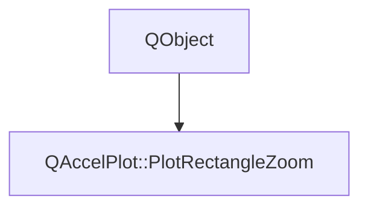

# Class QAccelPlot::PlotRectangleZoom


[**ClassList**](annotated.md) **>** [**QAccelPlot**](namespaceQAccelPlot.md) **>** [**PlotRectangleZoom**](classQAccelPlot_1_1PlotRectangleZoom.md)


_Rectangle zoom configuration and selection state exposed by PlotView._ 

* `#include <PlotRectangleZoom.hpp>`


Inherits the following classes: QObject


## Inheritance diagram




## Public Properties

| Type | Name |
| ---: | :--- |
| property bool | [**active**](classQAccelPlot_1_1PlotRectangleZoom.md#property-active-12)  <br>_Whether a rectangle selection is in progress._  |
| property QColor | [**borderColor**](classQAccelPlot_1_1PlotRectangleZoom.md#property-bordercolor-12)  <br>_Selection outline color. Default: Colors.dark.rectangleZoomBorder._  |
| property QML\_ANONYMOUSbool | [**enabled**](classQAccelPlot_1_1PlotRectangleZoom.md#property-enabled-12)  <br>_Enables rectangle selection with the left mouse button. Default: false._  |
| property QColor | [**fillColor**](classQAccelPlot_1_1PlotRectangleZoom.md#property-fillcolor-12)  <br>_Selection fill color. Default: Colors.dark.rectangleZoomFill._  |
| property qreal | [**minimumSize**](classQAccelPlot_1_1PlotRectangleZoom.md#property-minimumsize-12)  <br>_Minimum selection width and height in logical pixels. Default: 6; clamped to zero or greater._  |
| property int | [**modifiers**](classQAccelPlot_1_1PlotRectangleZoom.md#property-modifiers-12)  <br>_Required Qt::KeyboardModifiers for starting selection. Default: Qt::ShiftModifier._  |
| property QRectF | [**selectionRect**](classQAccelPlot_1_1PlotRectangleZoom.md#property-selectionrect-12)  <br>_Selection rectangle in plot item-local logical pixels; empty when inactive._  |


## Public Signals

| Type | Name |
| ---: | :--- |
| signal void | [**activeChanged**](classQAccelPlot_1_1PlotRectangleZoom.md#signal-activechanged)  <br>_Emitted when selection starts or ends._  |
| signal void | [**borderColorChanged**](classQAccelPlot_1_1PlotRectangleZoom.md#signal-bordercolorchanged)  <br>_Emitted when borderColor changes._  |
| signal void | [**enabledChanged**](classQAccelPlot_1_1PlotRectangleZoom.md#signal-enabledchanged)  <br>_Emitted when enabled changes._  |
| signal void | [**fillColorChanged**](classQAccelPlot_1_1PlotRectangleZoom.md#signal-fillcolorchanged)  <br>_Emitted when fillColor changes._  |
| signal void | [**minimumSizeChanged**](classQAccelPlot_1_1PlotRectangleZoom.md#signal-minimumsizechanged)  <br>_Emitted when minimumSize changes._  |
| signal void | [**modifiersChanged**](classQAccelPlot_1_1PlotRectangleZoom.md#signal-modifierschanged)  <br>_Emitted when modifiers changes._  |
| signal void | [**selectionRectChanged**](classQAccelPlot_1_1PlotRectangleZoom.md#signal-selectionrectchanged)  <br>_Emitted when the selection rectangle changes._  |


## Public Functions

| Type | Name |
| ---: | :--- |
|   | [**PlotRectangleZoom**](#function-plotrectanglezoom) (QObject \* parent=nullptr) <br>_Constructs configuration owned by the given parent._  |
|  bool | [**active**](#function-active-22) () const<br>_Returns whether selection is in progress._  |
|  QColor | [**borderColor**](#function-bordercolor-22) () const<br>_Returns the selection outline color._  |
|  bool | [**enabled**](#function-enabled-22) () const<br>_Returns whether rectangle selection is enabled._  |
|  QColor | [**fillColor**](#function-fillcolor-22) () const<br>_Returns the selection fill color._  |
|  qreal | [**minimumSize**](#function-minimumsize-22) () const<br>_Returns the minimum selection width and height in logical pixels._  |
|  int | [**modifiers**](#function-modifiers-22) () const<br>_Returns the required keyboard modifiers._  |
|  QRectF | [**selectionRect**](#function-selectionrect-22) () const<br>_Returns the current item-local selection rectangle._  |
|  void | [**setBorderColor**](#function-setbordercolor) (const QColor & value) <br>_Sets the color of the one-logical-pixel selection outline._  |
|  void | [**setEnabled**](#function-setenabled) (bool value) <br>_Enables or disables rectangle selection; changing this setting cancels an active selection._  |
|  void | [**setFillColor**](#function-setfillcolor) (const QColor & value) <br>_Sets the selection fill color._  |
|  void | [**setMinimumSize**](#function-setminimumsize) (qreal value) <br>_Sets the minimum size, clamping negative values to zero and ignoring nonfinite values._  |
|  void | [**setModifiers**](#function-setmodifiers) (int value) <br>_Sets the exact keyboard modifiers required at press time; Qt::NoModifier allows unmodified dragging._  |


## Public Properties Documentation


### property active {#property-active-12}

_Whether a rectangle selection is in progress._ 
```C++
bool QAccelPlot::PlotRectangleZoom::active;
```


<hr>


### property borderColor {#property-bordercolor-12}

_Selection outline color. Default: Colors.dark.rectangleZoomBorder._ 
```C++
QColor QAccelPlot::PlotRectangleZoom::borderColor;
```


<hr>


### property enabled {#property-enabled-12}

_Enables rectangle selection with the left mouse button. Default: false._ 
```C++
QML_ANONYMOUSbool QAccelPlot::PlotRectangleZoom::enabled;
```


<hr>


### property fillColor {#property-fillcolor-12}

_Selection fill color. Default: Colors.dark.rectangleZoomFill._ 
```C++
QColor QAccelPlot::PlotRectangleZoom::fillColor;
```


<hr>


### property minimumSize {#property-minimumsize-12}

_Minimum selection width and height in logical pixels. Default: 6; clamped to zero or greater._ 
```C++
qreal QAccelPlot::PlotRectangleZoom::minimumSize;
```


<hr>


### property modifiers {#property-modifiers-12}

_Required Qt::KeyboardModifiers for starting selection. Default: Qt::ShiftModifier._ 
```C++
int QAccelPlot::PlotRectangleZoom::modifiers;
```


<hr>


### property selectionRect {#property-selectionrect-12}

_Selection rectangle in plot item-local logical pixels; empty when inactive._ 
```C++
QRectF QAccelPlot::PlotRectangleZoom::selectionRect;
```


<hr>
## Public Signals Documentation


### signal activeChanged {#signal-activechanged}

_Emitted when selection starts or ends._ 
```C++
void QAccelPlot::PlotRectangleZoom::activeChanged;
```


<hr>


### signal borderColorChanged {#signal-bordercolorchanged}

_Emitted when borderColor changes._ 
```C++
void QAccelPlot::PlotRectangleZoom::borderColorChanged;
```


<hr>


### signal enabledChanged {#signal-enabledchanged}

_Emitted when enabled changes._ 
```C++
void QAccelPlot::PlotRectangleZoom::enabledChanged;
```


<hr>


### signal fillColorChanged {#signal-fillcolorchanged}

_Emitted when fillColor changes._ 
```C++
void QAccelPlot::PlotRectangleZoom::fillColorChanged;
```


<hr>


### signal minimumSizeChanged {#signal-minimumsizechanged}

_Emitted when minimumSize changes._ 
```C++
void QAccelPlot::PlotRectangleZoom::minimumSizeChanged;
```


<hr>


### signal modifiersChanged {#signal-modifierschanged}

_Emitted when modifiers changes._ 
```C++
void QAccelPlot::PlotRectangleZoom::modifiersChanged;
```


<hr>


### signal selectionRectChanged {#signal-selectionrectchanged}

_Emitted when the selection rectangle changes._ 
```C++
void QAccelPlot::PlotRectangleZoom::selectionRectChanged;
```


<hr>
## Public Functions Documentation


### function PlotRectangleZoom {#function-plotrectanglezoom}

_Constructs configuration owned by the given parent._ 
```C++
explicit QAccelPlot::PlotRectangleZoom::PlotRectangleZoom (
    QObject * parent=nullptr
) 
```


<hr>


### function active {#function-active-22}

_Returns whether selection is in progress._ 
```C++
bool QAccelPlot::PlotRectangleZoom::active () const
```


<hr>


### function borderColor {#function-bordercolor-22}

_Returns the selection outline color._ 
```C++
QColor QAccelPlot::PlotRectangleZoom::borderColor () const
```


<hr>


### function enabled {#function-enabled-22}

_Returns whether rectangle selection is enabled._ 
```C++
bool QAccelPlot::PlotRectangleZoom::enabled () const
```


<hr>


### function fillColor {#function-fillcolor-22}

_Returns the selection fill color._ 
```C++
QColor QAccelPlot::PlotRectangleZoom::fillColor () const
```


<hr>


### function minimumSize {#function-minimumsize-22}

_Returns the minimum selection width and height in logical pixels._ 
```C++
qreal QAccelPlot::PlotRectangleZoom::minimumSize () const
```


<hr>


### function modifiers {#function-modifiers-22}

_Returns the required keyboard modifiers._ 
```C++
int QAccelPlot::PlotRectangleZoom::modifiers () const
```


<hr>


### function selectionRect {#function-selectionrect-22}

_Returns the current item-local selection rectangle._ 
```C++
QRectF QAccelPlot::PlotRectangleZoom::selectionRect () const
```


<hr>


### function setBorderColor {#function-setbordercolor}

_Sets the color of the one-logical-pixel selection outline._ 
```C++
void QAccelPlot::PlotRectangleZoom::setBorderColor (
    const QColor & value
) 
```


<hr>


### function setEnabled {#function-setenabled}

_Enables or disables rectangle selection; changing this setting cancels an active selection._ 
```C++
void QAccelPlot::PlotRectangleZoom::setEnabled (
    bool value
) 
```


<hr>


### function setFillColor {#function-setfillcolor}

_Sets the selection fill color._ 
```C++
void QAccelPlot::PlotRectangleZoom::setFillColor (
    const QColor & value
) 
```


<hr>


### function setMinimumSize {#function-setminimumsize}

_Sets the minimum size, clamping negative values to zero and ignoring nonfinite values._ 
```C++
void QAccelPlot::PlotRectangleZoom::setMinimumSize (
    qreal value
) 
```


<hr>


### function setModifiers {#function-setmodifiers}

_Sets the exact keyboard modifiers required at press time; Qt::NoModifier allows unmodified dragging._ 
```C++
void QAccelPlot::PlotRectangleZoom::setModifiers (
    int value
) 
```


<hr>

------------------------------
The documentation for this class was generated from the following file `QAccelPlot/src/QAccelPlot/PlotRectangleZoom.hpp`

