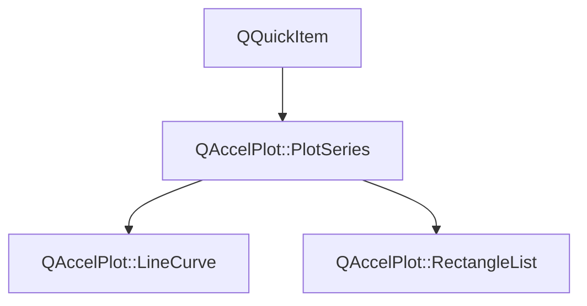

# Class QAccelPlot::PlotSeries


[**ClassList**](annotated.md) **>** [**QAccelPlot**](namespaceQAccelPlot.md) **>** [**PlotSeries**](classQAccelPlot_1_1PlotSeries.md)


_Common QML item contract for data series hosted by_ `PlotView` _._[More...](#detailed-description)

* `#include <PlotSeries.hpp>`


Inherits the following classes: QQuickItem


Inherited by the following classes: [QAccelPlot::LineCurve](classQAccelPlot_1_1LineCurve.md),  [QAccelPlot::RectangleList](classQAccelPlot_1_1RectangleList.md)


## Inheritance diagram




## Public Types

| Type | Name |
| ---: | :--- |
| enum  | [**LegendSymbol**](#enum-legendsymbol)  <br>_Supported default legend symbols._  |


## Public Properties

| Type | Name |
| ---: | :--- |
| property [**LegendSymbol**](classQAccelPlot_1_1PlotSeries.md#enum-legendsymbol) | [**legendSymbol**](classQAccelPlot_1_1PlotSeries.md#property-legendsymbol-12)  <br>_Symbol style requested from the default legend._  |
| property QString | [**name**](classQAccelPlot_1_1PlotSeries.md#property-name-12)  <br>_Identifying name used by the default legend._  |
| property QRectF | [**plotRect**](classQAccelPlot_1_1PlotSeries.md#property-plotrect-12)  <br>_Plot area in parent-item coordinates, assigned by_ `PlotView` _._ |
| property [**Axis**](classQAccelPlot_1_1Axis.md) \* | [**xAxis**](classQAccelPlot_1_1PlotSeries.md#property-xaxis-12)  <br>_Horizontal axis used for data-to-pixel coordinate mapping._  |
| property [**Axis**](classQAccelPlot_1_1Axis.md) \* | [**yAxis**](classQAccelPlot_1_1PlotSeries.md#property-yaxis-12)  <br>_Vertical axis used for data-to-pixel coordinate mapping._  |


## Public Signals

| Type | Name |
| ---: | :--- |
| signal void | [**legendSymbolChanged**](classQAccelPlot_1_1PlotSeries.md#signal-legendsymbolchanged)  <br> |
| signal void | [**nameChanged**](classQAccelPlot_1_1PlotSeries.md#signal-namechanged)  <br> |
| signal void | [**plotRectChanged**](classQAccelPlot_1_1PlotSeries.md#signal-plotrectchanged)  <br> |
| signal void | [**xAxisChanged**](classQAccelPlot_1_1PlotSeries.md#signal-xaxischanged)  <br> |
| signal void | [**xDataRangeChanged**](classQAccelPlot_1_1PlotSeries.md#signal-xdatarangechanged) (qreal min, qreal max) <br>_Emitted when the X data extent of this series changes._  |
| signal void | [**yAxisChanged**](classQAccelPlot_1_1PlotSeries.md#signal-yaxischanged)  <br> |
| signal void | [**yDataRangeChanged**](classQAccelPlot_1_1PlotSeries.md#signal-ydatarangechanged) (qreal min, qreal max) <br>_Emitted when the Y data extent of this series changes._  |


## Public Functions

| Type | Name |
| ---: | :--- |
|   | [**PlotSeries**](#function-plotseries) (QQuickItem \* parent=nullptr) <br> |
|  [**LegendSymbol**](classQAccelPlot_1_1PlotSeries.md#enum-legendsymbol) | [**legendSymbol**](#function-legendsymbol-22) () const<br> |
|  QString | [**name**](#function-name-22) () const<br> |
|  QRectF | [**plotRect**](#function-plotrect-22) () const<br> |
|  void | [**setLegendSymbol**](#function-setlegendsymbol) ([**LegendSymbol**](classQAccelPlot_1_1PlotSeries.md#enum-legendsymbol) symbol) <br> |
|  void | [**setName**](#function-setname) (const QString & name) <br> |
|  void | [**setPlotRect**](#function-setplotrect) (const QRectF & rect) <br>_Updates the series geometry to exactly cover_ _rect_ _._ |
|  void | [**setXAxis**](#function-setxaxis) ([**Axis**](classQAccelPlot_1_1Axis.md) \* axis) <br> |
|  void | [**setYAxis**](#function-setyaxis) ([**Axis**](classQAccelPlot_1_1Axis.md) \* axis) <br> |
|  [**Axis**](classQAccelPlot_1_1Axis.md) \* | [**xAxis**](#function-xaxis-22) () const<br> |
|  [**Axis**](classQAccelPlot_1_1Axis.md) \* | [**yAxis**](#function-yaxis-22) () const<br> |


## Protected Functions

| Type | Name |
| ---: | :--- |
|  void | [**clearDataRanges**](#function-cleardataranges) () <br>_Clears cached extents after a series has been emptied._  |
|  void | [**setDataRanges**](#function-setdataranges) (qreal xMin, qreal xMax, qreal yMin, qreal yMax) <br>_Reports this series' data extents to its bound axes._  |


## Detailed Description


[**PlotSeries**](classQAccelPlot_1_1PlotSeries.md) owns the integration shared by every plot type: axis bindings, plot-area layout, data-range reporting, and legend metadata. Concrete series remain responsible for their data model, rendering, and hit testing.


**See also:** [**LineCurve**](classQAccelPlot_1_1LineCurve.md), [**RectangleList**](classQAccelPlot_1_1RectangleList.md), [**QAccelPlot**](classQAccelPlot_1_1QAccelPlot.md) 


    
## Public Types Documentation


### enum LegendSymbol {#enum-legendsymbol}

_Supported default legend symbols._ 
```C++
enum QAccelPlot::PlotSeries::LegendSymbol {
    Line,
    Fill
};
```


<hr>
## Public Properties Documentation


### property legendSymbol {#property-legendsymbol-12}

_Symbol style requested from the default legend._ 
```C++
LegendSymbol QAccelPlot::PlotSeries::legendSymbol;
```


<hr>


### property name {#property-name-12}

_Identifying name used by the default legend._ 
```C++
QString QAccelPlot::PlotSeries::name;
```


<hr>


### property plotRect {#property-plotrect-12}

_Plot area in parent-item coordinates, assigned by_ `PlotView` _._
```C++
QRectF QAccelPlot::PlotSeries::plotRect;
```


<hr>


### property xAxis {#property-xaxis-12}

_Horizontal axis used for data-to-pixel coordinate mapping._ 
```C++
Axis* QAccelPlot::PlotSeries::xAxis;
```


<hr>


### property yAxis {#property-yaxis-12}

_Vertical axis used for data-to-pixel coordinate mapping._ 
```C++
Axis* QAccelPlot::PlotSeries::yAxis;
```


<hr>
## Public Signals Documentation


### signal legendSymbolChanged {#signal-legendsymbolchanged}

```C++
void QAccelPlot::PlotSeries::legendSymbolChanged;
```


<hr>


### signal nameChanged {#signal-namechanged}

```C++
void QAccelPlot::PlotSeries::nameChanged;
```


<hr>


### signal plotRectChanged {#signal-plotrectchanged}

```C++
void QAccelPlot::PlotSeries::plotRectChanged;
```


<hr>


### signal xAxisChanged {#signal-xaxischanged}

```C++
void QAccelPlot::PlotSeries::xAxisChanged;
```


<hr>


### signal xDataRangeChanged {#signal-xdatarangechanged}

_Emitted when the X data extent of this series changes._ 
```C++
void QAccelPlot::PlotSeries::xDataRangeChanged;
```


<hr>


### signal yAxisChanged {#signal-yaxischanged}

```C++
void QAccelPlot::PlotSeries::yAxisChanged;
```


<hr>


### signal yDataRangeChanged {#signal-ydatarangechanged}

_Emitted when the Y data extent of this series changes._ 
```C++
void QAccelPlot::PlotSeries::yDataRangeChanged;
```


<hr>
## Public Functions Documentation


### function PlotSeries {#function-plotseries}

```C++
explicit QAccelPlot::PlotSeries::PlotSeries (
    QQuickItem * parent=nullptr
) 
```


<hr>


### function legendSymbol {#function-legendsymbol-22}

```C++
LegendSymbol QAccelPlot::PlotSeries::legendSymbol () const
```


<hr>


### function name {#function-name-22}

```C++
QString QAccelPlot::PlotSeries::name () const
```


<hr>


### function plotRect {#function-plotrect-22}

```C++
QRectF QAccelPlot::PlotSeries::plotRect () const
```


<hr>


### function setLegendSymbol {#function-setlegendsymbol}

```C++
void QAccelPlot::PlotSeries::setLegendSymbol (
    LegendSymbol symbol
) 
```


<hr>


### function setName {#function-setname}

```C++
void QAccelPlot::PlotSeries::setName (
    const QString & name
) 
```


<hr>


### function setPlotRect {#function-setplotrect}

_Updates the series geometry to exactly cover_ _rect_ _._
```C++
void QAccelPlot::PlotSeries::setPlotRect (
    const QRectF & rect
) 
```


<hr>


### function setXAxis {#function-setxaxis}

```C++
void QAccelPlot::PlotSeries::setXAxis (
    Axis * axis
) 
```


<hr>


### function setYAxis {#function-setyaxis}

```C++
void QAccelPlot::PlotSeries::setYAxis (
    Axis * axis
) 
```


<hr>


### function xAxis {#function-xaxis-22}

```C++
Axis * QAccelPlot::PlotSeries::xAxis () const
```


<hr>


### function yAxis {#function-yaxis-22}

```C++
Axis * QAccelPlot::PlotSeries::yAxis () const
```


<hr>
## Protected Functions Documentation


### function clearDataRanges {#function-cleardataranges}

_Clears cached extents after a series has been emptied._ 
```C++
void QAccelPlot::PlotSeries::clearDataRanges () 
```


<hr>


### function setDataRanges {#function-setdataranges}

_Reports this series' data extents to its bound axes._ 
```C++
void QAccelPlot::PlotSeries::setDataRanges (
    qreal xMin,
    qreal xMax,
    qreal yMin,
    qreal yMax
) 
```


<hr>

------------------------------
The documentation for this class was generated from the following file `QAccelPlot/src/series/PlotSeries.hpp`

