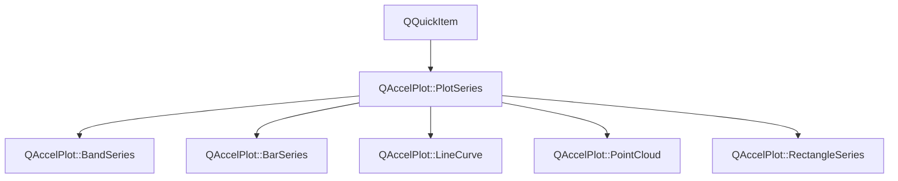

# Class QAccelPlot::PlotSeries


[**ClassList**](annotated.md) **>** [**QAccelPlot**](namespaceQAccelPlot.md) **>** [**PlotSeries**](classQAccelPlot_1_1PlotSeries.md)


_Common QML item contract for data series hosted by_ `PlotView` _._[More...](#detailed-description)

* `#include <PlotSeries.hpp>`


Inherits the following classes: QQuickItem


Inherited by the following classes: [QAccelPlot::BandSeries](classQAccelPlot_1_1BandSeries.md),  [QAccelPlot::BarSeries](classQAccelPlot_1_1BarSeries.md),  [QAccelPlot::LineCurve](classQAccelPlot_1_1LineCurve.md),  [QAccelPlot::PointCloud](classQAccelPlot_1_1PointCloud.md),  [QAccelPlot::RectangleSeries](classQAccelPlot_1_1RectangleSeries.md)


## Inheritance diagram


```mermaid
flowchart TB
  classQAccelPlot_1_1PlotSeries["QAccelPlot::PlotSeries"]

  external_base_classQAccelPlot_1_1PlotSeries_1["QQuickItem"]
  external_base_classQAccelPlot_1_1PlotSeries_1 --> classQAccelPlot_1_1PlotSeries

  classQAccelPlot_1_1BandSeries["QAccelPlot::BandSeries"]
  classQAccelPlot_1_1PlotSeries --> classQAccelPlot_1_1BandSeries
  click classQAccelPlot_1_1BandSeries "../classQAccelPlot_1_1BandSeries/" "Open QAccelPlot::BandSeries"

  classQAccelPlot_1_1BarSeries["QAccelPlot::BarSeries"]
  classQAccelPlot_1_1PlotSeries --> classQAccelPlot_1_1BarSeries
  click classQAccelPlot_1_1BarSeries "../classQAccelPlot_1_1BarSeries/" "Open QAccelPlot::BarSeries"

  classQAccelPlot_1_1LineCurve["QAccelPlot::LineCurve"]
  classQAccelPlot_1_1PlotSeries --> classQAccelPlot_1_1LineCurve
  click classQAccelPlot_1_1LineCurve "../classQAccelPlot_1_1LineCurve/" "Open QAccelPlot::LineCurve"

  classQAccelPlot_1_1PointCloud["QAccelPlot::PointCloud"]
  classQAccelPlot_1_1PlotSeries --> classQAccelPlot_1_1PointCloud
  click classQAccelPlot_1_1PointCloud "../classQAccelPlot_1_1PointCloud/" "Open QAccelPlot::PointCloud"

  classQAccelPlot_1_1RectangleSeries["QAccelPlot::RectangleSeries"]
  classQAccelPlot_1_1PlotSeries --> classQAccelPlot_1_1RectangleSeries
  click classQAccelPlot_1_1RectangleSeries "../classQAccelPlot_1_1RectangleSeries/" "Open QAccelPlot::RectangleSeries"

```


## Public Types

| Type | Name |
| ---: | :--- |
| enum  | [**LegendSymbol**](#enum-legendsymbol)  <br>_Supported default legend symbols._  |
| enum  | [**MarkerShape**](#enum-markershape)  <br>_Marker shapes shared by every series that draws markers._  |


## Public Properties

| Type | Name |
| ---: | :--- |
| property quint64 | [**dataRevision**](classQAccelPlot_1_1PlotSeries.md#property-datarevision-12)  <br>_Revision incremented by every accepted change of the series' records._  |
| property [**QAccelPlot::SeriesInspection**](classQAccelPlot_1_1SeriesInspection.md) \* | [**inspection**](classQAccelPlot_1_1PlotSeries.md#property-inspection-12)  <br>_Read-only constant: data queries for this series._  |
| property [**LegendSymbol**](classQAccelPlot_1_1PlotSeries.md#enum-legendsymbol) | [**legendSymbol**](classQAccelPlot_1_1PlotSeries.md#property-legendsymbol-12)  <br>_Symbol style requested from the default legend._  |
| property QString | [**name**](classQAccelPlot_1_1PlotSeries.md#property-name-12)  <br>_Identifying name used by the default legend._  |
| property QRectF | [**plotRect**](classQAccelPlot_1_1PlotSeries.md#property-plotrect-12)  <br>_Plot area in parent-item coordinates, assigned by_ `PlotView` _._ |
| property [**Axis**](classQAccelPlot_1_1Axis.md) \* | [**xAxis**](classQAccelPlot_1_1PlotSeries.md#property-xaxis-12)  <br>_Horizontal axis used for data-to-pixel coordinate mapping._  |
| property [**Axis**](classQAccelPlot_1_1Axis.md) \* | [**yAxis**](classQAccelPlot_1_1PlotSeries.md#property-yaxis-12)  <br>_Vertical axis used for data-to-pixel coordinate mapping._  |


## Public Signals

| Type | Name |
| ---: | :--- |
| signal void | [**dataRevisionChanged**](classQAccelPlot_1_1PlotSeries.md#signal-datarevisionchanged)  <br>_Emitted when the dataRevision property changes._  |
| signal void | [**legendSymbolChanged**](classQAccelPlot_1_1PlotSeries.md#signal-legendsymbolchanged)  <br> |
| signal void | [**nameChanged**](classQAccelPlot_1_1PlotSeries.md#signal-namechanged)  <br> |
| signal void | [**plotRectChanged**](classQAccelPlot_1_1PlotSeries.md#signal-plotrectchanged)  <br> |
| signal void | [**xAxisChanged**](classQAccelPlot_1_1PlotSeries.md#signal-xaxischanged)  <br> |
| signal void | [**xDataRangeChanged**](classQAccelPlot_1_1PlotSeries.md#signal-xdatarangechanged) (qreal min, qreal max) <br>_Emitted when the X data extent of this series changes._  |
| signal void | [**yAxisChanged**](classQAccelPlot_1_1PlotSeries.md#signal-yaxischanged)  <br> |
| signal void | [**yDataRangeChanged**](classQAccelPlot_1_1PlotSeries.md#signal-ydatarangechanged) (qreal min, qreal max) <br>_Emitted when the Y data extent of this series changes._  |


## Public Functions

| Type | Name |
| ---: | :--- |
|   | [**PlotSeries**](#function-plotseries) (QQuickItem \* parent=nullptr) <br> |
| virtual void | [**clearData**](#function-cleardata) () = 0<br>_Removes all records from the series._  |
|  quint64 | [**dataRevision**](#function-datarevision-22) () const<br>_Returns the current data revision._  |
|  [**SeriesInspection**](classQAccelPlot_1_1SeriesInspection.md) \* | [**inspection**](#function-inspection-22) () const<br>_Returns the data queries for this series; created on first use and owned by the series._  |
|  [**LegendSymbol**](classQAccelPlot_1_1PlotSeries.md#enum-legendsymbol) | [**legendSymbol**](#function-legendsymbol-22) () const<br> |
|  QString | [**name**](#function-name-22) () const<br> |
|  QRectF | [**plotRect**](#function-plotrect-22) () const<br> |
| virtual void | [**postData**](#function-postdata-12) (std::vector&lt; double &gt; && data, int count) = 0<br>_Queues a moved double buffer for assignment on the series' thread._  |
| virtual void | [**postData**](#function-postdata-22) (std::vector&lt; float &gt; && data, int count) = 0<br>_Queues a moved float buffer for assignment on the series' thread._  |
| virtual void | [**setData**](#function-setdata-12) (const double \* data, int count) = 0<br>_Replaces the series data with_ _count_ _records copied from an interleaved double array. Each concrete series defines its record layout (XY pairs or rectangle edges)._ |
| virtual void | [**setData**](#function-setdata-22) (std::vector&lt; double &gt; && data, int count) = 0<br>_Replaces the series data by moving an interleaved double buffer._  |
| virtual void | [**setDataF**](#function-setdataf-12) (const float \* data, int count) = 0<br>_Replaces the series data with_ _count_ _records copied from an interleaved float array._ |
| virtual void | [**setDataF**](#function-setdataf-22) (std::vector&lt; float &gt; && data, int count) = 0<br>_Replaces the series data by moving an interleaved float buffer._  |
| virtual void | [**setDataFNoRange**](#function-setdatafnorange-12) (const float \* data, int count) = 0<br>_Copies float records without reporting new data ranges to the axes._  |
| virtual void | [**setDataFNoRange**](#function-setdatafnorange-22) (std::vector&lt; float &gt; && data, int count) = 0<br>_Moves float records without reporting new data ranges to the axes._  |
| virtual void | [**setDataNoRange**](#function-setdatanorange-12) (const double \* data, int count) = 0<br>_Copies double records without reporting new data ranges to the axes._  |
| virtual void | [**setDataNoRange**](#function-setdatanorange-22) (std::vector&lt; double &gt; && data, int count) = 0<br>_Moves double records without reporting new data ranges to the axes._  |
|  void | [**setLegendSymbol**](#function-setlegendsymbol) ([**LegendSymbol**](classQAccelPlot_1_1PlotSeries.md#enum-legendsymbol) symbol) <br> |
|  void | [**setName**](#function-setname) (const QString & name) <br> |
|  void | [**setPlotRect**](#function-setplotrect) (const QRectF & rect) <br>_Updates the series geometry to exactly cover_ _rect_ _._ |
|  void | [**setXAxis**](#function-setxaxis) ([**Axis**](classQAccelPlot_1_1Axis.md) \* axis) <br> |
|  void | [**setYAxis**](#function-setyaxis) ([**Axis**](classQAccelPlot_1_1Axis.md) \* axis) <br> |
|  [**Axis**](classQAccelPlot_1_1Axis.md) \* | [**xAxis**](#function-xaxis-22) () const<br> |
|  [**Axis**](classQAccelPlot_1_1Axis.md) \* | [**yAxis**](#function-yaxis-22) () const<br> |


## Protected Types

| Type | Name |
| ---: | :--- |
| enum  | [**DataChange**](#enum-datachange)  <br>_How the records changed in a data update._  |


## Protected Functions

| Type | Name |
| ---: | :--- |
|  void | [**clearDataRanges**](#function-cleardataranges) () <br>_Clears cached extents after a series has been emptied._  |
|  void | [**clearXDataRange**](#function-clearxdatarange) () <br>_Clears the cached X extent, e.g. when no sample has a valid X coordinate._  |
|  void | [**clearYDataRange**](#function-clearydatarange) () <br>_Clears the cached Y extent, e.g. when no sample has a valid Y coordinate._  |
|  bool | [**event**](#function-event) (QEvent \* event) override<br>_Withholds hover events from a series beneath another series under the cursor._  |
|  void | [**extendXDataRange**](#function-extendxdatarange) (qreal x) <br>_Widens the reported X extent to include_ _x_ _._ |
|  void | [**extendYDataRange**](#function-extendydatarange) (qreal y) <br>_Widens the reported Y extent to include_ _y_ _. A non-finite__y_ _leaves the extent unchanged._ |
| virtual bool | [**inspectionAvailable**](#function-inspectionavailable) () const<br>_Returns false while the records are ambiguous, such as during a data transition. Default: true._  |
|  void | [**inspectionDataChanged**](#function-inspectiondatachanged) ([**DataChange**](classQAccelPlot_1_1PlotSeries.md#enum-datachange) change=DataChange::Replaced) <br>_Advances the data revision and refreshes the data queries. Call after every accepted record change._  |
| virtual [**InspectionRecord**](structQAccelPlot_1_1InspectionRecord.md) | [**inspectionRecord**](#function-inspectionrecord) (int index) const<br>_Returns the native record at_ _index_ _for series that are not plain XY series. Default: unsupported._ |
| virtual [**InspectionRecord**](structQAccelPlot_1_1InspectionRecord.md) | [**inspectionRecordAt**](#function-inspectionrecordat) (const QPointF & position) const<br>_Returns the native record drawn at the series-local_ _position_ _. Default: unsupported._ |
| virtual [**InspectionSource**](structQAccelPlot_1_1InspectionSource.md) | [**inspectionSource**](#function-inspectionsource) () const<br>_Returns a view of the XY records that sample queries search. The default has none._  |
|  void | [**invalidateInspection**](#function-invalidateinspection) () <br>_Refreshes the data queries after record validity changed without a data change, such as an axis scale switch._  |
| virtual void | [**onAxisRangeChanged**](#function-onaxisrangechanged) () <br>_Called when the viewport of a bound axis changes. The default implementation schedules a repaint._  |
| virtual void | [**onAxisScaleChanged**](#function-onaxisscalechanged) () <br>_Called when a bound axis switches between linear and logarithmic scale, or a different axis is bound._  |
|  QRectF | [**resolvePlotRect**](#function-resolveplotrect) () const<br>_Returns the plot area to render into:_ `plotRect` _when set, otherwise the item's current size._ |
|  void | [**setDataRanges**](#function-setdataranges) (qreal xMin, qreal xMax, qreal yMin, qreal yMax) <br>_Reports this series' data extents to its bound axes._  |
|  void | [**setXDataRange**](#function-setxdatarange) (qreal min, qreal max) <br>_Reports this series' X data extent to its bound horizontal axis. Non-finite extents are ignored._  |
|  void | [**setYDataRange**](#function-setydatarange) (qreal min, qreal max) <br>_Reports this series' Y data extent to its bound vertical axis. Non-finite extents are ignored._  |
|  std::optional&lt; [**DataExtent**](structQAccelPlot_1_1PlotSeries_1_1DataExtent.md) &gt; | [**xDataRange**](#function-xdatarange) () const<br>_Returns this series' X data range, or_ `std::nullopt` _when it has none._ |
|  std::optional&lt; [**DataExtent**](structQAccelPlot_1_1PlotSeries_1_1DataExtent.md) &gt; | [**yDataRange**](#function-ydatarange) () const<br>_Returns this series' Y data range, or_ `std::nullopt` _when it has none._ |


## Detailed Description


[**PlotSeries**](classQAccelPlot_1_1PlotSeries.md) owns the integration shared by every plot type: axis bindings, plot-area layout, data-range reporting, legend metadata, and a common C++ data-setting API. Concrete series define their record layout, rendering, and hit testing.


**See also:** [**LineCurve**](classQAccelPlot_1_1LineCurve.md), [**PointCloud**](classQAccelPlot_1_1PointCloud.md), [**RectangleSeries**](classQAccelPlot_1_1RectangleSeries.md), [**QAccelPlot**](classQAccelPlot_1_1QAccelPlot.md) 


    
## Public Types Documentation


### enum LegendSymbol {#enum-legendsymbol}

_Supported default legend symbols._ 
```C++
enum QAccelPlot::PlotSeries::LegendSymbol {
    Line,
    Fill,
    Marker
};
```


`Line` draws the series line style and marker, `Fill` a filled swatch, and `Marker` only the series marker shape (used by unconnected series such as `PointCloud`). 


        

<hr>


### enum MarkerShape {#enum-markershape}

_Marker shapes shared by every series that draws markers._ 
```C++
enum QAccelPlot::PlotSeries::MarkerShape {
    None,
    Circle,
    Square,
    Diamond,
    TriangleUp,
    TriangleDown,
    TriangleLeft,
    TriangleRight,
    Cross,
    XCross,
    HLine,
    VLine,
    Star,
    Asterisk,
    Pixel,
    Hexagon,
    Pentagon
};
```


Every shape except `Pixel` fits within a square whose half-width is the marker size. The shaders select a shape by this value minus one, so append new shapes at the end and never reorder or insert. Series that always draw markers, such as `PointCloud`, do not accept `None`. 


        

<hr>
## Public Properties Documentation


### property dataRevision {#property-datarevision-12}

_Revision incremented by every accepted change of the series' records._ 
```C++
quint64 QAccelPlot::PlotSeries::dataRevision;
```


<hr>


### property inspection {#property-inspection-12}

_Read-only constant: data queries for this series._ 
```C++
QAccelPlot::SeriesInspection* QAccelPlot::PlotSeries::inspection;
```


<hr>


### property legendSymbol {#property-legendsymbol-12}

_Symbol style requested from the default legend._ 
```C++
LegendSymbol QAccelPlot::PlotSeries::legendSymbol;
```


<hr>


### property name {#property-name-12}

_Identifying name used by the default legend._ 
```C++
QString QAccelPlot::PlotSeries::name;
```


<hr>


### property plotRect {#property-plotrect-12}

_Plot area in parent-item coordinates, assigned by_ `PlotView` _._
```C++
QRectF QAccelPlot::PlotSeries::plotRect;
```


<hr>


### property xAxis {#property-xaxis-12}

_Horizontal axis used for data-to-pixel coordinate mapping._ 
```C++
Axis* QAccelPlot::PlotSeries::xAxis;
```


<hr>


### property yAxis {#property-yaxis-12}

_Vertical axis used for data-to-pixel coordinate mapping._ 
```C++
Axis* QAccelPlot::PlotSeries::yAxis;
```


<hr>
## Public Signals Documentation


### signal dataRevisionChanged {#signal-datarevisionchanged}

_Emitted when the dataRevision property changes._ 
```C++
void QAccelPlot::PlotSeries::dataRevisionChanged;
```


<hr>


### signal legendSymbolChanged {#signal-legendsymbolchanged}

```C++
void QAccelPlot::PlotSeries::legendSymbolChanged;
```


<hr>


### signal nameChanged {#signal-namechanged}

```C++
void QAccelPlot::PlotSeries::nameChanged;
```


<hr>


### signal plotRectChanged {#signal-plotrectchanged}

```C++
void QAccelPlot::PlotSeries::plotRectChanged;
```


<hr>


### signal xAxisChanged {#signal-xaxischanged}

```C++
void QAccelPlot::PlotSeries::xAxisChanged;
```


<hr>


### signal xDataRangeChanged {#signal-xdatarangechanged}

_Emitted when the X data extent of this series changes._ 
```C++
void QAccelPlot::PlotSeries::xDataRangeChanged;
```


<hr>


### signal yAxisChanged {#signal-yaxischanged}

```C++
void QAccelPlot::PlotSeries::yAxisChanged;
```


<hr>


### signal yDataRangeChanged {#signal-ydatarangechanged}

_Emitted when the Y data extent of this series changes._ 
```C++
void QAccelPlot::PlotSeries::yDataRangeChanged;
```


<hr>
## Public Functions Documentation


### function PlotSeries {#function-plotseries}

```C++
explicit QAccelPlot::PlotSeries::PlotSeries (
    QQuickItem * parent=nullptr
) 
```


<hr>


### function clearData {#function-cleardata}

_Removes all records from the series._ 
```C++
virtual void QAccelPlot::PlotSeries::clearData () = 0
```


<hr>


### function dataRevision {#function-datarevision-22}

_Returns the current data revision._ 
```C++
quint64 QAccelPlot::PlotSeries::dataRevision () const
```


<hr>


### function inspection {#function-inspection-22}

_Returns the data queries for this series; created on first use and owned by the series._ 
```C++
SeriesInspection * QAccelPlot::PlotSeries::inspection () const
```


<hr>


### function legendSymbol {#function-legendsymbol-22}

```C++
LegendSymbol QAccelPlot::PlotSeries::legendSymbol () const
```


<hr>


### function name {#function-name-22}

```C++
QString QAccelPlot::PlotSeries::name () const
```


<hr>


### function plotRect {#function-plotrect-22}

```C++
QRectF QAccelPlot::PlotSeries::plotRect () const
```


<hr>


### function postData {#function-postdata-12}

_Queues a moved double buffer for assignment on the series' thread._ 
```C++
virtual void QAccelPlot::PlotSeries::postData (
    std::vector< double > && data,
    int count
) = 0
```


<hr>


### function postData {#function-postdata-22}

_Queues a moved float buffer for assignment on the series' thread._ 
```C++
virtual void QAccelPlot::PlotSeries::postData (
    std::vector< float > && data,
    int count
) = 0
```


<hr>


### function setData {#function-setdata-12}

_Replaces the series data with_ _count_ _records copied from an interleaved double array. Each concrete series defines its record layout (XY pairs or rectangle edges)._
```C++
virtual void QAccelPlot::PlotSeries::setData (
    const double * data,
    int count
) = 0
```


<hr>


### function setData {#function-setdata-22}

_Replaces the series data by moving an interleaved double buffer._ 
```C++
virtual void QAccelPlot::PlotSeries::setData (
    std::vector< double > && data,
    int count
) = 0
```


<hr>


### function setDataF {#function-setdataf-12}

_Replaces the series data with_ _count_ _records copied from an interleaved float array._
```C++
virtual void QAccelPlot::PlotSeries::setDataF (
    const float * data,
    int count
) = 0
```


<hr>


### function setDataF {#function-setdataf-22}

_Replaces the series data by moving an interleaved float buffer._ 
```C++
virtual void QAccelPlot::PlotSeries::setDataF (
    std::vector< float > && data,
    int count
) = 0
```


<hr>


### function setDataFNoRange {#function-setdatafnorange-12}

_Copies float records without reporting new data ranges to the axes._ 
```C++
virtual void QAccelPlot::PlotSeries::setDataFNoRange (
    const float * data,
    int count
) = 0
```


<hr>


### function setDataFNoRange {#function-setdatafnorange-22}

_Moves float records without reporting new data ranges to the axes._ 
```C++
virtual void QAccelPlot::PlotSeries::setDataFNoRange (
    std::vector< float > && data,
    int count
) = 0
```


<hr>


### function setDataNoRange {#function-setdatanorange-12}

_Copies double records without reporting new data ranges to the axes._ 
```C++
virtual void QAccelPlot::PlotSeries::setDataNoRange (
    const double * data,
    int count
) = 0
```


<hr>


### function setDataNoRange {#function-setdatanorange-22}

_Moves double records without reporting new data ranges to the axes._ 
```C++
virtual void QAccelPlot::PlotSeries::setDataNoRange (
    std::vector< double > && data,
    int count
) = 0
```


<hr>


### function setLegendSymbol {#function-setlegendsymbol}

```C++
void QAccelPlot::PlotSeries::setLegendSymbol (
    LegendSymbol symbol
) 
```


<hr>


### function setName {#function-setname}

```C++
void QAccelPlot::PlotSeries::setName (
    const QString & name
) 
```


<hr>


### function setPlotRect {#function-setplotrect}

_Updates the series geometry to exactly cover_ _rect_ _._
```C++
void QAccelPlot::PlotSeries::setPlotRect (
    const QRectF & rect
) 
```


<hr>


### function setXAxis {#function-setxaxis}

```C++
void QAccelPlot::PlotSeries::setXAxis (
    Axis * axis
) 
```


<hr>


### function setYAxis {#function-setyaxis}

```C++
void QAccelPlot::PlotSeries::setYAxis (
    Axis * axis
) 
```


<hr>


### function xAxis {#function-xaxis-22}

```C++
Axis * QAccelPlot::PlotSeries::xAxis () const
```


<hr>


### function yAxis {#function-yaxis-22}

```C++
Axis * QAccelPlot::PlotSeries::yAxis () const
```


<hr>
## Protected Types Documentation


### enum DataChange {#enum-datachange}

_How the records changed in a data update._ 
```C++
enum QAccelPlot::PlotSeries::DataChange {
    Replaced,
    Appended
};
```


<hr>
## Protected Functions Documentation


### function clearDataRanges {#function-cleardataranges}

_Clears cached extents after a series has been emptied._ 
```C++
void QAccelPlot::PlotSeries::clearDataRanges () 
```


<hr>


### function clearXDataRange {#function-clearxdatarange}

_Clears the cached X extent, e.g. when no sample has a valid X coordinate._ 
```C++
void QAccelPlot::PlotSeries::clearXDataRange () 
```


<hr>


### function clearYDataRange {#function-clearydatarange}

_Clears the cached Y extent, e.g. when no sample has a valid Y coordinate._ 
```C++
void QAccelPlot::PlotSeries::clearYDataRange () 
```


<hr>


### function event {#function-event}

_Withholds hover events from a series beneath another series under the cursor._ 
```C++
bool QAccelPlot::PlotSeries::event (
    QEvent * event
) override
```


Series ignore hover events so that the plot receives them too. Qt Quick 6.3 and newer stop at the topmost hovered item anyway; older versions also deliver the event to the series beneath, which then see a hover leave instead. 


        

<hr>


### function extendXDataRange {#function-extendxdatarange}

_Widens the reported X extent to include_ _x_ _._
```C++
void QAccelPlot::PlotSeries::extendXDataRange (
    qreal x
) 
```


Lets an append-style ingestion path update the range in O(1) instead of rescanning the whole buffer. A non-finite _x_ leaves the extent unchanged. 


        

<hr>


### function extendYDataRange {#function-extendydatarange}

_Widens the reported Y extent to include_ _y_ _. A non-finite__y_ _leaves the extent unchanged._
```C++
void QAccelPlot::PlotSeries::extendYDataRange (
    qreal y
) 
```


<hr>


### function inspectionAvailable {#function-inspectionavailable}

_Returns false while the records are ambiguous, such as during a data transition. Default: true._ 
```C++
virtual bool QAccelPlot::PlotSeries::inspectionAvailable () const
```


<hr>


### function inspectionDataChanged {#function-inspectiondatachanged}

_Advances the data revision and refreshes the data queries. Call after every accepted record change._ 
```C++
void QAccelPlot::PlotSeries::inspectionDataChanged (
    DataChange change=DataChange::Replaced
) 
```


<hr>


### function inspectionRecord {#function-inspectionrecord}

_Returns the native record at_ _index_ _for series that are not plain XY series. Default: unsupported._
```C++
virtual InspectionRecord QAccelPlot::PlotSeries::inspectionRecord (
    int index
) const
```


<hr>


### function inspectionRecordAt {#function-inspectionrecordat}

_Returns the native record drawn at the series-local_ _position_ _. Default: unsupported._
```C++
virtual InspectionRecord QAccelPlot::PlotSeries::inspectionRecordAt (
    const QPointF & position
) const
```


<hr>


### function inspectionSource {#function-inspectionsource}

_Returns a view of the XY records that sample queries search. The default has none._ 
```C++
virtual InspectionSource QAccelPlot::PlotSeries::inspectionSource () const
```


<hr>


### function invalidateInspection {#function-invalidateinspection}

_Refreshes the data queries after record validity changed without a data change, such as an axis scale switch._ 
```C++
void QAccelPlot::PlotSeries::invalidateInspection () 
```


<hr>


### function onAxisRangeChanged {#function-onaxisrangechanged}

_Called when the viewport of a bound axis changes. The default implementation schedules a repaint._ 
```C++
virtual void QAccelPlot::PlotSeries::onAxisRangeChanged () 
```


<hr>


### function onAxisScaleChanged {#function-onaxisscalechanged}

_Called when a bound axis switches between linear and logarithmic scale, or a different axis is bound._ 
```C++
virtual void QAccelPlot::PlotSeries::onAxisScaleChanged () 
```


Log scale changes which samples are valid, so series that apply the invalid-sample contract override this to refresh ranges and cached geometry. The default implementation does nothing. 


        

<hr>


### function resolvePlotRect {#function-resolveplotrect}

_Returns the plot area to render into:_ `plotRect` _when set, otherwise the item's current size._
```C++
QRectF QAccelPlot::PlotSeries::resolvePlotRect () const
```


Safe to call from `updatePaintNode()`; it never modifies the item. 


        

<hr>


### function setDataRanges {#function-setdataranges}

_Reports this series' data extents to its bound axes._ 
```C++
void QAccelPlot::PlotSeries::setDataRanges (
    qreal xMin,
    qreal xMax,
    qreal yMin,
    qreal yMax
) 
```


<hr>


### function setXDataRange {#function-setxdatarange}

_Reports this series' X data extent to its bound horizontal axis. Non-finite extents are ignored._ 
```C++
void QAccelPlot::PlotSeries::setXDataRange (
    qreal min,
    qreal max
) 
```


<hr>


### function setYDataRange {#function-setydatarange}

_Reports this series' Y data extent to its bound vertical axis. Non-finite extents are ignored._ 
```C++
void QAccelPlot::PlotSeries::setYDataRange (
    qreal min,
    qreal max
) 
```


<hr>


### function xDataRange {#function-xdatarange}

_Returns this series' X data range, or_ `std::nullopt` _when it has none._
```C++
std::optional< DataExtent > QAccelPlot::PlotSeries::xDataRange () const
```


<hr>


### function yDataRange {#function-ydatarange}

_Returns this series' Y data range, or_ `std::nullopt` _when it has none._
```C++
std::optional< DataExtent > QAccelPlot::PlotSeries::yDataRange () const
```


<hr>

------------------------------
The documentation for this class was generated from the following file `QAccelPlot/src/QAccelPlot/series/PlotSeries.hpp`

