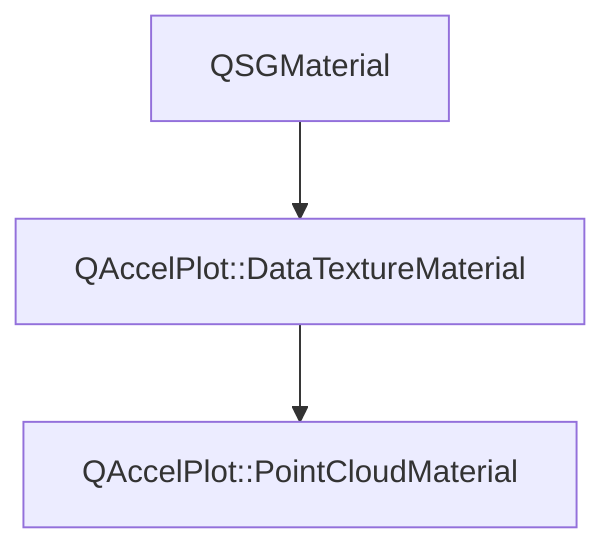

# Class QAccelPlot::PointCloudMaterial


[**ClassList**](annotated.md) **>** [**QAccelPlot**](namespaceQAccelPlot.md) **>** [**PointCloudMaterial**](classQAccelPlot_1_1PointCloudMaterial.md)


_QSGMaterial for_ `PointCloud` _rendering._[More...](#detailed-description)

* `#include <PointCloudMaterial.hpp>`


Inherits the following classes: [QAccelPlot::DataTextureMaterial](classQAccelPlot_1_1DataTextureMaterial.md)


## Inheritance diagram




## Public Attributes

| Type | Name |
| ---: | :--- |
|  float | [**antialiasingEnabled**](#variable-antialiasingenabled)   = `{1.0f}`<br>_1.0 when GPU anti-aliasing is active._  |
|  float | [**antialiasingFeather**](#variable-antialiasingfeather)   = `{1.0f}`<br>_Anti-aliasing feather width in pixels._  |
|  [**GradientTexture**](classQAccelPlot_1_1GradientTexture.md) | [**colorMap**](#variable-colormap)  <br>[_**Colormap**_](classQAccelPlot_1_1Colormap.md) _lookup texture sampled at binding 2._ |
|  float | [**markerFilled**](#variable-markerfilled)   = `{1.0f}`<br>_1.0 for filled markers, 0.0 for hollow outlines._  |
|  float | [**markerSize**](#variable-markersize)   = `{3.0f}`<br>_Marker radius in pixels._  |
|  float | [**markerStrokeWidth**](#variable-markerstrokewidth)   = `{1.0f}`<br>_Outline width in pixels for hollow markers._  |
|  int | [**shapeType**](#variable-shapetype)   = `{0}`<br>_Marker shape:_ `PlotSeries::MarkerShape` _value minus one (0 = Circle)._ |
|  float | [**stride**](#variable-stride)   = `{2.0f}`<br>_Floats per point in the data texture: 2 (x, y) or 3 (x, y, value)._  |
|  float | [**valueLogScale**](#variable-valuelogscale)   = `{0.0f}`<br>_1.0 to place values on the ramp in log10 instead of linearly._  |
|  float | [**valueMax**](#variable-valuemax)   = `{1.0f}`<br>_Value mapped to colormap position 1._  |
|  float | [**valueMin**](#variable-valuemin)   = `{0.0f}`<br>_Value mapped to colormap position 0._  |


## Public Attributes inherited from QAccelPlot::DataTextureMaterial

See [QAccelPlot::DataTextureMaterial](classQAccelPlot_1_1DataTextureMaterial.md)

| Type | Name |
| ---: | :--- |
|  QColor | [**color**](classQAccelPlot_1_1DataTextureMaterial.md#variable-color)   = `{Qt::blue}`<br>_Line/fill color uniform._  |
|  std::unique\_ptr&lt; QSGTexture &gt; | [**dataTexture**](classQAccelPlot_1_1DataTextureMaterial.md#variable-datatexture)  <br>_Owned data texture bound to the shader sampler._  |
|  QVector2D | [**domainMax**](classQAccelPlot_1_1DataTextureMaterial.md#variable-domainmax)   = `{1.0f, 1.0f}`<br>_Maximum data-space coordinate._  |
|  QVector2D | [**domainMin**](classQAccelPlot_1_1DataTextureMaterial.md#variable-domainmin)   = `{0.0f, 0.0f}`<br>_Minimum data-space coordinate._  |
|  float | [**logScaleX**](classQAccelPlot_1_1DataTextureMaterial.md#variable-logscalex)   = `{0.0f}`<br>_1.0 when the X axis uses log scale (float for std140 UBO compatibility)._  |
|  float | [**logScaleY**](classQAccelPlot_1_1DataTextureMaterial.md#variable-logscaley)   = `{0.0f}`<br>_1.0 when the Y axis uses log scale (float for std140 UBO compatibility)._  |
|  float | [**useVertexColor**](classQAccelPlot_1_1DataTextureMaterial.md#variable-usevertexcolor)   = `{0.0f}`<br>_1.0 when per-vertex color overrides_ `color` _(float for std140 UBO compatibility)._ |
|  QVector2D | [**viewportSize**](classQAccelPlot_1_1DataTextureMaterial.md#variable-viewportsize)   = `{800.0f, 600.0f}`<br>_Viewport size in pixels._  |


## Public Functions

| Type | Name |
| ---: | :--- |
|   | [**PointCloudMaterial**](#function-pointcloudmaterial) () <br>_Constructs a_ [_**PointCloudMaterial**_](classQAccelPlot_1_1PointCloudMaterial.md) _with default uniform values._ |
|  QSGMaterialShader \* | [**createShader**](#function-createshader) (QSGRendererInterface::RenderMode) override const<br>_Creates and returns the point cloud shader program._  |
|  QSGMaterialType \* | [**type**](#function-type) () override const<br>_Returns the unique material type identifier for this class._  |


## Public Functions inherited from QAccelPlot::DataTextureMaterial

See [QAccelPlot::DataTextureMaterial](classQAccelPlot_1_1DataTextureMaterial.md)

| Type | Name |
| ---: | :--- |
|   | [**DataTextureMaterial**](classQAccelPlot_1_1DataTextureMaterial.md#function-datatexturematerial) () <br>_Constructs an empty_ [_**DataTextureMaterial**_](classQAccelPlot_1_1DataTextureMaterial.md) _._ |
|  int | [**compare**](classQAccelPlot_1_1DataTextureMaterial.md#function-compare) (const QSGMaterial \* other) override const<br>_Compares shared uniform fields; delegates type-specific fields to_ `compareExtra()` _._ |
|  void | [**uploadTexture**](classQAccelPlot_1_1DataTextureMaterial.md#function-uploadtexture) (std::unique\_ptr&lt; QSGTexture &gt; & texture, QQuickWindow \* window, const float \* data, int floatCount) <br>_Uploads_ _floatCount_ _raw floats as an RGBA8888 data texture, reusing existing GPU/CPU buffers where possible._ |
|   | [**~DataTextureMaterial**](classQAccelPlot_1_1DataTextureMaterial.md#function-datatexturematerial) () override<br> |


## Public Static Functions

| Type | Name |
| ---: | :--- |
|  const QSGGeometry::AttributeSet & | [**attributeSet**](#function-attributeset) () <br>_Returns the per-vertex attribute set:_ `{float` _pointId, float corner} (8 bytes)._ |


## Public Static Functions inherited from QAccelPlot::DataTextureMaterial

See [QAccelPlot::DataTextureMaterial](classQAccelPlot_1_1DataTextureMaterial.md)

| Type | Name |
| ---: | :--- |
|  const QSGGeometry::AttributeSet & | [**attributeSet**](classQAccelPlot_1_1DataTextureMaterial.md#function-attributeset) () <br>_Returns the shared vertex attribute set:_ `{float` _id, float param, uchar4 color} (12 bytes)._ |
|  void | [**commitTexture**](classQAccelPlot_1_1DataTextureMaterial.md#function-committexture) (QSGMaterialShader::RenderState & state, int binding, QSGTexture \*\* texture, QSGTexture \* dataTexture) <br>_Commits_ _dataTexture_ _to sampler__binding_ _(call from_`updateSampledImage` _)._ |
|  bool | [**writeCommonUniforms**](classQAccelPlot_1_1DataTextureMaterial.md#function-writecommonuniforms) (char \* buf, int bufSize, const QMatrix4x4 & matrix, const [**DataTextureMaterial**](classQAccelPlot_1_1DataTextureMaterial.md) \* mat) <br>_Writes the shared UBO prefix (transform + color + domain + flags) into_ _buf_ _._ |


## Protected Functions

| Type | Name |
| ---: | :--- |
| virtual int | [**compareExtra**](#function-compareextra) (const QSGMaterial \* other) override const<br>_Compares point-cloud-specific uniforms and the colormap texture identity._  |


## Protected Functions inherited from QAccelPlot::DataTextureMaterial

See [QAccelPlot::DataTextureMaterial](classQAccelPlot_1_1DataTextureMaterial.md)

| Type | Name |
| ---: | :--- |
| virtual int | [**compareExtra**](classQAccelPlot_1_1DataTextureMaterial.md#function-compareextra) (const QSGMaterial \* other) const<br>_Subclass hook for_ `compare()` _— called after the shared fields compare equal._ |


## Detailed Description


Point positions (and optional per-point values) are read from the inherited data texture with `stride` floats per point. In value-color mode (`useVertexColor` == 1) the fragment shader maps each value through `colorMap`.


**
**


* 116–119 float markerSize
* 120–123 float antialiasingEnabled
* 124–127 float antialiasingFeather
* 128–131 float valueMin
* 132–135 float valueMax
* 136–139 float stride
* 140–143 int shapeType
* 144–147 float markerStrokeWidth
* 148–151 float markerFilled 


    
## Public Attributes Documentation


### variable antialiasingEnabled {#variable-antialiasingenabled}

_1.0 when GPU anti-aliasing is active._ 
```C++
float QAccelPlot::PointCloudMaterial::antialiasingEnabled;
```


<hr>


### variable antialiasingFeather {#variable-antialiasingfeather}

_Anti-aliasing feather width in pixels._ 
```C++
float QAccelPlot::PointCloudMaterial::antialiasingFeather;
```


<hr>


### variable colorMap {#variable-colormap}

[_**Colormap**_](classQAccelPlot_1_1Colormap.md) _lookup texture sampled at binding 2._
```C++
GradientTexture QAccelPlot::PointCloudMaterial::colorMap;
```


<hr>


### variable markerFilled {#variable-markerfilled}

_1.0 for filled markers, 0.0 for hollow outlines._ 
```C++
float QAccelPlot::PointCloudMaterial::markerFilled;
```


<hr>


### variable markerSize {#variable-markersize}

_Marker radius in pixels._ 
```C++
float QAccelPlot::PointCloudMaterial::markerSize;
```


<hr>


### variable markerStrokeWidth {#variable-markerstrokewidth}

_Outline width in pixels for hollow markers._ 
```C++
float QAccelPlot::PointCloudMaterial::markerStrokeWidth;
```


<hr>


### variable shapeType {#variable-shapetype}

_Marker shape:_ `PlotSeries::MarkerShape` _value minus one (0 = Circle)._
```C++
int QAccelPlot::PointCloudMaterial::shapeType;
```


<hr>


### variable stride {#variable-stride}

_Floats per point in the data texture: 2 (x, y) or 3 (x, y, value)._ 
```C++
float QAccelPlot::PointCloudMaterial::stride;
```


<hr>


### variable valueLogScale {#variable-valuelogscale}

_1.0 to place values on the ramp in log10 instead of linearly._ 
```C++
float QAccelPlot::PointCloudMaterial::valueLogScale;
```


<hr>


### variable valueMax {#variable-valuemax}

_Value mapped to colormap position 1._ 
```C++
float QAccelPlot::PointCloudMaterial::valueMax;
```


<hr>


### variable valueMin {#variable-valuemin}

_Value mapped to colormap position 0._ 
```C++
float QAccelPlot::PointCloudMaterial::valueMin;
```


<hr>
## Public Functions Documentation


### function PointCloudMaterial {#function-pointcloudmaterial}

_Constructs a_ [_**PointCloudMaterial**_](classQAccelPlot_1_1PointCloudMaterial.md) _with default uniform values._
```C++
QAccelPlot::PointCloudMaterial::PointCloudMaterial () 
```


<hr>


### function createShader {#function-createshader}

_Creates and returns the point cloud shader program._ 
```C++
QSGMaterialShader * QAccelPlot::PointCloudMaterial::createShader (
    QSGRendererInterface::RenderMode
) override const
```


<hr>


### function type {#function-type}

_Returns the unique material type identifier for this class._ 
```C++
QSGMaterialType * QAccelPlot::PointCloudMaterial::type () override const
```


<hr>
## Public Static Functions Documentation


### function attributeSet {#function-attributeset}

_Returns the per-vertex attribute set:_ `{float` _pointId, float corner} (8 bytes)._
```C++
static const QSGGeometry::AttributeSet & QAccelPlot::PointCloudMaterial::attributeSet () 
```


<hr>
## Protected Functions Documentation


### function compareExtra {#function-compareextra}

_Compares point-cloud-specific uniforms and the colormap texture identity._ 
```C++
virtual int QAccelPlot::PointCloudMaterial::compareExtra (
    const QSGMaterial * other
) override const
```


Implements [*QAccelPlot::DataTextureMaterial::compareExtra*](classQAccelPlot_1_1DataTextureMaterial.md#function-compareextra)


<hr>

------------------------------
The documentation for this class was generated from the following file `QAccelPlot/src/QAccelPlot/materials/PointCloudMaterial.hpp`

