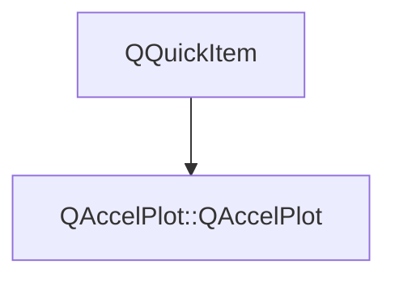

# Class QAccelPlot::QAccelPlot


[**ClassList**](annotated.md) **>** [**QAccelPlot**](namespaceQAccelPlot.md) **>** [**QAccelPlot**](classQAccelPlot_1_1QAccelPlot.md)


_The main plot canvas QML item — hosts axes, curves, and a grid._ [More...](#detailed-description)

* `#include <QAccelPlot.hpp>`


Inherits the following classes: QQuickItem


## Inheritance diagram




## Public Properties

| Type | Name |
| ---: | :--- |
| property QColor | [**axesAreaColor**](classQAccelPlot_1_1QAccelPlot.md#property-axesareacolor-12)  <br>_Background color of the axes surround area. Default: c8c8c8._  |
| property [**PlotBorder**](classQAccelPlot_1_1PlotBorder.md) \* | [**border**](classQAccelPlot_1_1QAccelPlot.md#property-border-12)  <br>_Decorative frame configuration for the plot area._  |
| property QQmlListProperty&lt; [**Axis**](classQAccelPlot_1_1Axis.md) &gt; | [**extraAxes**](classQAccelPlot_1_1QAccelPlot.md#property-extraaxes-12)  <br>_Additional axes beyond the primary four; each extra axis must supply its own side._  |
| property [**Grid**](classQAccelPlot_1_1Grid.md) \* | [**grid**](classQAccelPlot_1_1QAccelPlot.md#property-grid-12)  <br>_Read-only constant: grid configuration object._  |
| property qreal | [**padding**](classQAccelPlot_1_1QAccelPlot.md#property-padding-12)  <br>_Uniform padding in pixels between the plot area and the canvas edge. Default: 24._  |
| property QColor | [**plotAreaColor**](classQAccelPlot_1_1QAccelPlot.md#property-plotareacolor-12)  <br>_Background color of the plot data area. Default: d3d3d3._  |
| property QRectF | [**plotRect**](classQAccelPlot_1_1QAccelPlot.md#property-plotrect-12)  <br>_Read-only: plot area rectangle in item-local pixel coordinates._  |
| property QList&lt; [**PlotSeries**](classQAccelPlot_1_1PlotSeries.md) \* &gt; | [**series**](classQAccelPlot_1_1QAccelPlot.md#property-series-12)  <br>_Read-only: all registered plot series._  |
| property [**Axis**](classQAccelPlot_1_1Axis.md) \* | [**x2Axis**](classQAccelPlot_1_1QAccelPlot.md#property-x2axis-12)  <br>_Optional secondary horizontal axis; assigning it sets its side to_ `Axis.Top` _._ |
| property [**Axis**](classQAccelPlot_1_1Axis.md) \* | [**xAxis**](classQAccelPlot_1_1QAccelPlot.md#property-xaxis-12)  <br>_Primary horizontal axis; assigning it sets its side to_ `Axis.Bottom` _._ |
| property [**Axis**](classQAccelPlot_1_1Axis.md) \* | [**y2Axis**](classQAccelPlot_1_1QAccelPlot.md#property-y2axis-12)  <br>_Optional secondary vertical axis; assigning it sets its side to_ `Axis.Right` _._ |
| property [**Axis**](classQAccelPlot_1_1Axis.md) \* | [**yAxis**](classQAccelPlot_1_1QAccelPlot.md#property-yaxis-12)  <br>_Primary vertical axis; assigning it sets its side to_ `Axis.Left` _._ |


## Public Signals

| Type | Name |
| ---: | :--- |
| signal void | [**axesAreaColorChanged**](classQAccelPlot_1_1QAccelPlot.md#signal-axesareacolorchanged)  <br>_Emitted when the axesAreaColor property changes._  |
| signal void | [**mouseDoubleClicked**](classQAccelPlot_1_1QAccelPlot.md#signal-mousedoubleclicked) ([**::QAccelPlot::PlotMouseEvent**](classQAccelPlot_1_1PlotMouseEvent.md) \* event) <br>_Emitted when a mouse button is double-clicked over the plot. Call_ `event->accept()` _to consume the event and suppress built-in handling (rescale all axes)._ |
| signal void | [**mouseMoved**](classQAccelPlot_1_1QAccelPlot.md#signal-mousemoved) ([**::QAccelPlot::PlotMouseEvent**](classQAccelPlot_1_1PlotMouseEvent.md) \* event) <br>_Emitted when the mouse is moved over the plot. Call_ `event->accept()` _to consume the event and suppress built-in handling (panning)._ |
| signal void | [**mousePressed**](classQAccelPlot_1_1QAccelPlot.md#signal-mousepressed) ([**::QAccelPlot::PlotMouseEvent**](classQAccelPlot_1_1PlotMouseEvent.md) \* event) <br>_Emitted when a mouse button is pressed over the plot. Call_ `event->accept()` _to consume the event and suppress built-in handling (drag start)._ |
| signal void | [**mouseReleased**](classQAccelPlot_1_1QAccelPlot.md#signal-mousereleased) ([**::QAccelPlot::PlotMouseEvent**](classQAccelPlot_1_1PlotMouseEvent.md) \* event) <br>_Emitted when a mouse button is released over the plot. Call_ `event->accept()` _to consume further built-in handling. A left-button release always ends an active drag._ |
| signal void | [**paddingChanged**](classQAccelPlot_1_1QAccelPlot.md#signal-paddingchanged)  <br>_Emitted when the padding property changes._  |
| signal void | [**plotAreaColorChanged**](classQAccelPlot_1_1QAccelPlot.md#signal-plotareacolorchanged)  <br>_Emitted when the plotAreaColor property changes._  |
| signal void | [**plotRectChanged**](classQAccelPlot_1_1QAccelPlot.md#signal-plotrectchanged)  <br>_Emitted when the plotRect changes (axis layout recalculated)._  |
| signal void | [**seriesChanged**](classQAccelPlot_1_1QAccelPlot.md#signal-serieschanged)  <br>_Emitted when the set of registered plot series changes._  |
| signal void | [**x2AxisChanged**](classQAccelPlot_1_1QAccelPlot.md#signal-x2axischanged)  <br>_Emitted when the x2Axis property changes._  |
| signal void | [**xAxisChanged**](classQAccelPlot_1_1QAccelPlot.md#signal-xaxischanged)  <br>_Emitted when the xAxis property changes._  |
| signal void | [**y2AxisChanged**](classQAccelPlot_1_1QAccelPlot.md#signal-y2axischanged)  <br>_Emitted when the y2Axis property changes._  |
| signal void | [**yAxisChanged**](classQAccelPlot_1_1QAccelPlot.md#signal-yaxischanged)  <br>_Emitted when the yAxis property changes._  |


## Public Functions

| Type | Name |
| ---: | :--- |
|   | [**QAccelPlot**](#function-qaccelplot) (QQuickItem \* parent=nullptr) <br>_Constructs a PlotView with the given_ _parent_ _._ |
|  QColor | [**axesAreaColor**](#function-axesareacolor-22) () const<br>_Returns the axes surround background color._  |
|  [**PlotBorder**](classQAccelPlot_1_1PlotBorder.md) \* | [**border**](#function-border-22) () const<br>_Returns the decorative plot-frame configuration object._  |
|  Q\_INVOKABLE qreal | [**dataToPixelX**](#function-datatopixelx) (qreal dataValue) const<br>_Converts a horizontal data-space value to an item-local pixel X coordinate._  |
|  Q\_INVOKABLE qreal | [**dataToPixelY**](#function-datatopixely) (qreal dataValue) const<br>_Converts a vertical data-space value to an item-local pixel Y coordinate._  |
|  QQmlListProperty&lt; [**Axis**](classQAccelPlot_1_1Axis.md) &gt; | [**extraAxes**](#function-extraaxes-22) () <br>_Returns the QML list property for extra axes._  |
|  [**Grid**](classQAccelPlot_1_1Grid.md) \* | [**grid**](#function-grid-22) () const<br>_Returns the grid configuration object._  |
|  Q\_INVOKABLE bool | [**isInsidePlotArea**](#function-isinsideplotarea) (qreal x, qreal y) const<br>_Returns_ `true` _if the item-local point (__x_ _,__y_ _) lies inside the plot area._ |
|  qreal | [**padding**](#function-padding-22) () const<br>_Returns the uniform canvas padding in pixels._  |
|  Q\_INVOKABLE qreal | [**pixelToDataX**](#function-pixeltodatax) (qreal pixelX) const<br>_Converts an item-local pixel X coordinate to a horizontal data-space value._  |
|  Q\_INVOKABLE qreal | [**pixelToDataY**](#function-pixeltodatay) (qreal pixelY) const<br>_Converts an item-local pixel Y coordinate to a vertical data-space value._  |
|  QColor | [**plotAreaColor**](#function-plotareacolor-22) () const<br>_Returns the plot area background color._  |
|  QRectF | [**plotRect**](#function-plotrect-22) () const<br>_Returns the current plot area rectangle in item-local coordinates._  |
|  QList&lt; [**PlotSeries**](classQAccelPlot_1_1PlotSeries.md) \* &gt; | [**series**](#function-series-22) () const<br>_Returns all plot-series children currently registered with this canvas._  |
|  void | [**setAxesAreaColor**](#function-setaxesareacolor) (const QColor & c) <br>_Sets the axes surround background color to_ _c_ _._ |
|  void | [**setPadding**](#function-setpadding) (qreal p) <br>_Sets the canvas padding to_ _p_ _pixels._ |
|  void | [**setPlotAreaColor**](#function-setplotareacolor) (const QColor & c) <br>_Sets the plot area background color to_ _c_ _._ |
|  void | [**setX2Axis**](#function-setx2axis) ([**Axis**](classQAccelPlot_1_1Axis.md) \* axis) <br>_Sets the secondary horizontal axis to_ _axis_ _and assigns it to the top side._ |
|  void | [**setXAxis**](#function-setxaxis) ([**Axis**](classQAccelPlot_1_1Axis.md) \* axis) <br>_Sets the primary horizontal axis to_ _axis_ _and assigns it to the bottom side._ |
|  void | [**setY2Axis**](#function-sety2axis) ([**Axis**](classQAccelPlot_1_1Axis.md) \* axis) <br>_Sets the secondary vertical axis to_ _axis_ _and assigns it to the right side._ |
|  void | [**setYAxis**](#function-setyaxis) ([**Axis**](classQAccelPlot_1_1Axis.md) \* axis) <br>_Sets the primary vertical axis to_ _axis_ _and assigns it to the left side._ |
|  [**Axis**](classQAccelPlot_1_1Axis.md) \* | [**x2Axis**](#function-x2axis-22) () const<br>_Returns the secondary horizontal axis, or_ `nullptr` _if not set._ |
|  [**Axis**](classQAccelPlot_1_1Axis.md) \* | [**xAxis**](#function-xaxis-22) () const<br>_Returns the primary horizontal axis._  |
|  [**Axis**](classQAccelPlot_1_1Axis.md) \* | [**y2Axis**](#function-y2axis-22) () const<br>_Returns the secondary vertical axis, or_ `nullptr` _if not set._ |
|  [**Axis**](classQAccelPlot_1_1Axis.md) \* | [**yAxis**](#function-yaxis-22) () const<br>_Returns the primary vertical axis._  |
|   | [**~QAccelPlot**](#function-qaccelplot) () override<br>_Destroys the plot after disconnecting attached axis signals._  |


## Protected Functions

| Type | Name |
| ---: | :--- |
|  Q\_INVOKABLE void | [**rescaleAllAxes**](#function-rescaleallaxes) () <br>_Calls_ `Axis::rescaleToData()` _on all attached axes._ |


## Detailed Description


PlotView manages the layout of up to four axes (X, Y, X2, Y2) plus any number of additional axes, and renders `LineCurve` children via the Qt Scene Graph. Data-to-pixel and pixel-to-data conversion helpers are exposed as invokable methods so overlay items can align themselves to the plot coordinate system.


**
**


```C++
PlotView {
    Axis { id: xAxis }
    Axis { id: yAxis }
    xAxis: xAxis
    yAxis: yAxis
    LineCurve { xAxis: xAxis; yAxis: yAxis; color: "steelblue" }
}
```


**See also:** [**Axis**](classQAccelPlot_1_1Axis.md), [**LineCurve**](classQAccelPlot_1_1LineCurve.md), [**Grid**](classQAccelPlot_1_1Grid.md) 


    
## Public Properties Documentation


### property axesAreaColor {#property-axesareacolor-12}

_Background color of the axes surround area. Default: c8c8c8._ 
```C++
QColor QAccelPlot::QAccelPlot::axesAreaColor;
```


<hr>


### property border {#property-border-12}

_Decorative frame configuration for the plot area._ 
```C++
PlotBorder* QAccelPlot::QAccelPlot::border;
```


<hr>


### property extraAxes {#property-extraaxes-12}

_Additional axes beyond the primary four; each extra axis must supply its own side._ 
```C++
QQmlListProperty<Axis> QAccelPlot::QAccelPlot::extraAxes;
```


<hr>


### property grid {#property-grid-12}

_Read-only constant: grid configuration object._ 
```C++
Grid* QAccelPlot::QAccelPlot::grid;
```


<hr>


### property padding {#property-padding-12}

_Uniform padding in pixels between the plot area and the canvas edge. Default: 24._ 
```C++
qreal QAccelPlot::QAccelPlot::padding;
```


<hr>


### property plotAreaColor {#property-plotareacolor-12}

_Background color of the plot data area. Default: d3d3d3._ 
```C++
QColor QAccelPlot::QAccelPlot::plotAreaColor;
```


<hr>


### property plotRect {#property-plotrect-12}

_Read-only: plot area rectangle in item-local pixel coordinates._ 
```C++
QRectF QAccelPlot::QAccelPlot::plotRect;
```


<hr>


### property series {#property-series-12}

_Read-only: all registered plot series._ 
```C++
QList<PlotSeries*> QAccelPlot::QAccelPlot::series;
```


<hr>


### property x2Axis {#property-x2axis-12}

_Optional secondary horizontal axis; assigning it sets its side to_ `Axis.Top` _._
```C++
Axis* QAccelPlot::QAccelPlot::x2Axis;
```


<hr>


### property xAxis {#property-xaxis-12}

_Primary horizontal axis; assigning it sets its side to_ `Axis.Bottom` _._
```C++
Axis* QAccelPlot::QAccelPlot::xAxis;
```


<hr>


### property y2Axis {#property-y2axis-12}

_Optional secondary vertical axis; assigning it sets its side to_ `Axis.Right` _._
```C++
Axis* QAccelPlot::QAccelPlot::y2Axis;
```


<hr>


### property yAxis {#property-yaxis-12}

_Primary vertical axis; assigning it sets its side to_ `Axis.Left` _._
```C++
Axis* QAccelPlot::QAccelPlot::yAxis;
```


<hr>
## Public Signals Documentation


### signal axesAreaColorChanged {#signal-axesareacolorchanged}

_Emitted when the axesAreaColor property changes._ 
```C++
void QAccelPlot::QAccelPlot::axesAreaColorChanged;
```


<hr>


### signal mouseDoubleClicked {#signal-mousedoubleclicked}

_Emitted when a mouse button is double-clicked over the plot. Call_ `event->accept()` _to consume the event and suppress built-in handling (rescale all axes)._
```C++
void QAccelPlot::QAccelPlot::mouseDoubleClicked;
```


<hr>


### signal mouseMoved {#signal-mousemoved}

_Emitted when the mouse is moved over the plot. Call_ `event->accept()` _to consume the event and suppress built-in handling (panning)._
```C++
void QAccelPlot::QAccelPlot::mouseMoved;
```


<hr>


### signal mousePressed {#signal-mousepressed}

_Emitted when a mouse button is pressed over the plot. Call_ `event->accept()` _to consume the event and suppress built-in handling (drag start)._
```C++
void QAccelPlot::QAccelPlot::mousePressed;
```


<hr>


### signal mouseReleased {#signal-mousereleased}

_Emitted when a mouse button is released over the plot. Call_ `event->accept()` _to consume further built-in handling. A left-button release always ends an active drag._
```C++
void QAccelPlot::QAccelPlot::mouseReleased;
```


<hr>


### signal paddingChanged {#signal-paddingchanged}

_Emitted when the padding property changes._ 
```C++
void QAccelPlot::QAccelPlot::paddingChanged;
```


<hr>


### signal plotAreaColorChanged {#signal-plotareacolorchanged}

_Emitted when the plotAreaColor property changes._ 
```C++
void QAccelPlot::QAccelPlot::plotAreaColorChanged;
```


<hr>


### signal plotRectChanged {#signal-plotrectchanged}

_Emitted when the plotRect changes (axis layout recalculated)._ 
```C++
void QAccelPlot::QAccelPlot::plotRectChanged;
```


<hr>


### signal seriesChanged {#signal-serieschanged}

_Emitted when the set of registered plot series changes._ 
```C++
void QAccelPlot::QAccelPlot::seriesChanged;
```


<hr>


### signal x2AxisChanged {#signal-x2axischanged}

_Emitted when the x2Axis property changes._ 
```C++
void QAccelPlot::QAccelPlot::x2AxisChanged;
```


<hr>


### signal xAxisChanged {#signal-xaxischanged}

_Emitted when the xAxis property changes._ 
```C++
void QAccelPlot::QAccelPlot::xAxisChanged;
```


<hr>


### signal y2AxisChanged {#signal-y2axischanged}

_Emitted when the y2Axis property changes._ 
```C++
void QAccelPlot::QAccelPlot::y2AxisChanged;
```


<hr>


### signal yAxisChanged {#signal-yaxischanged}

_Emitted when the yAxis property changes._ 
```C++
void QAccelPlot::QAccelPlot::yAxisChanged;
```


<hr>
## Public Functions Documentation


### function QAccelPlot {#function-qaccelplot}

_Constructs a PlotView with the given_ _parent_ _._
```C++
explicit QAccelPlot::QAccelPlot::QAccelPlot (
    QQuickItem * parent=nullptr
) 
```


<hr>


### function axesAreaColor {#function-axesareacolor-22}

_Returns the axes surround background color._ 
```C++
QColor QAccelPlot::QAccelPlot::axesAreaColor () const
```


<hr>


### function border {#function-border-22}

_Returns the decorative plot-frame configuration object._ 
```C++
PlotBorder * QAccelPlot::QAccelPlot::border () const
```


<hr>


### function dataToPixelX {#function-datatopixelx}

_Converts a horizontal data-space value to an item-local pixel X coordinate._ 
```C++
Q_INVOKABLE qreal QAccelPlot::QAccelPlot::dataToPixelX (
    qreal dataValue
) const
```


<hr>


### function dataToPixelY {#function-datatopixely}

_Converts a vertical data-space value to an item-local pixel Y coordinate._ 
```C++
Q_INVOKABLE qreal QAccelPlot::QAccelPlot::dataToPixelY (
    qreal dataValue
) const
```


<hr>


### function extraAxes {#function-extraaxes-22}

_Returns the QML list property for extra axes._ 
```C++
QQmlListProperty< Axis > QAccelPlot::QAccelPlot::extraAxes () 
```


<hr>


### function grid {#function-grid-22}

_Returns the grid configuration object._ 
```C++
Grid * QAccelPlot::QAccelPlot::grid () const
```


<hr>


### function isInsidePlotArea {#function-isinsideplotarea}

_Returns_ `true` _if the item-local point (__x_ _,__y_ _) lies inside the plot area._
```C++
Q_INVOKABLE bool QAccelPlot::QAccelPlot::isInsidePlotArea (
    qreal x,
    qreal y
) const
```


<hr>


### function padding {#function-padding-22}

_Returns the uniform canvas padding in pixels._ 
```C++
qreal QAccelPlot::QAccelPlot::padding () const
```


<hr>


### function pixelToDataX {#function-pixeltodatax}

_Converts an item-local pixel X coordinate to a horizontal data-space value._ 
```C++
Q_INVOKABLE qreal QAccelPlot::QAccelPlot::pixelToDataX (
    qreal pixelX
) const
```


<hr>


### function pixelToDataY {#function-pixeltodatay}

_Converts an item-local pixel Y coordinate to a vertical data-space value._ 
```C++
Q_INVOKABLE qreal QAccelPlot::QAccelPlot::pixelToDataY (
    qreal pixelY
) const
```


<hr>


### function plotAreaColor {#function-plotareacolor-22}

_Returns the plot area background color._ 
```C++
QColor QAccelPlot::QAccelPlot::plotAreaColor () const
```


<hr>


### function plotRect {#function-plotrect-22}

_Returns the current plot area rectangle in item-local coordinates._ 
```C++
QRectF QAccelPlot::QAccelPlot::plotRect () const
```


<hr>


### function series {#function-series-22}

_Returns all plot-series children currently registered with this canvas._ 
```C++
QList< PlotSeries * > QAccelPlot::QAccelPlot::series () const
```


<hr>


### function setAxesAreaColor {#function-setaxesareacolor}

_Sets the axes surround background color to_ _c_ _._
```C++
void QAccelPlot::QAccelPlot::setAxesAreaColor (
    const QColor & c
) 
```


<hr>


### function setPadding {#function-setpadding}

_Sets the canvas padding to_ _p_ _pixels._
```C++
void QAccelPlot::QAccelPlot::setPadding (
    qreal p
) 
```


<hr>


### function setPlotAreaColor {#function-setplotareacolor}

_Sets the plot area background color to_ _c_ _._
```C++
void QAccelPlot::QAccelPlot::setPlotAreaColor (
    const QColor & c
) 
```


<hr>


### function setX2Axis {#function-setx2axis}

_Sets the secondary horizontal axis to_ _axis_ _and assigns it to the top side._
```C++
void QAccelPlot::QAccelPlot::setX2Axis (
    Axis * axis
) 
```


<hr>


### function setXAxis {#function-setxaxis}

_Sets the primary horizontal axis to_ _axis_ _and assigns it to the bottom side._
```C++
void QAccelPlot::QAccelPlot::setXAxis (
    Axis * axis
) 
```


<hr>


### function setY2Axis {#function-sety2axis}

_Sets the secondary vertical axis to_ _axis_ _and assigns it to the right side._
```C++
void QAccelPlot::QAccelPlot::setY2Axis (
    Axis * axis
) 
```


<hr>


### function setYAxis {#function-setyaxis}

_Sets the primary vertical axis to_ _axis_ _and assigns it to the left side._
```C++
void QAccelPlot::QAccelPlot::setYAxis (
    Axis * axis
) 
```


<hr>


### function x2Axis {#function-x2axis-22}

_Returns the secondary horizontal axis, or_ `nullptr` _if not set._
```C++
Axis * QAccelPlot::QAccelPlot::x2Axis () const
```


<hr>


### function xAxis {#function-xaxis-22}

_Returns the primary horizontal axis._ 
```C++
Axis * QAccelPlot::QAccelPlot::xAxis () const
```


<hr>


### function y2Axis {#function-y2axis-22}

_Returns the secondary vertical axis, or_ `nullptr` _if not set._
```C++
Axis * QAccelPlot::QAccelPlot::y2Axis () const
```


<hr>


### function yAxis {#function-yaxis-22}

_Returns the primary vertical axis._ 
```C++
Axis * QAccelPlot::QAccelPlot::yAxis () const
```


<hr>


### function ~QAccelPlot {#function-qaccelplot}

_Destroys the plot after disconnecting attached axis signals._ 
```C++
QAccelPlot::QAccelPlot::~QAccelPlot () override
```


<hr>
## Protected Functions Documentation


### function rescaleAllAxes {#function-rescaleallaxes}

_Calls_ `Axis::rescaleToData()` _on all attached axes._
```C++
Q_INVOKABLE void QAccelPlot::QAccelPlot::rescaleAllAxes () 
```


<hr>

------------------------------
The documentation for this class was generated from the following file `QAccelPlot/src/QAccelPlot.hpp`

