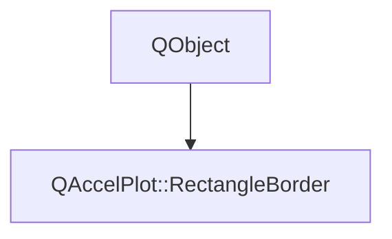

# Class QAccelPlot::RectangleBorder


[**ClassList**](annotated.md) **>** [**QAccelPlot**](namespaceQAccelPlot.md) **>** [**RectangleBorder**](classQAccelPlot_1_1RectangleBorder.md)


_Controls the outline a_ `RectangleSeries` _draws inside each rectangle's edges._[More...](#detailed-description)

* `#include <RectangleBorder.hpp>`


Inherits the following classes: QObject


## Inheritance diagram




## Public Properties

| Type | Name |
| ---: | :--- |
| property QColor | [**color**](classQAccelPlot_1_1RectangleBorder.md#property-color-12)  <br>_Outline color. Default: black._  |
| property QML\_ANONYMOUSqreal | [**width**](classQAccelPlot_1_1RectangleBorder.md#property-width-12)  <br>_Outline width in pixels, clamped to at least 0. Default: 0, no outline._  |


## Public Signals

| Type | Name |
| ---: | :--- |
| signal void | [**colorChanged**](classQAccelPlot_1_1RectangleBorder.md#signal-colorchanged)  <br>_Emitted when the color property changes._  |
| signal void | [**widthChanged**](classQAccelPlot_1_1RectangleBorder.md#signal-widthchanged)  <br>_Emitted when the width property changes._  |


## Public Functions

| Type | Name |
| ---: | :--- |
|   | [**RectangleBorder**](#function-rectangleborder) (QObject \* parent=nullptr) <br>_Constructs a_ [_**RectangleBorder**_](classQAccelPlot_1_1RectangleBorder.md) _owned by__parent_ _._ |
|  QColor | [**color**](#function-color-22) () const<br>_Returns the outline color._  |
|  void | [**setColor**](#function-setcolor) (const QColor & color) <br>_Sets the outline color to_ _color_ _._ |
|  void | [**setWidth**](#function-setwidth) (qreal width) <br>_Sets the outline width to_ _width_ _pixels. Negative values are clamped to 0._ |
|  qreal | [**width**](#function-width-22) () const<br>_Returns the outline width in pixels._  |


## Detailed Description


Accessible via the `border` CONSTANT grouped property of `RectangleSeries`, for example `border.width: 1`.


**See also:** [**RectangleSeries**](classQAccelPlot_1_1RectangleSeries.md) 


    
## Public Properties Documentation


### property color {#property-color-12}

_Outline color. Default: black._ 
```C++
QColor QAccelPlot::RectangleBorder::color;
```


<hr>


### property width {#property-width-12}

_Outline width in pixels, clamped to at least 0. Default: 0, no outline._ 
```C++
QML_ANONYMOUSqreal QAccelPlot::RectangleBorder::width;
```


On rectangles too small for two outlines, the outline narrows so at least 1 px of fill stays visible. 


        

<hr>
## Public Signals Documentation


### signal colorChanged {#signal-colorchanged}

_Emitted when the color property changes._ 
```C++
void QAccelPlot::RectangleBorder::colorChanged;
```


<hr>


### signal widthChanged {#signal-widthchanged}

_Emitted when the width property changes._ 
```C++
void QAccelPlot::RectangleBorder::widthChanged;
```


<hr>
## Public Functions Documentation


### function RectangleBorder {#function-rectangleborder}

_Constructs a_ [_**RectangleBorder**_](classQAccelPlot_1_1RectangleBorder.md) _owned by__parent_ _._
```C++
explicit QAccelPlot::RectangleBorder::RectangleBorder (
    QObject * parent=nullptr
) 
```


<hr>


### function color {#function-color-22}

_Returns the outline color._ 
```C++
QColor QAccelPlot::RectangleBorder::color () const
```


<hr>


### function setColor {#function-setcolor}

_Sets the outline color to_ _color_ _._
```C++
void QAccelPlot::RectangleBorder::setColor (
    const QColor & color
) 
```


<hr>


### function setWidth {#function-setwidth}

_Sets the outline width to_ _width_ _pixels. Negative values are clamped to 0._
```C++
void QAccelPlot::RectangleBorder::setWidth (
    qreal width
) 
```


<hr>


### function width {#function-width-22}

_Returns the outline width in pixels._ 
```C++
qreal QAccelPlot::RectangleBorder::width () const
```


<hr>

------------------------------
The documentation for this class was generated from the following file `QAccelPlot/src/QAccelPlot/series/RectangleBorder.hpp`

